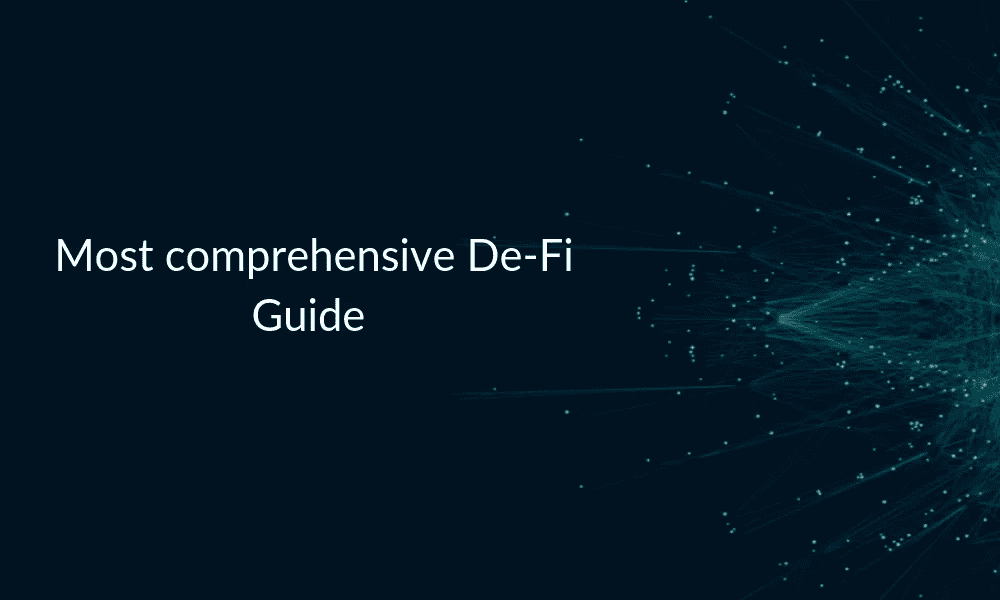
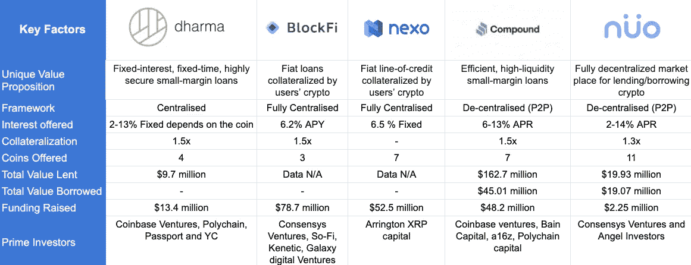
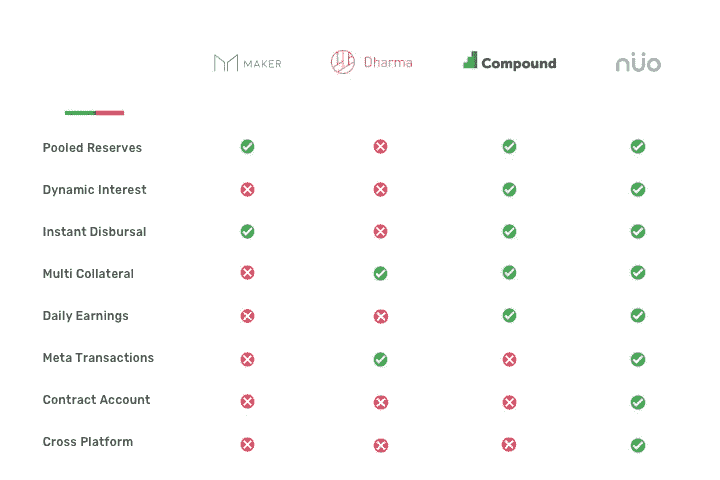

# 分散化扰乱了金融生态系统

> 原文：<https://medium.datadriveninvestor.com/compound-vs-nuo-vs-dharma-vs-maker-which-one-is-the-best-d85d5d614bb1?source=collection_archive---------3----------------------->

## 最全面的分散金融生态系统指南

几乎每个加密初创企业的支持者都在宣扬他们的商业基本面，利用区块链技术的去中心化价值，这已经成为一种趋势。

*(免责声明:本文内容不由任何人赞助，文中提及的观点仅由作者个人所有。*上第一次见到傩)

但是，是不是每个加密项目都是基于去中心化的原则呢？

在本文中，我们将解读基于分散化财务协议的业务与传统业务有何不同:

我们将主要讨论两个主要方面

1)什么是真正意义上的去 Fi？

2)去 Fi 平台的种类及其主要区别？

**去伪存真协议终极指南**

传统金融系统的用户往往希望有一个更容易进入、更透明、交易费用低、更少依赖中介的系统。为了形成这样一个更加公平的金融体系，银行、贷款和衍生品必须经历彻底的变革。此外，还需要采用像 DeFi 这样的分散式生态系统。它方便了点对点借贷，消除了集中控制，并为用户提供了财务自由。

最近，在密码领域，有很多关于分散金融，或简称 DeFi 的讨论。它提供全球性的金融服务:贷款、衍生品和其他产品；传统的金融中介机构的作用减少或没有作用。分散式金融系统的支持者将 DeFi，也称为开放金融，视为传统借贷的一个很好的替代方案。一些人已经称之为借贷的未来。

DeFi 建立在比特币网络和以太坊等公共区块链上。它已经成为以太坊网络上“使用的核心驱动因素”之一。通过利用无许可的分布式网络，DeFi 平台将金融产品转换为无信任协议，世界任何地方的任何人都可以访问该协议。没有银行账户的人也可以使用 DeFi 解决方案进行资产借贷，以及金融工具交易。

开源平台给用户带来了巨大的好处，包括透明度、廉价的跨境交易、无信用检查和减少审查。任何人都可以进行金融活动，因为没有地理位置的限制。

**DeFi 有多分散？**

最近几个月，DeFi 解决方案的引入激增。它们都没有提供相似的特征和优点。它们有不同的模式，它们的分权程度也各不相同。与其他模型相比，一些 DeFi 模型的分散程度较低。这是因为它们的组成部分只有几个被分散了，而其余的仍然由公司集中控制。

协议开发、非托管、价格馈送、确定利率、提供保证金通知流动性以及发起保证金通知是 DeFi 协议的关键组成部分。它们决定了有效分权的程度。

如果分散组件的数量更多，则 DeFi 协议比其他模型更加分散。这样的协议将让用户完全控制他们的数字资产，摆脱集中控制。直到现在，还没有 DeFi 协议将所有组件分散。每个 DeFi 协议[被分配一个基于分散组件数量的类别](https://hackernoon.com/how-decentralized-is-defi-a-framework-for-classifying-lending-protocols-90981f2c007f)。

**中央金融(CeFi)** : DeFi 解决方案通常是非托管式的，这意味着用户可以控制自己的资金并对其安全性负责。另一方面，CeFi 是托管的。中央系统负责保管用户的资产，也负责确保用户资金的安全。

在资金借贷方面，用户对资金的任何方面都没有控制权。利率由中央决定，追加保证金的流动性由中央系统或机构提供。CeFi 产品使用集中的价格馈送，启动追加保证金并非没有许可。摄氏度和盐被视为头孢菌素溶液。

**1 级-DeFi:** 此类 DeFi 产品是非托管产品，这是它在去中心化方面所能提供的全部功能。它的其他组件非常集中，就像 CeFi 解决方案一样。用户不能确定利率、管理平台的开发或更新**、**或为保证金通知提供流动性。产品采用分散价格进料；集中发起保证金追缴。达摩是一级 DeFi 最好的例子之一。这是以太坊上的一个点对点市场。

**Degree 2-DeFi** :此类别的 DeFi 解决方案是非托管式的，由于只有一个组件是分散的，因此为用户提供了最低限度的财务自由。分散组件可以是平台开发或更新；价格反馈、追加保证金通知的发起、追加保证金通知流动性的提供或利率确定。除了非监护和一个以上的组件，2 级 DeFi 协议的其余组件保持集中控制。诺网就是 2 度 DeFi 的一个例子。

**3 级-DeFi:** 此类 DeFi 解决方案具有两个分散组件，以及非监禁因素。Compound 和 MakerDao 是 3 级 DeFi 协议的示例。他们无需许可就可以发起追加保证金通知，也无需许可就可以提供追加保证金通知的流动性。用户对利率或平台发展没有控制权；两者都是在这种 DeFi 协议中集中控制的。价格源也是集中管理的。

**Degree 4-DeFi:** 在这个 DeFi 类别下的产品，利率和平台的开发和更新都是集中控制的。然而，与 degree 3 DeFi 解决方案不同，价格馈送不受中央控制。诸如 Fulcrum 和 dYdX 之类的协议使用分散的价格馈送。此外，它们还具有非托管成分、无需许可即可发起保证金追缴和提供保证金追缴流动性等特点。

**Degree 5-DeFi:**Degree 5 DeFi 产品让用户几乎可以完全控制他们的数字资产。只有平台开发组件是集中管理的。degree 5 DeFi 协议的一个例子是 bZx，它是以太坊主网上的第一个分散保证金借出协议。这类产品是非托管产品，具有分散的价格反馈。参与者决定利率。此外，启动追加保证金通知和提供追加保证金通知流动性是没有许可的。

**定义平台相对于集中式平台和集中式银行系统的优势**

*   集中平台的用户不能将借入资金转移到其他交易场所和平台。DeFi 平台为用户提供了这一优势。他们可以自由借入资金，并将其转移到多个地点。
*   与集中式平台不同，DeFi 平台为用户提供数字资产的完全托管。如果他们想进入保证金交易，即在一个时段内买卖证券，他们可以这样做。用户可以保留令牌，也可以在分散的网络上做空资产。

如果他们使用的是集中管理资金的中央平台，就无法做到这一点，而且由于限制和管辖范围，并非所有人都可以参与融资融券交易。

*   DeFi 平台不再需要 KYC。
*   与中央银行系统不同，DeFi P2P 借贷平台的利率由市场力量决定，而非监管机构。
*   参与者可以很容易地获得有关贷款的信息，而且也是免费或象征性收费的。
*   DeFi 平台比传统银行平台更加透明和高效。
*   用户可以很容易地以市场利率借到资金，交易过程非常快，因为没有中介机构参与贷款过程。
*   不是每个人都可以访问银行系统，但每个有互联网连接的人都可以访问 DeFi 平台。

## 如何使用 DeFi 平台？

加密借贷是目前加密货币创新中最热门的趋势之一，许多公司都在赶时髦，同时想出新的方法，通过集成区块链技术，在这种非常规的金融借贷产品基础设施中占据一席之地。

> 让我们深入分析一下该领域的行业领导者吧！

# 化合物 vs 诺 vs 达摩 vs Nexo vs 创客

分析这些平台的主要考虑因素是产品的可行性、市场适合度、利率/抵押、分散化程度、流动性、融资和牵引力以及最大价值主张。

以上 5 家中，只有复合和诺是两个完全去中心化的平台。

复合协议(Compound Protocol):它建立了货币市场，这是一个资产池，其利率是根据资产的供求关系通过算法得出的。它允许用户在不涉及交易对手的情况下赚取利息或借入以太坊资产。但与诺网不同的是，复合协议不允许直接借贷。所有者提供的资产成为可替代资源的一部分，其他用户可以从该资源中借到资金。

> [检查大院！](https://compound.finance/)

新用户将不得不使用社区构建的接口来访问复合协议和市场，包括复合接口、Zerion、InstaDapp 等等。

*   **贷方:**贷方向市场提供资产，这些资产由 ERC-20 令牌余额表示。诺网让出借人每天都能赚到利息，而复利协议的利率是根据供求关系实时浮动的。当流动性充足时，利率很低，当需求超过供给时，利率就会上升。贷方可以随时自由提款。
*   **借款人:**用户可以使用 cTokens 作为抵押品从协议中借款，借款资产直接转移到他们的钱包中。市场力量决定了每项资产的借贷成本。除非用户的账户中有足够的抵押品，否则他们不能借款。

[**诺网**](https://nuo.network/?utm_source=finga&utm_medium=finga&utm_campaign=finga) :它是一个债务市场，提供一种非托管的方式借出、借入或保证金交易数字资产。Nuo 协议允许用户创建债务准备金，使他们能够每天从其数字资产中赚取利息。用户可以通过在网络的智能合约中设定抵押品，轻松地从债务储备中借用 ETH 或 ERC20 令牌。

> [退房诺](https://nuo.network/?utm_source=finga&utm_medium=finga&utm_campaign=finga)

长期和短期贷款都可用，用户可以以他们喜欢的利率借款。交易委托给合同，并在订单匹配后执行。有一个密码加密的私钥用于签署交易。并且所有的交易都可以在线验证。

新用户需要使用 Metamask/Web3 Wallet 或基于密码的注册来创建一个 Nuo 帐户。他们必须将 ETH 或 ERC20 令牌转移到这个帐户，之后，他们可以在平台上开始借贷。

*   **借款人**:一旦他们将 ETH 或 ERC20 令牌添加到他们的 Nuo 智能账户，借款人需要创建一个超额抵押贷款或进行高达 3 倍杠杆的保证金交易。该系统将贷款与 ETH 或 ERC20 准备金进行匹配，之后，资金会非常迅速地转入 Nuo 账户。借款人需要贷款金额的 1.5 倍作为抵押才能获得贷款。
*   **贷方**:他们创建债务准备金，根据借款人的贷款请求借给他们。贷款人赚取的利息取决于准备金资助的贷款数量。利息在储备合同中累计，每天按比例定期分配。一旦债务准备金被取消，总额加上累计利息将被转移到贷方的交易账户。

**结论**

DeFi 仍处于萌芽阶段，但分散金融系统的倡导者已经宣称它有巨大的潜力。它是目前加密领域中最活跃的领域，它的日益流行不能被视为一种时尚。最近的一份市场报告称 DeFi 协议在不到一年的时间里“惊人地”增长。DeFi 锁定的价值从一年的 1 . 81 亿美元增加到了 5 亿多美元。

该报告还预测，到 2020 年底，锁定的总价值可能超过 15 亿美元。如果 DeFi 协议获得广泛接受，它们极有可能重塑金融工具，分散贷款和借款，让金融系统不那么脆弱，更透明、更有弹性。