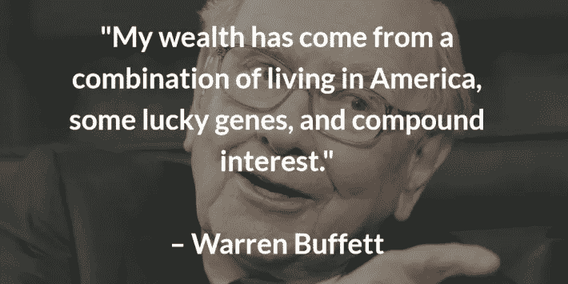
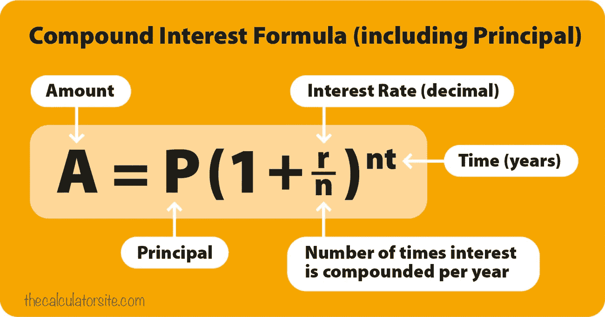
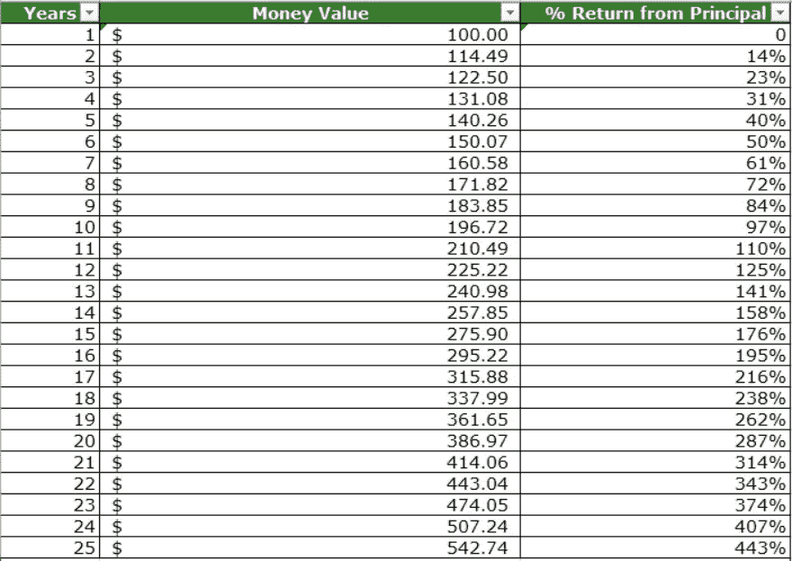

# 复利:个人理财的目标

> 原文：<https://medium.datadriveninvestor.com/compounding-interest-the-goat-of-personal-finance-35936cd0390f?source=collection_archive---------14----------------------->

*最初发布于 21stfinance.com*

创造财富是一场马拉松，而不是短跑。快速致富计划和一夜之间成为百万富翁的人是不会发生的。如果你想经济自由，你必须努力工作，攒钱。沃伦·巴菲特被认为是人类历史上最伟大的投资者。他的净资产超过 800 亿美元，他知道如何管理资金来创造持久的财富。

获得巨大财富和财务自由的关键是复利。任何基础投资者都需要知道什么是复利，在这篇博客中，我们将进一步探讨这个概念。

**什么是复利？**

简单地说，复利是对本金的额外利息。复利就是利息上的利息。

例如，假设你在第一年获得了 100 美元 7%的回报。你赚了 7 美元，现在你的总数是 107 美元。假设在第二年你又赚了 7%。根据复利定律，107 美元的回报率为 7%，总回报率为 7.49 美元。

这意味着两年后，你的总价值现在是 114.49 美元，或 14.49%的回报率！通过应用复利公式(见下文)，人们可以看到时间如何极大地影响这 100 美元的起始本金。

在大多数退休情况下，投资者都在寻找更长期的投资机会。从下表可以看出，时间(年数)是你资金增长的最大催化剂。25 年后，100 美元的原始本金将增长 443%。

当你考虑到这些年来大多数投资者每个月都在往这些账户里存钱时，这些账户的百分比收益和货币价值会成倍增长。

现在你可能会问自己，“我如何开始复利？”好消息是，有很多不同的方法来利用阿尔伯特·爱因斯坦称之为“世界第八大奇迹”的能量。

**员工赞助 401k**

这些投资计划的伟大之处在于，你真的在这里获得了两种不同的投资回报。当你观察市场随着时间的推移而增长时，许多雇主会匹配你在这些计划中投入的资金。如果你的公司为这些计划提供相当大的匹配，这项投资是必须的。

**股票(明智投资)**

许多公司会向投资者支付股息，然后这些股息可以再投资到公司。在选择股票的时候，确保你进行了尽职调查。不是所有的股票都能保证产生可观的回报。

**共同基金**

我个人认为这是投资股市的最佳方式。共同基金的建立是为了模仿股票市场(标准普尔 500、道琼斯)的整体趋势，将许多不同领域的不同股票捆绑在一起。共同基金的目标是将公司配对，以模仿整体市场将产生的回报。某些公司，如 [Betterment](http://betterment.com/) ，提供收费非常合理的电子交易基金(ETF)。

复利是让你的财富随着时间增长的最聪明和最有效的方法。你越早开始投资，随着时间的推移，你会看到越大的回报！

如果你在投资方面有困难，或者因为经验而对进入市场感到紧张，我推荐这些平台。

[改善](http://betterment.com/)

[橡子](http://acorns.com/)

[先锋](http://vanguard.com/)

[藏匿点](http://stashinvest.com/)

***-JP***