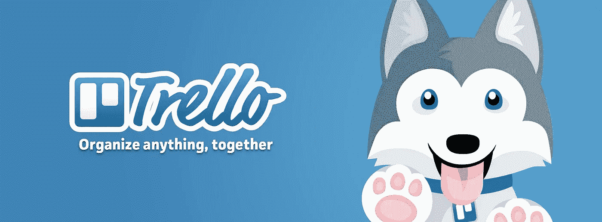
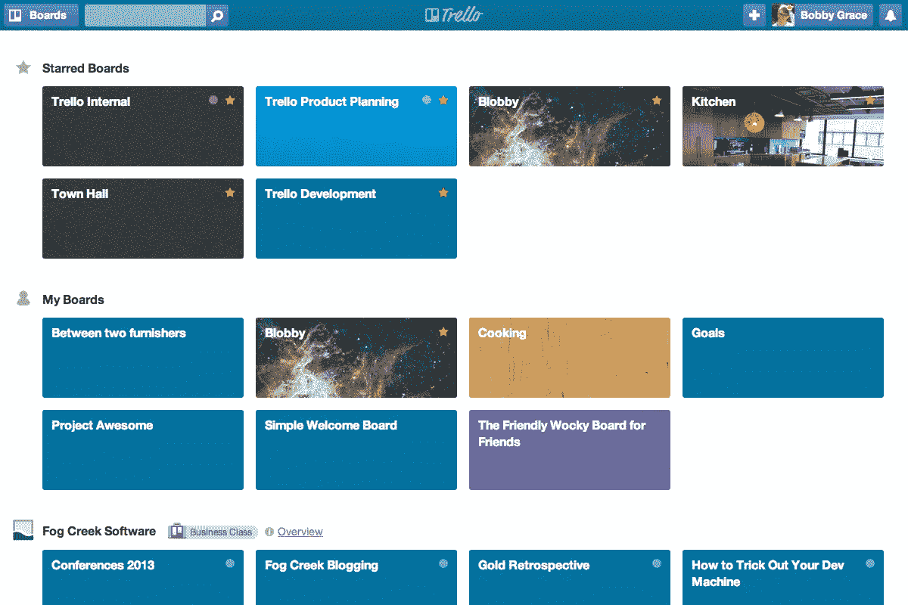
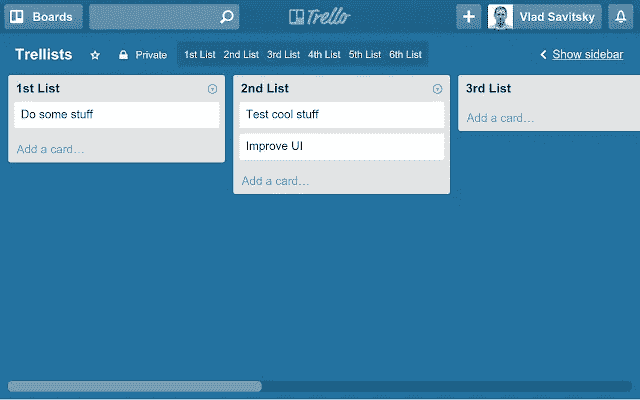
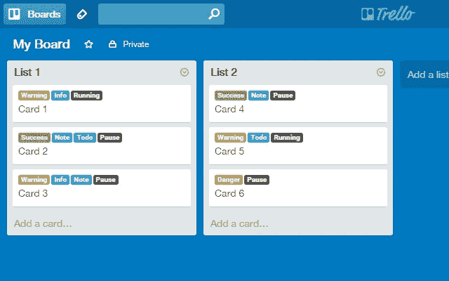
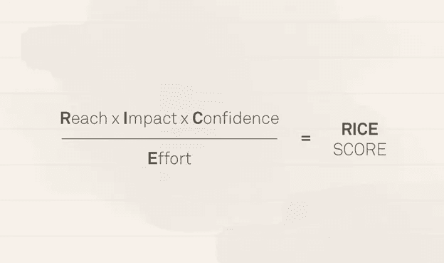
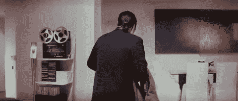
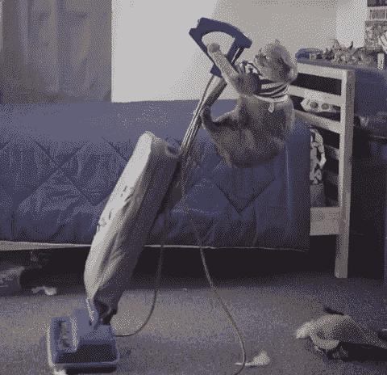

# 压缩你的时间:用更少的时间完成更多的工作

> 原文：<https://medium.datadriveninvestor.com/compress-your-time-get-more-work-done-in-less-time-867275035aee?source=collection_archive---------4----------------------->

你是否正在忍受着没有产出的日子，想要扭转局面，不被解雇？这些非生产性的时间累积起来，会让你的企业付出代价吗？坏消息是，如果你继续这样，你会被解雇，或者你的生意会失败。但好消息是，你也可以扭转局面。这篇短文的目的是引导你朝着正确的方向开始。

我的目标是帮助你开始“压缩你的时间”，这基本上意味着每小时完成更多的工作。把它想象成一辆汽车。汽车的速度是以英里/小时来衡量的。同样的，你可以通过你的 WPH(每小时工作)来思考你的生产效率。你的 WPH 越高，你完成的事情就越多。

Start to boost your work-per-hour (Source: Bachman Volkswagen Blog)

所以在这篇文章的剩余部分，我将与你分享一个软件工具和一些策略，最好地利用它来帮助压缩你的时间。

不仅如此，我还会告诉你策略背后的“为什么”,这样你就知道为什么某种生产力策略是有效的，有助于建立对它的更深的直观理解。

如果你想看关于这个的视频，我做了一个视频来配合这篇文章，看看吧:

# 首选软件工具

为了保持高效率和在我的游戏中处于领先地位，我在过去的 4 年里一直使用 Trello，它是一个非常简单，但非常有效的工具，当涉及到帮助你压缩时间时。最棒的是它完全免费加入。

Cute mascot they’ve got (Source: Amanda Grimmett)

## 纸板

它允许你创建“董事会”,基本上是你的项目或你的组织的董事会。然后，您可以邀请用户加入该讨论板进行协作。这感觉很像 Google Drive，你可以将用户添加到你的文件夹和文档中。

This is the page where you see all of the boards you are a member of (Source: Trello Blog)

## 任务类别

在这些面板中，您可以开始创建任务类别。例如，如果你正在遵循 Scrum 方法，你可以将类别分为“待办事项”、“正在做的事情”和“完成的事情”。你也可以把类别分为“市场营销”、“产品开发”等。如果你想用标签来表示完成。

Create different categories (Source: Chrome Web Store)

## 卡片

在这些任务类别下，您可以添加卡片，这些卡片基本上是需要完成的任务。然后，您可以进一步在这张卡片上添加一个标签，这只是一个彩色的方框，以指示该任务是否完成。您还可以将团队成员分配到特定的卡片上，以便有效地分配数据。您可以更改任务的截止日期，这有助于员工继续完成任务。您还可以添加描述，以帮助阐明任务的详细要求。最后，您可以将链接和文件附加到卡片上。

Create Cards under your Categories (Source: Unito)

添加团队成员是如此简单，加上 Trello 直观的用户体验，这是我选择的软件工具。

让我们深入了解这些策略以及它们背后的“为什么”。

# 生产力战略

所以我已经给了你我选择的软件工具，然而，一件武器只取决于它的主人，所以现在，我将与你分享一些有效使用这个工具的方法。

## 策略 1:为明天做计划

当你早上醒来，却不知道该做什么的时候，你会慢下来。这就是使用 Trello 提前计划的用处。

所以你之所以这么慢才下线，首先是因为没有紧迫感。如果你不知道需要做什么，那就没什么可急的，“你会找到时间去做的”。

通过使用 Trello，你可以预先给自己分配任务，并根据它们的重要性用颜色编码。为了进行排序，您可以使用一个任务优先级框架，比如 RICE 框架。

Calculating the RICE score a certain task (Source: Intercom)

现在，当你第二天醒来时，你确切地知道完成任务的顺序，所以你首先做最高优先级的工作，你知道有多少工作需要完成，所以有一些紧迫性。你下线会更快。

首先做最重要的任务可以帮助你开始压缩你的时间，因为你可以在一天中完成更多有意义的工作，即使你度过了糟糕的一天，至少你可以完成你最重要的任务。

## 策略 2:避免你的员工困惑

如果你管理一个组织，有时你的员工可能会搞不清楚需要做什么。电子邮件被埋没了，现在他们正在浪费时间试图找到邮件线索，以了解他们的任务是什么。

Trello 可以帮助您将事情组织在一个中心区域，组织内的任何人都可以访问该区域，以了解公司或部门的情况。

因为你可以在卡片上添加描述和清单，你可以将一个复杂的任务分解成更小的部分，这将有助于解决一些困惑。

Your confused employees in a GIF (Source: Monster GIF)

截止日期有助于保持每个人的责任感。当截止日期临近时，它还会向分配到该任务的成员的电子邮件(或手机，如果他们下载了该应用程序)发送通知。

这不仅有助于让员工开心，因为它消除了混乱，还会让经理开心，因为他们可以作为一个单位更有效地移动。

通过把每件事都放在一块白板上，让任务和截止日期透明化，你不仅会开始赢得员工的信任，因为你是一个有用的领导者，你还会开始压缩其他人的时间，这样他们也可以开始增加他们的每小时工作量。

## 策略 3:逆向工程你的目标

有时候你面前有一个很大的目标。你将如何把事情分解，你如何知道你是否朝着正确的方向前进？通过在 Trello 上进行规划，并在头脑中保持逆向工程的心态，你可以解决这个问题。

当你知道想要的结果是什么时，你就可以开始逆向工程，找出需要完成哪些任务，以及以什么样的顺序来达到想要的结果。

例如，让我们说你想通过你的网站增加你的生意的销售。为了获得更多的销售，你可以要么需要更多的交通到您的网站，或增加转化率您的产品。你决定先增加流量。

为了获得更多的流量，你需要在营销和广告上投入资源。你开始对需要完成的事情变得更加具体。你已经知道哪些类别将得到更多的工作。

接下来，在营销和广告中，你能做些什么才能对你网站的流量产生最大的影响。你可以开始在你的博客上写更多来增加你的 SEO。你可以想出一些脸书广告活动，以帮助推动更多的关注你的品牌和网站。你可以开始举办免费的线下活动来推广你的品牌，为你的网站带来流量。在这里你可以想出很多东西。同样，使用 RICE 框架来区分这些任务的优先级。

现在你确切地知道该做些什么来增加流量。您已经将所有这些目标作为卡片添加到各自的类别中。确保你也有适当的系统来衡量这些行为是否会给你的网站带来更多的流量，增加销售额。你不能改进你没有测量的东西。

如果有很多工作和某些任务需要委派给其他团队成员，您可以将它们分配到卡片上，并在卡片上附加一个截止日期以提醒他们。

最后，如果你想非常详细地了解这些任务，你可以写下详细的描述，并使用卡片中的清单将任务分解成检查点。

你可以看到我们是如何逆向工程一个大目标的，通过网站为你的企业获得更多的销售，进入它的初始假设，然后进一步分解成任务，最后变得非常精细。

这样你就可以监控事情是否朝着你想要的方向发展，并且看看你在完成的道路上走了多远。这也可以帮助你更容易地驾驶你的船，因为你也知道你前面是什么。

Steering your business (Source: GIPHY)

这可以帮助你压缩时间，因为你不会浪费太多时间去思考下一步该怎么做，也不会落后于形势。通过使用逆向工程思维和 Trello，你可以通过让任务超级清晰来开始增加你的组织的每小时工作量。

# 其他提示

现在，这些不是你可以使用的唯一策略，然而，你叠加的策略越多，你就越能压缩你的时间。这里有更多的技巧来帮助你做到这一点:

*   **关闭通知:**你可能认为一个简单的通知只需要几秒钟就可以查看并快速回复，然而，不要被愚弄了。这些分钟可以累加。更糟糕的是，你打破了你正在做的工作的势头。如果你在这个区域，最糟糕的方式就是在你的手机上轻轻一按。工作的时候把它们关掉。如果你开始时一直有查看手机的冲动，不要担心，只要保持关机状态，随着时间的推移，继续查看手机的冲动会逐渐消失。

Turn off those notifications (Source: Pinterest)

*   **听器乐:**如果你是一个喜欢边工作边听音乐的人，那么这首歌就适合你。工作时丢掉歌词。你可能没有注意到，但是这些单词正在消耗你的一些能量，因为你的大脑需要处理这些单词。宁愿听乐器演奏，如深度进步的家庭音乐或电影配乐。在写这篇文章的时候，我正在 YouTube 上听 synth-wave 混音。
*   **保持工作环境整洁:**如果你想变得更有创造力，让你的桌子变得有点凌乱可能会有所帮助，然而，如果你想成为一台精益机器，压缩你的时间，你应该考虑清理你的工作环境。这种陈词滥调的存在是有原因的:“凌乱的房间，混乱的头脑”。

Clean up your work environment (Source: Tenor)

*   建立积极的工作习惯:一本关于习惯的好书是查尔斯·杜希格的《习惯的力量》。作者指出，每个习惯都有要素:一个线索、一个行动和一个奖励。提示可以是指示某项任务开始的东西。对我来说，提示就是制作或获取咖啡。行动部分是需要做的实际行动。对我来说，喝完咖啡后，行动就起作用了。最后，奖励是行动之后的东西。如果你不奖励你的大脑，养成这个习惯将会非常困难。对我来说，这可能是一天结束时的工作，也可能是一个漫长的夜晚。

开始压缩你的时间，用更少的时间完成更多的工作。通过使用这三个策略和上面的额外建议，你可以慢慢开始培养积极的工作习惯，增加你的每小时工作量。

# 结论

保持高效有时会很困难，然而，有了 Trello，你可以很容易地为明天做计划，减少混乱，把更大的任务分解成小块。

如果这篇文章对你有所帮助，那么按下“鼓掌”按钮不是一个坏主意吗？

## 进一步讨论

如果你想更多地谈论这个话题，并且它可以应用到你的业务中，打电话给我。几乎每个社交媒体平台上都有@sunnychopper，甚至 Xbox Live。如果你更喜欢电子邮件，那就去 ishy.singh@gmail.com。