# 计算机视觉的计算几何

> 原文：<https://medium.datadriveninvestor.com/computational-geometry-for-computer-vision-f140fab91c76?source=collection_archive---------13----------------------->

计算几何领域出现于 20 世纪 70 年代，研究解决几何问题的数据结构和算法。这尤其包括确定图像中的拓扑结构，或者更高维度的表示，例如点邻域，这可以帮助从例如数字图像数据中导出几何意义[1]。

**计算机视觉**主要涉及静止或运动图像的处理、理解和重建【3】。由于由深度神经网络驱动的算法提供的令人印象深刻的超人类结果，对象识别(分类)、对象检测(分类&定位)和对象分割(分类、定位&边界检测)的计算机视觉应用领域已经在研究和行业中受到越来越多的关注。

毫不奇怪，考虑到这些感兴趣的重叠领域，计算几何为计算机视觉领域及其对应的计算机图形学提供了有用的概念。一组点的 Voronoi 图(又名 Dirichlet 镶嵌、Voronoi 镶嵌或 Voronoi 分割)及其对偶，点的 Delaunay 三角剖分(又名 Delone 三角剖分)，是这种有用概念的例子[1，2]。相关的计算机视觉应用包括人脸识别、人脸变形、图像合成和表面建模。在这篇博文中，我们展示了使用图像中人脸的 Delaunay 三角剖分/Voronoi 图作为人脸识别或人脸变形等应用的先驱。

让我们从定义开始。

一个 **Voronoi 图**将一个域划分为一组点的最近邻区域。考虑点集 *P = {p₁，p₂，…，pₙ}* ∈ *ℝ* 。定义 *pᵢ的平分线 *BS(pᵢ，pⱼ)* ，pⱼ* ∈ *P* ， *pᵢ ≠ pⱼ* ，为距离函数 *d* 中相对于 *pᵢ* ， *pⱼ* 的等距轨迹，即*bs(p÷1，p÷1)*=。设 *pᵢ* 相对于 *pⱼ* 、 *D(pᵢ,pⱼ)* 的优势区域，表示由 *BS(pᵢ,pⱼ)* 围成的包含 *pᵢ* 的区域。给定 *P* 的 *pᵢ* 的 *Voronoi 区域*定义为

并且由到 *pᵢ* 的距离小于或等于到任何其他点 *pⱼ* ∈ *P* 的距离的所有点组成。由一对芙诺以图区域共享的边界被称为*芙诺以图边缘*。芙诺以图的边缘在*芙诺以图的顶点*相遇。 *P* 的*芙诺以图*由下式给出

其中∂ *R(pᵢ,P)* 表示 *R(pᵢ,P)* 的边界。术语*有界 Voronoi 图*指的是 *VD(P)* 与其底层域的合取。

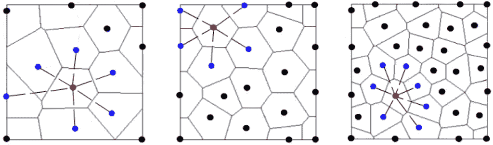

Figure 1: Voronoi diagrams of different point sets in the Euclidean plane and the (blue) so-called natural neighbourhood relationships they impose on the (red) example points

我们把自己限制在欧几里得平面域中的点上，例如，见图 1。然而，Voronoi 图的定义可以推广到从流形 *M* 中无噪声地获取的点 *P* ，即，更一般情况下的点*p*⊂*m*参见例如图 2 中 3D 流形上的点的固有(非欧几里德)Voronoi 图。

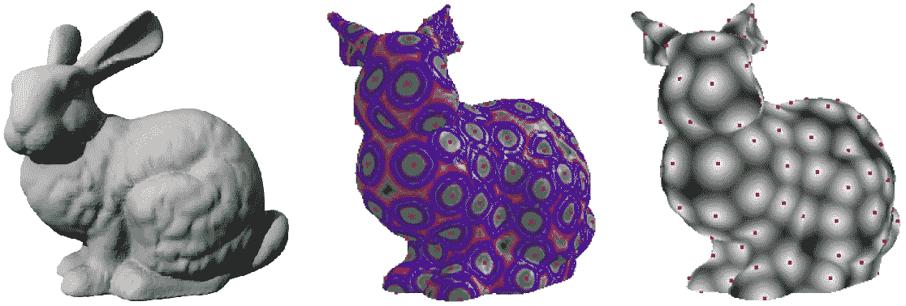

Figure 2: Voronoi diagram of (red) points on a 3D manifold surface: Scanned [Stanford Bunny](http://graphics.stanford.edu/data/3Dscanrep/) original (left), equal geodesic distance contours (centre) and the corresponding geodesic Voronoi diagram (right)

类似地，我们没有定义关于距离函数 *d* 的距离度量:Voronoi 图定义适用于在流形 *M* 上定义的任何测地线距离度量。因此，例如，在欧几里德平面域的情况下，标准欧几里德距离函数可以用于计算 *d(* ⋅,⋅ *)* 。

点集 *P = {p₁，p₂，…，pₙ}* ∈ *ℝ* 的 **Delaunay 三角剖分**由 *VD(P)* 的对偶图给出，Delaunay 三角剖分的每条边与*VD(p)*的一条边相关联，即 Delaunay 边连接 *VD(P)* 中的(自然)相邻点。参见图 3 中的示例。Delaunay 三角剖分通常存在于除欧几里德距离度量之外的度量中，但并不保证存在或被很好地定义。

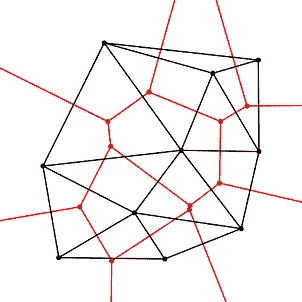

Figure 3: The (black) Delaunay triangulation of a (black) set of points in the Euclidean plane and its dual (red) Voronoi diagram (Source: [Wikipedia](https://en.wikipedia.org/wiki/Dual_graph))

我们参考[1，2]对大量 Voronoi 图和 Delaunay 三角测量变化的概述，例如最远点和加权 Voronoi 图。为了我们的目的，我们可以把自己限制在他们的标准定义。接下来让我们看看它们的计算实现。

我们的实施基于以下核心要素:

*   Python 3(在 Juypter 笔记本环境中使用)
*   用于 Python 的 OpenCV3.4.4.19 包装器包

为了确定面部标志，我们使用了 [Face++的演示功能](https://www.faceplusplus.com/landmarks/)。(请考虑在您自己的样本图像中使用此服务时的隐私问题。)

如果你更喜欢基于 C++的实现，我们建议看看 [CGAL](https://www.cgal.org/) 及其 Voronoi 和 Delaunay 类。这些应该使得下面的 Python 代码“翻译”成 C++相当简单。Python 编码的灵感来自于萨提亚·马里克的[博客文章](https://www.learnopencv.com/delaunay-triangulation-and-voronoi-diagram-using-opencv-c-python/)，也可以在 GitHub 上的[这里](https://github.com/cm230/Computational-Geometry)找到。

除了 OpenCV 包，我们使用 *numpy* 进行数组处理，使用 *matplotlib* 进行可视化。

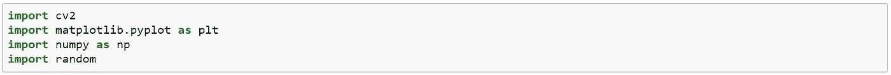

辅助函数 *rectContains* 确定点*点*是否落在由*矩形*描述的图像域内，并且因此是否应该将其视为图像的 Delaunay 三角剖分的输入。

*drawPoint* 功能正是这样做的，即它在输入图像 *img* 上以*彩色* ed 圆圈的形式显示面部标志 *p* 。

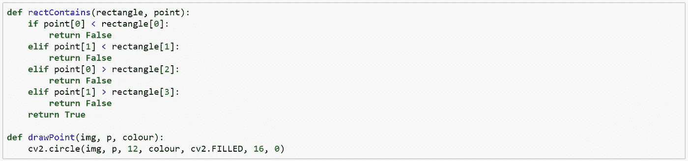

*voronoi* 函数使用*子曲面*成员函数 *getvoronoiFacetList* 来获取并随后基于其初始 OpenCV 细分*子曲面*绘制输入图像 *img* 的 Voronoi 图。我们为 Voronoi 面可视化设置了一个随机的颜色方案。

类似地， *delaunay* 函数在 *subdiv* 成员函数 *getTriangleList* 的帮助下确定并随后绘制输入图像 *img* 的初始 delaunay 细分 *subdiv* 的三角形。

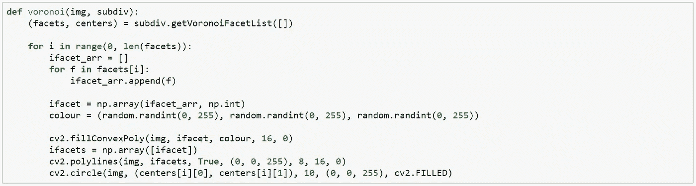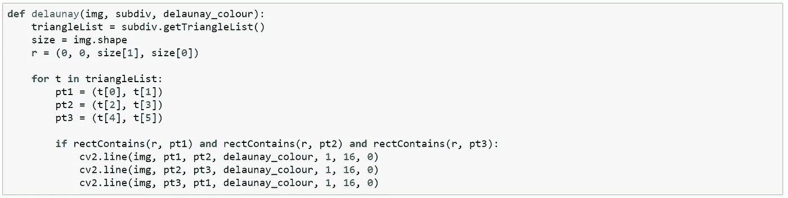

我们将这些函数应用于图 4 所示的示例图像。面部边界框和相应的面部标志由 Face++演示应用程序生成。

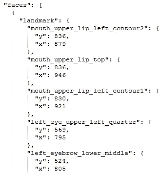

这个演示服务返回一个 JSON 文件，其中包含该服务在图像域中检测到的面部标志的 *(x* ， *y)* 坐标。图 4 中输入图像的 JSON 摘录如上所示。

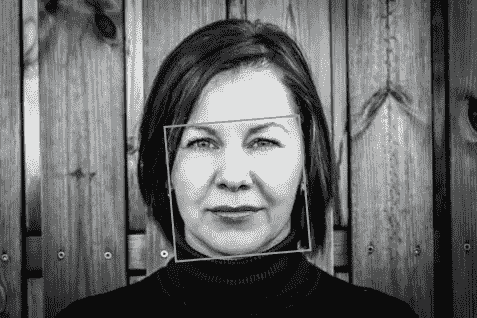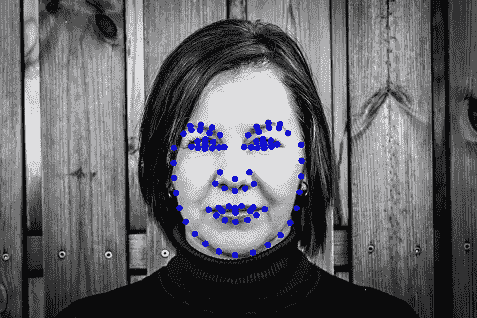

Figure 4: Original sample image (left) and both the facial bounding box (centre) and the associated facial landmarks (right) generated by Face++

这些面部标志坐标表示 OpenCV 细分函数的输入点。我们通过使用标准的 OpenCV *imread* 方法读入输入图像来开始 showcase 生成。输入图像的矩形形状决定了存储在*矩形*中的细分域。地标点以“Face2Points.txt”的形式上传到*点*数组中。然后，细分本身被实例化，并且随后通过使用细分*插入*方法逐个插入面部标志点来生成。

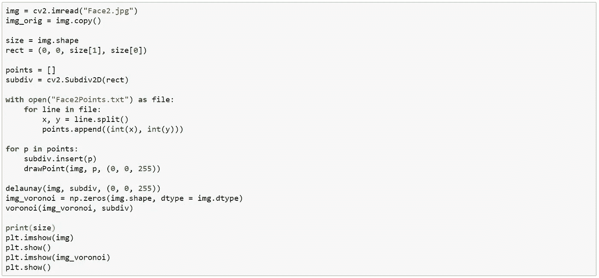

剩下要做的就是调用我们的 *delaunay* 和 *voronoi* 函数，传递输入图像及其新生成的细分。这导致了图 5 中显示的图形。

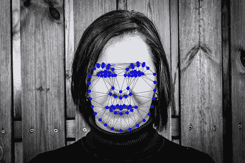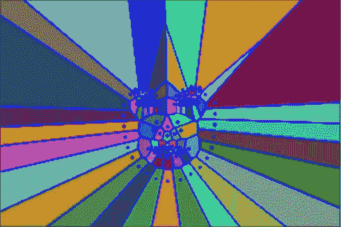

Figure 5: Delaunay triangulation (left) and its dual Voronoi diagram (right) of the input image

图 6 中的动画说明了一次一个面部标志点的输入图像的 Delaunay 三角测量过程。

Figure 6: Animation of the Delaunay triangulation of the input image

OpenCV *子曲面*对象提供了各种成员函数，用于检索 Delaunay 或 Voronoi 边和顶点。我们参考 OpenCV 标准[文档](https://docs.opencv.org/3.4/df/dbf/classcv_1_1Subdiv2D.html)获取详细信息。通过这种方式，这些相当通用的几何结构的各种元素可以很容易地传递给后续的图像处理或计算机视觉应用，如面部分割、识别[4、5、6]和[变形](https://www.learnopencv.com/face-morph-using-opencv-cpp-python/)。

虽然我们在这篇博文中关注的是计算机视觉应用，但请注意，这些几何结构存在许多用例，它们远远超出了计算机视觉的领域，尤其包括其他应用人工智能领域，如机器人导航。例如，参见[1，2]获得灵感。

## 参考

[1] M. de Berg、O. Cheong、M. van Kreveld 和 M. Overmars，*计算几何:算法和应用*，第三版，施普林格，柏林，德国，2010 年

[2] F. Aurenhammer，Voronoi 图-基本几何数据结构的调查， *ACM 计算调查*，23(3)，1991 年，第 345-405 页

[3] R. Szeliski，*计算机视觉:算法和应用*，斯普林格，伦敦，英国，2011 年

[4] A. Cheddad、D. Mohamad 和 A. A. Manaf，利用 Voronoi 图的特性进行人脸分割和特征提取，*模式识别*，第 41 卷，2008 年，第 3842–3859 页

[5] M. A. Suhail，M. S. Obaidat，S. S. Ipson 和 B. Sadoun，基于内容的图像分割， *IEEE Int .糖膏剂男子赛博恩。(SMC)* ，第 5 卷，2002 年

[6] M. Burge 和 W. Burger，耳朵生物测定学，载于:A. Jain、R. Bolle 和 S. Pankanti(编辑。)，*生物统计学:网络社会中的个人识别*，Kluwer Academic，波士顿，马萨诸塞州，美国，1999 年，第 273–285 页