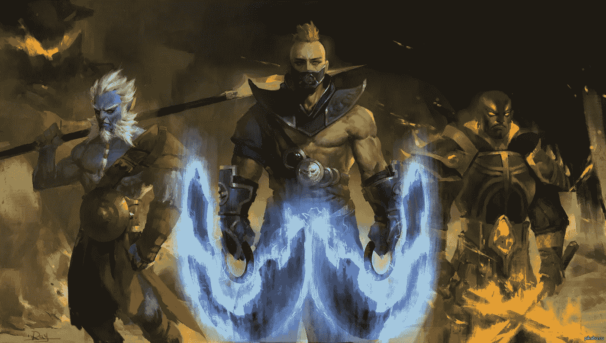
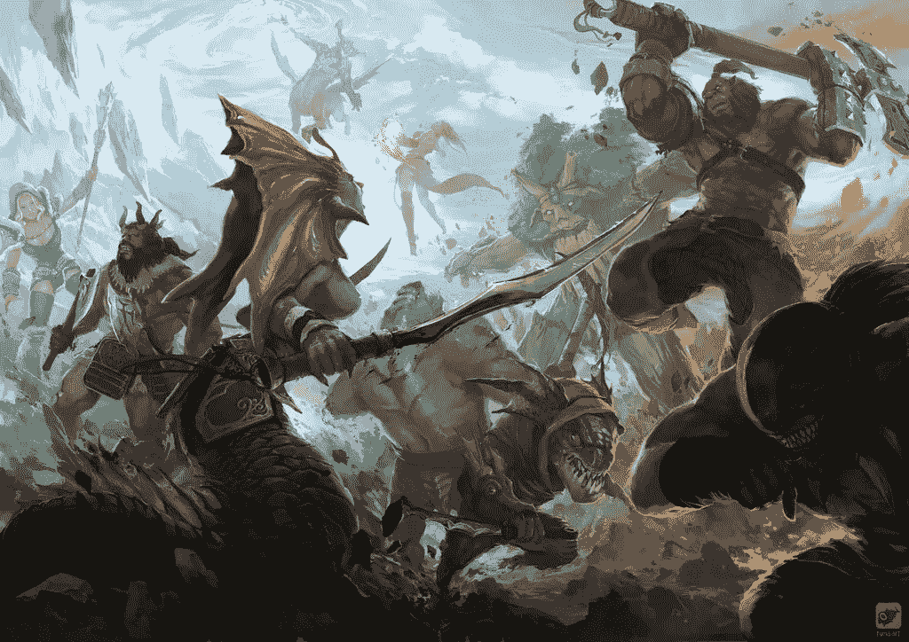

# 电脑游戏非常需要区块链

> 原文：<https://medium.datadriveninvestor.com/computer-games-need-blockchain-badly-d122a03c698f?source=collection_archive---------4----------------------->

将 lootboxes 等同于赌博并不是电脑游戏货币化的终结，而是行业发展新阶段开始的信号。

# 关于工具箱的问题

法国监管机构 ARJEL 的一份报告称，赌博机违反了国家政策，但从法律角度来看，它们不能被视为一种赌博形式。玩家在任何情况下都会从购买 lootboxes 中获得一些东西，但同时他还指望获得一大笔奖金。实际上，这种对想象中的巨额奖金的期望使得 lootboxes 赌博。

> 以前，lootboxes 在荷兰和比利时被赋予了与赌博同等的地位。像 Dota2 和 CS:GO 这样的热门游戏因此被禁。

# 货币化的替代方式

禁止 lootboxes 并不是视频游戏货币化的终结。据 VentureBeat 的分析师杰夫·格拉布(Jeff Grubb)称，lootboxes 将被更精致的货币化方式所取代。狂热的游戏玩家肯定对它们很熟悉。

比如现在在《皇家堡垒之战》中使用的高级进阶通行证系统。提升一个角色作为吸引玩家的一种方式已经存在了 20 年，只是现在玩家可以为了钱这样做，而不是花数百个小时提升一个角色。这位专家写道，这种形式的货币化赚取了相当大的利润。*注意，这与赌博无关！*

到目前为止，并不是所有的玩家都习惯于在电脑游戏中花钱，但是在五年内，这将成为一件绝对自然的事情。使用虚拟货币交易游戏物品是合乎逻辑的。

> 据游戏平台“Freed”的创始人 Evgeny Glariantov 称，自 2000 年以来，人们就一直在讨论创造通用游戏币的想法，但当时市场尚未做好准备。

大概，现在是时候了。如果付费游戏仍然被许多人认为是负面的，玩家已经习惯了付费账户的增加。有几个[好项目](https://medium.com/@alexstargame/blockchain-for-the-game-industry-projects-and-ideas-135f5a0f766)提供了使用区块链技术的不同变体，用于[电脑游戏货币化](https://medium.com/@alexstargame/computer-games-as-harbingers-of-cryptoeconomy-f3c6d2eeb0da)。这是一个很有前途的方向。

*区块链让赌博有机会脱离基于赌注的传统货币化方式，开始从游戏中的互动和收集功能中获利。只是我们打算如何在一个* [*费尔温*](http://fairwin.io/) *游戏中实现它，我稍后会告诉你。*

# 跟着我们

推特:[https://twitter.com/FairwinGambling](https://twitter.com/FairwinGambling)T2:[https://www.facebook.com/fairwin.gambling/](https://www.facebook.com/fairwin.gambling/)insta gram:[https://www.instagram.com/fairwin_team/](https://www.instagram.com/fairwin_team/)

# 与我们聊天:

不和:[https://discord.gg/Hbardp2](https://discord.gg/Hbardp2)Reddit:[https://www.reddit.com/user/fair-win](https://www.reddit.com/user/fair-win)电报:[https://t.me/fair_win](https://t.me/fair_win)