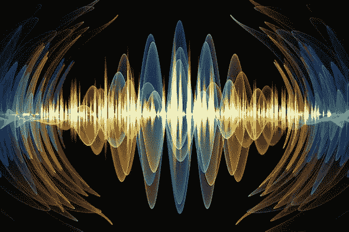

# 计算机超级视觉

> 原文：<https://medium.datadriveninvestor.com/computer-super-vision-31bb41b9ff2e?source=collection_archive---------23----------------------->

放大常规视频，听到无声的声音，看到看不见的动作

Credit: [Getty Images](https://www.gettyimages.com/detail/illustration/colorful-oscillation-royalty-free-illustration/990541032)

数学的绝对魔力可以通过它揭示隐藏在我们感官小波之间的部分世界的能力来展示。显微镜放大了我们宇宙的细微之处，这些细微之处是难以察觉的，但是存在着我们肉眼看不到的另一层现实，它包含了关于我们生活的世界的有意义的信息。检查这一层的一种方法是使用一种叫做欧拉视频放大的计算技术。

但是它是什么，它是如何工作的？

# 欧拉视频放大:*什么*。

EVM 是一种用于可视化普通视频中微妙的颜色和运动变化的技术，它依靠计算来使这些时间变化变大。通过隔离和放大感兴趣的信号来处理输入视频，这导致可能已经移动了原始视频中 1/100 像素的对象跨越输出视频中的许多像素。

这意味着可以看到细微的颜色变化，如人的脸因血流而变红，或起重机和建筑物的细微摇摆。

为了更好地理解这一点，我们需要深入流体力学。从欧拉的角度来看，流体粒子的特性是通过观察来自固定位置的时间信号来表征的，流体随时间穿过该固定位置。关于图像处理，这意味着从图像中的固定位置观察像素的强度变化，然后放大它们。然而，一旦放大系数变得太大，这种类型的放大就会失效。也就是；当大的运动发生时，颜色信息穿过许多像素，欧拉处理不能忠实地近似它们的放大。这是因为欧拉处理依赖于一种称为一阶泰勒级数展开的技术，运动必须与强度变化线性相关。否则，泰勒近似将是不精确的。

但是泰勒近似和欧拉处理有什么关系呢？

# 欧拉视频放大:如何。

在它的核心，欧拉视频放大功能通过对每个像素的颜色值的时间序列应用时间信号处理来放大时间频率带。为了解释时间处理和运动放大之间的关系，让我们考虑 1D 信号经历 2D 平移运动的情况。

设信号的强度用 ***I(x，t)*** 表示，其中 **x** 为**位置****t**为**时间**。由于信号处于运动中，所以相对于将位移考虑在内的函数来观察其强度，

> I(x，t) = f(x + (1 + α)δ(t))

对于某个放大因子α，其中δ(t)是位移函数，f(x) = I(x，0)。

一阶泰勒级数展开作为转换信号的良好近似器，在这种情况下可以帮助我们合成信号。

假设δ(t)很小，我们将时间 t 处的信号， *f(x + δ(t))* 写成关于 x 的一阶泰勒展开式，为

> I(x，t) ≈ f(x) + δ(t)*(∂f(x) / ∂x)

设 *B(x，t)* 是在每个位置 x 对 *I(x，t)* 应用宽带时间带通滤波器的结果。这将挑选出除 f(x)之外的所有内容，给出我们

> B(x，t) = δ(t) * (∂f(x) / ∂x)

***带通滤波器*** 允许两个特定频率之间的信号通过，但歧视其他频率的信号。带通信号被放大α倍，并加回 I(x，t ),得到处理后的信号

> I'(x，t) = I(x，t) + αB(x，t)

其中 I'(x，t)是处理后的信号。

结合上述等式，我们发现处理后的信号是简单的

> I'(x，t) ≈ f(x + (1 + α)δ(t))

从上面的等式中，我们可以看出，处理后的信号被放大到(1 + α)的幅度。

# 欧拉视频放大:哪里。

EVM 的一些应用是:

1.  从视频中的微小运动估计物体的材料特性。
2.  从视频恢复热空气的速度和深度。
3.  从物体响应声音而轻微振动的视频中恢复声音。
4.  当血液流入头部时，根据头部的牛顿运动测量脉搏。

# 关于从振动中恢复声音的一点点…

这是 EVM 的一个非常有趣的应用。

基本上，声音是气压的波动。这会导致物体一碰到它就振动。当然，这些振动是非常微妙的。但是通过使用 EVM，振动可以被定量分析以恢复声音，即使是无声的视频！视觉麦克风可以通过分析薯片包装的振动从高速视频中恢复语音。

然而，这些振动非常小，噪声(如视频中的颗粒)很容易干扰算法。但是重量轻的物体(如薯片包装)反映了连贯的运动，因为物体的密度和可压缩性是其中的因素。物体的平均运动通过特定于物体的传递函数相对于声音来测量。