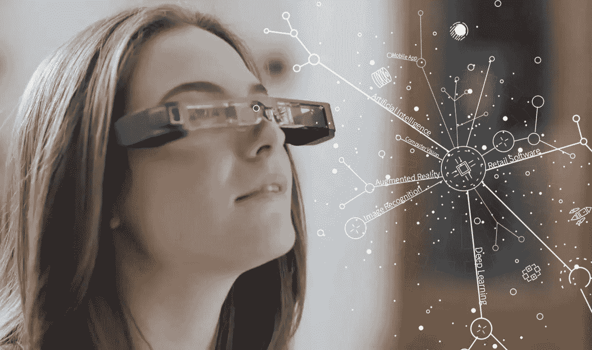
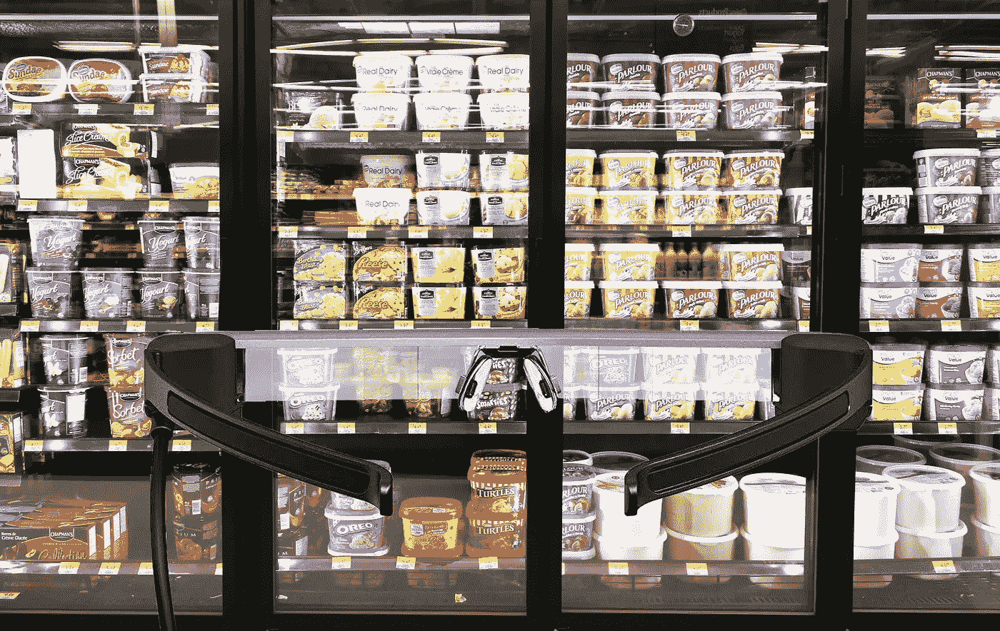
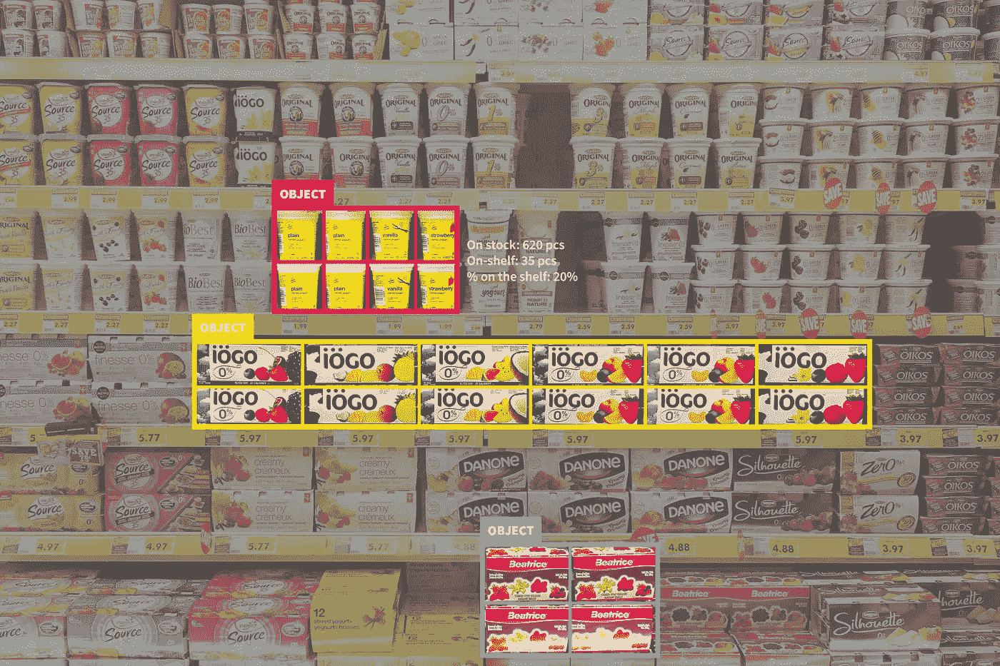
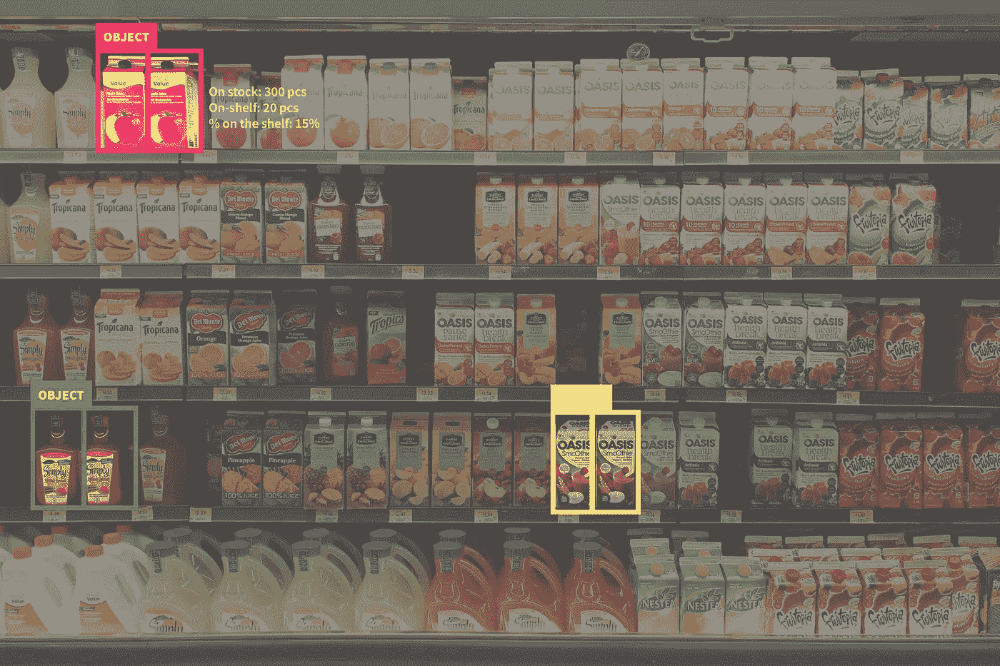

# 计算机视觉在零售业中的应用

> 原文：<https://medium.datadriveninvestor.com/computer-vision-application-for-retail-industry-1a98bd61572a?source=collection_archive---------1----------------------->

# 零售痛点

各地的零售商都必须不断应对一个共同的痛点:跟踪所有的商品。这包括核算他们销售的所有商品以及他们的库存。后者可能是最具挑战性的，因为这包括仓库、商店后室甚至货架上的商品。为了做出业务关键型决策，品牌需要始终掌握最新的库存情况、销量、竞争对手的库存以及其他重要数据。

Skywell Software 与系统集成商 [Customertimes](https://new.customertimes.com/) 以及我们的研发合作伙伴决定通过开发新的零售技术来缓解这一业务痛点。我们创建了一个人工智能移动应用程序，使用计算机视觉使零售商能够跟踪他们库存的所有商品。这款尖端的零售软件不仅能提供精确的信息，还能消除人为错误，并在最短的时间内将数据与服务器同步。

# 背景

最初，客户来找我们，要求开发一种工具，让他们能够有效地从商品流中收集数据，并极大地提高业务关键型决策的质量。

 [## 修复摄影|数据驱动的投资者

### 汤姆·津伯洛夫在转向摄影之前曾在南加州大学学习音乐。作为一个…

www.datadriveninvestor.com](https://www.datadriveninvestor.com/2019/03/22/fixing-photography/) 

这种零售店软件将向他们提供的信息包括货架上商品的整体流动。他们需要为客户的品牌和竞争对手提供这些信息。现在我们知道了 Customertimes 正在寻找的产品的想法，让我们看看 Skywell Software 是如何解决这个问题的。

# 技术解决方案

牢记所有的问题-想法见解，Skywell 软件团队决定利用其在计算机视觉和图像识别方面的深厚专业知识来创建业内高效的[零售软件解决方案](https://skywell.software/retail/)。只有在这些技术的帮助下，我们才能训练系统定位和识别货架上的产品，在 AR 中将其可视化，量化这些产品，并将信息发送到服务器，以便服务器端可以正确读取这些信息，并可以在考虑所有客户端规格的报告中呈现这些信息。

# 涉及的技术

可以想象，创建这样一个先进的零售图像识别解决方案需要结合使用多种技术。为了实施该解决方案，客户选择了 EPSON Moverio BT-300 AR 眼镜来可视化报告，因为它们比竞争产品轻得多，而且成本也低得多。

在我们这边，我们使用 Unity 和 SDK Vuforia 实现了最灵活的解决方案，即可以在 AR 眼镜和移动设备上工作的解决方案。这在选择技术堆栈时扮演了重要的角色，因为主要需求之一是解决方案必须支持上述两种可视化。但首先要做的是。

选择合适的 SDK，我们将我们的决定缩小到 Vuforia 和 Wikitude。然而，在进行了广泛的研究后，我们发现 Wikitude 只能支持移动应用程序上的可视化，尽管他们的网站声称也支持头盔。

因此，为了可视化 AR 中的信息，我们选择了 Vuforia basic SDK，它允许进行高质量的对象跟踪，并使我们能够完全实现我们心目中的库存管理软件。SDK Vuforia 成了我们的通用解决方案。

我们选择 Unity 是因为这个引擎让我们能够为所有平台调整我们的解决方案。截至目前，该平台只为 Android 构建，但它意味着将来可以部署到其他平台。

# 克服异议

在选择正确的技术组合和进一步编程时，我们必须考虑解决方案的一系列要求。

对于客户来说，识别这个系统被正确训练的对象是至关重要的。开发中的重要阶段是获得对陀螺仪和照相机自动对焦的控制，调整数据的传输和准备。

同样重要的是，一切都要在**短时间内**完成，因为他们希望在行业活动中展示。考虑到零售业中[计算机视觉](https://skywell.software/computer-vision-services/)所涉及的所有复杂性，我们仍然能够在其他公司建议的一半时间内实现这一解决方案。

确保团队的**灵活性**也是必要的。由于最后期限非常紧迫，从事该项目的团队必须尽可能方便客户，在实施方面灵活，并在克服出现的困难方面做出快速反应。

客户特别关注解决方案的**可扩展性**。我们必须以这样一种方式开发它，以便它可以在未来轻松扩展，以便可以添加离线/在线电子签名、条形码扫描仪、贸易促进管理套件等新模块，以及一些新功能。当然，这一切都需要彼此正确地工作，这为集成到现有产品中创造了适当的条件，而不会产生内部冲突。

为了创建一个**通用**解决方案，我们必须选择一个技术堆栈，确保零售货架解决方案可以在所有平台(iOS、Windows 等)上工作。)和不同的设备，正如我们上面提到的。这是我们通过选择 Unity 和 Vuforia SDK 捆绑包实现的。

# 客户风险

如果没有这样的解决方案，客户将面临系统错误地识别图像上的项目的风险，并且将无法在 AR 中可视化报告。Skywell 软件在产品开发中发挥了关键作用。如果没有我们的参与，Customertimes 将不会在设定的时间范围内收到针对零售行业的现成解决方案。

# 为什么选择 Skywell 软件

客户选择 Skywell 软件团队是因为我们的专业知识和内部知识。这包括时间限制——我们负责用其他人提供的一半时间开发产品。这样的时间框架允许 Customertimes 在工业活动上展示其现成的产品。此外，我们为客户提供了及时、准确的研究结果报告。因此，所有这些附加值在客户选择 Skywell Software 作为其研发合作伙伴的决定中起着至关重要的作用。

# 结果

我们的结果对顾客和零售商都有利:

-对于客户时间，我们提供了基于独立模块系统的定制解决方案，可以通用移植到其他平台。该解决方案还补充了客户的产品，并使实现主要想法成为可能。由于我们的发展，他们的产品已经成为一个整体解决方案，可以成功地执行所有必要的功能，并可以出售给直接消费者，即零售商。

-对于客户的顾客，我们创造了一个有用的工具，使他们能够减少跟踪商店和仓库中的商品所涉及的人力成本。这相当于审计成本降低了 80%。我们的解决方案也排除了人为错误。结果不言自明。实施该解决方案后，由于及时监控货架上商品的可用性和合理布局，销售额增加了 2–5%。

# 让我们一起努力吧

分享您的项目想法，我们将为您提供最佳的计算机视觉解决方案。

[估算项目](https://skywell.software/estimate-project/)

*原载于*[*https://sky well . software*](https://skywell.software/portfolio/computer-vision-application-for-retail-industry/)*。*