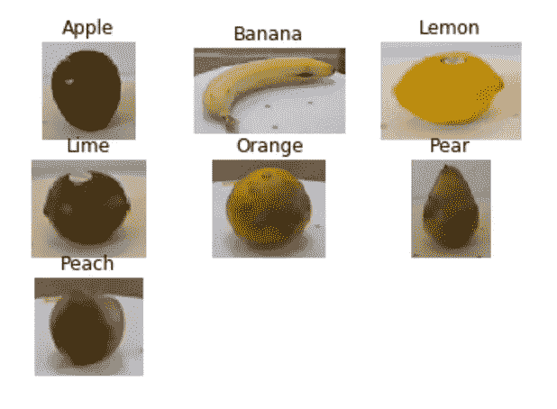
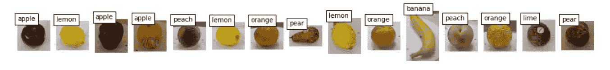

# 计算机视觉:水果识别

> 原文：<https://medium.datadriveninvestor.com/computer-vision-fruit-recognition-4f2f7a780e00?source=collection_archive---------1----------------------->

你好，我还是计算机视觉的初学者。所以我想告诉你一些关于我在学校的作业的故事。这是关于水果识别的。嗯，这有点难研究，因为以前我不能建立识别系统。我花了两周时间学习制作这个系统。编程语言是 Python3，我用 Jupyter Notebook 来编写它。

好吧，让我告诉你我的数据集的故事。我有 19.127 个图像数据。我的讲座给学生提供了这个数据集。这是数据的例子。



Fruit Datasets

有 7 类，苹果、香蕉、柠檬、酸橙、橘子、梨和桃子。顺便说一下，我喜欢苹果、香蕉，我认为……我喜欢:D 所有的水果，除了酸橙，因为它很酸。够了，回到主题。

让我们看看代码。首先，我们需要这个包。

我已经添加了注释，这样你就不会对这个包感到困惑了。之后，让我们开始加载数据集。

然后，让我们开始识别水果。首先，您必须连接所有的数组数据集，因为我在单独的数组中加载数据集。

```
X_Shapedes=np.concatenate((apple,banana,lemon,lime,orange,peach,pear))
y_Shapedes=np.concatenate((label_apple,label_banana,label_lemon,label_lime,label_orange,label_peach,label_pear))
```

然后，您应该将分类的数据训练和数据测试分开。在你分离它之前，你必须随机化数据，因为如果你不随机化数据，系统就不会学习所有的数据。语法如下

```
X_train, X_test, y_train, y_test = train_test_split(X_Shapedes, y_Shapedes, test_size=0.33, random_state=42)
```

在我的项目中，我使用 67%的数据集进行数据训练，然后使用 33%的数据集进行数据测试。

然后，必须进行特征提取。在我的代码中，我使用形状描述符来提取水果形状的信息。我使用的形状描述符是 HOG(梯度方向直方图)。这个描述符在基于形状的物体检测中非常有名。幸运是，skimage 已经提供了 HOG 库，所以在这段代码中我们不需要从头开始编写 HOG。但是，在进行特征提取之前，我们需要对图像进行预处理。预处理是为了提高图像的质量以满足分类的需要。如果我们不首先做预处理，我们将不能完全得到形状的信息。

好了，这是预处理的代码

在这段代码中，我使用灰度并将图像的大小调整为 72 x 72。那么，这是猪的代码

好了，现在我们可以通过调用函数来进行预处理和特征提取

```
*#Preprocessing*
X_trainp=preprocessing1(X_train)
X_testp=preprocessing1(X_test)*#Feature Extraction* 
X_trainftr=featureExtraction1(X_trainp) X_testftr=featureExtraction1(X_testp)
```

好吧，这需要点时间。现在，在这一步之后。我们做分类。在这个项目中，我使用 k-NN 分类。k-NN 分类是监督学习的一种，因为逻辑简单，所以容易学习。我们有一个不知道类的对象。首先，我们需要确定 k 值。然后我们用欧几里德距离来衡量一个物体到另一个物体的距离。然后，从这一个物体中选择 k 个最近的物体。然后看到多数，例如如果 x 类多于 y 类，那么这个物体就属于 x 类

Scikit-Learn 已经为 k-NN 提供了库。这是 k-NN 的代码

我们使用 fit 训练数据。然后，让我们试着预测数据测试结果

```
y_knn_pred = knn_clf.predict(X_testftr)
```

之后，让我们看看使用这个语法的准确性。

```
print(accuracy_score(y_test, y_knn_pred)*100,'%')
```

好吧！完成了。我得到了 99.9%的准确率，非常棒。我希望这能帮助你建立识别系统。如果你想知道识别结果，给你



Fruit Recognition Result

好吧！谢谢，如果你想了解更多，你可以访问我的 GitHub

github.com/nadyadtm

请对这篇文章给出一些反馈。