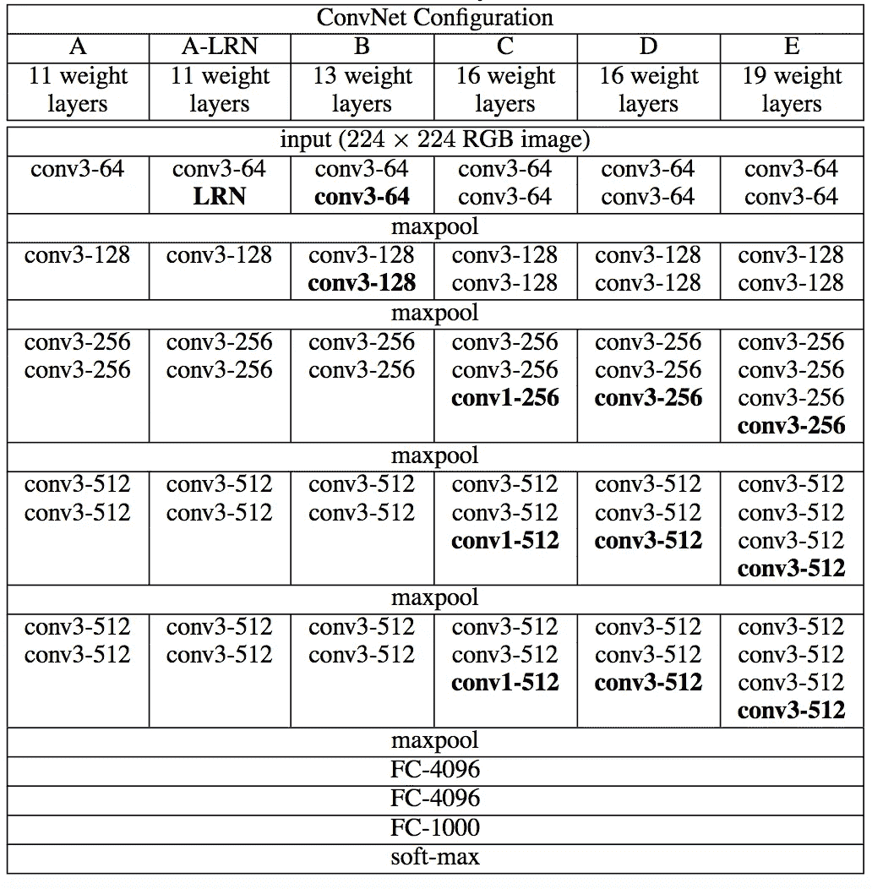
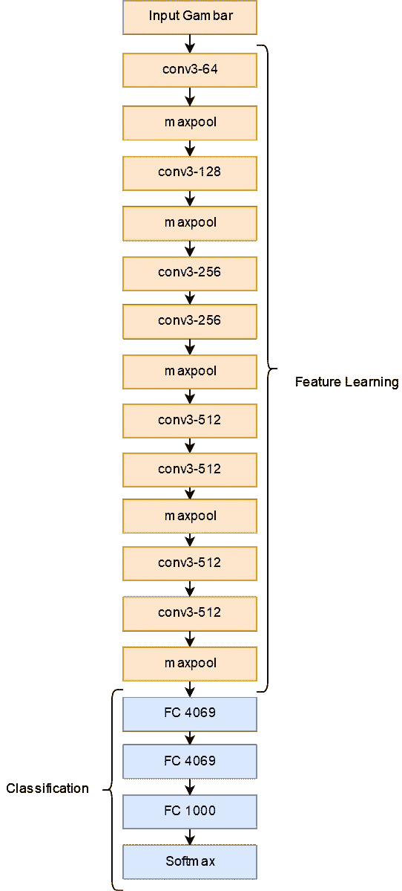
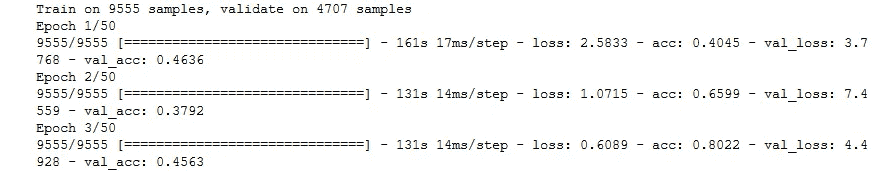

# 计算机视觉:卷积神经网络和 VGGNet 简介

> 原文：<https://medium.datadriveninvestor.com/computer-vision-introduction-of-convolutional-neural-network-and-vggnet-fe4cc0f10b48?source=collection_archive---------2----------------------->

> 我建议你必须了解人工神经网络的概念

你好，又回到娜迪亚身边了。我想分享一些关于 CNN(卷积神经网络)的故事。我用 Keras 构建 CNN 系统。这是我最后一次识别系统作业。你知道 CNN 吗？我来解释一下引言。

哦，这是警告。想要更好的了解 CNN，就需要了解 ANN(人工神经网络)。所以当我解释 CNN 是什么的时候，我假设你理解安。

 [## 深度学习用 7 个步骤解释-更新|数据驱动的投资者

### 在深度学习的帮助下，自动驾驶汽车、Alexa、医学成像-小工具正在我们周围变得超级智能…

www.datadriveninvestor.com](https://www.datadriveninvestor.com/2019/01/23/deep-learning-explained-in-7-steps/) 

在 ANN 中，你可以看到这里有一些层

Source: Google

有三种层次。这些层是输入层、隐藏层、输出层。还有重量和激活功能。CNN 的概念也差不多。这是一个例子。

Source: [https://medium.com/@RaghavPrabhu/understanding-of-convolutional-neural-network-cnn-deep-learning-99760835f148](https://medium.com/@RaghavPrabhu/understanding-of-convolutional-neural-network-cnn-deep-learning-99760835f148)

CNN 分为两个阶段，特征学习和分类。在通常的识别系统中，我们需要决定我们想要识别哪个特征，就像如果我们想要识别水果，我们可以从它的颜色来识别它。但是，对于 CNN 来说，系统会自己学习这个特性。特征学习有两种层次，卷积层和池层。

在卷积层，那里会发生卷积。在 CNN 上，权重就是过滤核。内核的大小通常为 3×3、5×5、7×7 等等。在开始卷积之前，我们需要确定步幅和填充。步幅是内核需要移动多少像素。填充是图像周围的空间。而卷积层会产生“特征图”

卷积层之后，还有一个汇集层。池图层是用于最小化要素地图维度的图层。有两种联营，有最大联营和平均联营。这就是联营的例子。

Source: [https://medium.com/@samuelsena/pengenalan-deep-learning-part-7-convolutional-neural-network-cnn-b003b477dc94](https://medium.com/@samuelsena/pengenalan-deep-learning-part-7-convolutional-neural-network-cnn-b003b477dc94)

在本例中，它使用最大池和 2x2 过滤器，步幅为 2。

好了，现在我们去全连接层。在全连通图层中，我们需要将特征地图展平为一个 1D 矢量，这样我们就可以将它用作全连通图层的输入。FC 层和 ANN 做的方式一样，FC 层有一些隐藏层、激活层、输出层和损失层。反向传播和人工神经网络一样。

好的，有很多 CNN 架构，但是在这篇文章中，我将解释其中一个 CNN 架构，VGGnet。

VGGnet 是我第四次作业选择的 CNN 架构之一。我使用的参考文献是卡伦·西蒙扬·丹·安德鲁·齐泽曼写的《用于大规模图像识别的超深度卷积网络》。这是他们制作的配置 VGGNet 架构。

VGGNet Configuration

这里有 6 种配置，但我选择了 a，这是 VGGnet 框图。

VGGNet Architecture

根据该论文，图像输入尺寸是 224 x 224 x 3 (RGB)。但我只是用输入尺寸 224 x 224 x 1(灰度)。过滤器大小为 3 x 3，池过滤器大小为 2 x 2。对于通道，我使用 64、128、256 和 512，就像这样。

好了，理论解释到此为止。接下来，我将解释我做的代码。首先，我们需要导入这些包。

之后，我们应该加载图像数据。对于数据，我已经把它转换成文件格式。因为如果我一个接一个地加载图像，将会花费更多的时间。下面是例子。

x 是图像数据，y 是标签。好的，对于图像数据集，我将其分为 67%的数据训练和 33%的数据测试。因为我之前已经对数据集进行了随机化，所以在这段代码中，我不需要在拆分数据之前对其进行随机化。

哦，我差点忘了，在我们使用数据进行训练和测试之前，我们需要将标签转换为二进制，因为神经网络只使用二进制输出。我已经在我的 github 上传了所有的代码。以后再分享。

现在，我们去看真正的源代码。这是 VGGnet 架构的代码。我用 keras 来建造它

对于激活功能，我对卷积层、池层和 FC 层使用 RELU，对输出层使用 Softmax。

之后，我设置损失函数和优化器，对于损失函数，我使用分类交叉熵，对于优化器，我使用 Adam。下面是代码示例

然后，让我们设置这个模型中所有重要的参数。

我将批量大小设置为 128，并将纪元设置为 128。然后，我把数据训练分成 67%的数据训练和 33%的数据验证。好吧，让我们运行这段代码！

好的，结果是我可以用这个模型得到很好的精确度。

如果你想深入研究这段代码，可以看我的 Github[https://Github . com/nadyadtm/Fruit-Recognition-Using-CNN-VGGnet/blob/master/VGGnet _ CNN . ipynb](https://github.com/nadyadtm/Fruit-Recognition-Using-CNN-VGGnet/blob/master/VGGnet_CNN.ipynb)太感谢了。过得愉快