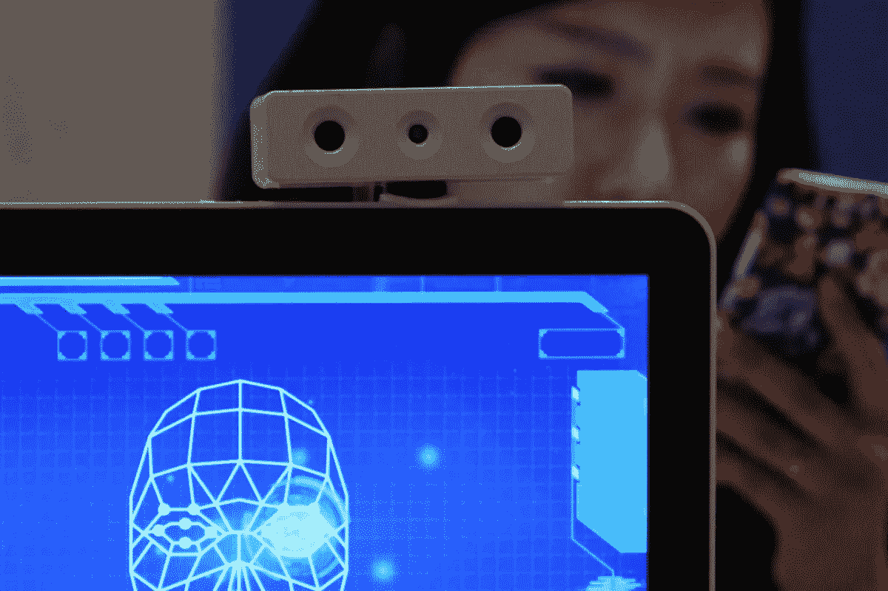
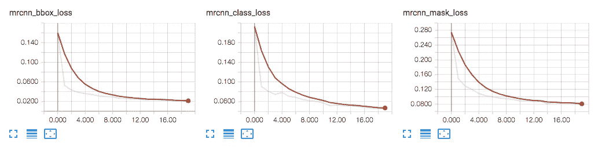

# 用 Python 实现计算机视觉

> 原文：<https://medium.datadriveninvestor.com/computer-vision-with-python-188b50433dbf?source=collection_archive---------11----------------------->

计算机视觉是一个科学领域，研究如何让计算机从数字图像或视频中获得高层次的理解。深度学习的新进展使得更有效地训练模型成为可能。我们可以检测图像中的对象，同时为每个实例生成高质量的分割掩模。该方法被称为掩模 R-CNN，通过与现有的用于边界框识别的分支并行地添加用于预测对象掩模的分支，扩展了更快的 R-CNN。

它是一个卷积神经网络，与 RCNN 具有相同的特性，因为它通过将图像划分为多个区域并在这些区域中搜索它认为可能相关的对象来节省时间。我们可以通过在任何检测到的对象周围画一个边界框来标记这些对象。遮罩 RCNN 更进了一步，它在物体上绘制一个遮罩。该遮罩是网络在边界框内绘制的半透明轮廓，用于突出显示检测到的对象。用户必须首先安装下面的存储库，并使用 pip 安装所需的软件包。

 [## 2019 年深度学习的终极学习路径及更多...数据驱动的投资者

### 又一个美好的一周，一些好的教育内容将会到来。我最喜欢的&最受欢迎的帖子之一…

www.datadriveninvestor.com](https://www.datadriveninvestor.com/2019/01/07/the-ultimate-learning-path-for-deep-learning-in-2019-more/) 

**GitHub:**【https://github.com/matterport/Mask_RCNN】T4

**需求:** Python 3.4，TensorFlow 1.3，Keras 2.0.8 等`requirements.txt`中列出的常用包。

对于这个项目，我们使用了加州理工学院的 Home Objects 数据集。这个和其他大量的计算机视觉数据集可以在他们的档案中找到[这里](http://www.vision.caltech.edu/archive.html)。一旦收集了数据集，就必须对其进行注释，以便将其用于训练。牛津大学有一个方便的网络工具，可以为这样的计算机视觉任务注释图像，可以在这里找到。VIA 工具将注释保存在 JSON 文件中，每个遮罩都是一组多边形点。还提供了一个可下载的版本和关于如何使用图像、视频和音频注释器的教程。一旦你的模型被训练，不要忘记检查它的准确性。GitHub 有 Jupyter 笔记本示例，将向您展示如何显示您的模型的检测。

Validation with Tensorboard

总之，要在您自己的数据集上训练模型，您需要扩展两个类:

`Config`该类包含默认配置。子类化它并修改你需要改变的属性。

这个类提供了一种一致的方式来处理任何数据集。它允许您使用新的数据集进行训练，而不必更改模型的代码。它还支持同时加载多个数据集，如果您想要检测的对象在一个数据集中不可用，这将非常有用。

参见`samples/shapes/train_shapes.ipynb`、`samples/coco/coco.py`、`samples/balloon/balloon.py`和`samples/nucleus/nucleus.py`中的示例。

在您验证了模型的准确性之后，您可以继续使用实况和/或录制的镜头来测试模型。使用 OpenCV 库，您可以利用您训练的模型，并用您的网络摄像头或计算机上的视频文件来测试它。

**多安人工智能**为全球客户提供**计算机视觉咨询**。如果你对实施人工智能感兴趣，请不要犹豫[联系我们](http://www.dogan.ai/)。

电子邮箱:john@dogan.ai

网址: [www.dogan.ai](http://www.dogan.ai/)

马修·洛佩兹写的