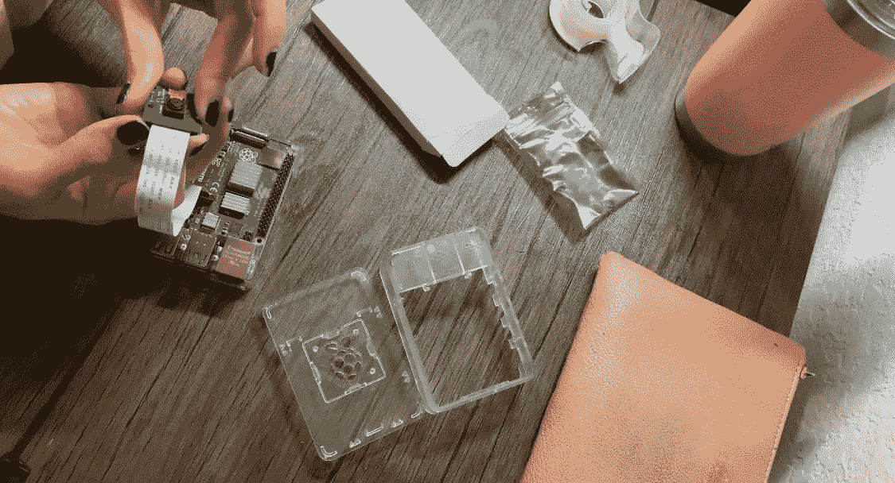
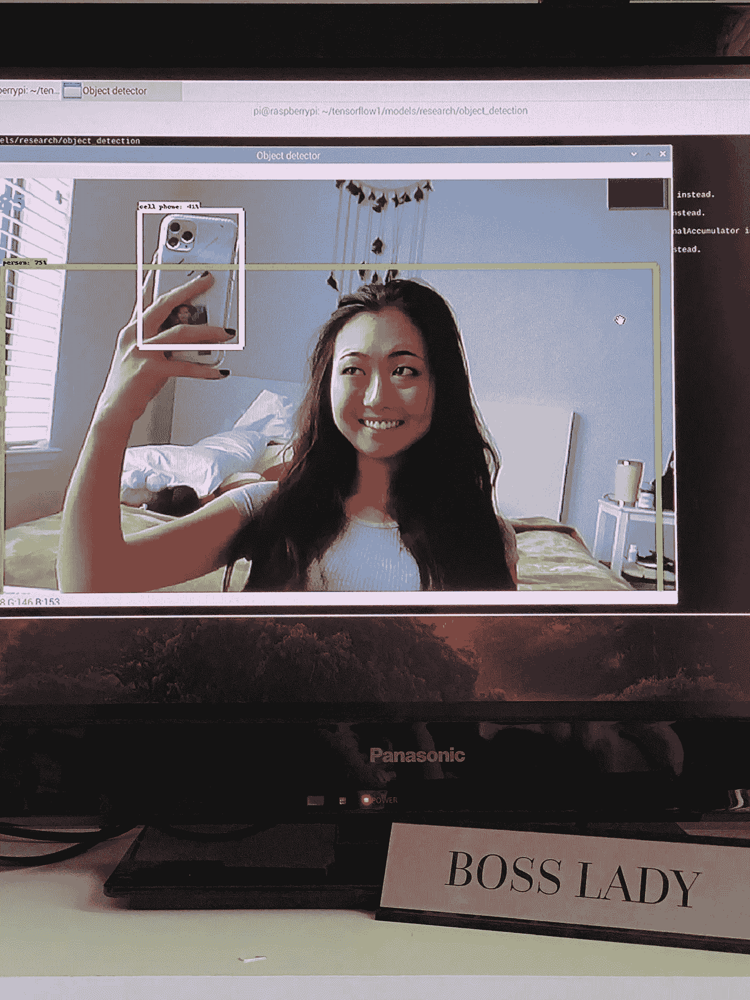
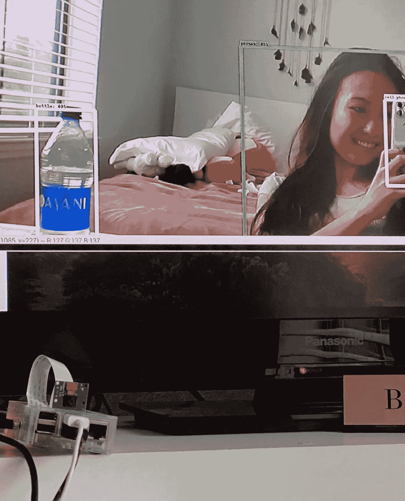
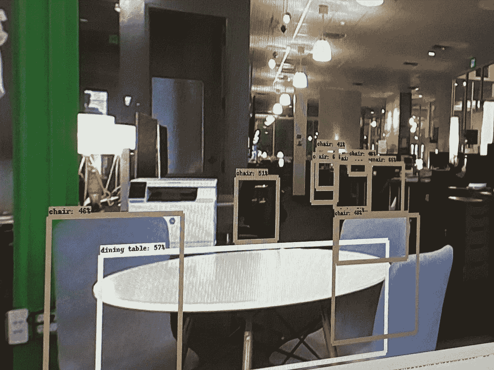

# 计算机视觉与树莓皮

> 原文：<https://medium.datadriveninvestor.com/computer-visioning-with-a-raspberry-pi-6d1035679f44?source=collection_archive---------7----------------------->

## 出于好奇，我想知道树莓 pi 是否能够处理 TensorFlow，我在最新的树莓 Pi 4 B 上进行了尝试。

Assembling the Raspberry PiCamera Cana Kit

计算机视觉(CV)行业是教计算机在接近人类看到和处理图像的水平上解释图像。例如，通过在大量照片中标记皮肤癌的指标，可以教会计算机识别黑色素瘤的迹象。这些照片通过深度学习神经网络进行处理。它还可以做更简单的任务，比如识别车辆型号，比如本田思域。

谷歌发布了一个非常容易使用的计算机视觉系统，名为 TensorFlow，也有预教系统可用。我在为我的初创公司研究人员/脚步计数机制时偶然发现了这项技术，并对谷歌免费提供这项技术感到惊讶。我需要专门用对象检测来训练设备，所以我将一个预训练的系统加载到 Raspberry Pi 4 上进行测试。

我使用的预训练量化模型是 SSD MobileNet v2 Lite，它能够识别 90 类物体，从香蕉、瓶子、猫，当然还有人。

 [## 修复摄影|数据驱动的投资者

### 汤姆·津伯洛夫在转向摄影之前曾在南加州大学学习音乐。作为一个…

www.datadriveninvestor.com](https://www.datadriveninvestor.com/2019/03/22/fixing-photography/) 

众所周知，张量流在配有不错处理器的笔记本电脑上非常慢，所以我不太确定它在树莓 Pi 上的表现如何。我希望，由于树莓 Pi 将致力于运行 TensorFlow，它将能够处理负载。

创建目录和加载文件的过程花了大约一个星期，这不是最顺利的过程。下载 openCV 需要一段时间，但我认为这是最简单的方法。picamera 的图像质量不算太差，我会说它与 iPhone 4 的相机质量相似。

所以让我们来看看我在跑 TensorFlow 时拍的一些照片:

TensorFlow Object Detection: person and cell phone

这是我第一天启动它时拍的照片。在这一天之前，它已经崩溃了 15 次以上，我感到非常沮丧。正如你在图像中看到的，该设备检测到我是一个人，而我的 iPhone 是一部手机。

TensorFlow detecting: person, cell phone, and bottle

在这张照片的一角，你可以看到我的树莓派已经用相机装好了。我要说的是，很难找到一个既能安装相机又能安装散热装置的盒子。我可以使用其中一个，如果我可以在运行 TensorFlow 时使用风扇就太好了，因为它会变热。

TensorFlow detecting: chairs and table

我在办公室试用了树莓 pi 来测试不同的距离，看看 TensorFlow 如何处理它。它在探测远距离物体方面做得非常好。那里的桌子被标记为“餐桌”，因为预先训练的图书馆可能教它以这种方式识别所有的桌子。谁说那不是餐桌呢？

总之，Raspberry Pi 4 B 完全能够运行对象检测。考虑到它的定价在 50 美元左右，这是相当可观的。如果你有兴趣亲自尝试一下，我建议你先用一个来开始。有这么多的指示，教你如何一步一步地加载它，所以不要气馁！

事实上，我并没有技术背景，我正在攻读生物学学位。所以如果我能做到，你也能！