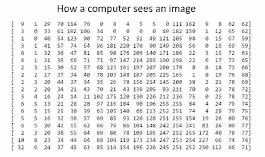
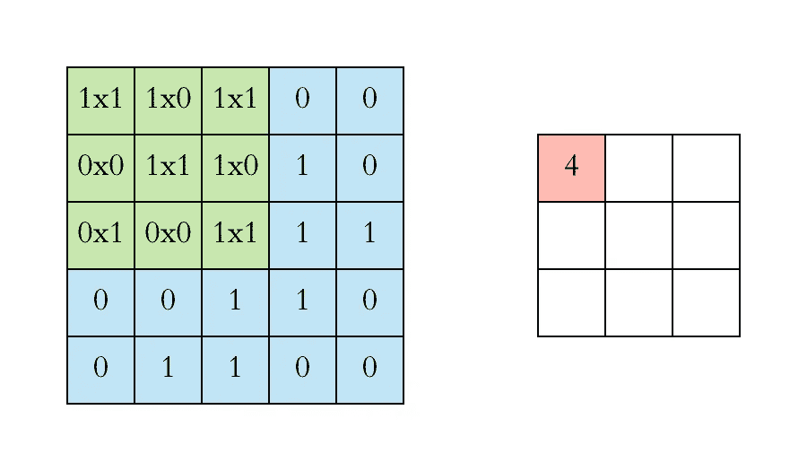
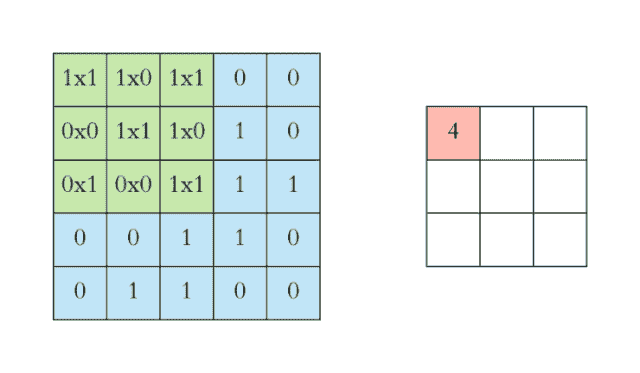
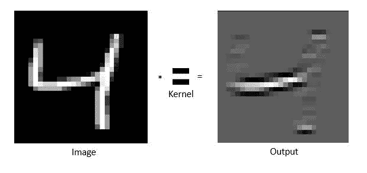
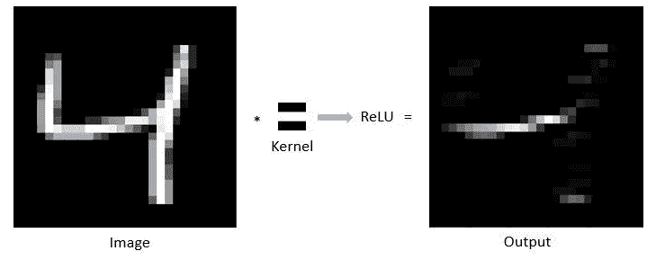
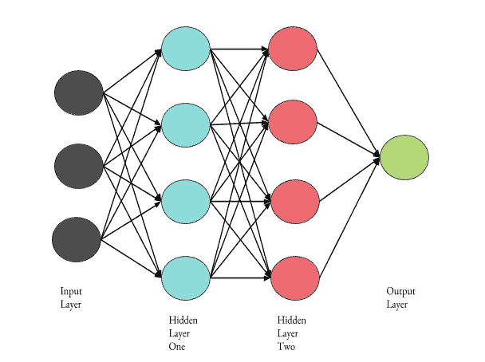

# 电脑能看见？！

> 原文：<https://medium.datadriveninvestor.com/computers-can-see-2ba2d0713240?source=collection_archive---------10----------------------->

视觉是充实生活最基本的部分之一。最近，视觉已经被添加到使用卷积神经网络(CNN)的人工智能(AI)技术中，卷积神经网络是计算机视觉的一个专门分支。说什么？？？电脑现在能看了？他们要接管世界？？不，我们还没到那一步。

然而，CNN 当然可以用来识别物体，诊断疾病，以及完成其他依赖于解释图像的任务！现在你可能在想，一个算法怎么能做医生的工作，或者识别物体？很高兴你问了！继续阅读，了解更多！

 [## 修复摄影-数据驱动的投资者

### 汤姆·津伯洛夫在转向摄影之前曾在南加州大学学习音乐。作为一个…

www.datadriveninvestor.com](https://www.datadriveninvestor.com/2019/03/22/fixing-photography/) 

首先，它有助于理解计算机如何真正看到图像。请看下图:

你可能会看到两个人在堆雪人。想知道计算机是如何看到这样的图像的吗？看下面:

计算机用数字来看图像，数字代表像素。CNN 帮助计算机理解这些数字，并真正看到图像。

CNN 用于图像分类，并使用两个部分进行操作:

1.  特征抽出
2.  分类

特征提取从输入数据开始。这部分过程的输入数据是需要分类的图像。现在，特性这个词出现在名字中，那么特性是从哪里来的，它们首先是什么？功能是图片中的差异化因素。例如，如果你正在给狗和猫分类，你有一张猫的照片，那张照片的一个特征是它们有更锋利的爪子。特征提取过程以输出结束，输出是来自原始图片的特征集的简化图像。

使用内核(也称为过滤器)来识别特征和创建简化图像的特征提取功能。我们马上就要开始学习数学了，所以准备好吧！

核由数值组成，这些数值与图像的数值相乘。

如上图所示，内核与图像重叠(图像为蓝色，内核为绿色)。在所有乘法运算之后，这种重叠将产生九个乘积。然后将这九个产品相加，在右边的方块中产生一个输出。例如，第一次重叠的总和是 4。内核在图像上滑动，直到找到所有的值。

你一定想知道，这一切意味着什么(双关语)？嗯，当你提取特定的特征时，与图像相乘的内核会使图像的其他部分变暗，只留下你正在提取的特征。如果使用之前的例子，猫的胡须在穿过内核后会变得突出，而图像的其余部分会变暗。另一个例子是这个手写数字。图像的左边是输入数据，在与内核相乘后，您会得到右边的图像。被提取的特征是水平线，它在手写数字中被突出使用。

使用内核后，输出(变暗的图像)将经过另一个数学步骤，这称为激活函数。大部分时间使用 ReLU，代表整流线性单位。这只是将乘法运算产生的所有负值变为 0，其余的保持不变。完成这一步后，图像将如下图所示。

该图像仅用于提取水平线，但也可以提取图像中的其他特征，如垂直线。

特征提取过程的最后一步称为汇集。池化的目的是减少当前输出的大小，这将减少处理数据所需的计算能力。有两种类型的池:

1.  最大池化
2.  平均池

最大池化是指在这个阶段之后接收到的输出是内核覆盖的图像部分的最大值。平均池是指这个阶段之后的输出是内核覆盖的图像部分的所有值的平均值。

特征提取结束后，分类部分开始。分类发生在完全连接的层(也称为神经网络)，如右图所示。这解释了卷积神经网络中的“神经网络”一词。如果你不知道什么是神经网络，可以看看我的[另一篇关于 AI 及其一些子集的文章](https://medium.com/@ramandeepsaini1379/a-crash-course-on-modern-tech-aaa1793c59f)，比如神经网络。

全连接层常常不止一次地重复从卷积到 ReLU 再到池化的过程。图像通过全连通层后，分类完成。

图像分类可以对世界产生巨大的影响。除其他外，它还被用于识别癌细胞、诊断疾病和增强面部识别技术。CNN 也可以用于物体检测，这在自动驾驶汽车中是必不可少的。随着计算机进化到可以看世界，它们可以更有效地与我们一起工作，对全球的生活产生影响。