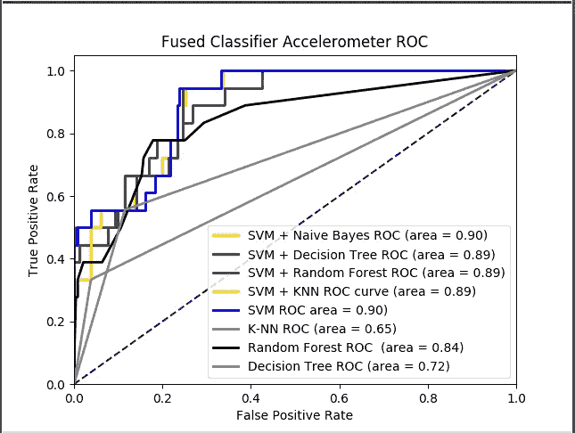

# 用 Python 计算 ROC 曲线

> 原文：<https://medium.datadriveninvestor.com/computing-an-roc-graph-with-python-a3aa20b9a3fb?source=collection_archive---------0----------------------->

[](http://www.track.datadriveninvestor.com/1B9E)

ROC 曲线通常以 Y 轴上的真阳性率和 X 轴上的假阳性率为特征。这意味着图的左上角是“理想”点——假阳性率为零，真阳性率为一。这不是很现实，但它确实意味着曲线下面积(AUC)越大通常越好。ROC 曲线通常用于二元分类，以研究分类器的输出。为了将 ROC 曲线和 ROC 面积扩展到多类或多标签分类，需要对输出进行二值化。每个标签可以绘制一条 ROC 曲线，但是也可以通过将标签指示矩阵的每个元素视为二元预测来绘制 ROC 曲线。输入样本的预测类别概率被计算为集合中分类器的加权平均预测类别概率。使用 Python 我们可以导入 SkLearn 库。用户可以为 Python3 安装 Anaconda，马上上手。

安装 Python:[https://real Python . com/installing-Python/# step-1-download-the-Python-3-installer](https://realpython.com/installing-python/#step-1-download-the-python-3-installer)

https://www.anaconda.com/download/[蟒蛇](https://www.anaconda.com/download/)

安装 SciKit:使用 Anaconda 命令行—pip install -U scikit-learn

在我们的示例中，我们将使用 scikit 库来检测是否检测到 class 1 或 class 2。在这个例子中，我们将使用 SVM 分类器。请创建一个 python 文件并测试代码。首先，我们必须导入我们的库。

```
from sklearn.svm import SVC
from sklearn.metrics import roc_curve
from sklearn.metrics import auc
import matplotlib.pyplot as plt
import numpy as np
```

我们必须在将标签与中的特征分离后创建多个列表。txt 文件。在我们的用例中，我们使用一个列表，然后将它转换成 numpy 数组。

```
#READ TRAINING AND TESTING FILE
featureFile = input("Enter Training File: ")
featureTestFile = input("Enter Test File: ")
featureFile = open(featureFile, 'r')
featureTestFile = open(featureTestFile, 'r')lines = featureFile.readlines()linesTest = featureTestFile.readlines()'''
X: 2D All Features Split Into Columns in a list for training
CF: 2D All Classes (1 or 2) in a list for training
TestX: 2D All Features Split Into Columns in a list for testing
TestCF: 2D All Classes Split Into Columns in a list for testing
'''
X, CF, TestCF, TestX = gatherFeatures(lines, linesTest)#NORMALIZE DATA AND RUN THROUGH SVM OBJECT
runClassifiers(X, TestX, TestCF, CF)
```

我们阅读了标有 1 或 2 的训练和测试数据。这是二进制分类，对于多类项目也是类似的。一旦特征被收集，我们就可以通过分类器运行所有的东西。我将跳过这篇文章的特性收集部分，只讨论预处理和分析我们的数据。

```
'''
Pre Process Data and Create ROC Curve. 
'''def runClassifiers(listX, listTestX, listTestCF, CF):#CLASS ARRAY, STORES ALL CLASSES
    cf = np.array(CF)
    cfTest = np.array(listTestCF)#Convert to Array
    X = np.array(listX)
    TestX = np.array(listTestX)# NORMALIZE DATA
    X = preprocessing.scale(X)
    TestX = preprocessing.scale(TestX)#SVM GATHER DATA
    rbf_svc = SVC(kernel='rbf', gamma=0.00001, C=1000,probability=True).fit(X, cf)#PREDICT PROBABILITY SCORE = 2D ARRAY FOR EACH PREDICTION
    predictedprobSVC = rbf_svc.predict_proba(TestX)#GET ROC DATA
        fpr, tpr, thresholds = roc_curve(cfTest, predictedprobSVC[:,1], pos_label=2)
    roc_auc = auc(fpr, tpr)#GRAPH DATA
    plt.figure()
    plt.xlabel('False Positive Rate')
    plt.ylabel('True Positive Rate')
    plt.plot([0, 1], [0, 1], color='navy', linestyle='--')
    plt.xlim([0.0, 1.0])
    plt.ylim([0.0, 1.05])
    plt.title('SVM Classifier ROC')
    plt.plot(fpr, tpr, color='blue', lw=2, label='SVM ROC area = %0.2f)' % roc_auc)
    plt.legend(loc="lower right")
    plt.show()
```

ROC 曲线常用于以图形方式显示一项测试或多项测试组合的每一个可能临界值的临床敏感性和特异性之间的联系/权衡。此外，ROC 曲线下的面积给出了使用所述测试的益处的概念。一旦运行了这个类，我们的 ROC 曲线图就会显示出来，看起来类似下图。



我们可以看到不同分类器的表现，并扩展我们的分析。**多安 AI** 为全球客户提供**机器学习咨询**。如果你对实施人工智能感兴趣，请不要犹豫[联系我们](http://www.dogan.ai)。

电子邮箱:john@dogan.ai

网址: [www.dogan.ai](http://www.dogan.ai)