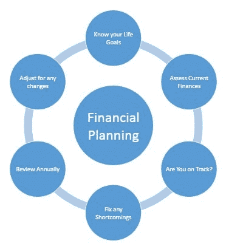

# 财务规划的概念

> 原文：<https://medium.datadriveninvestor.com/concept-of-financial-planning-3c687f7a0e9f?source=collection_archive---------9----------------------->

***建筑财富不是偶然发生的。你需要精心计划事情，并系统地执行。那些了解财务自由并为之努力的人可以获得财务自由。***

Understand and Implement

**理财规划**旨在确保一个家庭有足够的收入或资源来满足当前和未来的支出和需求。一个家庭的固定收入可能来自职业、工资或生意。一个家庭的正常活动和日常开支是围绕着固定收入进行的。然而，可能还需要从可用收入中支付其他费用。家庭的当前收入还必须为没有收入或收入很低的时期(如退休期)做准备。可能会有未列入预算的意料之外的费用，如大笔医疗费用、子女教育费用、结婚费用或买房费用，所有这些都需要在适当的时候有足够的资金。因此，将当前收入的一部分存起来并用于创造资产将满足这些要求。

**财务规划是指理顺家庭收入、支出、资产和负债的过程，以满足当前和未来的资金需求。**

 [## 股票市场投资的机器学习——数据驱动的投资者

### 当你的一个朋友在脸书上传你的新海滩照，平台建议给你的脸加上标签，这是…

www.datadriveninvestor.com](https://www.datadriveninvestor.com/2019/01/30/machine-learning-for-stock-market-investing/) 

*用下面的例子详细理解这个概念:*

拉吉夫今年 40 岁，收入 40 卢比。一个月 20 万卢比。在支付了所有家庭日常开支，支付了房子、汽车和其他需求的贷款后，他每个月能存下大约 4 万卢比。他的投资包括税收储蓄、银行存款、债券和一些共同基金。他为自己和妻子支付人寿保险费。Rajiv 是家庭中唯一挣钱的成员，他相信他能充分管理好自己的财务，以满足当前和未来的需求。 ***理财规划对他有什么帮助*** ？

**以下是财务规划将帮助 Rajiv 解决的一系列指示性问题**

*   作为唯一有收入的成员，如果他目前的收入因任何原因中断，他是否已准备好支付他的费用？
*   他是否有足够的保险，在他过早死亡的情况下能够满足他家人的需求？
*   考虑到他目前的收入和支出，他有足够的积蓄来创作所需的文集吗？
*   他未来的具体开销是什么，他将如何资助这些开销？
*   如果拉吉夫必须创建一个语料库来资助未来的大笔开支，他应该建立多大的投资语料库？
*   他是必须削减当前的开支，还是增加当前的收入，以满足当前的开支和未来的储蓄？
*   到目前为止，拉吉夫从他的储蓄中积累了多少财富？他如何才能最好地利用这些财富来满足自己的需求？
*   他的积蓄应该如何配置？什么样的投资适合拉吉夫建立所需的语料库？
*   拉吉夫愿意并能够为他的投资承担多大的风险？如何管理这些风险？
*   拉吉夫应该如何确保他的储蓄和投资与他的收入、支出和未来需求的变化相一致？

正式处理 Rajiv 面临的问题需要一个**财务规划流程**来评估当前形势，确定当前和未来的需求，确定满足这些需求所需的储蓄，并将储蓄投入使用，以便所需的资金可用于满足计划中的各项需求。

***理财规划就是这样一个过程，能够更好地管理一个家庭的个人财务状况。它主要通过确定关键目标和实施行动计划来调整财务以实现这些目标。这是一种全面的方法，考虑现有的财务状况，评估未来的需求，提出一个满足需求的流程并审查该流程。***