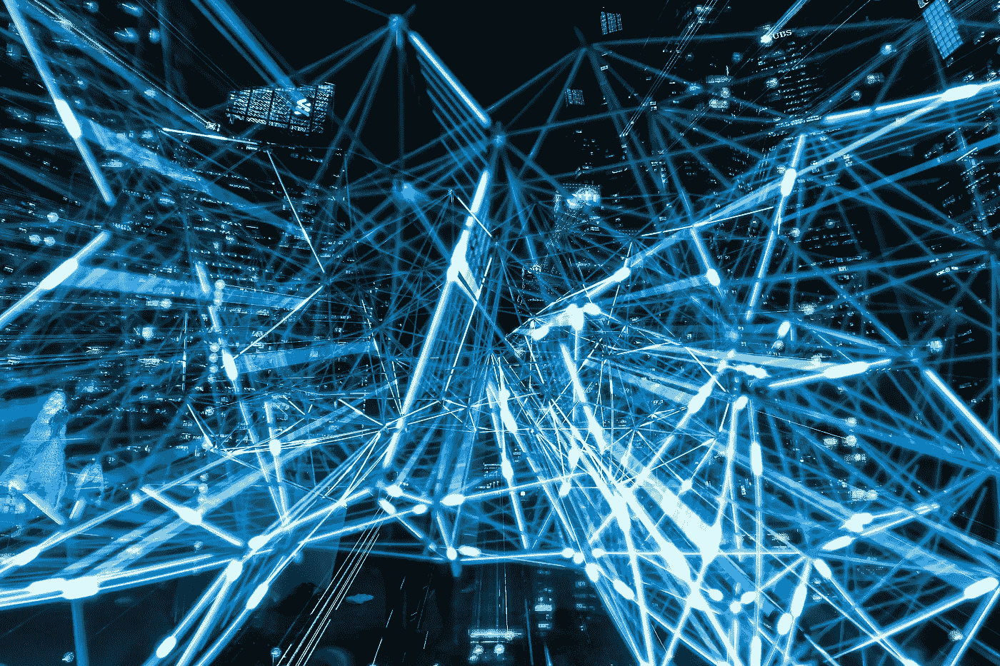
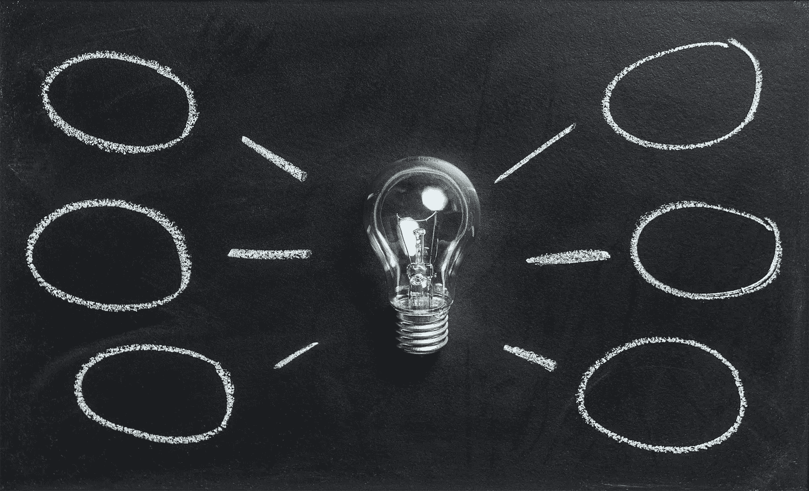

# 关于去中心化的概念观点&人工智能是未来的网络标准

> 原文：<https://medium.datadriveninvestor.com/conceptual-view-on-decentralization-ai-being-the-new-cybersecurity-f1e95ccfdd54?source=collection_archive---------29----------------------->

通过区块链的去中心化是惊人的:信息可以快速共享，人工智能可以在去中心化的实体之间创建血统，验证可以是适当的和完整的。

理解区块链的人不多，理解人工智能的人也不多，但这两者结合起来所产生的力量是无可争议的。

网络安全急需重新启动。几乎每个组织都提供一些基于城堡防御的方法，这很好，但在启发式分析和防止零日恶意软件进入敏感环境方面相对臃肿。有时候真的会适得其反。

随着权力下放，整个网络安全概念改变了威胁载体的面貌。没有人能得到一切…也许面包屑会到处被黑客攻击，但不同点的节点和实体的适当分离甚至可以防止它们成为黑客的目标。找到他们的唯一方法是单独找到他们，这很困难，因为他们必须首先确定每个单独的入口点。

在当今世界，我们有下载恶意软件的个人。如果存根是加密的，它将在整个企业中传播，它将整天呆在那里，直到 SIEM 或启发式分析发现它，或者如果存根被烧毁，AV 最终可以检测到它。防火墙可能会阻止恶意软件与其来源之间的一些进出流量，但由于标准端口需要开放，因此无法阻止它给家里打电话。端口 80、443 和 25 是常用的，许多新的恶意软件套件通过一个平台用电子邮件发送键盘记录的结果，并通过端口 25 发送出去。当然，通过去中心化，存根不能像用户交互那样传播到不同的机器上。一个看似无害的反病毒文件，实际上是加密的恶意软件和混乱的代码，突然变得毫无用处。然后，结合人工智能来获取基于执行时间、呼叫总部技术和文件资源的启发式信息，就有可能分析和消除这种情况，就像它是沙盒一样，但在实时环境中，它从未被共享。

谈到网络安全，人工智能当然是一场赌博。首先，机器学习显然会产生一种虚假的安全感。现实中，AI 可以错误地屏蔽很多东西，或者过度分析。它只有开发出来才是好的，所以如果黑客有足够的动力，他们可以学会绕过它。

这里真正有意思的是去中心化和学习的结合。分散式机器上的共享学习环境意味着每台机器都在自己的环境中运行。机器学习必须研究每台机器的数据，并对其进行单独分析，然后将其报告给 AI 知识库。像现在这样，大多数机器学习技术都是从自上而下的方法来分析它，使用它们的存储库来控制标准，并分析超出这些界限的任何东西。这对于当前形式的区块链来说并不理想，因为节点是在单独的基础上运行的。当然，区块链的定制水平似乎有无限的潜力，所以在不久的将来，当涉及到去中心化时，可以期待看到一些非常不同的网络安全方法。至于人工智能，在安全行业已经如火如荼。这两者的结合可以实现适当的信息共享，从而防止我们所知的黑客攻击。当然，我确信我们采取的任何方法都会有弱点。