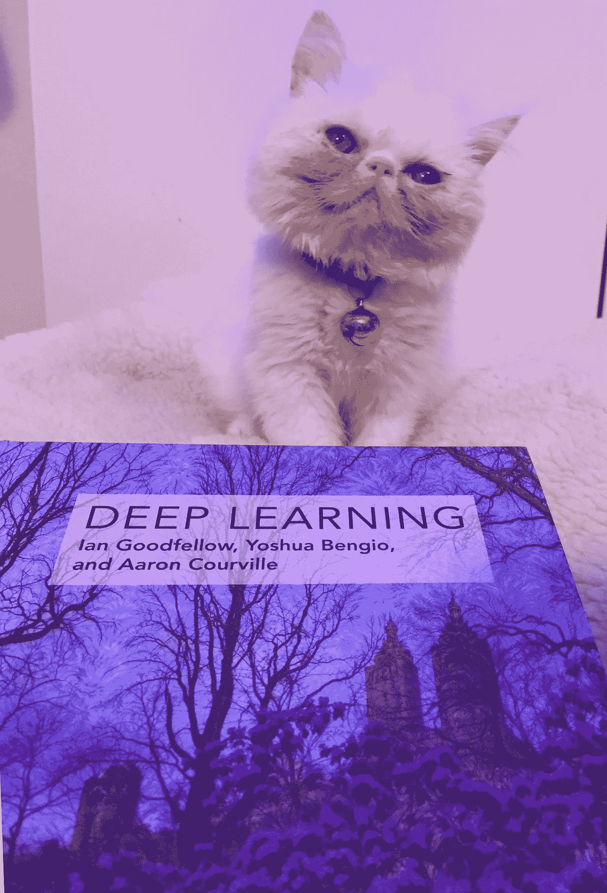
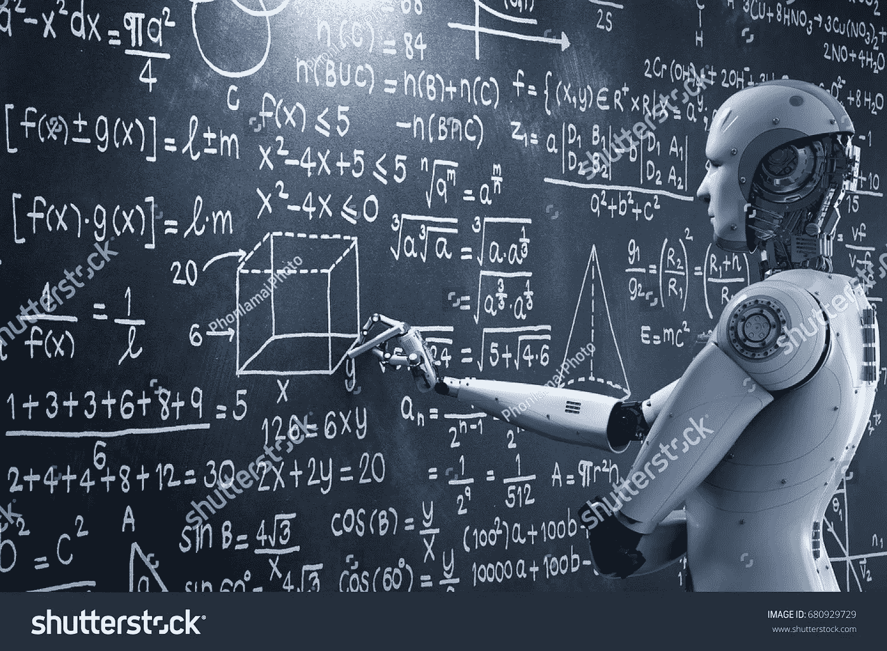

# 关于人工智能教育

> 原文：<https://medium.datadriveninvestor.com/concerning-ai-education-9888bdb1c6cd?source=collection_archive---------24----------------------->

I read a book and it changed my life! [Photo credit belongs to the author.]

人工智能教育是一个模糊定义的术语，有两个以上的含义，一个是指使用人工智能的教育，另一个是指在人工智能领域教育人类，最后它也意味着人工智能教育人类！显然，人工智能(AI)在教育领域有许多方面，从被用作教育的技术工具到成为随时可用的专业私人导师。

在这篇文章中，我想从几个角度恢复对人工智能教育领域的思考、关注和推测。

有几份市场报告预测了教育领域人工智能市场的未来，他们预计 2018-2021 年期间将有 47.50%的增长*【1】*。

## 人工智能作为教育的辅助工具

AI as a learning tool [image taken from shutter-stock]

当人工智能工具达到成熟阶段时，它们将成为常规教学环境的一部分，并处理重复性任务，如考勤、阅卷或自动化作业过程。在这种情况下，教师可以留出足够的时间来进行教育活动，将与学生进行一二一互动的简单部分留给人工智能*。这种人类-人工智能合作的有限环境意味着人工特定智能的理想世界，其应用正在取代传统的机器学习/统计策略。*

## *学习人工智能*

*学习人工智能有几个障碍，主要障碍是缺乏必要的背景知识来理解必要的概念。在收集了基本知识之后，要在这个快速发展的领域取得成果，还需要额外的和持续的努力，从一个领域到另一个领域的可转移知识也是至关重要的。尽管对于这个领域的基础知识有一个共识，因为充分的数学知识和编程一定是教育不可或缺的部分*【3】*。随着人工智能的进步，人工智能的一些应用不可避免地增加了，基于人工智能教育的内容是其中之一，根据想学习人工智能的学生，大量的资源也被认为是一个问题，因为他们觉得错过了必要的内容，延迟了使用几乎没有学到的知识应用任何东西。这些例子表明，除了人工智能研究策略，越来越有必要拥有与社会需求相对应的人工智能学习策略，而不是漫不经心地用冗余的大规模在线开放课程浪费好奇心。*

## *基于人工智能的导师*

**

*Highly abstracted image of robot tutor teaching on a chalkboard! image taken from shutter-stock]*

*独立决策导师似乎是科幻小说系列的一部分，但由于最近对聊天机器人或语音生成器的研究，显示了人工智能的巨大潜力，因此智能人工智能导师并不遥远。有几家公司正在增强这项技术，如 [Thinkster](https://get.hellothinkster.com/math-tutor/) 、 [Mika](https://www.carnegielearning.com/products/software-platform/mathiau-learning-software/) 和 [Brainly](https://brainly.com/) 来帮助人类学习，并根据学习者的需求进行个性化。还有课程编辑工具，为教师提供更多功能。这些成就是令人惊叹的例子。人类与人工智能的共同进化，这总是在我脑海中引发一些疯狂的问题，尤其是我想知道为什么人类向人类学习得最好？镜像神经元？也许吧！*

*参考资料:*

*1.[https://www . tech navio . com/report/artificial-intelligence-market-in-the-us-education-sector-analysis-share-2018？UTM _ source = T9&UTM _ medium = bw _ wk34&UTM _ campaign = business wire](https://www.technavio.com/report/artificial-intelligence-market-in-the-us-education-sector-analysis-share-2018?utm_source=t9&utm_medium=bw_wk34&utm_campaign=businesswire)*

*2.[https://medium.com/p/9888bdb1c6cd/edit](https://medium.com/p/9888bdb1c6cd/edit)*

*3.[http://www.iaied.org/pub/989/file/989_paper.pdf](http://www.iaied.org/pub/989/file/989_paper.pdf)*

*4.[https://www . thetechedvocate . org/5-示例-人工智能-教室/](https://www.thetechedvocate.org/5-examples-artificial-intelligence-classroom/)*