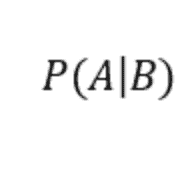
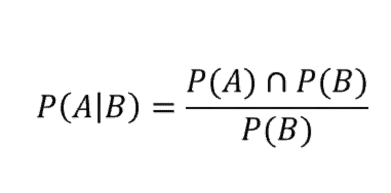
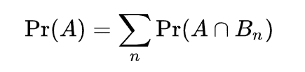
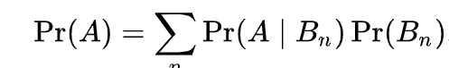
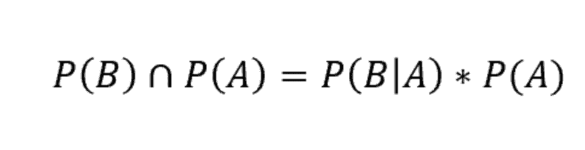
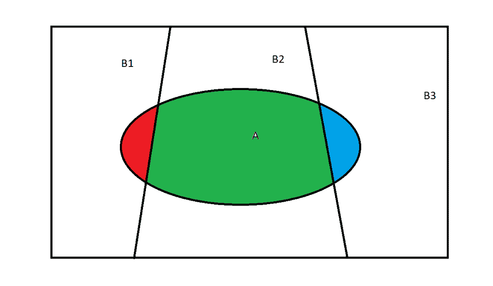
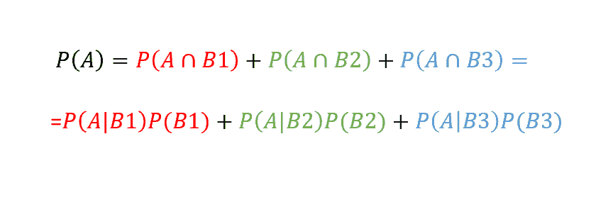
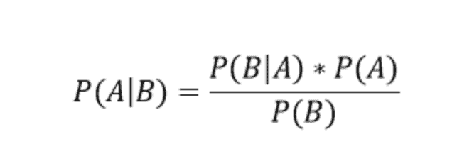
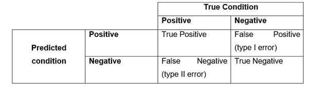
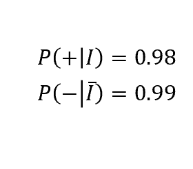

# 条件概率和罕见事件

> 原文：<https://medium.datadriveninvestor.com/conditional-probability-and-rare-events-585b436863a5?source=collection_archive---------6----------------------->

条件概率是指在给定一些额外信息的情况下，一般事件发生的概率。更具体地说，一个事件 A 相对于 B 的条件概率:

表示给定的 B 发生的概率。如果两个事件是独立的，简单和条件概率重合(B 的发生与 A 的发生无关)，否则:

现在，还有两个被广泛使用的公式。

或者，可选地:

的确，从条件概率的定义中，我们知道:

我们可以通过下图轻松地将其形象化:

这个定理的充分论证可以在[这里](https://medium.com/dataseries/lets-build-your-first-naive-bayes-classifier-with-python-d31a5140e4bc)找到。

 [## 描述性与推断性统计|数据驱动的投资者

### 描述性统计和推断性统计是统计分析的两大分支。根据定义，描述性的…

www.datadriveninvestor.com](https://www.datadriveninvestor.com/2019/02/28/descriptive-vs-inferential-statistics-whats-the-difference/) 

现在我们要用这两个公式来解决下面的问题。

想象一下，你在一家诊所工作，你想对你的病人进行测试，以了解他们是否生病。现在，您的测试将返回两个结果:如果检测到疾病，则为阳性；如果没有，则为阴性。那些被预测的值，可能等于也可能不等于现实。因此，为了评估你的测试的性能，你需要一个叫做混淆矩阵的评估标准。

此指标用于分类任务。这是一种特定的表格布局，通过计算预测值等于(或偏离)实际值的次数，可以直观显示算法的性能:

我们来解读一下。首先，对于那些熟悉统计学的人来说，你可能已经认识到假设检验的常用术语:事实上，当实际条件为负(正)而预测条件为正(负)时，我们会出现第一类和第二类错误。

但是“积极”或“消极”是什么意思呢？

一般来说，当它符合我们的零假设时，我们指的是正条件，即*现状*(保守情况)。否则，如果我们面对另一个假设，拒绝零，我们就在处理一个“负面”的情况。请注意，积极和消极并不一定意味着好或坏，通过我们的例子您会很容易理解:

*H0:“病人病了”* *H1:“病人没病”*

我们可以将混淆矩阵表示如下:

如果我们在病人生病时不拒绝空值，我们的混淆矩阵将计算一个真阳性。如果我们拒绝“零”,认为病人完全正常，而实际上他并不正常，我们就面临着第一类错误:这是你可能面临的最糟糕的情况，因为你把一个需要紧急干预的病人送回家。另一方面，第二类错误(当它为假时接受空值)并不像前一类错误那样糟糕:如果你没有足够的信心接受替代方案，最好还是保持保守状态。最后，如果预测值和实际值都是负的，我们的混淆矩阵会将这个观察结果计算为真的负。

现在想象一下，我们的测试能够在 98%的情况下检测到疾病(这意味着它的真实阳性率或敏感度等于 0.98)。此外，它能够将在 99%的情况下实际上没有表现出疾病的健康人分类(这意味着，其真正的负比率或特异性为 0.99)。如果我们说 *I* 是事件“生病”，+是事件“正结果”，而—是事件“负结果”，我们就有了以下数据:

假设在我们的人口中，这种疾病的发病率为 *p* 。

鉴于测试结果为阳性，我们有兴趣了解患病的条件概率。换句话说，如果患者从测试中获得阳性结果，那么他/她实际上生病的概率是多少？

也就是说，如果疾病的发生率是 *p* =0.3，概率 P(I|+)=98%，这是有道理的:我们有一个非常准确的测试，因此它应该很好地将病人与健康人分开。

但是如果这种疾病极其罕见，假设 p=0.1%，会发生什么呢？在这种情况下，我们有 P(I|+)=9%。

一个极其精确的测试怎么可能做到呢？这意味着只有 9%被归类为患病的人实际上表现出这种疾病。答案依赖于我们正在分析的事件的低概率，它可以被归类为极其罕见。这种情况被称为**假阳性悖论**，是基础率谬误的一个例子。

当假阳性检测比真阳性检测更有可能发生时，就会发生这种情况，这种情况在总体人群中发病率较低，且发病率低于假阳性率时就会发生。事实上，假设我们有 100 万人口需要分析。我们有一个测试，如果这个人是健康的，只在 1%的情况下返回阳性结果(因此，它是非常准确的)。我们要分析的疾病也非常罕见，p=0.1%。因此，我们的测试将总共返回 10000 个假阳性，而实际患病人数只有 1000(小 10 倍)。

*原载于 2019 年 8 月 28 日*[*【http://datasciencechalktalk.com】*](https://datasciencechalktalk.com/2019/08/28/conditional-probability-and-rare-events/)*。*