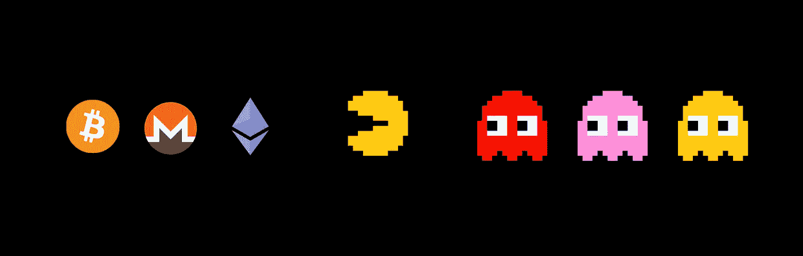

# 一个密码迷的自白:流动性、营销和价值

> 原文：<https://medium.datadriveninvestor.com/confessions-of-a-crypto-junkie-1-liquidity-marketing-and-value-53e6323376ff?source=collection_archive---------12----------------------->

在过去的两年中，我们已经看到 2000 多个项目推出了自己的 ICOs/TGEs/ITOs。即使这些项目来自不同的国家、部门和行业，它们也很少有我将在本文中描述的共同问题。

**代币的流动性和商品化**

如果没有流动性，一旦你的潜在客户(也就是 ICO 投资者)可以退出他们的头寸，他们就会消失，你的第一印象将是:这是一枚劣质硬币，就这样。

流动性问题一直存在，但随着大量 ICO 的推出，以及随后做市公司的价格在 2018 年达到新的峰值，流动性问题在最近变得更加相关。

投资者进入你的代币市场仍然受到代币上市交易所的强烈影响。然而，由于在大型交易所上市代币的费用很高，替代选择是在较低交易量的交易所上市，并通过做市商服务进行补偿。至少可以避免因为没有足够的流动性而造成的声誉损失。

没有一个 ICO 项目公开表示，但不幸的是，有一种强烈的信念和假设认为，ICO 项目将通过象征性销售而不是通过销售产品或服务的未来业务运营赚更多的钱。
通过这种方法，每个代币都是竞争者，这导致所有这 2000 个项目的产品商品化；他们都在为同一件事而战，炒作。炒作很厉害，可以跨行业，跨国家。
不管你的核心业务是与 IOT、供应链还是金融服务相关；你们都将争夺同样的东西:炒作，流动性，以及希望在用户中的低流通速度。

**《代币秀》**

去年我参加了几次关于区块链和 ICO 的会议，令人难以置信的是围绕它创造的新市场。
ico 基本上是一种全球众筹销售，许多公司需要同时出席世界各地不同国家和大洲的多个会议。他们是如何做到的？解决方案看起来很简单:公司现在雇佣公共演讲者代表他们参加会议并进行推销。如果你敢问一个情节之外的问题，或者幻灯片中没有显示的问题，贫穷(但报酬丰厚)的顾问能够回答的机会非常低，大多数情况下，你只要拿到一张名片来回答进一步的问题就可以了。

这是适用于 ico 的感知接近度概念，也是我们人性的一部分。作为人类，我们自然会更放心地看到一些“真实”的人在舞台上表演一个情节，而不仅仅是在 Github 上发布一个真实的项目。

**(营销)策略在区块链的业务**

不幸的是，至今大多数 ico 都没有产品，唯一需要考虑的策略是营销策略。

营销成本在某种程度上是 ICO 公司面临的最高成本之一，正如在这些情况下经常发生的那样，筹集的资金使用效率低下。

其中一个问题与这样一个事实有关，即 ICOs 瞄准的绝大多数客户(假设没有运行产品的情况)不同于最终将使用该公司产品或服务的客户。这就是为什么，就目前而言，将营销 ICO 服务外包给外部机构是有意义的，因为在内部保留客户如何回应每次 ICO 营销尝试的专业知识可能没有什么价值。

然而，这导致了这样一个事实，即一旦真正的产品上市，将有必要为全新的营销活动分配额外的预算，可能还会有新的品牌标识，当然还有针对产品用途的新的沟通策略，而不是投资机会。

经常被低估的是，极少数投资者或代币持有者也将是公司的未来客户。请记住，采用免费增值模式的成功创业公司有 1%到 10%的免费到溢价转换率。我假设你可以想象从 ICO 投资者到客户的类似转换率。

**2018 年第四季度和 2019 年 Q1**

我们看到金融机构正朝着加密货币的方向发展。银行对加密生态系统变得越来越“友好”,最终用加密资产进行银行业务也不是不可能完成的任务。

然而，可以预见的是，越来越多的金融机构将以不同的方式进入加密市场。我担心的是，他们唯一的价值主张可能是利用他们“我受到监管”的地位……(face palm)
一些银行将借此机会扮演投资银行向希望 IPO 的公司提供的角色；还有的会推出集中交易所，尝试用老办法赚钱(doublefacepalm)
让人惊讶的是，人的记性都很短，我觉得丹斯克银行过去是，现在也是受监管的银行，对吧？！？

至于流动性方面的问题，尽管加密对冲基金在 2017 年和 2018 年初增长非常快，但我们现在面临着一个市场停滞不前的局面，因为它由大型和“模糊的力量”主导……
一旦你在加密行业呆了足够长的时间，了解了它的工作原理，我相信你会理解为什么分散式交易所是该行业未来繁荣的唯一途径。不幸的是，分散式交易所的做市商尚未达到令人满意的成熟水平，以保证所需的流动性。

就在一年前，除非你有合适的联系人，否则很难与加密交易所取得联系，让令牌上市。太多的请求……把标价推到了令人讨厌的水平。最近，我们开始看到一个新的趋势，即加密交易所现在联系 ICO 顾问、ICO 精品店、营销机构等，以提供佣金，以防一些项目被引用。变化很大，不是吗？！？