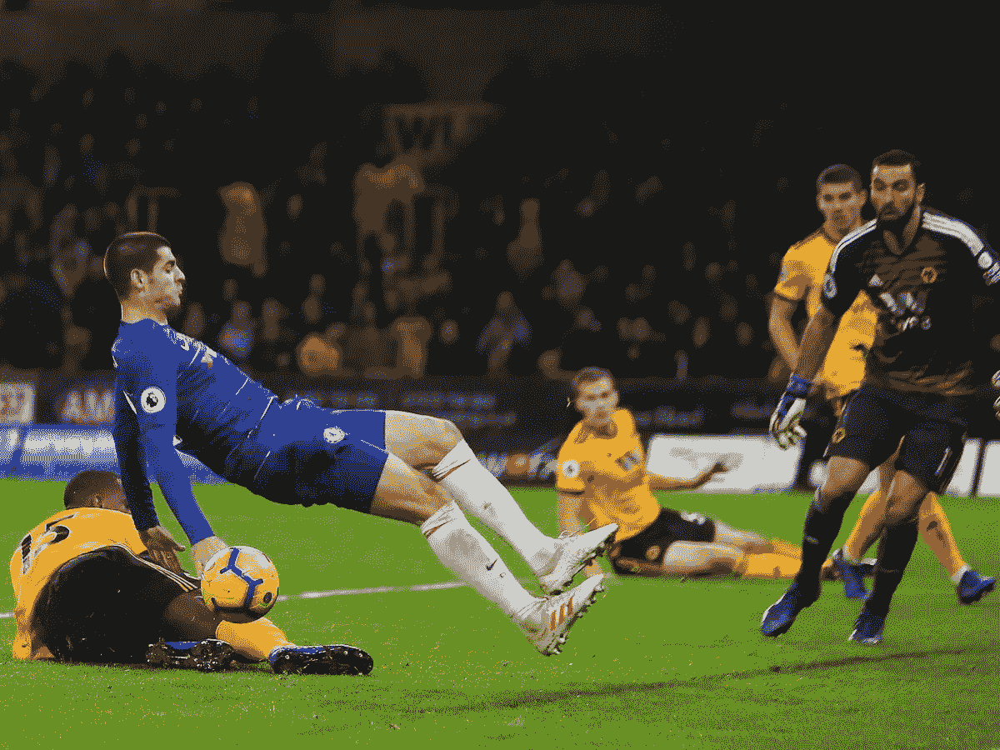

# 信心和表现

> 原文：<https://medium.datadriveninvestor.com/confidence-and-performance-64627e69fd37?source=collection_archive---------23----------------------->

周三晚上切尔西对阵狼队，阿尔瓦罗·莫拉塔又经历了一个令人失望的进球之夜。评论员提到的一点是，这位前锋在过去的几个月里缺乏信心，这导致了他的糟糕表现，他指出，信心的提升可能会提高他在场上的表现。

虽然自信和表现之间肯定有关联，但在归因时，这是一个先有鸡还是先有蛋的问题。信心不足会导致表现不佳还是相反？

要回答这个问题，还有一个因素需要考虑。这是一个参考框架，由历史观察和对性能的一般预期来定义。

一个类似的场景是我们在赌场赢了(或输了)后的感受。以某个人为例，他以 100 欧元开始了他的夜晚。他们立即将价格翻了三倍，再翻三倍，总共达到 900 欧元。在那晚剩下的时间里，他们没有再次赢得那么大，并从那一点开始输掉了 400 欧元，最终以 500 欧元结束。另一个人以同样的 100 欧元开始这个晚上，整晚都没有赢或输很多，以 500 欧元结束这个晚上。尽管从绝对值来看，第一个人赢的更多，但第二个人是两个人中更快乐的一个。因为第一个人有一个参照系，她本来可以赢得 900 欧元，但最终只赢得 500 欧元，而第二个人有一个不同的参照系，她最终获得了她所能获得的最大值。

在这种情况下，参考系是基于历史观测值定义的。现在，如果这两个人都带着赢得 500 欧元的期望去了赌场，两个人都会同样快乐(至少他们快乐的差异会远远小于以前)。如果他们两人都期望赢得 2500 欧元，那么他们都会同样不开心。

如果这两个人在之后的另一个晚上回到赌场，那么他们的信心将与他们之前经历的快乐程度相关。

在阿尔瓦罗·莫拉塔的情况下(就像费尔南多·托雷斯在切尔西糟糕的时期一样)，参照系是基于伴随着高昂价格的期望而定义的，如果达不到这一点，信心就会继续削弱(因为价格是一个不变的常数)，不断恶化他们在球场上的表现。

无论我们在做什么，这种现象在工作中都是一样的——单口喜剧、写作、向投资者推销等等。我们可以重新定义参照系来适应我们——要么降低期望值，要么关注历史观察中有利的一段，而忽略其他部分。然后，我们可以专注于相对于该基准或之前的绩效的增量改进。

这将形成一个良性循环，绩效的轻微提升会激发更多的信心，从而进一步提高我们的绩效。

这是对两个最有力的观察结果的分析(向詹姆斯·阿尔图彻致敬，他第一次向我介绍了他们)——幸福是超出预期的现实，以及每天努力提高 1%。

让我们利用这一点。

## 在你走之前…

如果你喜欢这个，请支持我的工作。你需要做的就是鼓掌。

[*跟我讨论美好生活的错综复杂。*](http://eepurl.com/cqwJZT)

[*读我的书*](https://www.amazon.com/s/ref=nb_sb_noss?url=search-alias%3Daps&field-keywords=mayantuyacu)