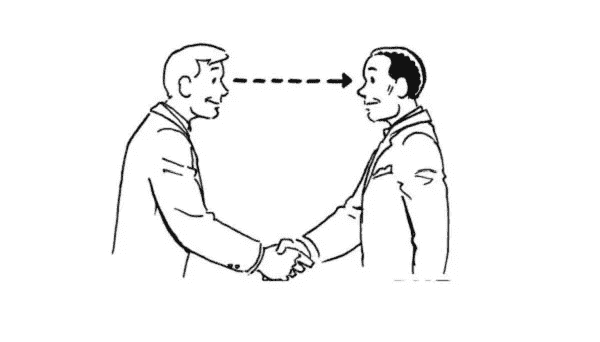
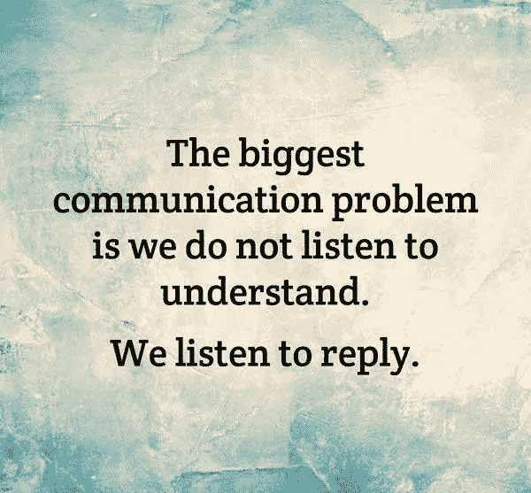
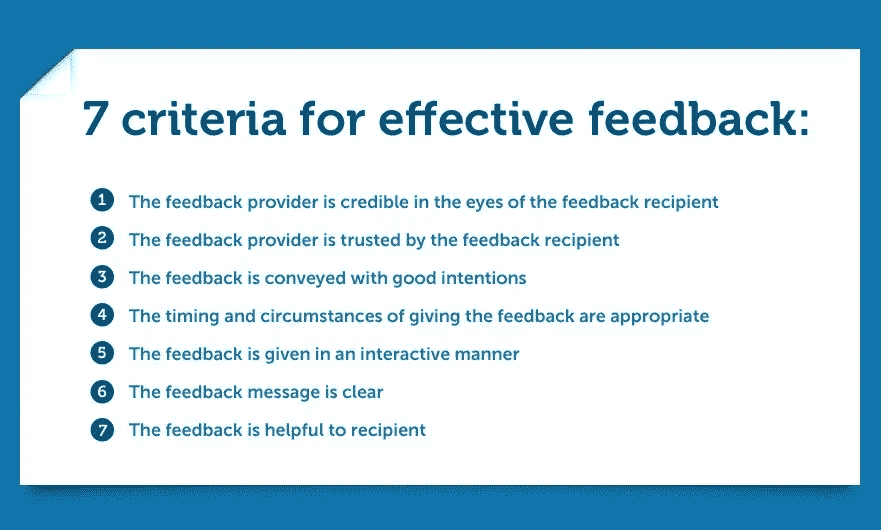
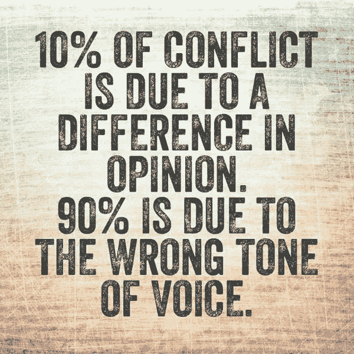

# 自信的沟通者有他们的发言权

> 原文：<https://medium.datadriveninvestor.com/confident-communicators-have-their-say-9cf2905ec1eb?source=collection_archive---------7----------------------->

当谈到自信和有效的沟通者时，[珍·奥莱尼扎克·布朗](https://twitter.com/JenOleniczak)，[吉尔·希弗本](https://twitter.com/dynamicjill)和[切尔西·克罗斯特](http://chelseakrost.com/meet-chelsea/)毫无保留。每个人都有一个文件夹来支持他们的话。

布朗是一名演讲者，也是《即兴表演:用即兴表演找到你的声音、风格和自我》一书的作者。

Schiefelbein 是动态通信器。她创建并执行沟通策略，帮助组织增加销售，增强产品体验并留住客户。

Krost 是领先的千禧一代影响者，LinkedIn 排名前 20 的千禧一代营销和品牌策略师。

他们一起交换口头交易技巧，以此来证明他们的成功。

“自信的交流是清晰、简洁和自信的，你可以用有效的专业知识或研究来支持任何观点，”Krost 说。

布朗说，当人们不虚伪时，交流效果最好。

“自信的交流发生在你做你自己的时候，”她说。“你抛弃了内心的批评，那个骗子综合症怪物，你感觉很舒服。我们获得我们释放的能量——所以如果你感到不确定和尴尬，和你说话的人也会感到不确定和尴尬。

布朗说:“自大的沟通经常与自信的沟通混淆。”“在我作为教练的实践中，我认为最大的不同是你对其他人的关心。如果你只想弹自己的歌，从来不听别人的，那就是自大。”

她的建议是:在你的交流中，不要试图取悦他人。

“自信就是知道自己知道什么，不知道什么，”Schiefelbein 说。“自大就是相信自己无所不知。

“自信的沟通者只在必要的时候说话，”她说。”他们痴迷地听着。他们给出简洁明确的答案。自信的沟通者不会为了回应而倾听。他们听是为了理解。

不必要的，一次性的话可以显示不安全感:老实说，实际上，说实话，希望。

“每当你用‘我认为’开始一个句子时，你会立刻表现出不安全感，”克罗斯特说。“如果你对自己的观点有信心，就不需要‘我认为’"

布朗不喜欢限定词。

“像‘只是’或‘只有’这样的词——当我们‘但是’自己时也是如此，”她说。“我最不喜欢听到的话是:‘我只是认为我们应该这样做，但如果你想这样做，我们可以这样做。’啊啊啊！说还是不说！你的话就是货币。

“每个人都有不同的短语，”布朗说。“当我紧张的时候，我经常在句子的开头说‘所以’。你呢？如果你不知道，反思一下:想想你的感受，以及为什么你会有这样的感觉。注意你嘴里说出来的话。”

Schiefelbein 讨厌道歉。

“当没有什么可抱歉的时候，就从‘对不起’开始，”她说。“就像‘你好吗？’一样常见无需等待回应。

Schiefelbein 说:“使用‘只是’这个词会削弱你交流的能力。”“别闹了。说你的意思。拥有你的信息。”

# 没有手指

她解释了人们是如何过于努力地去证明一个观点的。

“从‘你’开始，用手指着另一个人，”Schiefelbein 说。“拥有你的信息，以‘我’开头以显示自信。

“掌握你的信息非常非常重要，尤其是对职场女性来说，”她说。“摇滚起来！”

[非语言也能交流——不仅仅是交叉双臂。](https://medium.com/@JKatzaman/your-body-speaks-louder-than-words-ea9ea043d601)

“我给女人最大的提示？站着的时候不要跷二郎腿，”布朗说。Amy Cuddy 也经常谈到这个问题。这是一种不安全感的非语言表达。你应该站着，双脚放在膝盖下面，臀部放在肩膀下面。松开你的屁股。

“人们——很多女性——倾向于保持很大的紧张感，”她说。“想知道你做了什么吗？握紧你的屁股说你好。现在松开它，打个招呼。听出区别了吗？”

Schiefelbein 指出，肢体语言驱动对话。

“非语言占你传达信息的 80%，”她说。“用你的身体意识到你在说什么，你没在说什么。

“一个人不能不交流，”Schiefelbein 说。“你说的话比你不说的话传达的信息一样多，甚至更多。你怎么说仅仅比你怎么说更重要。副语言——语速、音调、音高——可以交流。”

书面语言也成为了一个不同的角色。

“表情符号、gif 和其他基于图像的交流改变了游戏，”Schiefelbein 说。“我的论文是第一批关注以计算机为媒介的交流的论文之一。”

克罗斯特仔细查看了统计数据。

“我真的相信肢体语言说明了一切，”她说。“我听说 55%的交流是肢体语言，38%是语调，7%是实际说的话。

“除了肢体语言，眼神交流或不交流可以显示你有多自信或不自信，”克罗斯特说。“当人们不愿看着你的眼睛时，这恰好是我最讨厌的事情。”

不要冷冷地走进一个重要的场合。了解并预演你的信息。自信地将它们融入谈话中，而不会显得尴尬。

“养成热身的习惯，”布朗说。“摆个充满力量的姿势，放松你的臀部，做些绕口令——无论什么你需要自信的*。在我做一个大演讲之前，我必须在浴室里热身。*

“在我的第一次 TEDx 之前，我吐了，”她说。“在我的第三部电影之前，我很兴奋，也做了热身——[《差异显示》T5。”](https://www.youtube.com/playlist?list=PLhzlFr-9IaytzGzdOc9Lh3LR6HZDorzuA)

下面是她的备考小贴士:

*   用声乐热身来温暖我的声音。
*   做跳跃运动。
*   喝大量的水。
*   告诉自己我能行。

“如果你不知道你的日常生活是什么，那就好好想想你需要什么，”布朗说。“我的上一个客户说错了话。对此很紧张。所以，我给他做了绕口令的热身——试试爱尔兰手表。他在一次投球比赛中赢得了 20，000 美元。没有绊倒。

“好偷偷摸摸的提示？她说:“要在场，听问题，然后回答。“注意。而且说不知道也行。”

Schiefelbein 强调了做好准备的重要性。

“为任何潜在的问题做好准备，”她说。“准备是最好的防御和进攻。对你所知道的要有信心，并且毫不含糊地陈述出来。欢迎提问。摇摆你的答案。

“练习。练习。练习，”Schiefelbein 说。"在做了数千次演讲后，我仍然为每一次演讲做准备。"

# 接受暗示

克罗斯特说，部分解决办法在于卡片。

她说:“你准备得越充分，在面对任何情况时就越有信心。”“花时间准备、研究和练习。制作带有演讲要点的提示卡，以便在活动开始前学习和准备。滚戏。”

这是真正的精神食粮。

“吃对我来说是一件大事，尤其是在演讲之前，”克罗斯特说。"你不会想在我肚子咕咕叫的时候上台的。"

反馈可能是交流的敏感时期，取决于你如何处理建设性的批评——包括给予和接受。

“关注行为，”Schiefelbein 说。“具体点。沟通因果。不要把它私人化。以行为为基础。

“每种情况都是一次学习经历——如果你在倾听的话，”她说。“在每次谈话开始时设定你的目标。不要以“你”开始陈述。这就像是口头指责。“是你干的”让我们采取了防御。"

布朗建议去掉“但是”这个词，受害者的行为和指责。

“提出批评:要清晰、具体、简洁，”她说。“服用吗？优雅地做它，不管它来自何方。反思，看看它是从哪里来的。

“有时候，是*坏了*。而且恶意。有时候这是对的，”布朗说。“深呼吸，好好想想。有反应，没反应。”

# 友好的谈话

给予批评，有支配性的指导方针。

布朗说:“当你付出时，要像 T2 一样诚实，像 T4 一样善良。”。“这并不是说你应该撒谎。它是说，你对任何人都没有好处，因为你太好了，或者是糖衣炮弹。要真实。”

最重要的是，不要把反馈看得太个人化。

“每当提出建设性的批评时，我总是关注情况而不是人，”克罗斯特说。“我总是试图用反馈来增强*而不是*贬低……总是这样。

她说:“在反馈问题上，要有开放的心态。”

作为跟进，有一些方法可以表明你已经采纳了反馈并重视了来源。

“我以后再提出来，”布朗说。“如果这是建设性的反馈，我会在以后就它以及它的工作方式进行交谈。如果我需要澄清，也许我会问一两个问题。

“我喜欢学习，”她说。“在反馈中成长的理念在我的职业发展中非常重要。通过*向*展示你正在做这些建议，而*说*你正在做这些建议——差别很大。”

双方都需要确定他们听到了同样的事情。

Schiefelbein 说:“一定要检查是否相互理解。”“重复你所听到的，并阐明接下来的步骤。

“大多数会议都因为缺乏澄清和跟进而失败，”她说。“清晰是至关重要的。通过电子邮件告知后续步骤和责任。记录步骤很重要。做一条小道。”

# 表示感谢

克罗斯特说，人们应该记住自己的举止。

“当有人花时间提供反馈时，要表示感谢，”她说。“每一条反馈都是评估、完善和改进的学习机会。

克罗斯特说:“让这个人知道你做了什么来采纳建议，以便在下一次面试中有所改进。”

另一方面是当反馈不是那么令人愉快或有建设性的时候。

“有风度，”布朗说。“说谢谢。要善良。知道是他们而不是你，做*你*。我是一个反对女孩对女孩犯罪的女人。当我看到女人对其他女人无礼时，我很生气。

“要善良。不要小气，”她说。“励志演说家珍·辛塞罗说:也许，如果你把怀疑放在一边，卷起袖子，承担一些风险，全力以赴，你会在某一天醒来，意识到你过着你曾经嫉妒的生活。”

布朗强调了她的主要观点。

"*善良点*！"她说。“有些人只是愤怒和痛苦。不是。值得。的。时间。去做牛逼吧。

布朗说:“*又来了*:有些人*也*就是喜欢争论。“我太忙了，没法改变主意。你呢？记住，你不是披萨饼

Schiefelbein 呼吁人们不要退缩。

“坚守阵地，”她说。“事实站在你这边。陈述它们。拥有它们。要求澄清和说明细节。如果有人不具体和行为，让他们。

“询问下一步，”Schiefelbein 说。“让他们说他们想要你做什么。具体来说。并使其可操作。”

给予建设性的反馈可以增强力量。

“想想那个人，”布朗说。“感同身受走一条*长*的路。他们如何接受反馈？他们需要赞美吗？他们需要一些善意作为缓冲吗？他们需要直的吗？

“请*，*为了大家的爱，不要消极攻击*，”她说。“只要诚实、坦率和善良。善良不是擦鞋垫或糖衣。善良是出于好意。你希望他们成功，你希望他们进步。”*

*一切都回到文字上来。*

*“使用提升和平衡的语言，”布朗说。“像‘但是’、‘只是’、‘然而’这样的词往往会减少。像*、*、*是的*、*和*这样的词能让奇迹发生:是的，你认为这很棒，我知道你能做得更多。让我们弄清楚那是什么。*

*“最重要的是要真诚，”她说。“现实一点。如果三明治对你有用，那太好了。如果没有呢？这会看起来很假。”*

**

*Schiefelbein 从一开始就注意到了买进的重要性。*

*“人们支持他们帮助创造的东西，”她说。“让他们对改进计划有发言权。在接下来的步骤中获得认同是很重要的。确保每个人都在同一页上。*

*“问为什么，”Schiefelbein 说。“弄清事情发生的原因。即使你要问很多次。所以通常“反馈”只是命令。如果是真正的反馈，那就是双向的。”*

*Krost 采取了额外的措施，将反馈放在最好的位置。*

*“我总是从这个人做得好的地方开始，然后解释哪里以及如何改进，”她说。“我也非常注意我的语气，这样我的信息就能被理解，并具有积极的建设性。*

*“你的语气会对事情的结果产生巨大的影响，”克罗斯特说。“指出你学到的东西也很棒。”*

*布朗最后提到了你嘴角的卷曲。*

*“微笑改变了你声音的节奏，所以这不仅仅是看起来漂亮或英俊，”她说。“那有助于语气。”*

***关于作者***

*吉姆·卡扎曼是[拉戈金融服务公司](http://largofinancialservices.com)的经理，曾在空军和联邦政府的公共事务部门工作。你可以在[推特](https://twitter.com/JKatzaman)、[脸书](https://www.facebook.com/jim.katzaman)和 [LinkedIn](https://www.linkedin.com/in/jim-katzaman-33641b21/) 上和他联系。*