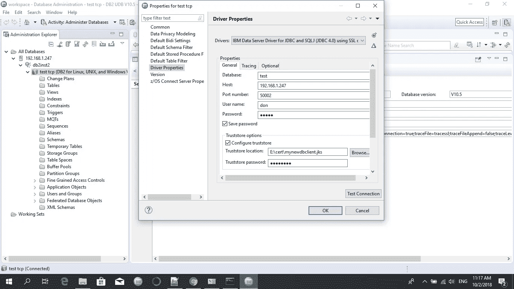

# 为 DB2 服务器和客户机配置安全套接字层(SSL)

> 原文：<https://medium.datadriveninvestor.com/configuring-secure-sockets-layer-ssl-for-db2-server-and-client-3b317a033d71?source=collection_archive---------2----------------------->

环境:Linux，数据库版本:10.5

# **配置服务器使用 SSL**

让我们理解这里的要求。我们需要 DB 服务器接受来自使用 SSL 的新端口的连接。所以我们需要打开一个新的服务来接受 SSL 连接。该任务的一部分是身份验证(也可以通过证书完成)，另一部分是保护服务器和客户端之间通信的加密连接。

GSKit 包用于密钥生成。这是在安装 DB2 时自动安装的。默认路径是(对于 Linux，默认路径是/opt/ibm/db2/V11.1/gskit/bin/)。

规则:以实例所有者的身份运行所有命令。

好了，现在让我们开始…

1.  创建一个文件夹来保存密钥，一个密钥数据库，并用下面的命令设置数字证书。(需要有写权限)

## ***/home/db 2 inst 2/sqllib/gskit/bin/GSK 8 capicmd _ 64-keydb-create-db " server . kdb "-pw " pass w0 rd "-stash***

注意:如果 LIBPATH 设置正确，运行 gsk8capicmd_64 时不需要指定路径。

命令 gsk8capicmd_64 用于管理 CA 证书。在我们的命令中，我们使用了以下选项:

*   -keydb —使用密钥数据库
*   -创建-创建密钥数据库
*   -db —用作密钥数据库的文件名
*   -pw —密钥数据库的密码
*   -stash-该选项将在与密钥数据库相同的位置创建一个存储文件

-stash 选项在与密钥数据库相同的路径下创建一个 stash 文件，文件扩展名为. sth。在实例启动时，GSKit 使用 stash 文件获得密钥数据库的密码。

2.下一步是为密钥数据库创建一个证书。在这里，我将创建一个标签为 **mylabel** 的自签名证书。

***/home/db 2 inst 2/sqllib/gskit/bin/GSK 8 capi cmd _ 64-cert-create-db " server . kdb "-pw " Passw0rd "-label " my label "-dn " CN = test company "-size 2048-sigalg sha 256 _ WITH _ RSA***

使用以下选项:

*   -cert-该命令用于证书
*   -创建—创建证书
*   -db —指示证书将存储在哪个数据库中
*   -pw —密钥库的密码。可以使用连字符(-)，将出现一个交互式提示，要求输入密码
*   -label-证书的标签，用于在密钥数据库中唯一标识证书
*   -dn-将标识证书的 X.500 可分辨名称。只有 CN(通用名称)值是必需的。其他信息可以添加到 DN(区分名称)中，例如 O 代表组织，C 代表国家等等。
*   -size —密钥的大小，以位为单位
*   -sigalg —用于证书的签名算法。使用 PKCS #12 的算法。

3.将刚刚创建的证书提取到一个文件中，这样就可以将它分发给运行客户机的计算机，这些客户机将建立到 Db2 服务器的 SSL 连接。
**/home/db 2 inst 2/sqllib/gskit/bin/GSK 8 capicmd _ 64-cert-extract-db " server . kdb "-pw " pass w0 rd "-label " my label "-target " server . arm "-format ascii-FIPS**

在这一阶段，您的目录将包含以下文件集，

server.rdb，server.crl，server.sth，server.kdb，server.arm

要显示证书，发出以下命令:
/home/db 2 inst 2/sqllib/gskit/bin/GSK 8 capi cmd _ 64-cert-details-db " server . kdb "-pw " pass w0 rd "-label " my label "

稍后您将需要上述文件…现在让我们开始配置数据库以创建一个新的 SSL 服务。

**4。Db2 服务器配置的变化** 要设置 Db2 服务器支持 SSL，请以 DB2 实例所有者的身份登录，并设置以下配置参数和 DB2COMM 注册表变量。
a .将 ssl_svr_keydb 配置参数设置为密钥数据库文件的全限定路径。(.kdb 文件是从上述 5 个文件中创建的。作者假设您已经在以下路径创建了密钥:/home/db2inst2/cert/)

**db2 使用 SSL _ SVR _ KEYDB/home/db 2 inst 2/cert/server . kdb 更新 DBM CFG** 输出:
DB20000I 更新数据库管理器配置命令成功完成
。

b.将 ssl_svr_stash 配置参数设置为 stash 文件的完全限定路径。(.sth 文件是从上述 5 个文件中创建的。作者假设您已经在以下路径创建了密钥:/home/db 2 inst 2/cert/)
**DB2 使用 SSL _ SVR _ STASH/home/db 2 inst 2/cert/server . sth** 输出:
DB20000I 更新数据库管理器配置命令成功完成
。

c.将 ssl_svr_label 配置参数设置为您在步骤 1 中添加的服务器数字证书的标签。如果未设置 ssl_svr_label，则使用密钥数据库中的默认证书。如果密钥数据库中没有默认证书，则不会启用 SSL。
**db2 使用 SSL_SVR_LABEL mylabel 更新 DBM CFG**

d.SSL 连接需要一个单独的端口。它可以被定义为服务名或端口号。服务名需要在/etc/services 中定义。
vi /etc/services 文件并为 SSL 端口添加新的服务名。

**db2cs _ db 2 inst 2 50002/TCP** 

e.新的服务名是 db2cs_db2inst2，端口 50002，协议 TCP。启用 SSL 连接也需要此参数。
**db2 使用 SSL_SVCENAME db2cs_db2inst2 更新 DBM CFG**

输出:DB20000I 更新数据库管理器配置命令成功完成
。

f.将值 SSL 添加到 DB2COMM 注册表变量中。
**db 2 set-I db 2 inst 2 db 2 comm = SSL**

g.确保为数据库实例启用 TCP/IP 和 SSL 通信协议。如果您计划只使用一个，那么没有必要两个都添加。
**db 2 set-I db 2 inst 2 db 2 comm = SSL，TCPIP** 完成。

为了安全起见，请使用下面的命令验证您的配置。
**DB2 get DBM CFG | grep SSL** SSL server KEYDB file(SSL _ SVR _ KEYDB)=/home/db 2 inst 2/cert/server . kdb
SSL server STASH file(SSL _ SVR _ STASH)=/home/db 2 inst 2/cert/server . sth
SSL server 证书标签(SSL_SVR_LABEL) = mylabel
SSL 服务名(SSL_SVCENAME) = db2cs

5.停止并重新启动数据库。
6。验证数据库是否使用多个端口启动。
netstat-tap | grep DB2
TCP 0 0 *:db2c _ db 2 inst 2 *:* list EN 23682/db 2 sysc 0
TCP 0 0 *:db2cs _ db 2 inst 2 *:* list EN 23682/db 2 sysc 0

# 客户端连接配置

## 1.从 Windows 设置 Data Studio JDBC 连接

从上面的步骤 3 中获取 server.arm 文件，然后将其移动到 windows 计算机中的某个位置。例如:E:\cert

现在你需要启动并运行“keytool”命令。二进制文件位于 Jre/bin 文件夹中。因此，请确保将 Env Variables >系统变量路径设置为:C:\ Program Files \ Java \ JRE 1 . 8 . 0 _ 181 \ bin \

运行下面的命令来生成 java 密钥库。
**keytool-import-trustscacerts-alias myalias-file server . arm-keystore mynewdbclient . jks**

您将被要求输入密码，输入您在上述步骤 3 中输入的密码。例如:通行证

将创建一个新文件如下，
目录 E:\ cert
10/02/2018 11:03AM 752 mynewdbclient . jks
09/28/2018 06:01PM 989 server . arm
现在打开 Data Studio >新连接到一个数据库
选择带有 SSL 设置的驱动程序，然后应用如下设置，

Data Studio Setup

请注意，您需要给出。jks 文件位置和密码到“信任-存储位置”和“密码”字段，如上所示。

我的示例 jdbs url 如下所示，
JDBC:DB2://192 . 168 . 1 . 247:50002/test:retrieveMessagesFromServerOnGetMessage = true；sslConnection = true

## 2.设置其他客户端连接，请查看以下链接

 [## 配置 Db2 数据服务器驱动程序以通过 SSL 连接与 Db2 服务器通信，以及如何…

### 在本文中，我们将介绍 Db2 数据服务器驱动程序 v11.1 的配置，以便与 Db2 服务器进行通信…

blog.toadworld.com](https://blog.toadworld.com/2017/09/01/configure-db2-data-server-driver-to-communicate-with-the-db2-server-via-ssl-connection-and-how-to-use-it-in-toad-for-db2-version-6-3) 

**参考:** [https://www . IBM . com/support/knowledge center/en/SSE pgg _ 11 . 1 . 0/com . IBM . DB2 . luw . admin . sec . doc/doc/t 0025241 . html](https://www.ibm.com/support/knowledgecenter/en/SSEPGG_11.1.0/com.ibm.db2.luw.admin.sec.doc/doc/t0025241.html)
[https://blog . toad world . com/2017/08/21/configure-IBM-DB2-luw-v11-1-for-SSL-connections-self](https://blog.toadworld.com/2017/08/21/configure-ibm-db2-luw-v11-1-for-ssl-connections-self-signed-certificate)