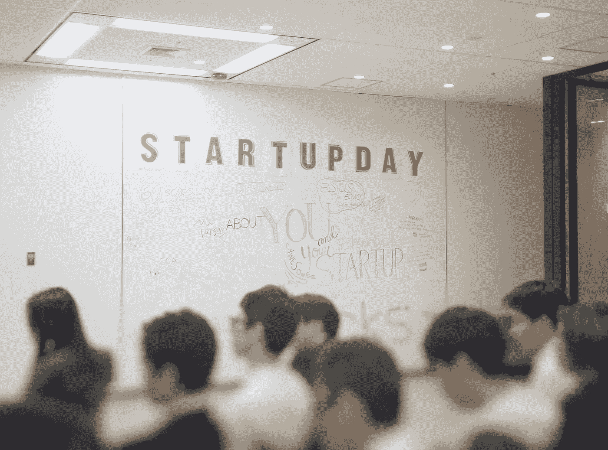

# 面对人生中最糟糕的时刻？积极应对

> 原文：<https://medium.datadriveninvestor.com/confronting-the-worst-time-of-your-life-deal-with-it-positively-83aa835c2a3d?source=collection_archive---------1----------------------->

Photo by [Franck V.](https://unsplash.com/@franckinjapan?utm_source=medium&utm_medium=referral) on [Unsplash](https://unsplash.com?utm_source=medium&utm_medium=referral)

## 乐观思维的力量超乎想象，但有时考虑最坏的情况也是明智的。

乐观地思考总是不能给你如何摆脱困境的想法。只有考虑到最坏的情况，才能做到这一点。

几年前，由于市场状况不佳，我的公司没有多少利润。我真的很害怕这种情况。我总是在想，如果我的公司面临重大亏损，我该怎么办。

## 我晚上睡不着觉，一切似乎都对我不利。我担心如何支付我的员工和管理公司。

有一天，在和我的导师交谈时，我问他如何应对这些日益增长的恐惧。他笑着说:

## "你为什么不考虑最坏的情况？"

这个想法似乎很吸引人。所以，那天我回到家，列出了我所有的恐惧。如果我的公司面临亏损，我将不得不给员工发工资，解雇一些员工，关闭公司，重新开始。于是，我在一张纸上写下了我所有的恐惧。

突然，我所有的恐惧都消失了，我可以清晰地思考。我问自己最害怕的是什么。是关闭公司的想法。

我坐下来，心想

> 但这并不意味着我企业家生涯的结束。我还可以申请银行贷款，重新开始。如果我的公司倒闭了，我还会失去什么吗？不要！我还会呼吸，还会活着。
> 
> 我的朋友和家人仍然会以同样的方式爱我。我可能会卖掉我开的昂贵汽车来支付所有的费用。但是还有什么呢？我还会失去什么？

一旦事情对我来说清楚了，我就不再害怕了。如果最坏的事情发生了，我可以冷静地思考并指出我需要做什么。这就是思考最坏情况的力量。

创业之路充满了障碍。在这里，你需要赌一把运气，冒几个精心计算的风险。因此，当你面对最可怕的噩梦时，它会帮助你清楚地看到和思考一切。

如果你不能想到最坏的情况并做出必要的修正，你将永远无法克服你的恐惧。因此，你将永远无法在事业上取得成功。只有成功克服恐惧的企业家才能在职业生涯中获得非凡的成功。

> 企业家也是领导者。因此，作为一名领导者，你必须对每件事都有清晰的愿景，这样你才能引导你的员工以及企业朝着正确的方向前进。

## 当你考虑最坏的情况时，它允许你自由思考并带领你的公司走向成功。承担所有必要的风险。但是如果你不让你的恐惧消失，你将永远无法前进，也无法成为一名成功的企业家。