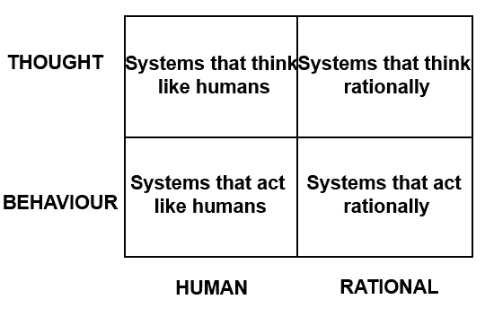

# 人工智能中的困惑及其解决方法

> 原文：<https://medium.datadriveninvestor.com/confusion-in-ai-and-how-to-solve-it-9479f39aa95f?source=collection_archive---------5----------------------->

## 答案在于基础知识和正确的分类术语

有感觉的 AI？我们接近了吗？天网什么时候会接管世界？人类什么时候开始变得过时？如果你没有计算机科学背景，但看到最近媒体上关于“人工智能”代理为你预约、驾驶你的汽车、协助治疗癌症的头条新闻，你会认为我们几乎处于另一场革命的悬崖边，并可能开始想知道“人工智能的危险”到底是什么？简而言之，目前或可预见的未来都没有危险。长回答？好吧，继续往下读。

当我看到我所在的大学开设了人工智能课程时，我立即匆忙报名参加了。我对此兴奋不已，确信自己会做得很好。当然，一看教学大纲，兴奋感就消失了。

教学大纲对我来说完全陌生，它谈到了状态空间和谓词逻辑。不知道。一阶逻辑和专家系统。不知道。没有提到深度学习、支持向量机和聚类。不过这种失望很快就消失了。它是关于经典人工智能的，并帮助我们回答一些问题，解决一些常见的困惑，围绕人工智能的炒作。

它特别有助于我们正确看待我们离通常谈论的有感知能力的人工智能有多近，这样的系统应该如何工作，我们如何真正对人工智能进行分类？人工智能、机器学习和深度学习之间的界限非常模糊。即使是机器学习实践者，也会发现很难帮助你理解它们之间有什么区别。此外，当寻求关注的媒体谈论它，曲解和歪曲引用时，它真的无助于解决混乱。更不用说，当没有人工智能领域知识的媒体人谈论它时，它是有害的。

> 那是因为我们试图在错误的地方划错误的线。

智能系统根据不同的标准有自己的分类方式。虽然这些分类仍然没有给出众所周知的具体界限，并且在一定程度上仍然可以解释，但是它们已经足够好了。先来看看基础的。

**软人工智能或狭义人工智能**——这包括了你可能遇到过的大多数“人工智能系统”。这一类的人工智能系统解决一个问题，虽然它们做得令人印象深刻，甚至超过人类，但有时它们基本上在其他任何方面都很糟糕。例如，聊天机器人(NLP 任务)不能进行对象检测(计算机视觉任务)。即使是同一个学科，就说 NLP 吧。聊天机器人无法将中文文本转换为日文，也无法开始学习一种新语言。

硬人工智能还是广义人工智能— 我们根本还没有做出这些。这不仅仅是组合几个软 AI 机器那么简单。转换音频/视频信息，以便能够理解非常广泛的命令和上下文，能够在之前没有看到特定任务的情况下执行这些命令，这是一项艰巨的任务，但绝对是一台棋盘人工智能机器应该能够做到的。虽然你的 Alexa 可以为你播放音乐，但它仍然无法区分苹果和橙子，也无法为你驾驶汽车。

yeah, you can’t flex on iron man. Not yet.

另一个术语，更准确地描述了电影、电视节目等中描绘的内容，或者所有炒作的内容是“人工通用智能”或 AGI。顾名思义，AGI 应该和人类一样聪明，能够概括所有类型的问题。因此，像这样的机器将会非常强大和有用。想象一个你永远不需要翻译的世界，因为你的个人 AGI 助理可以帮助你与任何人和每个人实时交谈，它可以为你制作电子表格，为你报税，理解和回复邮件，同时提醒你重要的任务。它还会带你去任何地方，同时它会连接到其他 AGI 助手，并计算出到达目的地的最佳路径。

事实上，我们现在拥有的大多数人工智能都不是人工智能，而是更多的智能增强或 IA。

例如，让我们考虑一下工厂的自动化。机器人由协助工厂工作的工厂工人监督。成型的材料然后由其他工人运输。机器人本身的生产力、一般后勤、维护等仍然由人类处理。由于机器人本身并不完全有能力维护整个工厂，它们仍然在“充实”人类。当他们能够自己做任何事情时，他们将被称为人工智能。这同样适用于大多数东西，无人机，医疗机器人等等。

接下来，我们根据人工智能设计的的**目标，转向人工智能的另一种分类方法。**

**像人类一样思考-** 为了能够判断像人类一样思考的系统，我们必须需要有一个人类如何思考的定义或方法。我们可以通过内省我们自己的思想或者通过心理学实验来确定。

一旦我们有了定义，我们就可以把它转换成一个程序，看看输出结果是否符合人类的行为。在这一点上，有两种方法。要么我们可以满足于结果与问题的解决方案相匹配，要么我们需要深入挖掘系统到底是如何解决问题的，看看它是否与人类的认知相匹配。认知科学和人工智能在语言、视觉等许多领域相互补充。

**像人一样行动-** 这些系统经常被忽视，因为没有太多的用例。然而，这种类型的一个有趣的方面是它所经受的那种测试。图灵测试。艾伦·图灵提出的*图灵测试*旨在提供一个令人满意的智能操作定义。图灵将智能行为定义为在所有认知任务中达到人类水平的表现，足以愚弄审讯者的能力。所以他的建议是，人类会和另一个系统或人类对话，而不管他们是和另一个人对话还是和另一个系统对话，他们都不会。如果他们被愚弄了，认为这个系统是人类，它就通过了图灵测试。

然而，这在人和系统之间产生了分歧。一个*总体图灵测试*后来被设计出来，在这个测试中，人类将与一个系统面对面。这需要先进的机器人技术和面部特征来欺骗人类。

**理性思考-** 这些系统基于硬逻辑，这意味着它们以逻辑符号给出一个问题的描述，并找到问题的解决方案(如果有的话)。所以它使用逻辑系统并进行推论。也就是说，如果 A 暗示 B and B 暗示 C，那么 A 暗示 C

用逻辑符号来表示问题通常是不可行的，即使有可能，计算复杂度也是一个大问题。所以我们甚至得不到一个“足够好”的答案。

**理性行事-** 理性行事意味着以一种能让系统更接近最终目标的方式行事。人们可以说理性思考是理性行动的一个子集，这是真的，因为实现目标的一个简单方法是能够根据给定的数据进行合理的推理。然而，还有其他理性行事的方法。因为通过推理来证明某事是正确的并不总是可能的，但是如果它有效，那么它就是有效的。

有点令人不安，但可能是一个更好的例子。如果你把手放在火焰上，你不需要在脑子里得出结论。我的手在火焰上。我知道火焰产生热量。这意味着我的手会被加热。这意味着我的皮肤会受损，应该避免。不要！你直接感觉到疼痛，并像膝跳反应一样移开你的手。因此，逻辑结论并不总是必需的或适用的，这就是理性行动表现最好的地方。

目前，我们在理性表演部分做了相当先进的东西，但其他的就没那么多了。现在应用的大多数学习方法都是基于目标的学习方法。

在看了这些分类系统之后，很明显人工智能技术仍然需要很多年才能赶上人类的智力水平。

## 来自 DDI 的相关故事:

 [## 用 7 个步骤解释深度学习

### 和猫一起

medium.com](https://medium.com/datadriveninvestor/deep-learning-explained-in-7-steps-9ae09471721a)  [## 数据科学和软件工程哪个更有前途？

### 大约一个月前，当我坐在咖啡馆里为一个客户开发网站时，我发现了这个女人…

medium.com](https://medium.com/datadriveninvestor/which-is-more-promising-data-science-or-software-engineering-7e425e9ec4f4)