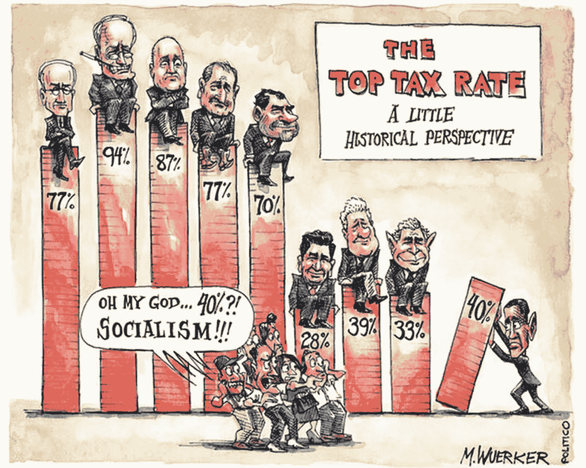
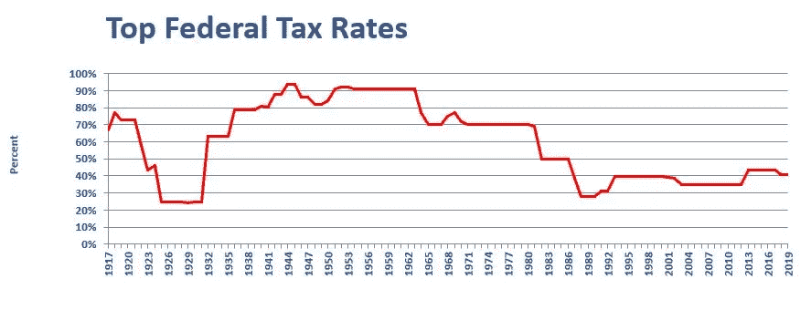
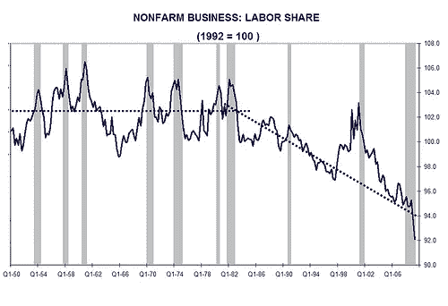
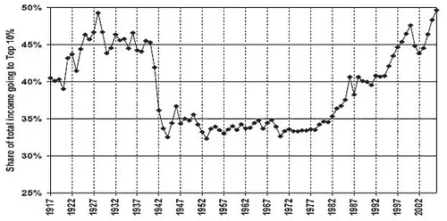
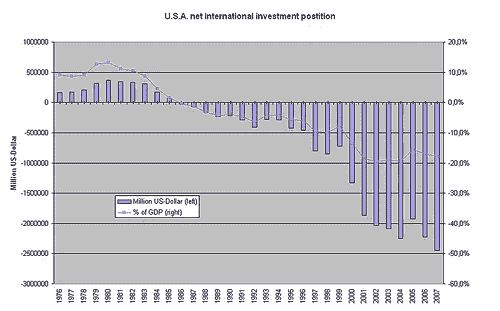

# 国会女议员亚历山大·奥卡西奥·科尔特斯是对的——对富人征收 70%的税率是个好主意

> 原文：<https://medium.datadriveninvestor.com/congresswoman-alexandria-ocasio-cortez-is-right-a-70-tax-rate-for-the-rich-is-a-great-idea-a23a2909fbfb?source=collection_archive---------13----------------------->

美国的贫富差距越来越大。这是事实。当我们讨论该怎么办时，争论就开始了。一部分人认为把我们收集的所有东西留给自己是我们的权利。另一部分人认为我们的社会应该确保一个国家的财富应该共享。后者认为，如果没有基本的医疗保健和教育，天平会过度倾向于那些在有利条件下长大的人，使他们比其他人拥有不公平的优势。我认为这两种想法都有优点。如果我们努力工作，我们应该能够保持我们已经获得的，但不要剥夺那些没有一个好的开始的人的重要机会。

国会女议员亚历山大·奥卡西奥·科尔特斯(Alexandria Ocasio-Cortez)宣布，作为她的信息的一部分，联邦政府应该向超级富人征收更多的税。她说，非常富有的人在经济和美国有太多的影响力。我不认为大多数美国人会反对这一点(除了富人)。她希望用这些额外的税收资助像全民医疗保健、绿色新政和消除学生债务这样的项目。这些项目会让年轻人和美国公民受益，所以我很感兴趣。有趣的是，看到即使是中产阶级个人也对她提出的将最高联邦税率提高到 70%甚至更高的建议做出反应。

对非常富有的人征收 70%的最高税率听起来很可笑，但如果我们看看美国历史，这并不是一个新想法。事实上，在过去 100 年中，最高联邦税率有一半时间都在 70%或更高。有趣的是，当利率高时，美国经济和财富分配发生了什么变化，当利率低得多时，又发生了什么变化。

大约 100 年前，第一次世界大战刚刚结束。第一次世界大战是美国历史上第一次对富人征收超过 10%到超过 70%的税率。战争是昂贵的。几年后，最高收入人群的税率回落至 25%，然而这一税率并没有持续很长时间。当大萧条来临时，联邦政府将它提高到 70%或更多，并在大萧条期间一直保持到 1981 年罗纳德·里根总统。针对超级富豪的高税率有助于应对大萧条时期的问题，并在中产阶级最富裕的 50 年里一直有效，这很能说明问题。这表明，当一个负责任的政府专注于确保国家财富在公民中公平分配时，整个国家都会赢。公民有足够的收入购买基本商品和奢侈品，而富人仍然无法花掉他们理应积累的钱。从 20 世纪 50 年代到 70 年代，美国中产阶级有足够的钱继续生活；实现美国梦的绝佳机会。美国家庭只需要一个养家糊口的人，有两辆车，一栋漂亮的房子，几乎没有债务。

然后，当罗纳德·里根(Ronald Reagan)在 1981 年实施经济复苏税收法案时，非常富有的人的最高联邦税率降至 40%-50%之间，这一比例一直持续到 2018 年。当时，里根和执政党解释说，在经济不景气的时候，这一削减将刺激更多的经济增长。规定是富有的公司所有者将在他们的业务上花费更多，从而创造新的就业机会。这与 50 年前帮助美国经济走出大萧条的逻辑背道而驰。

针对富人的高联邦税率很好地为联邦政府提供了急需的资金，让其在最需要的地方进行再分配。第一次世界大战、大萧条、第二次世界大战以及中产阶级最舒适的时期，也是超级富豪被课以重税的年份。财富不平等是那些年讨论的一部分，但事情变糟了，从里根时代和他宽松的税收政策开始变得更糟。

因此，自 1981 年以来，工人拥有的财富份额开始缩水。自里根以来，超级富豪们一直保持着巨额超额收入，你猜怎么着？从那以后，他们一直在将更多的钱进行再投资，以创造更多的财富。这导致国家的财富份额从劳动力中下降，落入最富有的 1%的人手中，耗尽了国家的金融资源。如今，一个家庭中的两个成年人都全职工作、拥有一辆汽车、租房子住是最常见的，而且几乎 100%的美国人都有重大的个人债务。

美国人不是唯一受里根时代经济思想影响的人。直到 20 世纪 80 年代，美国政府也拥有有利的投资地位。然后，就在最高税率回落后，政府自身欠了许多债权人越来越多的债务。对超级富豪征收的税支付了国家预算的很大一部分。现在，国债对普通美国人来说是一个负担。

世界上最强大的国家放弃了其债权人的地位，负责任地重新分配这些财富，以造福于其所有公民，自那以来，它一直在走下坡路。

女议员亚历山大·奥卡西奥·科尔特斯年轻而充满激情。她经常被资深政客不公平地斥为没有经验的新人，但她的信息听起来是真实的。作为一个国家，美国需要扭转局面，重新为人民赢得胜利。对高收入人群征税让这个国家度过了艰难的金融时期，也给了这个国家一些最好的时光。同样的策略可以让普通美国人摆脱危机模式。国家和公民有大量债务需要偿还。令人欣慰的是，美国收入最高的 1%的人拥有的财富比收入最低的 90%的人加起来还要多，所以从中分一杯羹可以为美国工人创造奇迹。

将最高税率联邦税率提高到 70%的历史水平将会为政府注入大量资金。反过来，美国政府可以资助全民医疗保健、全民基本收入、全民免费教育、绿色新政或任何其他惠及每一个美国人的受欢迎的举措。政府应该利用这一历史上成功的政策，为全体人民服务。

对于那些认为剥夺富人每年数百万美元的财富不符合美国精神或根本不公平的人，请记住，在一个地方积累的财富意味着其他人无法获得。我们可以同时获得成功和快乐。我们都可以通过合作而不是不断的竞争来达到我们的职业和生活目标。此外，研究显示，年收入超过 7.5 万美元不会增加一点幸福感。因此，合理的财富分配有助于建设一个强大、经济健康的社会是我们应该走的路。每个人都应该过上幸福的生活。

我们只需要有勇气通过立法提高联邦税率来启动财富再分配进程。然后，我们可以计划多少钱将用于偿还国债，多少钱将用于有益的项目。这不是一个艰难的选择。美国梦是所有美国人的。