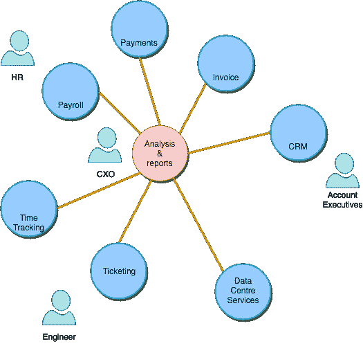
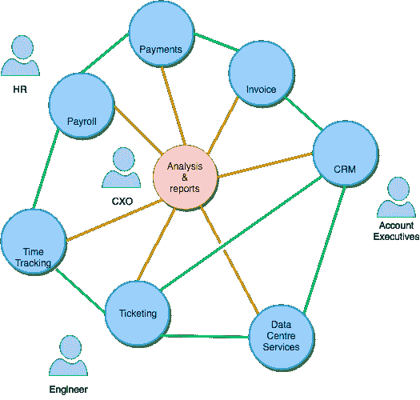
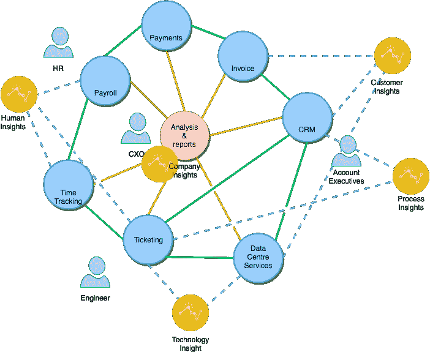

# 企业中的关联数据

> 原文：<https://medium.datadriveninvestor.com/connected-data-in-an-enterprise-part-1-f006a00032e8?source=collection_archive---------5----------------------->

大大小小的公司都对构建基于机器学习和人工智能的系统感兴趣，以帮助客户和日常用户。但他们很少意识到，他们在组织内拥有如此多的数据，可以改善企业界每个人的日常活动。

呈现的是什么样的数据？

让我们举一个例子，一个 IT 组织参与销售他们的产品和支持他们。该组织中的每个部门，从人力资源、财务、销售、IT 工程和业务团队到 CXO，都使用不同的系统，并且每天都与它们进行交互。

现在让我们把这些数据联系起来:

突然之间，组织有能力得出见解，并利用数据做更多的事情，否则这些数据只不过是报告。

销售和客户主管可以获得关于客户、系统使用方式以及他们还能做些什么来提供价值的有意义的见解。

工程师将有一个知识库来支持客户。

人力资源部将洞察工程师的表现，并为他们提供进一步的支持或培训

CXO 将可以实时获得资源利用、利润分析和其他企业见解。

在以后的文章中，我们将看到一个数据平台如何将实时报告集成到 BI 工具中的例子

继续:[https://link.medium.com/44ARsMETvR](https://link.medium.com/44ARsMETvR)

在 HorizonX([http://www.horizonx.com.au](http://www.horizonx.com.au))，我们与企业合作，帮助他们实现组织内外的数据潜力。