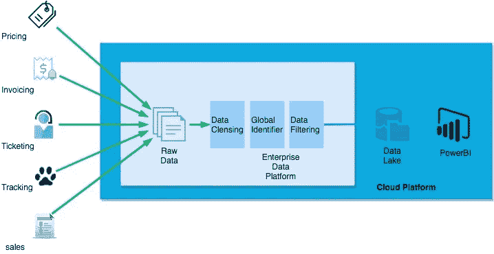
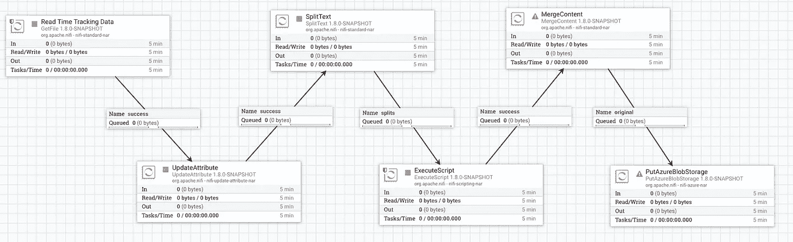
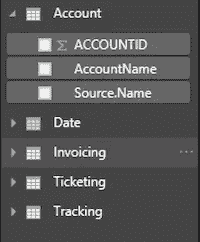
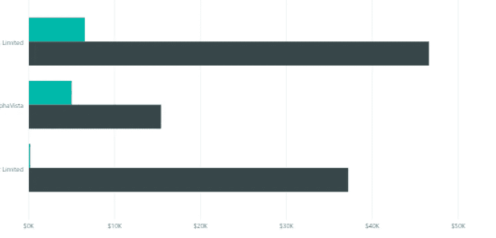
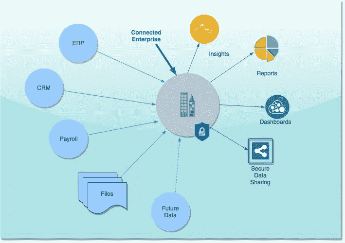

# 企业中的互联数据—第 2 部分

> 原文：<https://medium.datadriveninvestor.com/connected-data-in-an-enterprise-part-2-3d6d5607dcd9?source=collection_archive---------14----------------------->

[早些时候](https://medium.com/datadriveninvestor/connected-data-in-an-enterprise-part-1-f006a00032e8)我们看到了互联数据在企业环境中的优势。让我们看一个如何让组织成为数据驱动型组织的例子。

# 方案

让我们考虑一个拥有 SAAS 应用程序的组织，其客户订阅了该应用程序。这个数据就是 ***定价*** 。然后，该组织使用 NetSuite 等应用程序在当月月底向客户发送一张 ***发票*** 。该组织使用客户支持团队来支持他们的产品，客户支持团队查看订户提出的 ***票证*** 并对其进行处理。针对 ***跟踪*** 应用程序记录工作项目。销售团队根据一个像 SalesForce 这样的 CRM 应用程序跟踪他们的工作项目，并提供关于客户的主数据。

连接所有这些数据并生成一份利用率报告或利润报告通常非常耗时。因此，我们将构建一个数据存储库，从这些不同的来源获取数据，并使用 PowerBI 等数据分析工具构建一个仪表板。

# 数据操作

为了构建一个数据平台，我们需要一个应用程序将所有的源和汇汇集在一起。传统上已经使用了很多 ETL 工具，但是它们很复杂而且耗时。在新时代，我们使用数据流工具来实现自动化，这是数据操作的关键。它们允许处理流/批处理数据，清理和过滤数据，专注于数据安全并提供可扩展性。我们在 [HorizonX](http://www.horizonx.com.au) 中使用的一些工具有 Apache Nifi、StreamSets 和 Google Dataflow (Apache Beam)。我们为什么以及如何选择这些工具取决于项目的性质。我将在以后的文章中解释它们。

## 数据平台

既然已经建立了数据平台，我们就可以连接到上述所有数据源了。这些可能是连接到 SAAS 应用程序的 HTTP 接口，可能是获取文件的 CSV 导出或直接连接到数据库。

示例流如下所示:

该流允许转换、清理和将数据传递到数据接收器中。它还允许在实时环境中扩展数据(比如向同一个流添加新的接收器或源),而无需任何修改。

## 水槽

我们可以根据业务案例选择各种各样的数据接收器。它可以是任何公共云和任何类型的数据湖存储。对于这个用例，我们选择 Azure Blob 存储，Nifi 数据流将 CSV 写入 Blob 存储

## 商务智能分析

现在我们有了一个能够将数据传输到云存储的数据平台，我们可以开始消费数据了。使用任何 BI 分析工具，如 PowerBI、Google Data Studio、Looker、Tableau 或 Qlik，将数据转化为见解或仪表盘。

查询视图示例:

Analytical Queries

账户查询表示来自 CRM 的数据。

发票表示来自 NetSuite 的发票数据

票务和跟踪数据来自票务和跟踪应用程序

从上述查询生成的报告:

Profitability Analysis

由于自动化数据流确保实时数据馈入 Azure，因此可以定期刷新报告以获得实时见解。

## 接下来…

互联数据平台可实现更快的洞察、更相关的报告、数据驱动的仪表板以及跨组织的安全数据共享。

在 [HorizonX](http://www.horizonx.com.au) ，我们将一个企业转变为一个互联企业。自动化业务流程或为客户增加价值或实现工程师的潜力，有大量的用例。