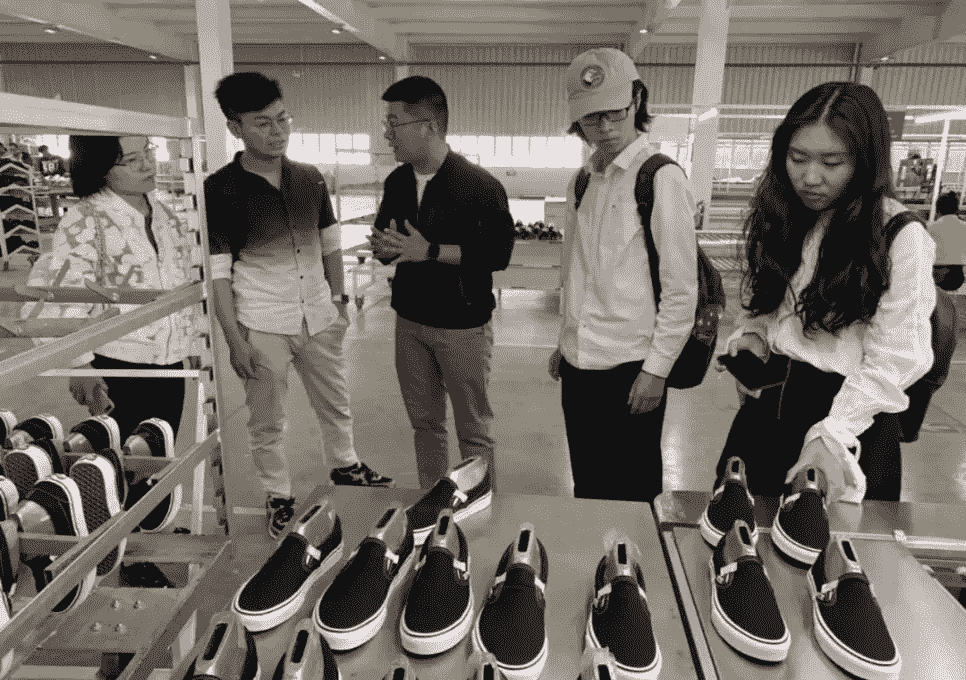
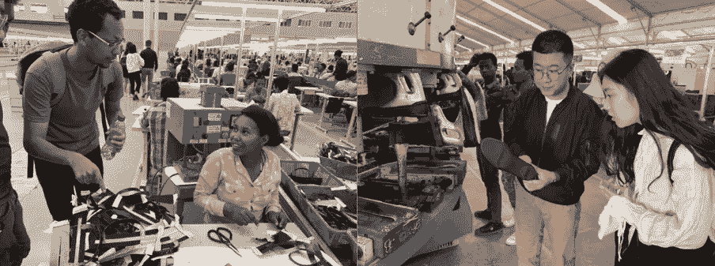
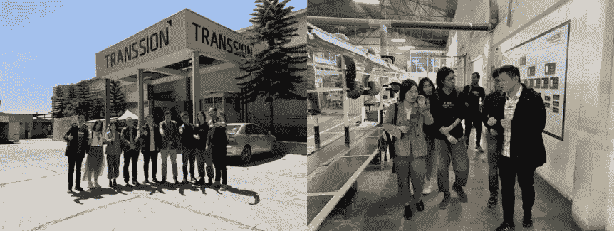
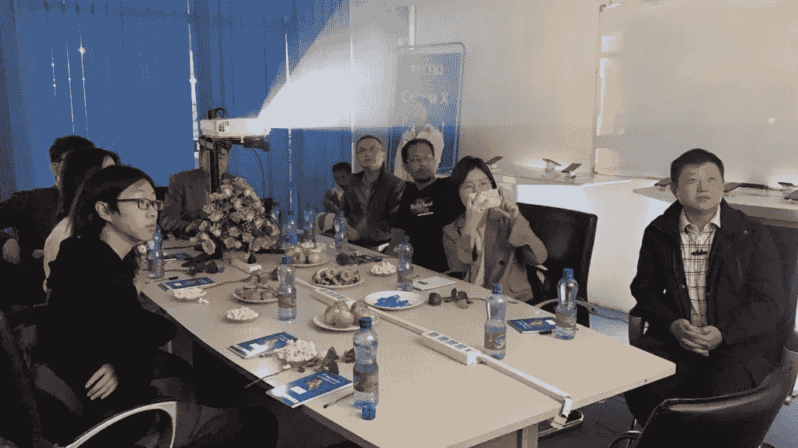

# 通过创新和技术连接中国和埃塞俄比亚(第四部分)

> 原文：<https://medium.datadriveninvestor.com/connecting-china-and-ethiopia-through-innovation-and-technology-part-four-dc31f4dde1ab?source=collection_archive---------7----------------------->

*这是这个系列的第四部，在这里看完了* [*第一部*](https://medium.com/@naelhailemariam/connecting-china-and-ethiopia-through-innovation-and-technology-part-one-16fc82dfc3a3)*[*第二部*](https://medium.com/@naelhailemariam/connecting-china-and-ethiopia-through-innovation-and-technology-part-two-8b5d2830d48e) *和* [*第三部*](https://medium.com/@naelhailemariam/connecting-china-and-ethiopia-through-innovation-and-technology-part-three-80a16146411c) *e。**

**

*The sand model of the Huajian industrial park*

# *中国企业参观*

*清华大学代表有机会参观了在埃塞俄比亚最活跃的中国企业。这里我把它们都列出来了。*

* [## 挑战你对人工智能和社会的看法的 4 本书——数据驱动的投资者

### 深度学习、像人类一样思考的机器人、人工智能、神经网络——这些技术引发了…

go.datadriveninvestor.com](http://go.datadriveninvestor.com/4AI1) 

1.  **华坚**

我们的第一步是在中国最大的鞋类出口商之一——华坚的埃塞俄比亚工厂。这位经理告诉我们，华坚计划在 10 年内投资 20 亿美元发展以出口制鞋为主的制造业集群。

该公司为 Guess 和 Calvin Klein 等品牌生产鞋子，并希望在十年内从埃塞俄比亚的出口额达到 40 亿美元。

During the delegates visit the Huajian factory I

从东部工业园区到华坚国际轻工城，华坚鞋厂是众多中国民营企业加速发展埃塞俄比亚制造业的缩影。有 200 多名中国管理人员和 2000 多名埃塞俄比亚工人。

During the delegates visit the Huajian factory II

华坚于 2011 年在埃塞俄比亚开设工厂，并于 2014 年以“女性战利品”的设计建立工业园区。它原计划在 2014 年至 2020 年完成，但由于经济和政治原因，该计划目前正在改变。

The sand model of the Huajian industrial park

作为劳动密集型企业，华建也受益于埃塞俄比亚低廉的劳动力成本。人工成本几乎是国内的七分之一，电费只有国内的一半，大大降低了生产成本。

**2。转运控股**

TRANSSION Holdings 是一家专注于移动通信的多元化全球高科技集团，以其领先的移动品牌如 TECNO、itel 和 Infinix 而闻名。

我们受到了 TRANSSION 控股公司埃塞俄比亚地区部平台总监陈品山先生的热烈欢迎；TECNO 工厂厂长田军先生；和人力资源部经理孟先生。

The delegation visiting the TRANSSION factory in Addis Ababa, Ethiopia

在亚的斯亚贝巴的街头，随处可见 TECNO 流动商店。让代表们惊讶的是，非洲最知名的手机型号 TECNO，居然是来自中国深圳的国产品牌。

TECNO 从未打入中国十大智能手机品牌，也不在美国或欧洲销售。然而，根据研究人员科纳仕公司的说法，其母公司占非洲手机销售的 30%，而第二名三星占 22%。三个主要的生产工厂位于中国、埃塞俄比亚和印度。

随着非洲成为全球增长最快的手机市场之一，成立于 2006 年的非洲首家双卡手机供应商 TECNO Mobile 似乎正处于领先地位。根据英国商业杂志《非洲商业》(Africa Business)编制的排名(2018 年 6 月)，TRANSSION 的三个手机品牌因其用户体验承诺而入选 2017/2018 年度非洲最受赞赏品牌 100 强。TECNO 排名第 7，连续多年位居非洲中国消费品牌第一，itel 排名第 16；Infinix 排名第 28 位。

随后，三位负责人在工厂会议室与代表团进行了座谈。

The delegation hosting a discussion in the conference room

陈董事详细介绍了天顺公司的历史和发展，包括公司的业务模式。他还给我们看了公司全球年会的现场视频。

> “种树的最佳时间是 20 年前，第二好的时间是现在，”埃塞阿比亚 TRANSSION Holdings 的副平台经理陈品山说，他引用了一句中国谚语来激励我们，因为开始一个伟大的想法、项目、关系或旅行之路永远不会太晚。

我从 Peter 先生那里了解到，TECNO 致力于为新兴市场转化最先进的技术，在“全球思考，本地行动”的指导方针下，提供量身定制的本地化产品。* 

*在下一个系列中，我将详细描述我们对亚的斯亚贝巴大学、埃塞俄比亚国家博物馆、Debre Libanos 的访问，以及我们与中国驻埃塞俄比亚大使馆参赞就埃中合作进行的非常详细的交谈，包括埃塞俄比亚参与[一带一路](https://www.beltroad-initiative.com/) (BRI)。*

*请随时联系。我的推特账号是 [@Nael4best](https://twitter.com/Nael4best)*

****附:S:*** *感谢阅读第四篇文章。我会有五个系列的出版物来生动地分享这些故事。**

**跟随* [*第五部*](https://medium.com/@naelhailemariam/connecting-china-and-ethiopia-through-innovation-and-technology-part-five-the-last-piece-375e5bfb608) *中的这个故事。**