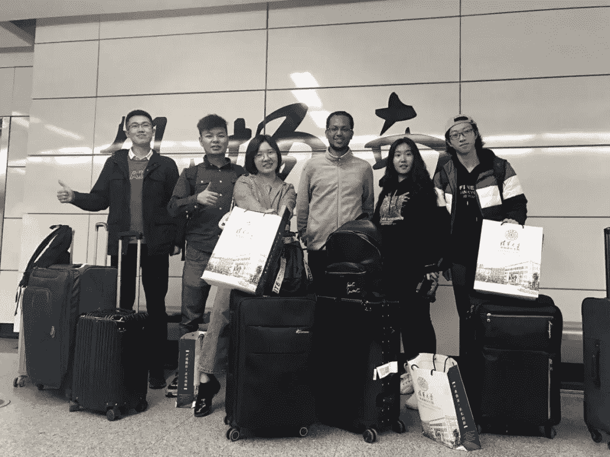
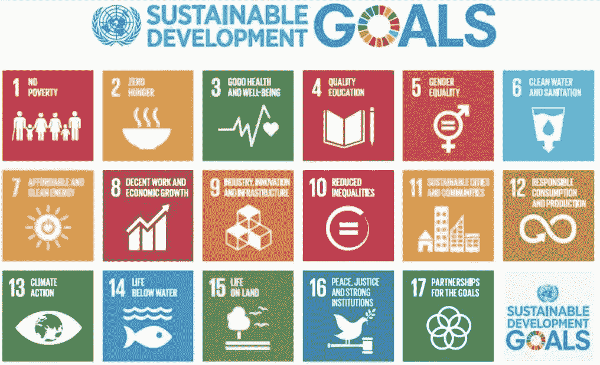
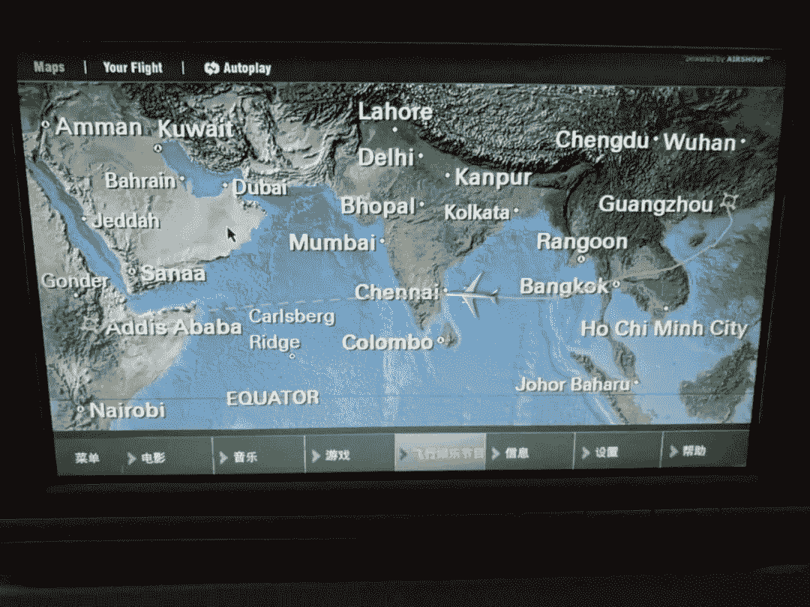
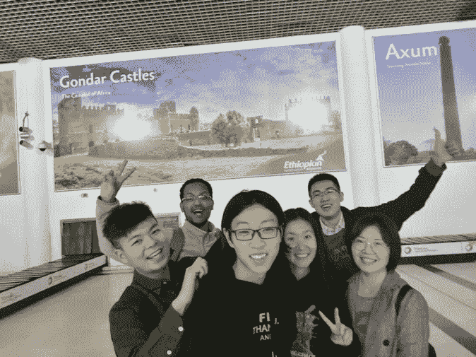
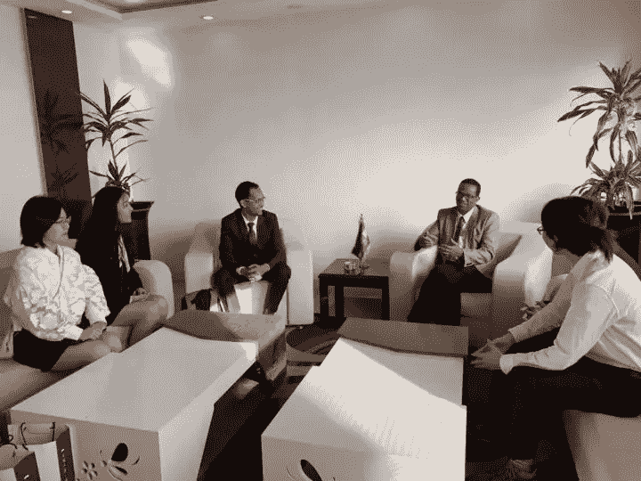
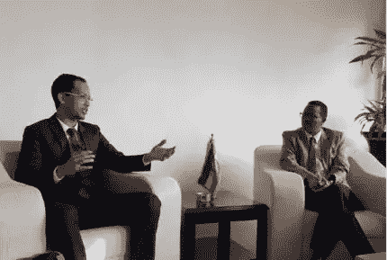

# 通过创新和技术连接中国和埃塞俄比亚(上)

> 原文：<https://medium.datadriveninvestor.com/connecting-china-and-ethiopia-through-innovation-and-technology-part-one-16fc82dfc3a3?source=collection_archive---------5----------------------->

我是 Nael Hailemariam，[清华大学](http://www.tsinghua.edu.cn/)深圳研究生院的数据科学硕士研究生。

将一群来自清华大学的中国精英学生送到我的祖国埃塞俄比亚，是我一生中做过的最有趣的事情之一。我从来没有想过我会带我的朋友去埃塞俄比亚当学生；我一直以为我开始工作后会举办这样的旅行。然而，我抓住了这个机会，因为我想让他们体验和了解埃塞俄比亚丰富的文化、人民和气候。我相信埃塞俄比亚的转变是赋予这一代埃塞俄比亚青年的责任，我想通过帮助我的朋友了解我的祖国来尽我的一份力量。

The Practice Delegation Team

# **实习背景**

埃塞俄比亚实践代表团由来自开放嘉年华和计算机科学项目的六名清华大学学生组成，他们是、马、、王传赞、、欧远志和我。这个团队是经过精心挑选的，代表了不同的背景。

我们是清华大学深圳研究生院的第一个海外社会实践团队。由我们自己发起，并得到清华大学开放嘉年华中心、清华大学深圳研究生院、深圳 Seeed 科技有限公司、深圳开放创新实验室(SZOIL)的支持。

这种做法源自成功的“埃塞俄比亚设计”竞赛。我们此行的目的是展示中国和埃塞俄比亚的创新项目，促进有抱负的中国和埃塞俄比亚年轻企业家的交流，并为未来的合作搭建平台。并强调利用深圳的资源解决埃塞俄比亚的创业问题，促进联合国可持续发展目标(SDGs)的实现。开放嘉年华中心主任许教授指出:“这次实践活动是一次难得的‘突破’。这是一个体现清华学生全球能力的创新项目，也是一个为促进中非友好合作带来新机遇的典范。”

The UN Sustainable Development Goals

我们最初从深圳出发去广州，然后转乘直飞埃塞俄比亚首都亚的斯亚贝巴的航班。从广州到亚的斯亚贝巴的 11 个小时的旅程一开始有点麻烦，因为我们被告知预定的航班已经超额预订，不得不重新安排。因此；在我们重新订票时，我们不得不在旅馆里呆了一夜。幸运的是，航空公司支付了住宿费。我们的行李很满，因为我们还带来了 Seeed Studio 为埃塞俄比亚的年轻企业家、孵化器和公司赞助的电子工具包。

The delegation en route to Addis Ababa

我们于当地时间 1 月 24 日下午 4 点在亚的斯亚贝巴的博乐国际机场着陆。下飞机后，代表团惊讶地感受到埃塞俄比亚温和的天气，因为他们以为会很热。我已经在中国呆了四年多，在完成北京航空航天大学的学士学位时，我从我的中国朋友那里听到了很多关于非洲的美丽。然而，他们从未想过非洲的天气有时会温和或寒冷。

此外，纯朴善良的埃塞俄比亚人民减少了我的指导工作。陌生人对代表团的友好帮助他们感到舒适，并在整个旅程中受到照顾。

After arriving in Addis Ababa

由于航班重新安排，我们不得不重新安排第一天的行程。所以，在我们入住 Sherar Addis 酒店后，我带他们去了 Romina，这是我在亚的斯亚贝巴最喜欢的餐馆之一。我们点了很多本地菜。代表们起初不愿意尝试“Injera ”,这是埃塞俄比亚大多数人的主食，也是埃塞俄比亚和厄立特里亚的国菜。然而，我告诉他们，这是一种由画眉草粉制成的谷物，富含纤维、铁和钙，并坚持让他们尝尝。最终，他们尝试并喜欢上了它。

# 会见埃塞俄比亚创新和技术部部长

1 月 25 日，我们与 ing 部长会面，开始了为期八天的“与深圳一起创新”活动。Getahun Mekuria 在他位于埃塞俄比亚创新技术部的办公室里。作为团队的领导者，我介绍了“埃塞俄比亚设计”项目的进展，也谈到了清华大学和深圳。

The delegation in discussion with the Minister

Myself introducing the purpose of our visit to the Minister

部长高度赞扬和赞同清华大学组织的社会实践活动的意义和合作精神，并概述了他对埃塞俄比亚未来科技发展的规划。他希望拥有类似微信支付和阿里巴巴的本地化电子商务平台。

欧洲大陆有许多充满希望的信号表明这是可能的。肯尼亚的电子商务现在估计占 2017 年所有采购的 6%。此外，麦肯锡最近的一份报告显示，到 2025 年，电子商务将占非洲大陆最大经济体零售额的 10%。他提到，埃塞俄比亚政府正在将许多国有企业私有化，并向市场经济迈进。他还与代表团分享了对电子商务行业的两大期望。这些是:

1.  部委办公室正在推动电子商务行业蓬勃发展。埃塞俄比亚截至目前没有电子商务行业。部长明白电子商务行业可以帮助小企业走向国际，与大公司竞争。
2.  该部希望创建一个以埃塞俄比亚为中心的非洲电子商务贸易圈。这可以在制定第一个目标的过程中触发。

The delegation presenting the Minister with memorabilia from Tsinghua University

在下一个系列中，我将详细介绍我们的社会实践代表团研讨会，该研讨会吸引了近 60 名由埃塞俄比亚创新和技术部挑选的当地大学生、年轻工程师和企业家。

请随时联系。我的推特账号是 [@Nael4best](https://twitter.com/Nael4best)

***附:S:*** *感谢阅读第一篇文章。我会有五个系列的出版物来生动地分享这些故事。*

*跟随这个故事进入* [*第二部。*](https://medium.com/datadriveninvestor/connecting-china-and-ethiopia-through-innovation-and-technology-part-two-8b5d2830d48e)