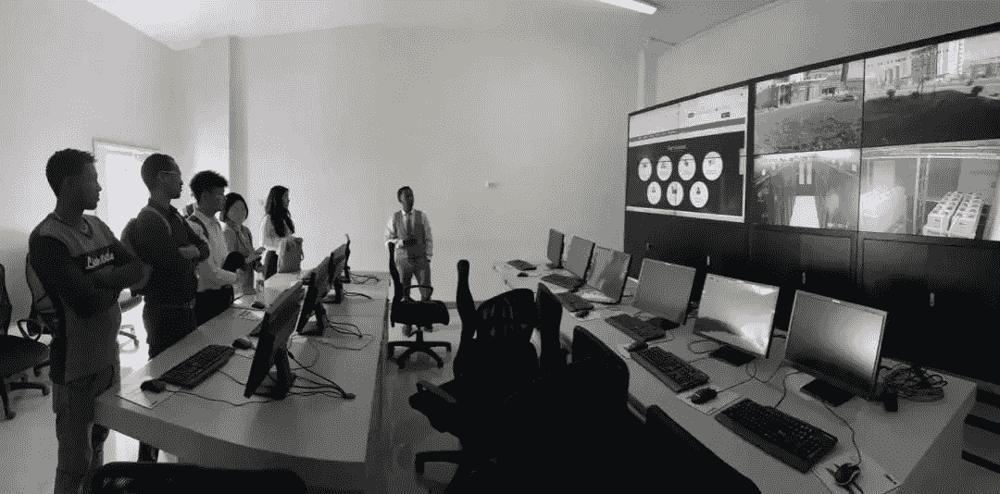
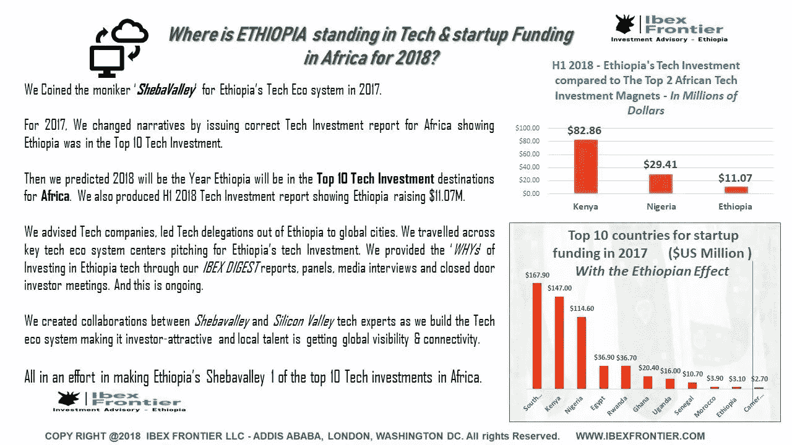
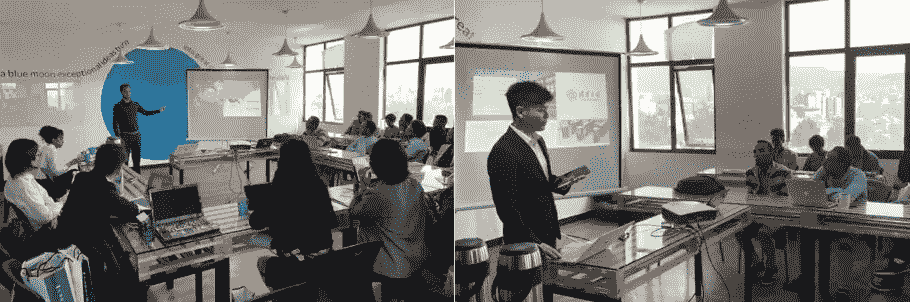
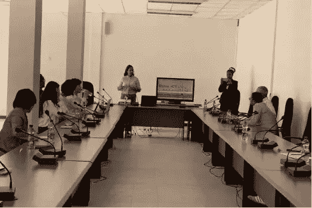
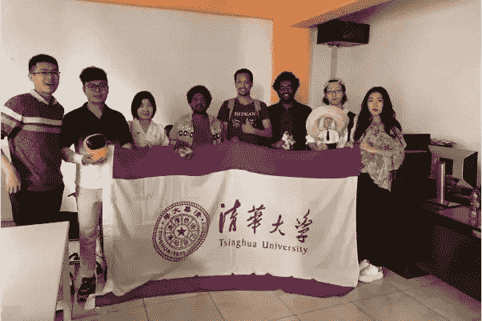
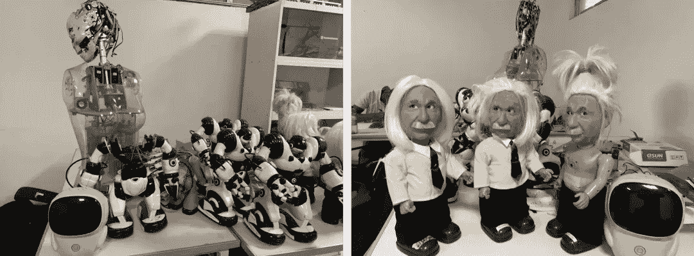

# 通过创新和技术连接中国和埃塞俄比亚(第三部分)

> 原文：<https://medium.datadriveninvestor.com/connecting-china-and-ethiopia-through-innovation-and-technology-part-three-80a16146411c?source=collection_archive---------17----------------------->

*这是这个系列的第三部，在这里阅读* [*第一部*](https://medium.com/@naelhailemariam/connecting-china-and-ethiopia-through-innovation-and-technology-part-one-16fc82dfc3a3) *和* [*第二部*](https://medium.com/@naelhailemariam/connecting-china-and-ethiopia-through-innovation-and-technology-part-two-8b5d2830d48e) *。*

The delegation while visiting the ICT Park datacenter

# **孵化器参观**

1 月 28 日至 30 日，[清华大学](http://tsinghua.edu.cn)代表团继续在亚的斯亚贝巴与当地孵化器、公司进行调研交流。为了深入了解埃塞当前的科技发展状况，我们与埃塞 [iCog Labs](http://www.icog-labs.com) 、 [blueMoon](https://bluemoonethiopia.com) 和 IT Park 的高层管理人员进行了参观和讨论。

Ibex Frontier analysis on the top 10 countries for startup funding in Africa in 2017 — ETH is placed at #10

**蓝月亮**

blueMoon 是埃塞俄比亚最大、最成功的孵化器公司之一。公司战略负责人 Bezawit Nesussie 女士向代表团介绍了公司及其发展情况。我分享了我对深圳的看法，以及如果它融入深圳的生态系统，它将如何帮助蓝月亮实现跨越式发展。40 多名参与者参加了此次活动，其中一些团队介绍了他们的项目以及他们在构建原型时面临的挑战。我们给了他们一些指导。最后，我们交出了大量由 Seeed 工作室赞助的电子设备和传感器。

The delegates while presented their researches at blueMoon HQ

**ICT 园区**

Ms. Feven, CEO of ICT Park, while introducing the ICT Park to the delegation

ICT Park 是埃塞俄比亚最大的科技孵化器。在参观过程中，ICT Park 首席执行官 Feven 女士介绍了 ICT Park 的资源和机会，这些资源和机会通过提供管理培训或办公场所等服务来帮助创业公司发展。

> Feven 女士还提到了埃塞俄比亚 ICT 面临的三大挑战:第一，技术基础设施不足，缺乏本地制造的组件，第二，缺乏行业专家，最后，知识产权保护薄弱，这意味着许多高科技工作者的成果在埃塞俄比亚得不到可靠的保护。

The delegation while visiting the ICT Park datacenter

随后，代表团参观了 ICT 园区数据中心。在参观数据中心时，工作人员介绍了数据中心的容量、管理系统和服务内容。

**iCog 实验室**

During the visit to iCog Labs

代表团还参观了埃塞俄比亚最大的人工智能公司 [iCog Labs](http://www.icog-labs.com) 。在参观过程中，我们与工程师进行了长时间的互动，并观察了许多有趣的科技产品；包括足球机器人、爱因斯坦机器人和许多其他由本地和汉森机器人公司开发的机器人。

Soccer robot and Einstein, both developed by iCog Labs with the help of the Hanson robotics

在接下来的系列文章中，我会写下我们访问埃塞俄比亚的中国企业的细节。以及其他非洲国家可以从中国企业在埃塞俄比亚的扩张中学到什么。

请随时联系。我的推特账号是 [@Nael4best](https://twitter.com/Nael4best)

***附:S:*** *感谢阅读第三篇文章。我会有五个系列的出版物来生动地分享这些故事。*

*跟随* [*第四部*](https://medium.com/datadriveninvestor/connecting-china-and-ethiopia-through-innovation-and-technology-part-four-dc31f4dde1ab) *中的这个故事。*