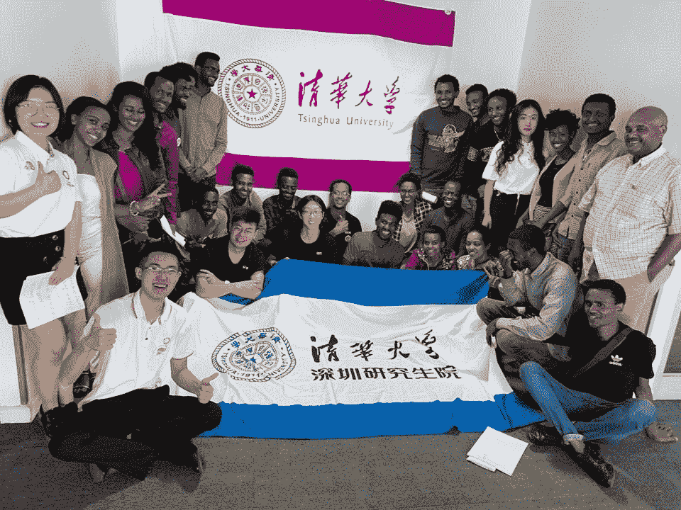
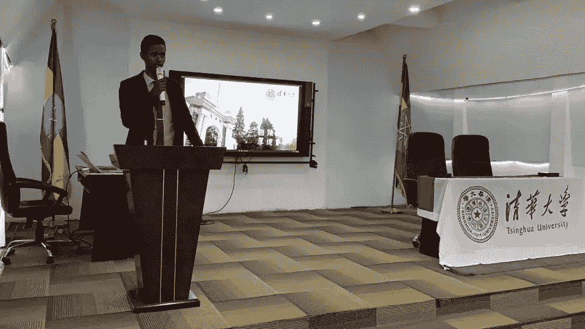
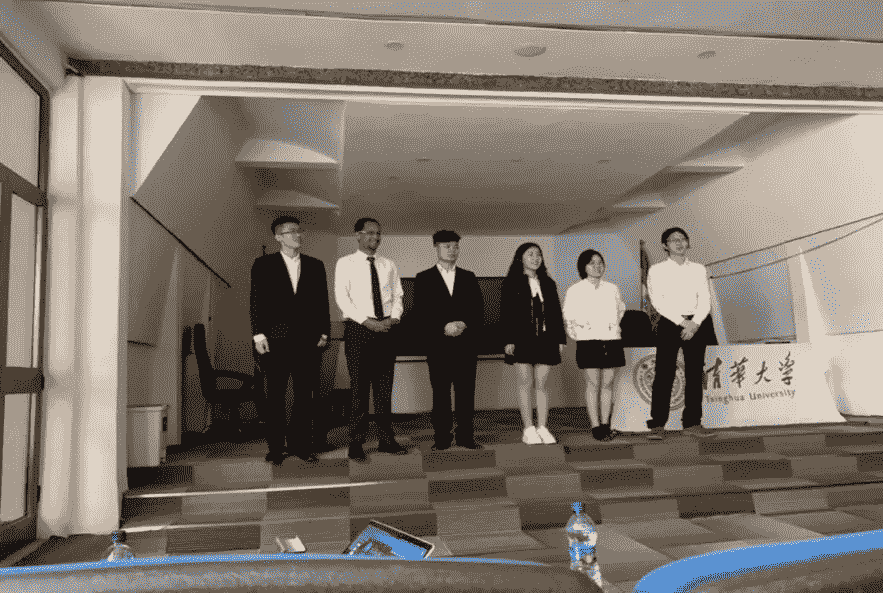
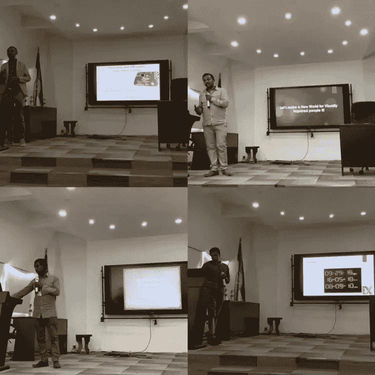
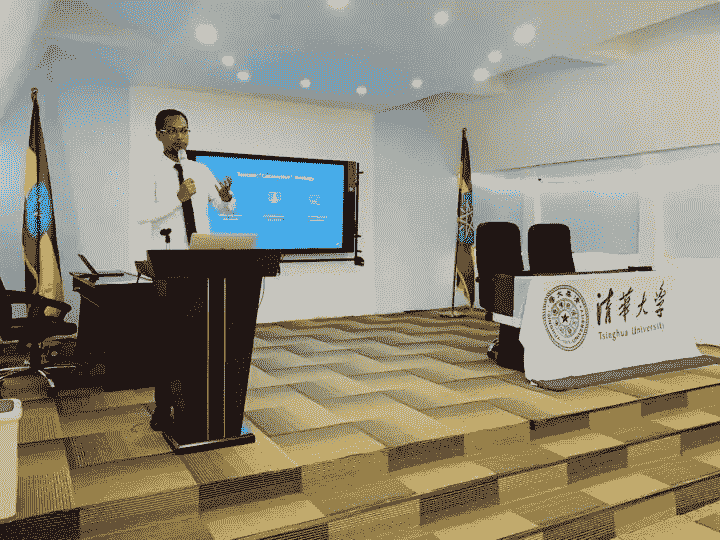
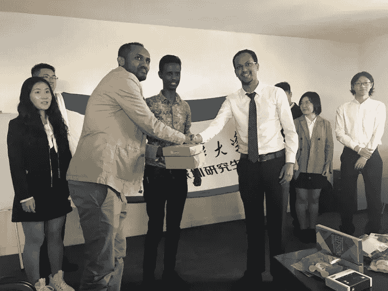
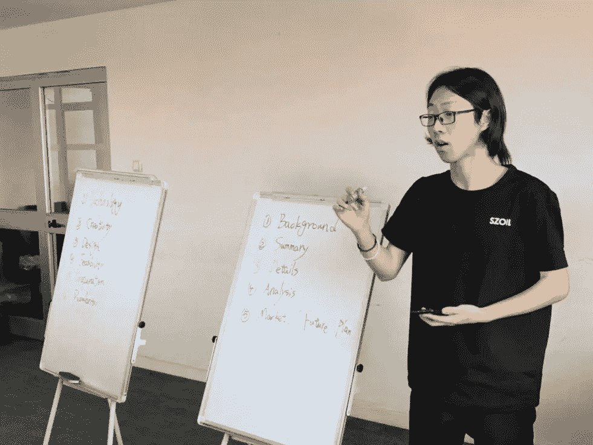
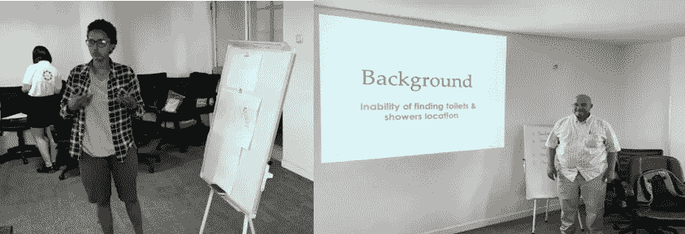
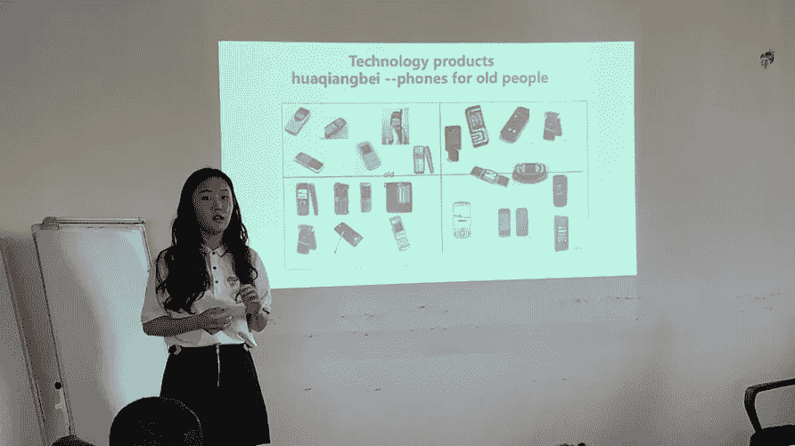
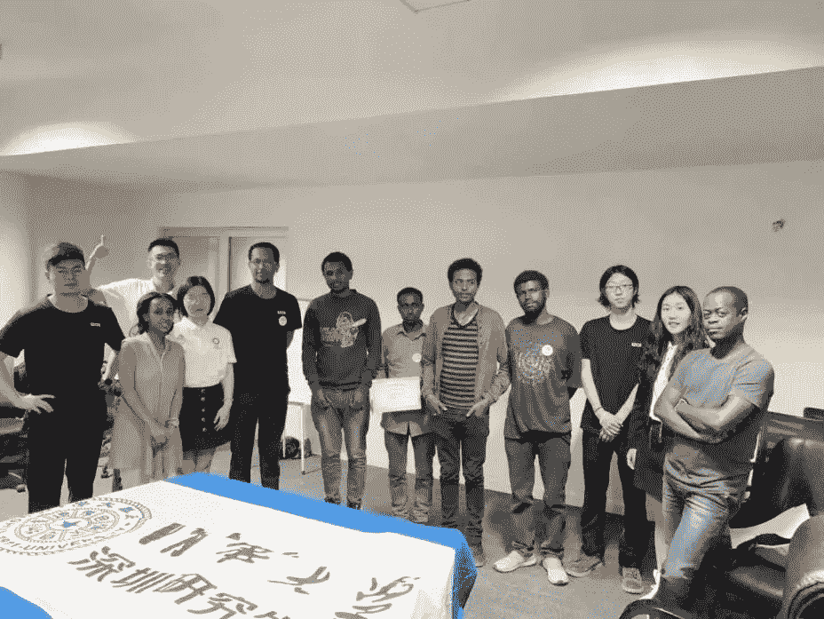

# 通过创新和技术连接中国和埃塞俄比亚(下)

> 原文：<https://medium.datadriveninvestor.com/connecting-china-and-ethiopia-through-innovation-and-technology-part-two-8b5d2830d48e?source=collection_archive---------13----------------------->

*这是这个系列的第二部，* [*这里看第一部*](https://medium.com/@naelhailemariam/connecting-china-and-ethiopia-through-innovation-and-technology-part-one-16fc82dfc3a3) *。*

A group photo of the participants and mentors

# **社会实践代表团工作坊**

在研讨会的开幕式上，埃塞俄比亚创新技术部技术转让和发展事务主任 Kalid Ahmed 博士(博士)发表了讲话，指出清华大学学生代表团来到亚的斯亚贝巴的重要性。他称赞我们努力展示来自中国和埃塞俄比亚的创新项目，促进有抱负的中国和埃塞俄比亚年轻企业家的交流，并为未来的合作搭建平台。

Opening speech by Dr. Kalid Ahmed (Ph.D.)

来自孵化器和部委办公室的 60 多名参与者出席了开幕式。此外，代表团的两位成员:欧源志浩和马介绍了清华大学的历史、学科和学术声誉。

Tsinghua University delegates introducing themselves

第二天，我和侯钰介绍了深圳的历史和发展现状。与会者惊讶地听到深圳从 1950 年拥有 3148 名居民的小渔村转变为 2017 年拥有 1253 万人口的世界上最富裕的特大城市之一。在下午的活动中，向代表团展示了正在深圳进行原型制作的“2018 埃塞俄比亚设计”的前五个项目。

Four of the top five team leaders presenting their projects

Myself introducing about Shenzhen and its tech ecosystem

1 月 26 日，代表团团队与创新技术部合作，进行了五强团队的挑战，提出了“在埃塞俄比亚设计”计划的介绍和总结，并领导了一次设计思维研讨会。

Kalid 博士提议建立 Fab Labs 来帮助制作普通人的设计原型，并将这项任务分配给了代表团。他还宣布，该部办公室有足够的资金支持首批“埃塞俄比亚设计”获奖者。随后，来自 iCog 实验室的工程师 Dagim 介绍了该公司的研究现状和与深圳合作的经验。

> “每个人都想去美国，现在每个人都想与中国合作，”达吉姆说。

上午会议结束时，代表团将深圳 Seeed Technology 捐赠的硬件套件移交给当地制造商。

The delegation handing over the donation kit to the maker

在 26 日下午研讨会的开幕式上，代表之一的王传赞向与会者介绍了研讨会的背景和日程安排。在王的介绍之后，由两个部委办公室的官员和五个代表组成的指导小组做了简要介绍，以指导小组的项目。

Wang Chuanzan introduces the workshop details

经过仅 3 个小时的讨论和迭代，四个团队围绕医疗、民生、环保等重要问题，找出问题，制定解决方案。在展示他们的原型时，代表团和两位官员对参与者对设计思维方法的理解感到非常惊讶。研讨会帮助代表和与会者加深了对埃塞俄比亚社会问题以及创新和创业现状的了解。这也为中埃两国进一步开展青年合作奠定了坚实基础。

Participants while presenting their teams’ project’s

随后，侯钰分析了中国互联网行业的发展现状，以寻找与埃塞 ICT 生态系统的协同效应。

One of the delegates, Hou Yu, introduces business analysis methods

该系列研讨会吸引了近 60 名当地大学生、年轻工程师和企业家参加。还邀请了埃塞俄比亚创新技术部的官员与代表团一起参与指导。

Winning group award ceremony

在研讨会期间，代表团介绍了各种高端研究和实用技能，如商业分析、人工智能和设计思维。我们还推荐了一些教育平台和来中国申请奖学金的机会，受到了与会者的广泛好评。

在下一个系列中，我将写下我们参观三个埃塞俄比亚高科技企业孵化器和公司的经历，以及我们也有兴趣参与的埃塞俄比亚企业家的有前途的项目。

请随时联系。我的推特账号是 [@Nael4best](https://twitter.com/Nael4best)

***附言:*** *感谢阅读第二篇文章。我会有五个系列的出版物来生动地分享这些故事。*

*跟随* [*第三部*](https://medium.com/datadriveninvestor/connecting-china-and-ethiopia-through-innovation-and-technology-part-three-80a16146411c) *中的这个故事。*