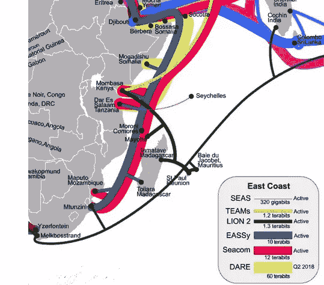
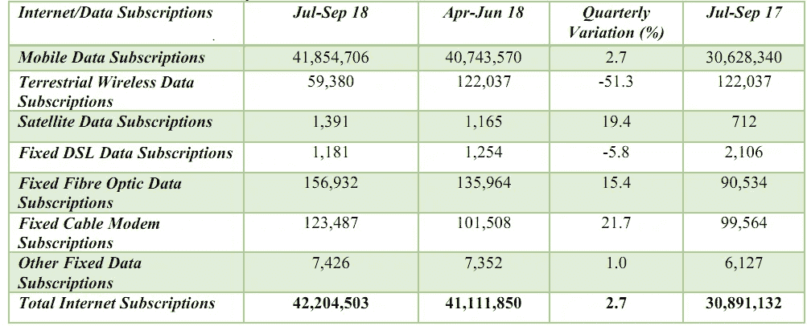
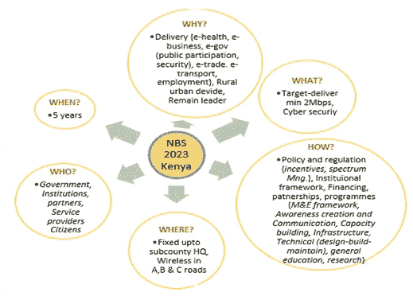

# 将每个人连接到互联网

> 原文：<https://medium.datadriveninvestor.com/connecting-everyone-to-the-internet-bd08f5de9073?source=collection_archive---------4----------------------->

## 肯尼亚 2018–2023 宽带战略简评

Image by [S Young](https://pixabay.com/users/dalatindiva-6363720/?utm_source=link-attribution&utm_medium=referral&utm_campaign=image&utm_content=3144495) from [Pixabay](https://pixabay.com/?utm_source=link-attribution&utm_medium=referral&utm_campaign=image&utm_content=3144495)

随着政府继续将其关键服务数字化，互联网日益成为一项公民权利。每一个肯尼亚人申请驾照、护照和报税都必须在网上进行。此外，宽带连接通过在线贸易、社会互动和内容制作，促进了人类社会和经济自由的扩展。这意味着保持不连接意味着在社会和经济发展中被落在后面。

政府公布了将肯尼亚人接入互联网的拟议计划。2019–2023 年宽带战略提案是对 2014–2017 年第一个战略的修订。本文将带您了解政府计划将公民接入宽带的策略，并在此过程中提供一些分析和背景。

 [## 准备在 2019 年改变世界的技术-数据驱动的投资者

### 很难想象一项技术会像去年的区块链一样受到如此多的关注，但是……

www.datadriveninvestor.com](https://www.datadriveninvestor.com/2019/01/17/the-technologies-poised-to-change-the-world-in-2019/) 

## 肯尼亚连通性概述

肯尼亚有大约 4220 万互联网用户，而人口为 4800 万(数字由通信管理局提供，但无法核实)。肯尼亚连接着一个广阔的海底电缆网络。随着平价上网手机进入市场以及移动和宽带服务提供商之间的激烈竞争，互联网渗透率近年来有了巨大增长。然而，肯尼亚只有不到十分之一的移动用户接入了家庭宽带，而家庭宽带主要集中在内罗毕及其周边地区。

Source: [African Undersea Cables 2018](https://manypossibilities.net/african-undersea-cables/)

Source: Communications Authority Sector statistics — 20182019

宽带战略的修订受到以下挑战的影响:

(一)宽带分布不均大多集中在城市地区。肯尼亚大部分农村地区仍未联网。即便如此，宽带市场在很大程度上是由私营部门驱动的，因此在城市地区留下了一些看起来无利可图的投资领域。

㈡最后一英里连接的挑战。

肯尼亚宽带费用高。内罗毕地区的家庭宽带为 5mbps，平均价格为 2500 KES。互联网服务的税率为 15%。由于去年经历的国家预算危机，这一数字比 8%有所上升。

㈣缺乏相关的数字内容和应用程序来推动宽带的使用，特别是对农村地区的公民而言。我们仍然只有有限的创新宽带服务可供所有社会经济部门采用，以吸引这些部门的采用并提高其效率和对这些服务的认识。

(v)缺乏基础设施共享框架和不一致的投资模式、建设成本以及整个产业链的协作，这在一定程度上阻碍了网络在全国的推广。

(六)对宽带的信任度和不安全感不足，缺乏电子垃圾管理计划。

2013 年的战略设想农村地区的连接速度为 2Mbps，肯尼亚城市为 5Mbps。然而，现在还不清楚这些速度是如何达到的，因为政府认为这个目标过于雄心勃勃，利益相关者陷入了 1.6Mbps 和 2Mbps 之间的选择僵局。尽管如此，我们应该首先考虑我们希望普通肯尼亚人生产和消费的内容。

这是它将如何交付

Source: Broadband strategy 2018–2023

该战略侧重于七个专题领域:政策、立法和监管；基础设施和连通性；服务、内容和应用程序；能力建设和创新；设备；隐私和安全；金融与投资；以及实施该战略的配套体制框架。

# 能力建设

互联网使用、教育水平和贫困之间有很大的关联。由于实行免费初等教育，肯尼亚的教育水平在过去 15 年里直线下降。我们是非洲宽带事业的领跑者之一，并在全球范围内与其他公司进行比较。

为了促进与提供宽带服务有关的技能发展，该战略侧重于振兴专门机构，以支持相关部门所需的专门技能和能力

# 设备融资

该战略计划审查税收政策，包括宽带设备税的例外情况，以提高可负担性。具体来说，它提出手机零评级，以增加互联网接入。政府还计划与金融机构合作，提供贷款和创新的支付方式，以增加公民的设备拥有率。值得注意的是，在齐贝吉总统任期内，ICT 设备是零税率。此外，学生们能够以半价从政府-世界银行 *wezesha* 项目中购买笔记本电脑。在此期间，信通技术行业在该部门包容性政策发展的推动下取得了巨大进展。也许我们还应该与私营部门合作，促进社区网络，并发展类似的概念，如 Mkopa，以连接贫困人口。

# 履行

战略是概述为实现目标而采取的行动的计划。因此，战略文件应该给出两点:一个目标和实现目标的计划。2013 年宽带战略有目标，但缺乏治理和行政结构，因此肯尼亚信通技术部门的发展不是因为它，而是因为市场自由化。这一次，2023 年战略的制定由信息和通信技术部与 2030 年愿景委员会共同牵头。因此，它将该战略与国家发展计划直接联系起来。

2023 年战略给出了两种实施方案:

1.  通过协调政府机构，如 2030 年愿景、信息和通信技术部和通信管理局。
2.  通过一项议会法案设立的国家宽带实施委员会。

方案 2 将是一个挑战，因为提出新的立法将需要至少两年时间——占用了该战略实施时间的一半。

# **政策、立法和法规**

以下是该战略将依赖的政策:

1.  【2013 年肯尼亚信息&通信修正法案 —规定了信息和通信的总体条例。该法案设立了通信管理局作为监管机构。
2.  **2016 年《获取信息法》** —旨在促进公众获取公共机构持有的信息，以此作为促进开放和参与式治理的一种方式。
3.  【2018 年《计算机滥用和网络犯罪法案》 —旨在对与计算机系统相关的犯罪做出规定。
4.  **关键基础设施—** 旨在保护公有和私有的有形和虚拟资产，这对肯尼亚人的社会和经济福祉至关重要。战略草案建议将宽带作为关键基础设施。然而，该法案于 2015 年提出供公众参与，其批准进展情况不得而知。
5.  **ICT 政策** —旨在为 ICT 提供一个框架/总体规划。该计划于 2006 年首次制定，由于信通技术领域的快速变化，计划于 2016 年进行审查。在与信息和通信技术部门进行了大量接触后，政府也对其审查的进展保持沉默。
6.  [**数据保护法案**](https://medium.com/datadriveninvestor/regulating-the-new-oil-5962d8974c9b)**——**是 GDPR 的翻版。开发的目的是让数据主体控制由数据处理器存储的数据。这也是在去年年底公众意见征询后悬而未决的。由于政府的数字化项目(如国家综合身份管理)缺乏公众支持，其批准可能会被优先考虑。
7.  **版权法—** 旨在促进知识产权所有权，以及
8.  **肯尼亚工业产权法—** 旨在促进发明和创新活动，通过授予和管理专利、实用新型、技术创新和工业设计来促进技术的获取。

# **隐私和安全**

更新后的战略将包括确保安全和保护用户隐私的计划。这里的策略重点是检测和执行安全和数据违规事件。政府将:(I)与国家警察局合作，确保宽带基础设施的安全，(ii)推动建立独立的网络犯罪法医组织，以及(iii)对公民开展有关在线隐私和安全的教育和定期宣传计划

# 金融和投资

该战略着眼于支持宽带交付的各种替代方案。第一种选择是由中央政府通过财政部提供资金，第二种选择是由县政府拥有宽带基础设施，通过它向二级服务提供商提供县批发服务。其他选择包括公私伙伴关系和捐助资金。

# 限制

我们对这个国家及其民众的宽带连接有什么样的愿景？我们正从一个工业社会转变为一个更加信息化的社会。宽带战略没有谈到知识社会、智能城市的发展。这将需要该战略与其他信通技术政策文件相联系:信通技术战略、网络安全战略和网络安全政策。似乎有一些悬而未决的政策和多个缺失的环节来解释这些政策文件是如何相互反馈的。一年多前，该国的 ICT 总体规划——这一战略应该以此为基础——公开征求公众参与，但迄今为止，这份文件后来发生了什么还不得而知。

另一个挑战是提供与普通公民直接相关的指标的战略——对公民友好的指标。(从街上随机挑选一个人，问他们关心策略中的什么)。因此，该战略应该让普通肯尼亚人了解他们能够参与其发展的程度。