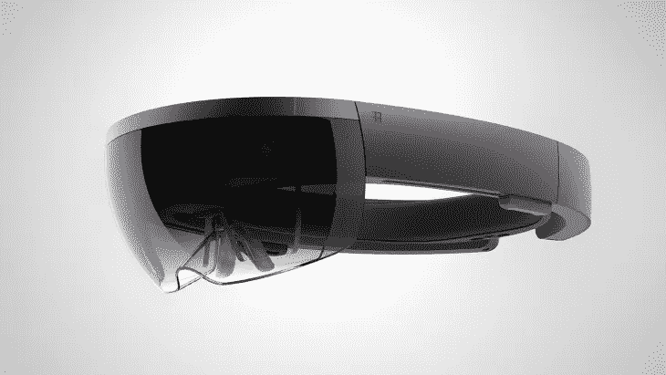

# 连接 Microsoft Hololens 和 Raspberry Pi3B+

> 原文：<https://medium.datadriveninvestor.com/connecting-the-microsoft-hololens-and-raspberry-pi3b-58665032964c?source=collection_archive---------1----------------------->

[](http://www.track.datadriveninvestor.com/1B9E)

连接物理和增强现实

在过去的几年里，增强现实已经席卷了整个国家，生产力和生活方式工具以一种新的方式重新想象的机会从未如此之高。在这一系列中，我们希望在使开发人员能够创建不仅仅是视觉辅助全息图方面取得一些突破。我们将构建功能全息图，使我们能够与物质世界互动。在整个系列中，我们将从本地解决方案逐步发展到云解决方案。我们将首先在 raspberry pi3 上设置一个服务器，我们的微软 Hololens 将与该服务器进行通信。然后，我们将在我们的 Hololens 上设置一个 TCP 客户端，它将向我们的服务器发送指令，然后让服务器向 Hololens 发送指令已被接收、处理和完成的确认。



## 在 Raspberry Pi 3B 上设置服务器

让我们首先在我们的 raspberry pi 上设置一个本地服务器。我们将使用 Python 套接字库进行 TCP/IP 通信。如果你还没有你的 IP 地址，打开一个终端，输入 **ifconfig** 。从您的终端找到您的 IPv4 地址，并将其粘贴到您的服务器的主机变量中(如下面的代码块所示)。

[](https://www.datadriveninvestor.com/2018/08/30/the-convergence-of-ai-rv-what-you-can-expect/) [## 人工智能和虚拟现实的融合-你能期待什么|数据驱动的投资者

### 在技术领域，融合是合乎逻辑的一步。就在几十年前，你可能需要一个专门的…

www.datadriveninvestor.com](https://www.datadriveninvestor.com/2018/08/30/the-convergence-of-ai-rv-what-you-can-expect/) 

在您的服务器代码中，您可以将端口号设置在 8000 到 10000 之间。注意，您不能让其他服务器监听您为 raspberry pi 服务器设置的端口。

```
import socketserversocket = socket.socket(socket.AF_INET, socket.SOCK_STREAM)
host = "#.#.#.#"
port = ####
```

让我们将服务器套接字绑定到本地地址和上面指定的端口。一旦我们绑定了我们的服务器套接字，我们将告诉套接字库，在拒绝外部连接之前，我们希望排队多达 5 个连接请求。

```
serversocket.bind((host, port))
serversocket.listen(5)
```

既然我们的服务器已经启动并在监听连接，那么让我们为何时开始从客户机接收信息设置逻辑。首先，我们将建立一个无限循环，它将无限期地接受到我们服务器的新连接。当我们收到新的信息时，我们会对它进行解码。接下来，我们将设置一个案例，用于处理服务器解码特定短语的情况，我们还可以选择向客户端发送确认响应，表明我们收到了他们的消息。

```
print("The server has started and is listening for connections.")
while 1:
    (clientsocket, address) = serversocket.accept()
    print("Connection Found!")

    data = clientsocket.recv(1024).decode("utf-8")
    print("Message received from client: " + str(data)) if data == "Ping":
        print("Message received from client: " + str(data))
        #Send a confirmation that the data was received
        #clientsocket.send("Pong").encode("utf-8")
    else:
        print("Data did not match any cases on the server.")

    print("Closing the socket")
    clientsocket.close()
    print("Closed socket")
```

## 完整的服务器代码

下面是我们的树莓 pi3 的完整服务器代码。

## StreamSocket 概述

我们将利用 StreamSocket 类从 Hololens 与我们的 raspberry pi 进行通信。StreamSocket 类支持在 UWP 应用程序中通过 TCP 或蓝牙 RFCOMM 使用流套接字的网络通信。StreamSocket 的文档可以在这里找到[。](https://docs.microsoft.com/en-us/uwp/api/windows.networking.sockets.streamsocket)

## Unity 版本

我们将在这个项目中使用 2018.3.11 Unity LTS 版本。这个版本的 Unity 的下载可以在[这里](https://unity3d.com/get-unity/download/archive)找到。

## 设置 Hololens 环境

要开始设置你的 Hololens 环境，导航到编辑→播放器设置→窗口

我们将在**其他设置、XR 设置和……**中编辑内容

在**其他设置**下，向下滚动到**功能**并选中两个选项:**互联网客户端服务器**和**互联网客户端**

仍然在**其他设置**下，滚动到**配置**，将**脚本运行时版本**设置为**。NET 4.x 等效**，设置**脚本后端**为**。NET** ，并将 **Api 兼容级别**设置为**。NET 4.x.**

在**项目设置→ XR 设置**下，确保 Windows 混合现实添加在你的**虚拟现实 SDK 下。**更多关于虚拟现实 SDK 的信息可以在[这里](https://docs.unity3d.com/Manual/XR.html)找到。

## 在 Hololens 上设置 Tcp 客户端

导航到您的 **Assets** 文件夹，并创建一个名为 **MyTcpClient 的新 C#脚本。**

首先，让我们定义我们将为客户机使用的所有名称空间。Hololens 需要 threading.tasks，如果没有指定应用程序应该何时使用它，将导致程序失败。

```
using System;
using System.Collections.Generic;
using System.IO;
using System.Text;
using System.Threading;
using UnityEngine;#if !UNITY_EDITOR
using System.Threading.Tasks;
#endif
```

现在我们将在 MyTcpClient 类中分配变量。我们将创建一个名为 **clientMessage** 的字符串变量，它将允许我们更改从 inspector 选项卡发送到服务器的消息。每当我们在 Hololens 上运行程序时，都会用到这里列出的变量。

```
 //String Variable that will be sent over to the server
    [SerializeField]
    public string clientMessage;#if !UNITY_EDITOR
    //Used to determine whether we'll be using the Unity editor or a Hololens
    private bool _useUWP = true;
    //Create a socket to be used as a pipeline to communicate with our server
    private Windows.Networking.Sockets.StreamSocket socket;
    //Allows the program to know when to start, dispose, or close a task
    private Task exchangeTask;
#endif
```

让我们来处理应用程序何时从编辑器中运行。这里的变量与上面代码块中列出的相同，但是被配置为用于在 Unity 编辑器中运行

```
#if UNITY_EDITOR
    //Use the Unity editor
    private bool _useUWP = false; //Pipeline used to communicate with our server
    System.Net.Sockets.TcpClient client;
    System.Net.Sockets.NetworkStream stream; //Allows the program to know when to start, dispose, or close a thread
    private Thread exchangeThread;
#endif
```

我们将创建一个字节数组变量来存储要发送给服务器的字符串。我们的 StreamWriter 变量将用于将信息写入我们的 StreamSocket，然后 StreamSocket 将字节数组发送到服务器，StreamReader 用于通过与 StreamWriter 类似的通道从服务器读入信息。

```
private Byte[] bytes = new Byte[256];
private StreamWriter writer;
private StreamReader reader;
```

尝试使用您的本地地址和您指定的端口将 Hololens 客户端连接到 raspberry pi 服务器。一旦 Hololens 连接完毕，使用 **ExchangePackets** 向服务器发送消息。

```
public void Start() {
    Connect("#.#.#.#","####");
    ExchangePackets();}
```

现在我们将设置一个函数，首先检查我们是通过 Unity 还是从 Hololens 运行我们的应用程序。这很重要，因为 Hololens 处理任务的方式与 Unity 编辑器不同。

```
public void Connect(string host, string port) {
    if (_useUWP) {
    ConnectUWP(host, port);
    } else {
    ConnectUnity(host, port);
    }
}
```

如果我们从 Hololens 运行应用程序，就会调用这个函数。UWP 是全息透镜的建造者。

首先，我们将检查我们是否为我们试图构建的平台使用了正确的变量。如果我们使用了错误的变量，我们会通知用户。假设我们使用了正确的变量，我们将检查是否已经有一个进程在运行。如果有一个进程正在运行，我们将停止它，并使用我们的 IP 地址和端口创建一个新的套接字。接下来，我们将使用 StreamWriter 和 StreamReader 创建一种从服务器读取和写入数据的方法。一旦我们创建了一个新的套接字和我们的读写器，通知用户我们已经连接到服务器。该代码的 Unity 编辑器实现在该代码块的下面。

```
#if UNITY_EDITOR
    private void ConnectUWP(string host, string port)
#else
    private async void ConnectUWP(string host, string port)
#endif
    {
#if UNITY_EDITOR
        errorStatus = "UWP TCP client used in Unity!";
#else
        try {
            if (exchangeTask != null) StopExchange();
            socket = new Windows.Networking.Sockets.StreamSocket();
            Windows.Networking.HostName serverHost = new
                Windows.Networking.HostName(host);
            await socket.ConnectAsync(serverHost, port); Stream streamOut=socket.OutputStream.AsStreamForWrite();
            writer = new StreamWriter(streamOut) {AutoFlush=true};

            Stream streamIn = socket.InputStream.AsStreamForRead();
            reader = new StreamReader(streamIn);

            successStatus = "Connected!";
        } catch (Exception e) {
            errorStatus = e.ToString();
        }
#endif
    }
```

下面是 Unity 编辑器实现(与上面的相同),用于创建套接字、编写器和读取器。这有利于测试您的应用程序功能，而不必构建和部署到您的设备上。

```
 private void ConnectUnity(string host, string port) {
#if !UNITY_EDITOR
        errorStatus = "Unity TCP client used in UWP!";
#else
        try {
            if (exchangeThread != null) StopExchange(); client = new System.Net.Sockets.
                TcpClient(host, Int32.Parse(port));
            stream = client.GetStream();
            reader = new StreamReader(stream);
            writer = new StreamWriter(stream) {AutoFlush=true}; successStatus = "Connected!"; } catch (Exception e) {
            errorStatus = e.ToString();
        }
#endif
    }
```

变量，用于处理服务器和客户端之间如何交换信息，以及正在发送的信息的状态。

```
private bool exchanging = false;    
private bool exchangeStopRequested = false;    
private string lastPacket = null;     
private string errorStatus = null;    
private string successStatus = null
```

**更新**功能对此并不真正需要，但我选择将它留在这里，以防您想要更新用户的连接状态和发送的消息。

```
public void Update(){
    /*if(errorStatus != null){
        Debug.Log(errorStatus);
        errorStatus = null;
    }
    if (successStatus != null){
        Debug.Log(successStatus);
        successStatus = null;
    }*/
}
```

这是负责从设备向服务器发送信息的主要功能。每当你想向服务器发送消息时，你将调用这个函数。对于这个演练，我们将在我们的 **Start** 方法中调用这个函数；在确保我们的 Hololens 连接到 raspberry pi 服务器之后。我们的 **clientMessage** 字符串设置在 Unity 项目的 inspector 选项卡中。

```
 public void ExchangePackets(){
        try {
            if (clientMessage == "Ping") {
                writer.Write("Ping");
            }
            else if (clientMessage == "Start Game") {
                writer.Write("Start Game");
            }
        } 
        catch (Exception e) {
            Debug.Log(e.ToString());
        }
    }
```

我们的 **StopExchange** 函数将处理与当前套接字关联的进程的关闭和处置。与我们的套接字关联的所有变量都将被设置为 null。

```
 public void StopExchange(){
        exchangeStopRequested = true;
#if UNITY_EDITOR
        if (exchangeThread != null){
            exchangeThread.Abort();
            stream.Close();
            client.Close();
            writer.Close();
            reader.Close(); stream = null;
            exchangeThread = null;
        }
#else
        if(exchangeTask != null) {
            exchangeTask.Wait();
            socket.Dispose();
            writer.Dispose();
            reader.Dispose(); socket = null;
            exchangeTask = null;
        }
#endif
        writer = null;
        reader = null;
    }
```

现在您已经为您的客户端设置了代码，我们将创建一个函数，每当这个脚本所连接的游戏对象被销毁时，该函数将关闭并处理我们的套接字。

```
 public void OnDestroy() {
        StopExchange();
    }
```

下面是设置 Tcp 客户端的完整代码。

**MyTcpClient.cs(完整)**

Tcp 客户端文件修改自帖木儿的文章。你可以在这里找到他的文章。

## 使用客户端

现在您已经有了 TcpClient 脚本，将您的**mytcclient . cs**脚本添加到一个游戏对象中，并输入字符串“Ping”，我们希望使用 **clientMessage** 字段(位于检查器中)将它发送到我们的服务器。

## **构建我们的应用**

让我们构建我们的应用程序，以便它可以在 Hololens 上运行。转到文件->构建设置。将目标平台切换到**通用 Windows 平台。**设定:

*   **目标装置**至**全息透镜**
*   **架构:** x64
*   **建造类型:** D3D
*   **目标 SDK 版本:**最新安装
*   **最低平台版本:** 10.0.10240.0
*   **Visual Studio 版本:**最新安装(或 VS 2017)
*   **构建并运行于:**本地机器

在 Unity 中构建您的解决方案，并在 Visual Studio 中打开您的项目构建文件夹。

## **部署我们的解决方案并运行我们的应用**

一旦你有了 visual studio，你就要将你的**解决方案配置**设置为**调试，将解决方案平台**设置为 x86，将**设备**设置为**设备。**

现在，在您的解决方案资源管理器中，右键单击层次结构顶部的项目文件夹，并选择 Deploy Solution。将您的解决方案部署到设备后，选择**运行**按钮在设备上启动您的应用程序。如果您的项目正常工作，您应该在您的 raspberry pi 上显示以下消息: **Unity 发送 Ping** 。如果你看不到从你的 Hololens 发出的信息，可能是由于下面列出的一些错误:

*   你在你的客户端已经在运行之后启动了你的服务器(注意，在你的 Hololens 上启动应用之前，你的服务器必须在运行)。
*   您用于客户端和服务器的 IP 地址不匹配。
*   您用于客户端和服务器的端口不匹配。
*   您使用的 IP 地址不正确。
*   您没有连接到互联网。
*   你的 Hololens 和 raspberry pi 没有连接到同一个网络。

## 下一个

该系列的第 2 部分将包括控制色调灯和使用 Twilio 发送短信/语音消息。