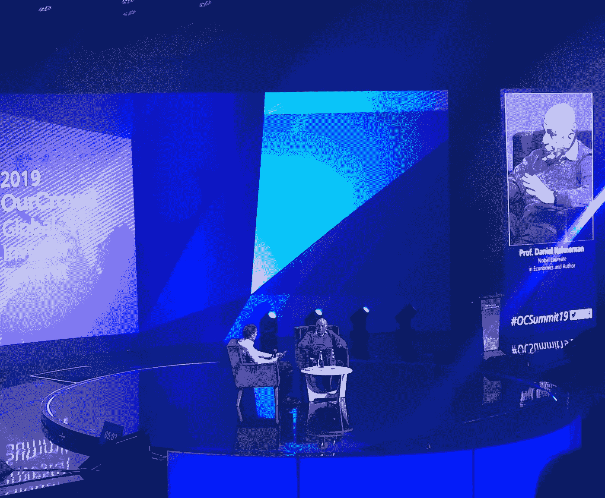
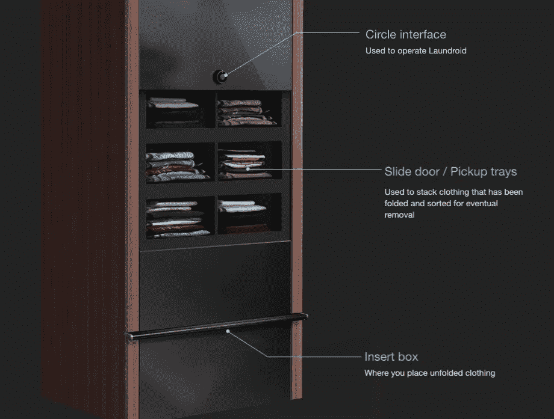
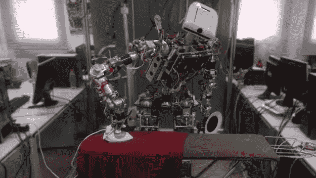
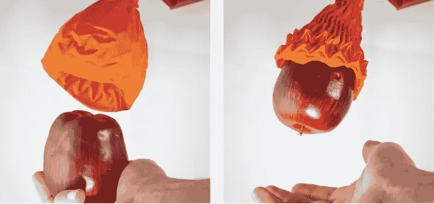

# 征服家居，一次一件衬衫

> 原文：<https://medium.datadriveninvestor.com/conquering-the-home-one-shirt-at-a-time-6850eefae56f?source=collection_archive---------15----------------------->

上周，在参加“我们的人群”峰会时，我被聚集在耶路撒冷国际会议中心的广泛创新和思想所吞没。乔纳森·梅德韦德的 10 亿美元众筹平台已经推出了一些最有前途的机电初创公司，包括 [ReWalk](https://rewalk.com/) 、[直觉机器人](https://www.intuitionrobotics.com/)、[空中机器人](https://www.airoboticsdrones.com/)和[阿格斯网络安全](https://argus-sec.com/)。梅德韦德的成功在于他富有感染力的积极和自信，这种积极和自信促进了整个风险生态系统的合作。用峰会总结发言人、诺贝尔奖获得者丹尼尔·卡内曼的话说，“乐观是资本主义的引擎……那些成就伟大事业的人，如果你回头看，他们是过度自信和乐观的——过度自信的乐观主义者。”

听了卡尼曼博士的话，我见到了 Foldimate 公司自信的企业家加尔·罗佐夫。这家机器人公司在今年 1 月的消费电子展(CES)上成为头条新闻，展示了其智能家居自动化的新方法。本周，这位创始人与我分享了他的想法:“我一直觉得我应该分担家务，但我第一个承认，我不太擅长做家务，也不特别喜欢做家务。”这位慈爱的丈夫承认，“我的妻子不同意我的衣物折叠标准，”然后他突然想到，“也许如果有一台机器可以帮我完成折叠的困难部分，我就可以帮助完成这项烦人又繁重的家务。”他将他的发明与其他家用电器相比较，“它将完成困难的部分——折叠，就像洗碗机做清洁一样。”凯膳怡最成功产品的创造者约瑟芬·科克伦在 1893 年的芝加哥世界博览会上展示了第一台可用的机械洗碗机，这是一个奇怪的巧合。然而，又过了 65 年，消费者才开始在家里安装设备。相反，在战后销售繁荣之前，凯膳怡的顾客包括酒店和大型餐馆。

 [## 2019 年及以后的技术趋势-数据驱动的投资者

### 要建立一个成功的创业公司，你需要 3T:TAM、团队和时机。这份时事通讯是关于时间的-更多…

www.datadriveninvestor.com](https://www.datadriveninvestor.com/2019/01/17/tech-trends-in-2019-and-beyond/) 

家庭消费市场已经成为许多暴发户的废墟，罗佐夫从科克伦的故事中受到潜意识的启发，为初露头角的机器人企业家提供了价值课程。该公司没有将 Foldimate 定位为在电子商店销售的洗衣机和烘干机旁边的新设备，而是首先解决了商业洗衣领域的问题。Rozov 解释说，“根据我们的计算，根据目前的美国人口，我们估计仅在美国每天就有超过 1.2 亿件物品在自助洗衣店和共用洗衣房被人工折叠。”当要求他量化这一数额时，这位高管预计，以目前 7.25 美元的最低工资计算，每天大约有 80 万小时用于折叠衣服，相当于 580 万美元的时薪。根据 Rozov 的说法，十亿美元的市场机会甚至可能更高，“我们不知道有多少物品在服装店等其他业务中被折叠，但可以肯定的是，它不会少于自助洗衣店，而且可能更多。”这款折叠机器人拥有超音速速度，因为“FoldiMate 在不到 5 分钟的时间内折叠了约 25 件衣物，在最近的测试中，我们测试了人类与 FoldiMate 一起折叠，我们发现它的折叠速度至少是人类的两倍，”罗佐夫自豪地说。这些数据转化为大量的工资节省和服装销售商销售机会的增加，包括像 Gap，Inc .这样痴迷于折叠的商店。

Foldimate 并不是第一台自动衣物折叠机，但它是目前唯一一款售价低于千元的便携版。多年来，服装制造商一直使用价值数十万美元的工业文件夹来包装服装订单。在 2018 年的 CES 上，日本初创公司 Seven Dreamers 推出了 [Laundroid](https://laundroid.sevendreamers.com/en/about/) ，这是一款价值 16，000 美元的人工智能服装整理器，包括折叠抽屉，可以将褶皱的衣物压在一起，优雅地堆放在衣柜的架子上。与 Foldimate 使用夹子将织物弯曲并塞入褶皱不同，亚洲版利用机械臂和超过 250，000 张图像的数据库来扫描、识别并折叠成整齐的束。在 2018 年回顾 Laundroid 时，Verge 作家[达米·李](https://www.theverge.com/authors/dami-lee)表示，“你需要几个小时来完成折叠一堆衣物，因为一件 t 恤需要大约 5-10 分钟来折叠。”凭借对该公司和松下工程合作伙伴关系的 9000 万美元投资，Seven Dreamers 没有被吓倒，因为它有望在今年晚些时候发布一个更便宜、更高效的版本，直接与 Foldimate 竞争。

当 Laundroid 和 Foldimate 争夺 400 亿美元的洗衣市场时，许多机器人专家正在采取不同的方法。2017 年，卡洛斯三世大学的研究人员展示了一个名为 [TEO](https://www.newscientist.com/article/2138264-this-handy-robot-will-iron-your-clothes-so-you-dont-have-to/) 的人形机器人，能够处理家务熨烫工作。该实验室用皱纹检测计算机视觉技术给 TEO 编程，以快速压出皱纹。用它的创造者 Juan Victores 博士的话说，“TEO 是为了做人类做的事情而建造的。我们家里会有像 TEO 这样的机器人。只是谁先做的问题。”

本周，随着麻省理工学院计算机科学和人工智能实验室宣布成功测试一种新型柔性机械手爪，维克托博士对机器人管家的预测更接近现实。Daniela Rus 教授向媒体展示了[折纸末端效应器](https://www.youtube.com/watch?v=byqGFH6AZuk)，展示了她的花状附肢如何能够拾取不同大小和深度的重物。正如 Rus 博士解释的那样，“通过将这种可折叠的骨架与柔软的外部相结合，我们获得了两个世界的最佳效果。我对使用这样的机器人手开始抓取食品杂货感到兴奋。”根据 Rus 博士的最新实验，普通手臂能够举起 100 倍于其重量的重物，有望为世界上老龄化的人口增加重物。

随着第一代家用机器人的诞生，如 Jibo 和 Kuri 的倒闭，智能电器随着 Foldimate 等硬件的进步以及最近的学术突破而蓬勃发展。罗佐夫乐观地描述道，“我们认为不应该将 FoldiMate 与 Jibo 和 Kuri 相提并论。我们认为，几十年来，世界一直在等待解决折叠问题的可行方案，FoldiMate 是解决主要问题的第一个自然步骤。”他在推动行业发展方面的坚韧让人想起十九世纪科克伦的坚韧不拔，他宣布:“如果没有人发明洗碗机，我就自己来做！”从而将女性从脏盘子的束缚中解放出来尽管他们相隔一百多年，但科克伦和罗佐夫实现了卡尼曼关于企业家决心的理论，“他们承担大风险，因为他们低估了风险有多大。”