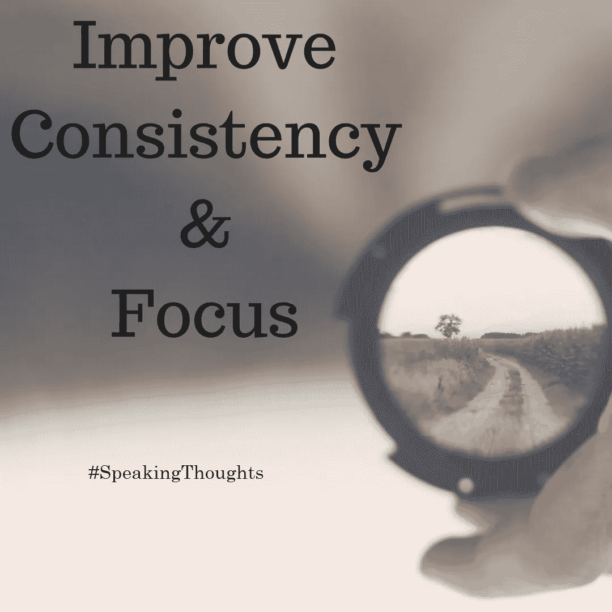

# 专注和一致性

> 原文：<https://medium.datadriveninvestor.com/consistency-and-focus-8f8b34b37bcf?source=collection_archive---------8----------------------->

每天都是新的一天。我们必须每天都证明自己，因为每一天都有新的挑战和要求。在我们的一生中，我们经常观察到，有些人在很短的时间内取得了巨大的成功，而另一些人同样努力，但却收效甚微，我们想知道这是怎么回事。可以说，那些人只是更聪明，或者更有野心，或者更有毅力，或者可能只是更幸运。这些都是重要的因素，在我们的生活中扮演着重要的角色，帮助我们取得更多的成就。然而，只有一个因素比其他任何因素都重要。这体现在专注和一致性上。我们需要高度专注和持续地工作，因为努力工作一天并不重要，除非你每天都工作一段时间，相信我，你会看到结果的。

这是 21 世纪的第二个十年，充满了干扰；从交通、手机声音、社交媒体(脸书、Instagram、WhatsApp)到电视。我们周围的噪音会分散我们的注意力。因此，在这种情况下，很难保持我们的重点和一致性。我们失去了注意力和内心的平静。因为这些干扰，我们每天都在浪费大量的时间。

现在这是一个数字化的世界，我们正在经历从未有人想过的事情。一切都变得超快，这当然有助于我们的生产力和效率，但同时，它也让我们不耐烦。我们想要快速的结果，而不是等待事情在它们自己的时间里成熟。现在我们等不及了，失去了冷静。因此，我们不能长期坚持一个目标或指标，但在很短的时间内，我们希望有好的结果。然而，这是不可能的。每件事都需要一定的时间来完成。底线是我们已经失去了一致性和重点。我们沉迷于结果，忘记了过程。

我仍然相信，我们可以实现一致性和对实践的极大关注。对我来说，第一步是接受并意识到我们正过着分心的生活。社交媒体和手机是改善沟通和生产力的伟大工具，但从长远来看，它们会破坏我们对重要事情的关注并伤害我们。一旦我们接受这个事实，我们将学习使用这些小工具的道德规范，我们将学习如何在不分心的情况下 100%有效地使用它们。

让我们考虑一个我们经历过的现实生活中的例子。想想一个 2-3 岁的婴儿，他开始学习如何说话，他说错了什么，所以每天都继续练习。每次他练习，他的口语一天天地提高，有一天他开始说得很好。当同一个婴儿开始学习如何走路时，他不会，他会在一个台阶上摔倒，但我们会让他练习，总有一天他会开始用一致性的力量正确地走路。

最重要的部分是设定一个目标，把目标分成更小的目标，每天练习。继续做下去。忘记结果，让自己负责。有一天你会看到比你期望的更好的结果。

[#说话思维](https://www.facebook.com/hashtag/speakingthoughts?source=feed_text&epa=HASHTAG&__xts__%5B0%5D=68.ARC9MfwbhlyjDwlHa9clMDHge1pnzRfNRokx9Epa0gHN8Ti9zCBlF9xwgHeDyOBvclIjzQTM8c5g5G-OYzB3a8LJJImGSo4_Ax8C-kTkcM7puaUyjBmIiTEuy9K2imXnGh6eCp8DSmEqwA-6sBo-KjTyOmLScKJ9DrzYH6Mn5Fhv-58mpQj_agwY4zxpXnDJkqriWafKsStYJ8oChz1nAh0n1DJwnwzue5BNtAZjblG56dh_5RSMOaCyrA7eS4rDlp9IfHU5xd_zVXkzbsHT1tvZJCln1UQIDW03h0nsHp1AIAhd6jUWHG3SWKEs8Oj5bBaWVZ0KfMV1L6q0gZH6j2w&__tn__=%2ANK-R)[#专注](https://www.facebook.com/hashtag/focus?source=feed_text&epa=HASHTAG&__xts__%5B0%5D=68.ARC9MfwbhlyjDwlHa9clMDHge1pnzRfNRokx9Epa0gHN8Ti9zCBlF9xwgHeDyOBvclIjzQTM8c5g5G-OYzB3a8LJJImGSo4_Ax8C-kTkcM7puaUyjBmIiTEuy9K2imXnGh6eCp8DSmEqwA-6sBo-KjTyOmLScKJ9DrzYH6Mn5Fhv-58mpQj_agwY4zxpXnDJkqriWafKsStYJ8oChz1nAh0n1DJwnwzue5BNtAZjblG56dh_5RSMOaCyrA7eS4rDlp9IfHU5xd_zVXkzbsHT1tvZJCln1UQIDW03h0nsHp1AIAhd6jUWHG3SWKEs8Oj5bBaWVZ0KfMV1L6q0gZH6j2w&__tn__=%2ANK-R)[#坚定](https://www.facebook.com/hashtag/consistancy?source=feed_text&epa=HASHTAG&__xts__%5B0%5D=68.ARC9MfwbhlyjDwlHa9clMDHge1pnzRfNRokx9Epa0gHN8Ti9zCBlF9xwgHeDyOBvclIjzQTM8c5g5G-OYzB3a8LJJImGSo4_Ax8C-kTkcM7puaUyjBmIiTEuy9K2imXnGh6eCp8DSmEqwA-6sBo-KjTyOmLScKJ9DrzYH6Mn5Fhv-58mpQj_agwY4zxpXnDJkqriWafKsStYJ8oChz1nAh0n1DJwnwzue5BNtAZjblG56dh_5RSMOaCyrA7eS4rDlp9IfHU5xd_zVXkzbsHT1tvZJCln1UQIDW03h0nsHp1AIAhd6jUWHG3SWKEs8Oj5bBaWVZ0KfMV1L6q0gZH6j2w&__tn__=%2ANK-R)[#匆忙](https://www.facebook.com/hashtag/hustle?source=feed_text&epa=HASHTAG&__xts__%5B0%5D=68.ARC9MfwbhlyjDwlHa9clMDHge1pnzRfNRokx9Epa0gHN8Ti9zCBlF9xwgHeDyOBvclIjzQTM8c5g5G-OYzB3a8LJJImGSo4_Ax8C-kTkcM7puaUyjBmIiTEuy9K2imXnGh6eCp8DSmEqwA-6sBo-KjTyOmLScKJ9DrzYH6Mn5Fhv-58mpQj_agwY4zxpXnDJkqriWafKsStYJ8oChz1nAh0n1DJwnwzue5BNtAZjblG56dh_5RSMOaCyrA7eS4rDlp9IfHU5xd_zVXkzbsHT1tvZJCln1UQIDW03h0nsHp1AIAhd6jUWHG3SWKEs8Oj5bBaWVZ0KfMV1L6q0gZH6j2w&__tn__=%2ANK-R)

感谢你阅读这篇文章。你可以在这里看到我写的其他文章。我也欢迎你访问我的 Fb 页面[speaking thinks](https://www.facebook.com/speakingthoughts.net/)。我唯一想要的回报就是对报道进行反思。