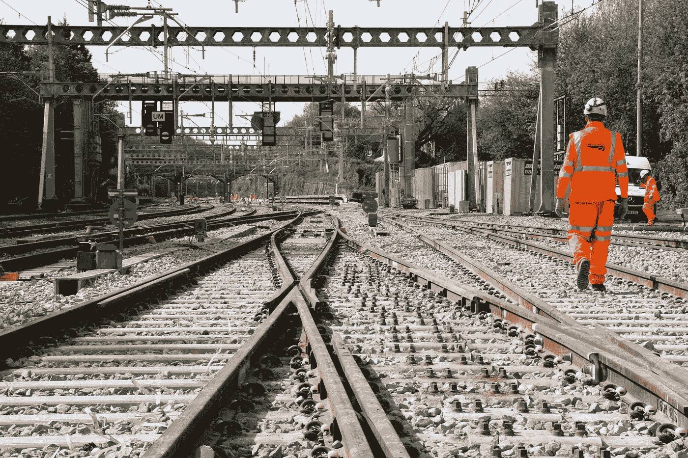

# 建筑业新闻综述

> 原文：<https://medium.datadriveninvestor.com/construction-industry-news-roundup-af282b34ce0e?source=collection_archive---------14----------------------->

2019 年 2 月

25，000 套新房子，为铁路网 350 亿英镑的 CP6 计划开绿灯，人工智能预防和预测自然灾害:关注本月所有重要的行业新闻。

# 政府批准了 2.5 亿英镑的大型住房项目

全文请见:[建筑咨询](https://www.constructionenquirer.com/2019/02/14/government-signs-off-250m-for-major-housing-projects/)

英国政府已经签署了近 2.5 亿英镑的资金，为建设近 2.5 万套住房扫清了道路。

这笔资金将投资于一系列项目。其中 1 . 57 亿英镑将用于支持德文郡和坎布里亚郡大型项目的关键基础设施。

住房基础设施基金贷款将用于建设一条连接南卡莱尔和 M6 的新高速公路，为圣库斯伯特花园村提供多达 1 万套新住房。

此外，5500 万英镑将用于德文郡的道路改善和其他基础设施，支持 2500 套住房的开发，这些住房将建在埃克塞特的西南部。

在另一项行动中，英国家园组织与国防部达成协议，将在全国七个军事基地建造超过 10，000 所房屋。

在伦敦，由于开发商获得了 7800 万英镑的住房建设基金贷款，将在伊丽莎白女王奥林匹克公园(Queen Elizabeth Olympic Park)建造逾 1500 套新住房。

# 人工智能技术有助于预防自然灾害

全文请见: [BBC 未来](http://www.bbc.com/future/story/20190226-how-to-bring-wildfires-back-under-control)

地震、海啸、洪水和野火是自然界最猛烈、最无法控制的现象。但是预测他们可能袭击的时间和地点有助于拯救生命。

预测和控制自然灾害，如森林火灾的蔓延，需要对森林和如何管理森林有详细的了解。这提出了一个除了少数专业专家之外，所有人都无法应对的挑战。这就是人工智能介入的地方。

> [DDI 编辑推荐——未来的产业](http://go.datadriveninvestor.com/daib07/matf)

一家总部位于美国的公司 SilviaTerra 正在使用人工智能绘制森林地图，为帮助规划者降低火灾风险提供资源。利用卫星数据以及航空照片和激光扫描技术，该团队正在以 15 平方米的分辨率绘制美国 3.055 亿公顷的每一片森林。一旦地图完成，机器学习算法将帮助当局确定火灾风险最大的区域。

在世界的另一端，日本东北大学(Tohoku University)，一个团队正在开发一种工具，利用人工智能来定义受自然灾害影响的地区，对地面上的损失进行分类，并提醒政府和救援队前往最需要他们的地方。

在 SenSat，我们与 Bam Nuttall 合作创建了一个虚拟的洪水走廊，目的是让计算机能够分析河流、地形和洪水风险，这些变量比人类单独分析要多得多。高度详细的数字 3d 模型有助于了解 Bam Nuttall 需要进行哪些建设工程来减少该地区的洪水。建筑工程将于今年夏天完工。

# 350 亿英镑的 CP6 铁路网计划最终获得批准

全文位于:[新土木工程师](https://www.newcivilengineer.com/latest/final-green-light-for-network-rail-35bn-cp6-plan/10040118.article)

Source: NCE

铁路网已经为其 350 亿英镑的一揽子资金和控制期 6 (CP6)的支出计划开了绿灯，该计划将持续到 2024 年的未来五年。

未来五年的详细支出计划将在 4 月 1 日控制期开始前的 3 月底公布。

英国的铁路对国家的繁荣至关重要。它不仅将人与工作联系起来，将商品与市场联系起来，还能刺激经济增长。近年来，英国拥有欧洲增长最快的铁路，铁路旅行的数量在过去 20 年里翻了一番，乘客数量预计到 2040 年将增长[约 40%。](https://cdn.networkrail.co.uk/wp-content/uploads/2018/02/Strategic-business-plan-high-level-summary.pdf)

需求的翻倍显然标志着铁路行业的成功，但随着铁路规模的扩大，运营成本也在增加。Network Rail 的首席执行官 Marc Carne 指出,“Network Rail 需要成为我们所能做到的最有效率的公司，虽然我们在过去的十年里已经将铁路的运营成本降低了 40%,但我们可以也必须做得更多。新技术和更高效的工作方式将是铁路在未来几年成为精益、创新行业的关键。”​

*最初发表于*[*www.sensat.co.uk*](https://www.sensat.co.uk/blog-february-industry-roundup)*。*