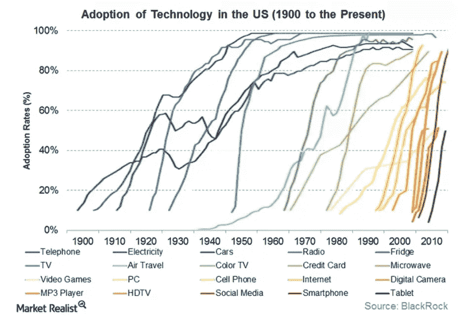

# 消费者人工智能与工业人工智能扩散率——3 个差异&为什么派对才刚刚开始？

> 原文：<https://medium.datadriveninvestor.com/consumer-ai-vs-industrial-ai-diffusion-rates-3-differences-why-the-party-is-just-getting-995b8501bc6d?source=collection_archive---------1----------------------->

我们所有人都不断接触到大量宣传人工智能优点和缺点的媒体饮食。这是新的现实。它已经悄悄地、稳步地渗透到每个行业的多个方面。这种稳定状态的人工智能渗透正在对结果产生有形/无形的影响，改变行为，转变商业模式，扰乱市场。在这篇博客中，我们希望分享 Fluturas 对工业人工智能采用的实际见解，以及为什么这对整个经济的未来至关重要，因为经济在很大程度上是由能源和工程公司驱动的

Source = Blackrock

在宏观层面上，人工智能应用可以大致分为两类

1.  **消费者人工智能应用**:交叉销售推荐器、情绪分析器、市场组合建模器、糖尿病视网膜病变预测器等
2.  **工业人工智能应用**:过程化学产量预测器、井下钻井低效预测器、压裂时马达停机故障预测器等

在 Flutura，我们有幸在过去 5 年中目睹了许多实际的工业人工智能应用，这些应用在休斯顿、东京、杜塞尔多夫和许多其他工业中心的上游钻井、过程化学制造、工业重型设备制造商中**大规模超越了“创新概念”**。我们注意到这两个部分的节奏不同，并问自己**两个简单的问题**

> 问题 1:什么**区分了工业人工智能采用率**和消费者人工智能采用率以及为什么这些差异**很重要？**
> 
> 问题 2 : **对此能做些什么？**

Flutura 从其“来自战壕”的体验中发现，消费者 AI 已经领先，因为 **3 个原因**

> 原因- **1** :标签为**的 dat** a 适用于工业&消费级 AI 机型的差异
> 
> 原因- **2** :在工业&消费者环境中对**解锁的**美元的感知差异
> 
> 原因- **3** :工业&消费主管**心态**的差异

# 原因 1:工业和消费者人工智能模型可用的标签数据的海洋

让我们面对现实吧…在模型调整到真实世界的行为之前，机器学习算法需要“攫取”大量“标签数据”——无论是建模消费者行为还是机器行为:)

如果有人将面部识别视为使用深度学习神经网络来解决的问题，那么从 Minst 这样的来源可以学习大量数据。

如果我们考虑一个类似的问题，如检测尿布制造厂的产品质量图像异常或海底结构的裂缝检测和进展，则需要开始创建标记数据集的基础工作。如果公司有一种“延迟满足”的心态，项目就会启动，而如果高管们想要一种“现在止痛膏”，这些项目就会被搁置。

对此能做些什么呢？

必须让工业高管意识到，获取标签数据将是竞争优势的来源。

> 标记的工业过程和设备数据将成为在高度竞争的市场中生存的工具，在这个市场中，算法的访问变得大众化，标记数据的访问成为“护城河”。

# 原因 2:对消费者和工业人工智能所释放的价值的理解不同

> “忘记那些花里胡哨的条款，给我钱吧”是我们经常从休斯顿、东京、杜塞尔多夫听到的反馈。

在消费行业中，当一个人执行市场组合模型(例如，该模型改变了零售行业中促销费用的分配)时，管理人员可以通过测量 ROMI(营销费用回报指标)来感知未锁定的费用价值

然而，工业思维习惯于感知机电维度的价值(“我能看到水平钻井能做什么，我能看到增加振动和冲击传感器如何减少保修责任”)，这比数字维度更实际(“我看不到我不能感知的东西”)，因此，他们无法足够自信地回答“**给我钱**”这个问题

对此能做些什么呢？

Flutura 发现“**工程曲线”**是一个很好的工具，可以向持怀疑态度的工业人士展示有形的附加值

对于设备制造商来说，PF 曲线可以成为让买家感知价值的工具。例如，在作战部署中，发动机异常检测器将数以千计的消费者/海军舰船发动机的故障警告检测窗口从 60 秒移动到 60 分钟

对于**钻井承包商**来说，每个钻井状态下的深度与时间可以是一个概念，使他们认识到 AI 在移动每个钻井状态下的停留时间中的价值，从而在数百个钻井平台上实现数百万美元的效率

> 每个行业都必须有一条工程效率曲线，在这条曲线上可以绘制出工业人工智能的价值感知。**找到就搞定了:)**

# 原因 3:产业和消费者心态的差异

工业过程是复杂的，需要大量投资，高可靠性的机电运动部件已经运行多年。与工业部门相比，零售/保险/银行流程相对“轻资产”。

由于这种差异，可靠性成为关键词，无论是保证复杂压裂设备或顶驱的预测率，还是井下钻杆移位故障。

> 工业主管肩上扛着很多东西。在某些情况下，一个小小的错误可能意味着与那些危险的工业操作密切接触的人的生死。在经历了许多成功和失败后，他们需要感同身受，并被温和地引导通过新的“工业人工智能”的眼睛来看待运营。

# 为什么这三个差异在测量工业人工智能扩散率的 S 曲线上很重要？

众所周知的 S 曲线一直是衡量市场中颠覆性技术采用率的可靠晴雨表，无论是手机采用率、比特币采用率还是人工智能采用率。如果我们为工业人工智能和消费者人工智能绘制 S 曲线，那么在影响点上的差异将会明显出现

> 区别-1:消费人工智能的起飞点>工业人工智能
> 
> 差异-2:工业人工智能的峰值点>消费者人工智能

实现一个工业人工智能应用需要更长的时间，但是外科人工智能应用的潜在影响可以让许多消费者人工智能应用的综合影响黯然失色。

# 结束语

这意味着，释放巨大经济价值的工业人工智能采用派对才刚刚开始。如前所述，采用曲线中有一条很长的水平线，随后是大规模的采用高峰。在一个以人类历史上前所未有的速度加速和变化的世界里，当工业高管们管理风险与回报等式时，我们需要对他们的需求感同身受。最后，我们留给你杰伊·阿什的这一临别感想(13 个原因)

> “你不能阻止未来
> 
> 你不能倒转过去
> 
> 了解这个秘密的唯一方法
> 
> …就是按播放。"