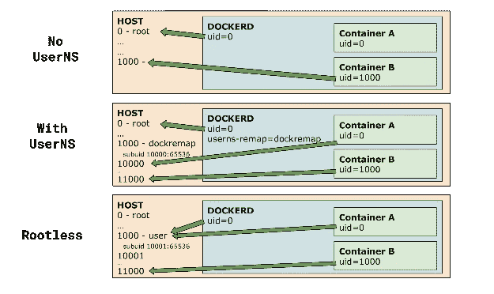
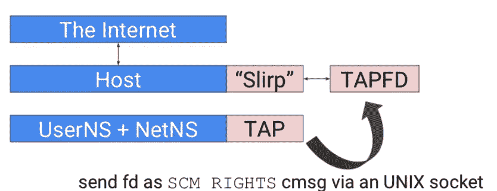

# 容器安全:看无根容器

> 原文：<https://medium.datadriveninvestor.com/container-security-a-look-at-rootless-containers-7c2ea6f6842?source=collection_archive---------3----------------------->


作者:李逸


> *资料来源:osxdaily.com*

[Docker](https://www.docker.com/?spm=a2c41.13239704.0.0) 和 [Kubernetes](https://kubernetes.io/?spm=a2c41.13239704.0.0) 已经成为当今许多企业 IT 架构中非常常见的基础设施。尤其是当容器运行时安全性在 IT 社区中获得更多关注的时候。

不久前， [Docker 19.03](https://github.com/docker/docker-ce/releases?spm=a2c41.13239704.0.0) 增加了对一个全新的重要特性的支持——无根容器[。在最近五月的一个星期假期中，我花了一些时间来体验 Docker 的这一全新功能。这篇博客文章借鉴了我使用无根 Docker](https://rootlesscontaine.rs/?spm=a2c41.13239704.0.0) 的经验[，也考虑了额外的细节和相关实践，包括这个特性如何进一步提高容器的安全性和可管理性。](https://medium.com/@tonistiigi/experimenting-with-rootless-docker-416c9ad8c0d6?spm=a2c41.13239704.0.0)

[](https://www.datadriveninvestor.com/2018/09/22/infographic-journey-to-the-clouds/) [## 信息图:云之旅|数据驱动的投资者

### 聪明的企业领导者了解利用云的价值。随着数据存储需求的增长，他们已经…

www.datadriveninvestor.com](https://www.datadriveninvestor.com/2018/09/22/infographic-journey-to-the-clouds/) 

# 为什么是无根容器

随着 Docker 和 Kubernetes 变得越来越普遍，容器安全性也越来越受到关注。Docker 提供应用程序虚拟化功能，并通过名称空间和 cgroups 实现资源隔离和配额约束。Docker 引擎具有以下客户端-服务器结构:

> *Docker 客户端(TCP/Unix 套接字)——>Docker 守护进程(父/子进程)——>容器*

因为在 Linux 中创建名称空间和挂载文件系统需要特权能力，所以 Docker 守护进程总是需要由根用户启动。这使得有权访问 Docker 的用户可以通过连接到 Docker 引擎来获得根用户权限，并通过绕过系统中的审核功能来发起攻击。这阻止了容器在某些场景中的应用。例如，在高性能计算领域，由于在传统的资源管理和调度系统中，容器需要由无特权的用户来运行，所以社区不得不实现另一种容器运行时— Singularity。

随着莫比和 BuildKit 维护者 Akihiro Suda 的出色工作，无根支持被添加到 Docker 引擎和 BuildKit 中。这种支持允许 Docker Engine 作为非特权用户运行，并支持更好地重用 Linux 安全系统。

> *注:**

*   目前，无根容器还处于实验阶段。还不支持某些功能，包括 cgroups 资源控制、apparmor 安全配置文件和检查点/恢复。
*   目前只有 Ubuntu 支持无根模式下的覆盖文件系统。出于安全原因，该解决方案没有获得上游支持。对于其他操作系统，无根模式使用 vfs 存储驱动程序，可能会影响性能。因此，无根模式不适合 I/O 密集型应用程序。

# 所涉及的核心技术

第一个关键是利用用户名称空间。用户名称空间映射一系列用户 id，以便内部名称空间中的根用户映射到父名称空间中的非特权范围。Docker Engine 已经提供了`--userns-remap`标志来支持相应的能力，提供了更好的容器安全性。无根模式以类似的方式工作，除了 Docker 守护进程也在重新映射的名称空间中运行。



尽管非特权用户可以在用户名称空间中创建网络名称空间，并执行类似 iptables 规则管理和 tcpdump 的操作，但他们不能跨主机和容器创建 veth 对，这意味着容器没有 Internet 连接。为了解决这个问题，Akihiro 使用用户模式网络(SLiRP)通过将 TAP 设备连接到非特权用户名称空间来为容器提供互联网连接。下图显示了该架构。



要了解更多信息，请查看 [slirp4netns](https://github.com/rootless-containers/slirp4netns?spm=a2c41.13239704.0.0) 项目。

# 如何为无根容器设置环境

您可以按照这些步骤为无根容器设置您的环境。请注意，验证练习是在 CentOS 7.6 虚拟机上执行的。

接下来，您想要创建一个用户。您可以通过运行这些命令来实现。

```
$ useradd moby
$ passwd moby
```

然后，将新用户添加到 sudoers 组。

```
usermod -aG wheel moby
```

接下来，切换到非特权用户。

```
$ su - moby
$ id
uid=1000(moby) gid=1000(moby) groups=1000(moby),10(wheel)
```

配置 uid/gid 映射。

```
$ echo "moby:100000:65536" | sudo tee /etc/subuid
$ echo "moby:100000:65536" | sudo tee /etc/subgid
```

安装无根 Docker

```
$ curl -sSL https://get.docker.com/rootless | sh
```

接下来，如果您是第一次安装，您需要安装所需的软件包。

```
$ curl -sSL https://get.docker.com/rootless | sh
# Missing system requirements. Please run following commands to
# install the requirements and run this installer again.
# Alternatively iptables checks can be disabled with SKIP_IPTABLES=1cat <<EOF | sudo sh -x
curl -o /etc/yum.repos.d/vbatts-shadow-utils-newxidmap-epel-7.repo https://copr.fedorainfracloud.org/coprs/vbatts/shadow-utils-newxidmap/repo/epel-7/vbatts-shadow-utils-newxidmap-epel-7.repo
yum install -y shadow-utils46-newxidmap
cat <<EOT > /etc/sysctl.d/51-rootless.conf
user.max_user_namespaces = 28633
EOT
sysctl --system
EOF
```

接下来，如果您愿意，可以安装用户模式网络协议栈(slirp4netns)。为此，您需要从源代码构建 slirp4netns，因为 yum 安装的 slirp4netns 版本太旧，无法运行。

```
$ sudo yum install glib2-devel
$ sudo yum group install "Development Tools"
$ git clone https://github.com/rootless-containers/slirp4netns
$ cd slirp4netns
$ ./autogen.sh
$ ./configure --prefix=/usr
$ make
$ sudo make install
```

安装无根 Docker 后，您会看到以下提示。

```
$ curl -sSL https://get.docker.com/rootless | sh
# systemd not detected, dockerd daemon needs to be started manually/home/moby/bin/dockerd-rootless.sh --experimental --storage-driver vfs# Docker binaries are installed in /home/moby/bin
# Make sure the following environment variables are set (or add them to ~/.bashrc):\n
export XDG_RUNTIME_DIR=/tmp/docker-1000
export DOCKER_HOST=unix:///tmp/docker-1000/docker.sock
```

# 验证无根容器。

要验证您已经获得了无根容器，您可以遵循以下步骤。

首先，运行以下命令:

```
$ export XDG_RUNTIME_DIR=/tmp/docker-1000
$ export DOCKER_HOST=unix:///tmp/docker-1000/docker.sock
$ /home/moby/bin/dockerd-rootless.sh --experimental --storage-driver vfs
```

接下来，在不同的窗口中运行以下命令:

```
$ export XDG_RUNTIME_DIR=/tmp/docker-1000
$ export DOCKER_HOST=unix:///tmp/docker-1000/docker.sock
$ docker version
Client:
 Version:           master-dockerproject-2019-04-29
 API version:       1.40
 Go version:        go1.12.4
 Git commit:        3273c2e2
 Built:             Mon Apr 29 23:39:39 2019
 OS/Arch:           linux/amd64
 Experimental:      falseServer:
 Engine:
  Version:          master-dockerproject-2019-04-29
  API version:      1.40 (minimum version 1.12)
  Go version:       go1.12.4
  Git commit:       9a2c263
  Built:            Mon Apr 29 23:46:23 2019
  OS/Arch:          linux/amd64
  Experimental:     true
 containerd:
  Version:          v1.2.6
  GitCommit:        894b81a4b802e4eb2a91d1ce216b8817763c29fb
 runc:
  Version:          1.0.0-rc7+dev
  GitCommit:        029124da7af7360afa781a0234d1b083550f797c
 docker-init:
  Version:          0.18.0
  GitCommit:        fec3683
$ docker run -d -p 8080:80 nginx
$ curl localhost:8080
```

使用 iperf3 执行网络性能测试，并启动服务器。

```
$ docker run  -it --rm --name=iperf3-server -p 5201:5201 networkstatic/iperf3 -s
```

测试容器间的网络带宽。

```
$ SERVER_IP=$(docker inspect --format "{{ .NetworkSettings.IPAddress }}" iperf3-server)
$ echo $SERVER_IP
172.17.0.2
$ docker run -it --rm networkstatic/iperf3 -c $SERVER_IP
...    
- - - - - - - - - - - - - - - - - - - - - - - - -
[ ID] Interval           Transfer     Bandwidth       Retr
[  4]   0.00-10.03  sec  29.8 GBytes  25.5 Gbits/sec    0             sender
[  4]   0.00-10.03  sec  29.8 GBytes  25.5 Gbits/sec                  receiver
```

测试容器和主机之间的网络带宽(互联网连接)。

```
$ HOST_IP=$(hostname --ip-address)
$ echo $HOST_IP
192.168.1.162
$ docker run -it --rm networkstatic/iperf3 -c $HOST_IP
...
- - - - - - - - - - - - - - - - - - - - - - - - -
[ ID] Interval           Transfer     Bandwidth       Retr
[  4]   0.00-10.00  sec  1011 MBytes   848 Mbits/sec    0             sender
[  4]   0.00-10.00  sec  1008 MBytes   845 Mbits/sec                  receiver
```

您可以看到容器之间的通信带宽相对较高。然而，跨容器和主机的不同网络名称空间中的通信带宽急剧减少。

# 结论

docker 引入的无根容器在提高 Docker/Runc 容器的安全性和可管理性方面向前迈出了一大步。这个全新的特性允许完全重用 Linux 中的安全系统，并可以通过组合 seccomp 和 SELinux 等安全配置来减少攻击面。该社区还提供了一个不需要 root 权限的 Kubernetes 实验版本。你可以从 https://github.com/rootless-containers/usernetes 获得这个实验版本

然而，授予无根容器并不能防止 Linux 内核的风险。此外，无根容器的网络和存储性能需要优化，无根容器只能用于特定场景。我希望社会能够继续提高容器的安全性和效率，使这种容器能够在更广泛的场景中使用。

# 原始资料

[](https://www.alibabacloud.com/blog/container-security-a-look-at-rootless-containers_595153?spm=a2c41.13239704.0.0) [## 容器安全:看无根容器

### 阿里巴巴集装箱服务 2019 年 7 月 29 日 1，073 作者李逸来源:osxdaily.com Docker 和 Kubernetes 已经变得非常…

www.alibabacloud.com](https://www.alibabacloud.com/blog/container-security-a-look-at-rootless-containers_595153?spm=a2c41.13239704.0.0)