# 使用 CAF 和 Well 架构的 AWS 深潜集装箱安全

> 原文：<https://medium.datadriveninvestor.com/container-security-at-aws-from-caf-and-well-architecture-perspective-b46f27701428?source=collection_archive---------4----------------------->

Amazon Web Services (AWS)云采用框架(CAF)为协调组织迁移到云计算的不同部分提供了指导。CAF 指南分为与实施基于云的 IT 系统相关的 6 个重点领域。这些焦点区域被称为透视图，并且每个透视图被进一步分成组件。6 个 CAF 视角都有白皮书。

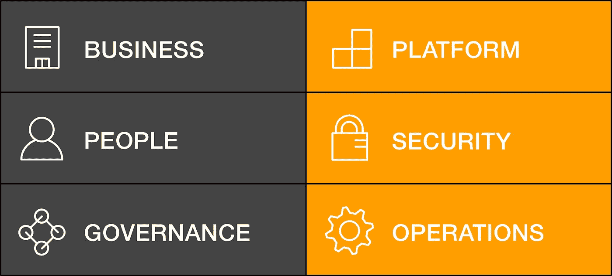

AWS CAF Perspectives

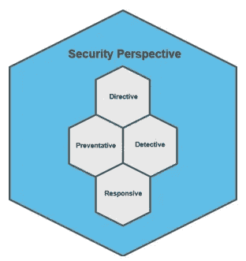

CAF Security Perspective

安全视角的组成部分包括:

**指令控制**建立环境运行的治理、风险和合规模型。

**预防性控制**保护您的工作负载，减少威胁和漏洞。

**Detective controls** 在 AWS 中为您的部署操作提供全面的可见性和透明度。

**响应控制**推动对安全基线潜在偏差的补救。

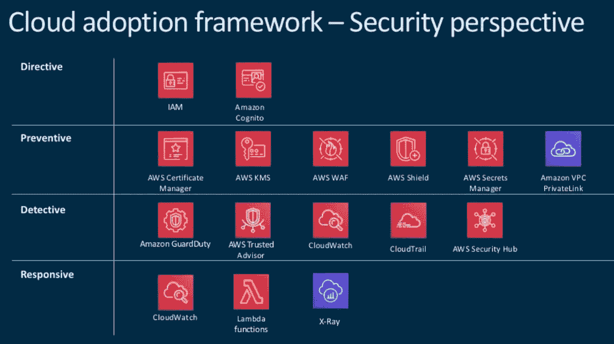

AWS CAF Security Perspective Tools

设计和实现不同功能如何协同工作的过程代表了一个快速熟悉和学习如何迭代您的设计以最好地满足您的需求的机会。尽早从实际的实现中学习，然后在学习的过程中通过小的改变来适应和发展。为了帮助您实现，您可以使用 CAF 安全 Epics。安全史诗由多组用户故事(用例及滥用案例)组成，您可以在 sprints 期间进行工作。

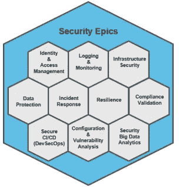

AWS Security Epics

核心 5 史诗是您应该尽早考虑的核心控制和功能类别，因为它们是开始您的云采用之旅的基础。

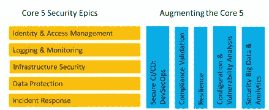

AWS 10 Security Epics

增强核心五大史诗代表了通过可用性、自动化和审计推动持续卓越运营的主题。你需要明智地将这些史诗整合到每个 sprint 中。

定义此结构后，就可以制定实施计划了。能力会随着时间的推移而变化，并且会不断发现改进的机会。多次冲刺将提高成熟度，同时保持适应业务节奏和需求的灵活性。

短跑系列的一个例子是 6 次两周短跑:

Sprint 0 —安全制图:合规制图、策略制图、初始威胁模型审查、建立风险注册表；建立使用和滥用案例的积压；规划安全史诗

冲刺 1—IAM；记录和监控

冲刺 2—IAM；记录和监测；基础设施保护

冲刺 3—IAM；记录和监测；基础设施保护

冲刺 4—IAM；记录和监测；基础设施保护；数据保护

Spring 5 —数据保护、自动化安全操作、事件响应规划/工具；弹性

Sprint 6 —自动化安全运营、事件响应；弹性

总体方法旨在定义 MVP 或基线。然后在每个区域绘制第一个冲刺图。在初始阶段，最终目标可能不太明确，但是会创建一个清晰的初始冲刺路线图。一个关键的元素是通过安全和法规遵从性单元测试用例将法规遵从性验证合并到每个 sprint 中，然后进行生产过程的提升。这种方法可能比基于长时间和高资本支出的大爆炸方法更有效，具有更高的成本效益。

AWS 架构良好的框架，涵盖了关键概念、云中架构的设计原则和五大支柱。AWS 架构良好的框架有助于您理解在 AWS 上构建系统时所做决策的利弊。通过使用该框架，您将了解在云中设计和运行可靠、安全、高效且经济实惠的系统的架构最佳实践。它为您提供了一种根据最佳实践一致地度量您的体系结构并确定需要改进的领域的方法。

AWS 架构良好的框架的支柱是:

**卓越运营**

运行和监控系统以交付业务价值并持续改进支持流程和程序的能力。

**安全**

保护信息、系统和资产的能力，同时通过风险评估和缓解策略提供业务价值

**可靠性**

系统从基础设施或服务中断中恢复、动态获取计算资源以满足需求，以及缓解错误配置或短暂网络问题等中断的能力。

**性能效率**

高效使用计算资源以满足系统需求，并随着需求变化和技术发展保持这种效率的能力

**成本优化**

运行系统以最低价格交付商业价值的能力。

云中的安全性由五个方面组成:

1.**身份和访问管理**是信息安全计划的关键部分，确保只有经过授权和认证的用户才能访问您的资源，并且只能以您希望的方式访问。

2.**检测控制**识别潜在的安全威胁或事件。它们是治理框架的重要组成部分，可用于支持质量流程、法律或合规义务，以及威胁识别和响应工作。

3.**基础设施保护**包括控制方法，例如深度防御，这是满足最佳实践和组织或监管义务所必需的。无论是在云中还是在本地，使用这些方法对于成功的持续运营都至关重要。基础设施保护是信息安全计划的关键部分。它确保您的工作负载中的系统和服务受到保护，免受意外和未经授权的访问以及潜在的漏洞。

4.**数据保护**在设计任何系统之前，应该准备好影响安全性的基本实践。例如，数据分类提供了一种基于敏感级别对组织数据进行分类的方法，而加密则通过使未经授权的访问无法理解数据来保护数据。这些方法非常重要，因为它们支持防止财务损失或遵守法规义务等目标。

5.**事件响应**即使有非常成熟的预防和检测控制，您的组织仍应建立流程来响应和减轻安全事件的潜在影响。您的工作负载体系结构会严重影响您的团队在事故期间有效运行、隔离或控制系统以及将运行恢复到已知良好状态的能力。在安全事故发生前准备好工具和访问，然后在比赛期间定期练习事故响应，这将有助于确保您的架构能够适应及时的调查和恢复。

让我们看看我们应该如何处理集装箱安全问题。这是一种深度防御的多层方法。

Container Defense in Depth

1.从最有价值的第一层开始，即*用户数据*。它们是核心业务数据，任何种类的 PII 信息，比如欧洲的 GDPR。 [**亚马逊 Macie**](https://aws.amazon.com/macie/) 是一项安全服务，它使用机器学习来自动发现、分类和保护 AWS 中的敏感数据。

2.下一层是围绕*配置数据*。尤其是在密码、API 密钥等敏感配置数据方面。比如推送明文密码。Aws [git-secrets](https://github.com/awslabs/git-secrets) 阻止您将机密和凭证提交到 git 存储库中

3.*代码*是下一层。净化用户输入、静态代码分析等等。 [Cfn-nag](https://aws.amazon.com/blogs/mt/git-pre-commit-validation-of-aws-cloudformation-templates-with-cfn-lint/) ，Cfn-lint，任务类别。

4.*依赖关系*是下一层。比如拉很多依赖项、库、包、框架和运行时。这些依赖项的安全分析和漏洞检查。AWS 与[集成 Synk](https://snyk.io/) 是一个开源依赖检查软件组合分析工具，它识别项目依赖并检查是否有任何已知的、公开披露的漏洞

5.下一层是*集装箱层*。它们包含运行时层、运行时和映像的标准。(OCI 标准)容器映像的主要思想是它们是不可变的，并且它们共享相同的内核。AWS 与 [aquasec](https://www.aquasec.com/) 和 [qualys](https://www.qualys.com/) 集成。

6.最后也是重要的一点，容器需要在主机*上运行。它们是全面分发还是容器优化分发，多租户要求是什么。*

让我们看看 AWS 的工具箱中有什么，如果我们正确使用它，我们将安全地构建和运行这些容器化的微服务或应用程序。

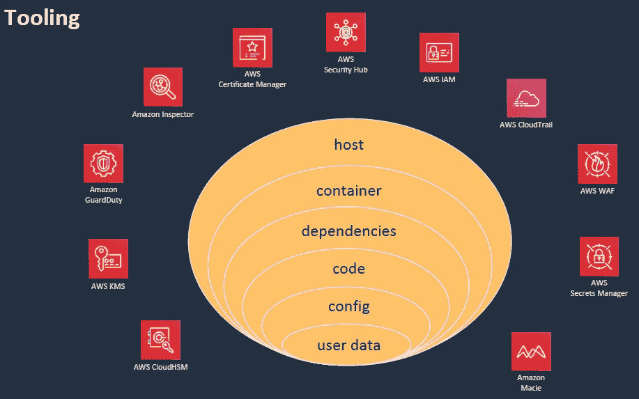

AWS Security Tooling

让我们不要忘记，这是一种分担责任的模式。安全性和合规性是 AWS 和客户的共同责任。这种共享模式有助于减轻客户的运营负担，因为 AWS 可以运营、管理和控制从主机操作系统和虚拟化层到服务运营设施的物理安全的组件。客户负责管理客户操作系统(包括更新和安全补丁)、其他相关应用软件以及 AWS 提供的安全组防火墙的配置。客户应仔细考虑他们选择的服务，因为他们的责任因所使用的服务而异。将这些服务集成到他们的 IT 环境中，以及适用的法律和法规。这种共享责任的性质还提供了允许部署的灵活性和客户控制。

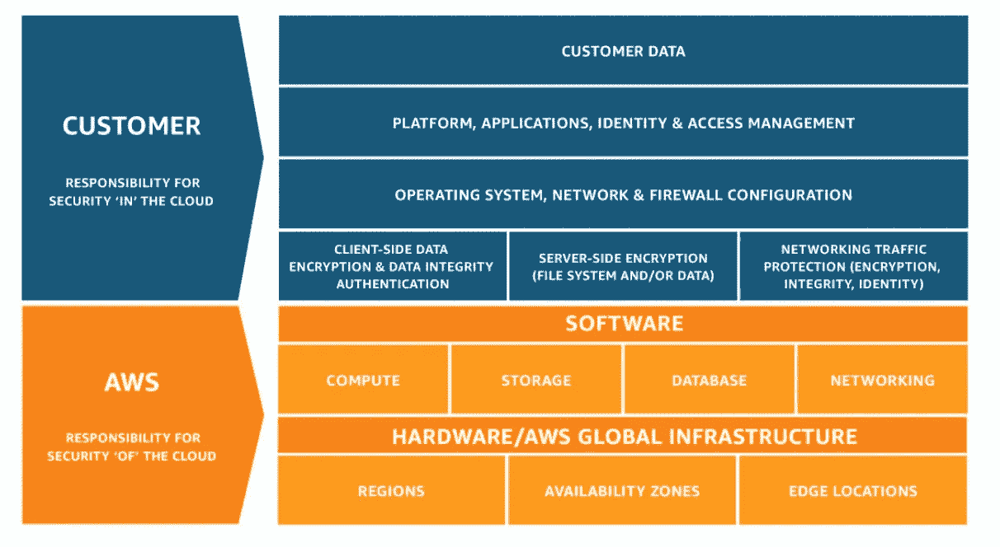

AWS Shared Responsibility Model

有两部分。*AWS 负责的云安全*。此外，作为云的用户，我们必须采取一些安全措施，这也被称为云中的*安全性*。云之外的安全性意味着计算、存储、数据库、网络等基础服务。

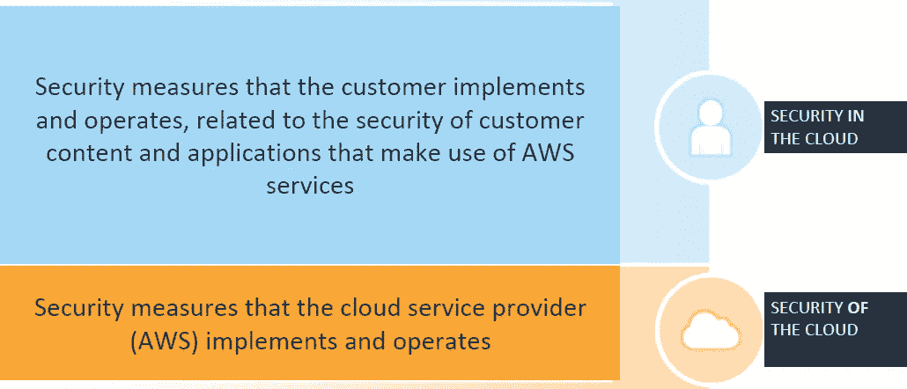

Overall Cloud Security

一个例子是云外的安全性，指的是计算、存储、数据库和网络等基础服务。云中的安全示例意味着您要对您的客户数据负责，如深度防御图中所示，例如您在容器中运行应用程序时处理的核心业务数据。

让我们看看 AWS 上的托管容器服务产品。我们可以看到有 4 层:

**Image registry** 是一个类似于 Docker hub 的 ECR 容器映像存储库。

**计算引擎**在 ECS 中，容器在您管理的 EC2 实例或集群上运行于 Linux 和 Windows 操作系统。还有 AWS Fargate launch type，它是 Amazon ECS 的计算引擎，允许您运行容器，而不必管理服务器或集群。亚马逊 EKS 是一项托管服务，使您可以轻松地在 AWS 上运行 Kubernetes，而无需安装和操作您自己的 Kubernetes 集群。然而，目前 EKS 支持 Linux 工作负载；Windows 工作负载支持已公开发布。

**流程编排**是容器化应用的部署、调度、扩展和管理，这通常在亚马逊 ECS 和亚马逊 EKS 完成。

**更高级别的服务**此类别中的第一个是服务网格，它是微服务架构的基础架构层。它处理服务之间的通信问题，使通信更加可见(或“可观察”)和可管理。更具体地说，它可以处理诸如服务发现、路由&负载平衡、安全性(例如加密、TLS、认证、授权)之类的事情，并提供诸如重试和断路之类的错误处理。 **AWS App Mesh 是一个基于 [Envoy](https://www.envoyproxy.io/) 代理的服务网格**，可以轻松监控微服务。App Mesh 标准化了微服务的通信方式，为您提供端到端的可见性，并有助于确保应用的高可用性。App Mesh 为应用中的每个微服务提供一致的可见性和网络流量控制。App Mesh 支持对其组件使用服务发现命名的微服务应用。要使用 App Mesh，您必须有一个运行在 AWS Fargate、亚马逊 ECS、亚马逊 EKS、AWS 上的 Kubernetes 或亚马逊 EC2 上的现有应用程序。

基于现代[微服务的](https://microservices.io/patterns/microservices.html)应用通常运行在虚拟化或容器化的环境中，其中服务实例的数量及其位置会动态变化。因此，您必须为实现一种机制，使服务的客户端能够向一组动态变化的短暂服务实例发出请求。

服务发现是通过网络自动检测设备和提供的服务。许多基于微服务的现代应用程序是使用各种类型的云资源构建的，并部署在动态变化的基础架构上。 **AWS 云图**是云资源发现服务。云地图允许您使用自定义名称来命名应用程序资源，并且它会自动更新这些动态变化的资源的位置。这提高了应用程序的可用性，因为应用程序总是发现其资源的最新位置。您可以将 *AWS 云地图服务注册表选择器与 AWS App Mesh* 配合使用。这个新选项允许您定义在云地图中定义的端点的子集(通过匹配键和值选择器)。您只需更改应用网格虚拟节点配置以使用云地图，为您希望虚拟节点表示的服务端点子集添加选择器，并使用相应的云地图服务名称、命名空间、键和值元数据注册您正在运行的服务(IP 地址和元数据)。当将流量路由到该虚拟节点时，App Mesh 将路由到与您配置的 CloudMap 键和值选择器相匹配的端点。

AWS 构建现代应用程序的最佳实践是:

通过组织成小型开发团队来创造创新文化

通过自动化安全来持续评估您的安全状况

使用微服务将应用组件化

通过自动化 CI/CD 快速更新应用程序和基础架构

通过将基础架构建模为代码来标准化和自动化运营

利用无服务器技术简化基础架构管理

通过提高可观察性来提高应用程序性能

让我们仔细看看某些主题。我们现在不会深入探讨，但会触及这些主题的表面。

**AWS IAM vs RBAC Kubernetes**

对于 ECS:完全由 AWS IAM 管理

对于 EKS:你需要了解和配置 AWS IAM 和 Kubernetes RBAC

基于角色的访问控制本质上定义了哪个用户或服务帐户可以执行什么操作以及承担什么样的风险。尽管有许多可用的工具，但是创建角色和角色绑定的方法需要一个学习过程。

**AWS 安全组与 Kubernetes 网络策略**

对于 ECS:您需要了解和配置 AWS VPC 和安全组。

对于 EKS:您需要了解和配置 AWS VPCs/安全组和 Kubernetes 网络策略

网络策略可以通过第三方提供，比如实施和强制执行这些策略的庇护或 calico。

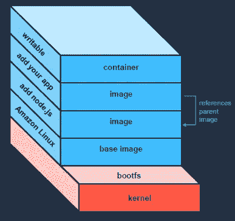

Container Layers

**容器映像的安全最佳实践**

少即是多(安全)

图像中没有秘密

每个集装箱一项服务

在任务/单元中使用边车

最小化集装箱占地面积

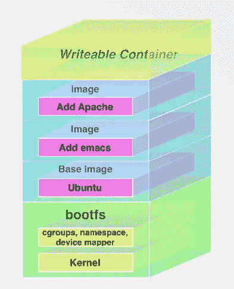

Container Layers

仅包含运行时需要的内容

使用已知和可信的基础映像

来自 Docker Hub 的标准化或官方版本

扫描图像中的 CVE

在 Dockerfile 中指定用户(否则是根用户)

分配独特的信息图像标签

码头工人 RBAC

让我们继续讨论如何处理容器图像。容器映像本质上是实际应用程序如何打包并通过容器注册中心分发到实际的运行时环境。容器图像包含组成容器的 DNA。如果该 DNA 被污染，它会影响从同一图像创建的所有容器。对于您自己创建的 Docker 映像来说确实如此，但是当您使用来自公共存储库的开源映像时，问题会更加严重。一般来说，越少越安全，也就是说，尽量少放入图像。通常，您可以使用一个通用的 Docker 容器映像来启动项目，比如编写一个带有 FROM 节点的 Docker 文件，作为您的“默认”。然而，在指定节点映像时，您应该考虑到完全安装的 Debian Stretch 发行版是用于构建它的底层映像。如果您的项目不需要任何通用系统库或系统实用程序，那么最好避免使用成熟的操作系统(OS)作为基础映像。例如，如果你需要排除故障，而你又没有基本的东西，这就需要有所取舍。例如二进制文件，您可以使用它们来调试正在发生的事情。例如，当您使用一个通用的、普遍下载的节点映像(如 docker pull node)时，您实际上是在您的应用程序中引入了一个已知在其系统库中有 580 个漏洞的操作系统。

为了保持容器图像的可重用性和安全性，请保持它们没有敏感信息。在映像容器中存储诸如令牌、密码和 API 密钥之类的秘密可能会授权未经授权的人员进行访问。将这些数据存储在您的应用程序代码中可能会导致秘密被推送到 Git 存储库并暴露给公众。

尝试遵循每个容器放一个服务的模式。例如，如果您有需要一起运行的依赖项，您可能有一个容器负责从 s3 存储桶中提取一些数据，然后您有另一个容器像 web 服务器一样处理这些数据。例如，读取数据并对其进行处理的应用服务器。

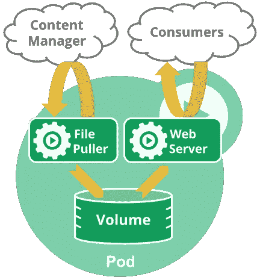

Container Sidecar

在图中(从 [Kubernetes docs)](https://kubernetes.io/docs/concepts/workloads/pods/pod-overview/) ，一个容器是保存在共享卷中的文件的 web 服务器。边车容器从远程源更新文件。这两个进程紧密耦合，共享网络和存储，因此适合放在一个单元中。

边车容器扩展并与主容器一起工作。这种模式最适合在有清晰的

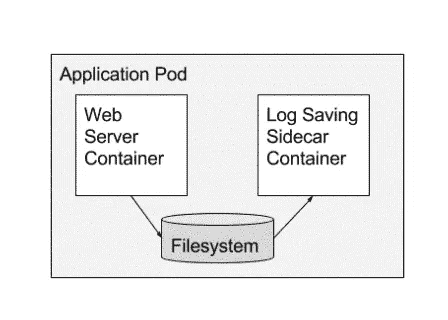

Sidecar Container

主要容器和需要为其完成的任何次要任务之间的区别。例如，需要将其日志解析并转发到日志存储(次要任务)的 web 服务器容器(主要应用程序)可以使用负责日志转发的 sidecar 容器。这个 sidecar 容器也可以用在堆栈中的其他地方，为其他 web 服务器甚至其他应用程序转发日志。

Docker 需要 root 权限，任何能够访问 Docker 主机和 Docker 守护进程的人都会自动获得对所有相关 Docker 容器和映像的完全控制。具有 root 权限的攻击者可以创建和停止容器、删除或提取图像、向正在运行的容器中注入命令以及暴露敏感信息。Docker RBAC 提供用户、团队、组织和服务帐户等角色的访问控制，这种设置没有考虑到复杂性。在 DevOps 组织中，开发人员、测试人员和 IT 人员需要在开发管道的不同点访问相同的容器。一些用户需要受限访问，而另一些用户需要修改和管理容器的能力。设置这种类型的可变访问可能很复杂。Docker 访问管理解决方案支持精细的 RBAC 管理，有助于减少 docker 安全问题。像 Active Directory 这样的授权访问管理解决方案允许您以最小的权限操作容器，并管理跨团队和开发生命周期阶段的访问。

尽量减少容器的占用空间，只包含运行时需要的内容。这对于多阶段构建来说更容易。如果可以，只使用已知和可信的基础映像。例如，您可以制定一个策略，只使用 docker hub 中的官方容器映像。确保您的基本映像设置正确，并定期修补。您可以为每种语言(如 Java、Python 和 NodeJs)创建一个基础映像。因此，每种语言可能有三个维护的基本映像。Docker 图像的真实性是一个挑战。我们非常信任这些图像，因为我们实际上是将它们用作在生产中运行代码的容器。因此，确保我们提取的图像是由发布者推送的图像，并且没有任何一方修改过它是至关重要的。篡改可能发生在 Docker 客户端和注册表之间的线路上，或者通过损害所有者帐户的注册表以将恶意图像推送到。签名并验证图像以减轻 MITM 攻击。Docker 允许签署图像，并由此提供了另一层保护。要签署图像，请使用 [Docker 公证人](https://docs.docker.com/notary/getting_started/)。公证人为您验证图像签名，如果图像签名无效，就会阻止您运行图像。

此外，确保扫描这些图像。扫描这些图像看有没有静脉曲张。像 Synk 这样的工具可以帮助您监控、管理和分析容器基础设施的各个方面。通过在交付生命周期中扫描漏洞，您可以防止部署受污染的容器。实现完整的生命周期管理确保容器在开发和部署的所有阶段都保持安全。

不幸的是，许多 docker 文件没有定义用户，这意味着容器在运行时不必要地运行在 root 上。当 Dockerfile 没有指定用户时，它默认使用根用户执行容器。实际上，很少有理由让容器拥有 root 权限。Docker 默认使用 root 用户运行容器。当该名称空间被映射到正在运行的容器中的 root 用户时，这意味着该容器可能拥有 Docker 主机上的 root 访问权限。让容器上的应用程序以根用户身份运行会进一步扩大攻击面，如果应用程序本身容易被利用，还会使权限提升变得容易。为了最大限度地减少曝光，选择加入为应用程序在 Docker 映像中创建专用用户和专用组；使用 docker 文件中的用户指令来确保容器以尽可能低的特权访问来运行应用程序。特定用户可能不存在于映像中；使用 docker 文件中的说明创建该用户。

请确保您分配整洁和信息丰富的图像标签。每个 Docker 图像可以有多个标签，这些标签是相同图像的变体。最常见的标签是 *latest* ，代表图片的最新版本。图像标签不是不可变的，图像的作者可以多次发布相同的标签。

这意味着您的 Docker 文件的基本映像可能会在不同的版本之间发生变化。由于对基础映像进行了更改，这可能会导致不一致的行为。
有多种方法可以缓解这个问题:

*   首选最具体的可用标签。如果图像有多个标签，如:8 和 *:8.0.1* 甚至*:8 . 0 . 1-阿尔卑斯山*，最好选择后者，因为它是最具体的图像参考。避免使用最普通的标签，如 latest。请记住，锁定特定标签时，它最终可能会被删除。
*   为了减轻特定图像标签变得不可用并成为依赖它的团队的绊脚石的问题，请考虑在您自己控制的注册表或帐户中运行此图像的本地镜像。考虑这种方法所需的维护开销很重要，因为这意味着您需要维护一个注册中心。在您拥有的注册表中复制您想要使用的映像是一种良好的做法，可以确保您使用的映像不会改变。
*   具体点！不要拉标签，而是使用 Docker 图像的特定 SHA256 引用来拉图像，这保证每次拉都获得相同的图像。但是请注意，使用 SHA256 引用可能有风险，如果映像发生变化，该散列可能不再存在。

你可以有一个双重策略，例如你可以使用基于 github 的模型，你可以使用 git commit hash 作为默认标签。然后，您计划推广到生产环境的重要主要版本可以手动标记为 v0.1 之类的版本。

让我们继续讨论运行时容器安全性。可以使用 aws cloudwatch、aws x-ray 或 Scout、Datadog 和 Prometheus 等工具对集装箱进行监控。监控系统可以帮助您识别攻击、发送警报，甚至自动实施修复。定期检查由容器生成的日志数据，并使用它来生成预防性安全洞察。通过 Aqua Security &Twistlock 等合作伙伴产品，您可以防范 CVE 数据库中还没有的零日漏洞。运行时容器安全性的要点是

通过规则引擎限制容器中可以执行的内容

确保只有受信任的映像可以在您的群集中部署/运行

了解整个环境的运行时行为

一旦 CVE 公开，就检测易受攻击的运行容器

此外，还有一些高级策略和审计。这可能有不同的动机，如法规遵从性原因、监管要求以及金融、医疗保健等行业。因此，你只需遵循一定的规则。业务工作流可能需要您实施这些高级策略。热安全策略基本上允许在集群中的所有单元中实施安全上下文。例如，不允许某人运行使用 root 的 pod，或者您可以应用某些强制访问控制策略等等。此外，还有一类通用预付保单，这里最好的例子是 OPA。开放策略代理(OPA)是一个通用策略引擎，用途从授权和准入控制到数据过滤。您可以在 AWS 博客[上阅读将 OPA 部署到用于 Kubernetes (EKS)集群的 Amazon Elastic Container Service 中，并执行检查以仅允许来自您自己的 Amazon Elastic Container Registry(ECR)或 EKS ECR 存储库的图像。](https://aws.amazon.com/blogs/opensource/using-open-policy-agent-on-amazon-eks/)然后是所谓的软件供应链政策和政策执行控制。两个例子是[toto](https://in-toto.github.io/in-toto.html)和 Grafeas。然而，软件供应链政策仍处于早期阶段。

CIS Docker 基准，为建立 Docker 引擎(社区版 18.09 和 Docker Enterprise 2.1)的安全配置状态提供说明性指导

**主机配置**

*   为容器创建单独的分区
*   强化容器主机
*   定期更新你的 Docker 软件
*   明智地管理 Docker 守护程序访问授权
*   配置您的 Docker 文件目录，并审计所有 Docker 守护进程活动。

**Docker 守护程序配置**

*   **限制默认网桥容器之间的网络流量**以及对来自容器的新权限的访问。
*   **启用用户命名空间支持**以提供额外的 Docker 客户端命令授权、实时恢复和默认 cgroup 使用
*   **禁用传统注册表**操作和用户域代理
*   **通过允许 Docker 对 iptables 进行更改来避免网络错误配置**，并在生产过程中避免实验性功能。
*   **为 Docker 守护进程以及集中式和远程日志记录配置 TLS 认证**。
*   **将记录级别设置为“信息”**，并设置适当的默认 ulimit
*   **不要使用不安全的注册表**和 aufs 存储驱动
*   **应用容器的基本设备大小**和一个守护进程范围的自定义 SECCOMP 配置文件来限制调用。

**容器图像和构建文件**

*   为容器创建一个用户
*   确保容器仅使用可信图像
*   确保容器中没有安装不必要的包
*   在扫描和重建过程中包括安全补丁
*   为 Docker 启用内容信任
*   向容器映像添加运行状况检查说明
*   从映像中删除 setuid 和 setgid 权限
*   在 Dockerfile 中使用 COPY is 代替 ADD
*   仅安装经过验证的软件包
*   不要在 docker 文件中使用单行或单独的更新指令
*   不要在 docker 文件中存储秘密

**容器运行时**

*   **限制容器**获得额外的特权，并限制 Linux 内核的能力。
*   启用 AppArmor 配置文件。
*   **运行时避免使用特权容器**，在容器内运行 ssh，映射容器内的特权端口。
*   确保敏感的主机系统目录没有安装在容器上，容器的根文件系统以只读方式安装，Docker 套接字没有安装在任何容器内。
*   **为容器设置适当的 CPU 优先级**，将“失败时”容器重启策略设置为“5”，并且仅打开容器上必要的端口。
*   **根据需要应用 SELinux 安全**选项，并在运行时覆盖默认的 ulimit。
*   **不要共享主机的网络命名空间**和主机的进程命名空间，主机的 IPC 命名空间，挂载传播模式，主机的 UTS 命名空间，主机的用户命名空间。
*   **限制容器的内存使用量**并将传入的容器流量绑定到特定的主机接口。
*   **不要将主机设备**直接暴露给容器，不要禁用默认的 SECCOMP 配置文件，不要使用带有特权和用户选项的 docker exec 命令，不要使用 docker 的默认网桥 docker0。
*   **确认 cgroup 使用**并使用 PIDs cgroup 限制，在运行时检查容器健康状况，并始终使用最新版本的映像更新 docker 命令。

**码头工人安全操作**

确保避免映像蔓延

确保避免集装箱蔓延