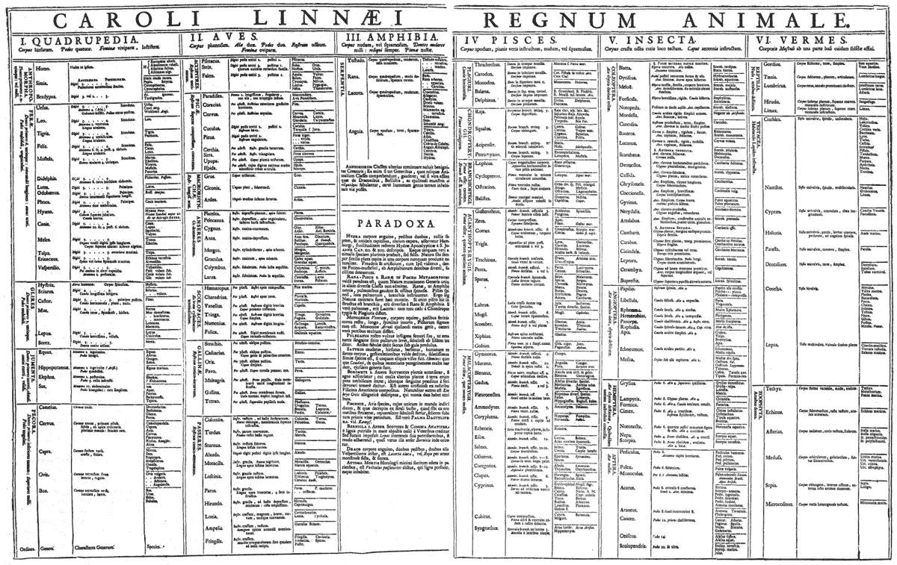
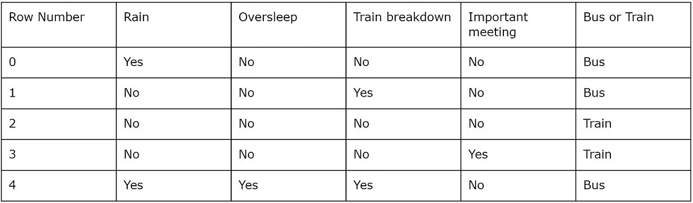
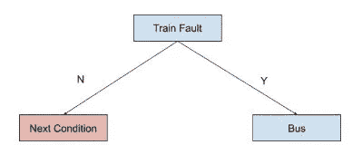
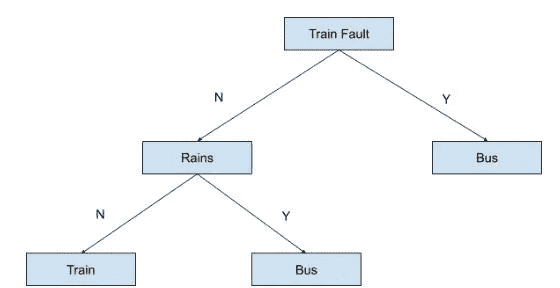
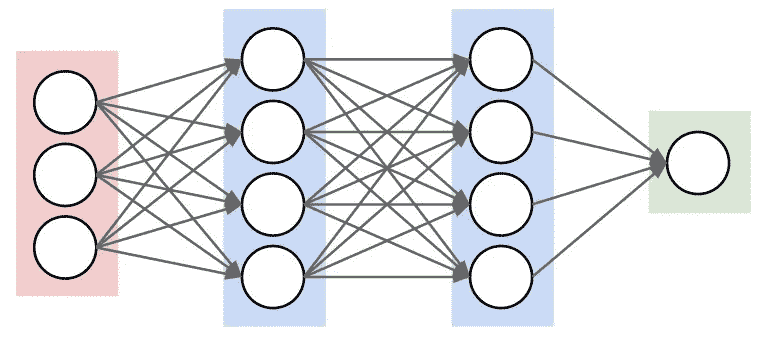

# 监督学习:机器学习技术的当代分类(上)

> 原文：<https://medium.datadriveninvestor.com/contemporary-classification-of-machine-learning-techniques-part-1-16e77eaa993e?source=collection_archive---------1----------------------->

在题为“学习机器学习”系列的第二篇文章中，我们将把机器学习技术分成不同的类型/类别。 *这篇文章的目标是为你提供一个简单的框架，帮助你理解你遇到的机器学习技术。*

Table of the Animal Kingdom (Regnum Animale) from Carolus Linnaeus’s first edition (1735) of *Systema Naturae*

随着机器学习领域呈指数级增长，新从业者经常会对大量的机器学习技术感到不知所措和困惑。本文旨在通过将机器学习技术视为以下三种类型之一来简化您的学习过程:监督学习、非监督学习和强化学习。这种机器学习算法的简单分类为你提供了一个简单的框架，帮助你在遇到新算法时组织自己的思维过程。希望随着我们深入技术细节，这将被证明是有用的。

 [## DDI 编辑推荐:5 本机器学习书籍，让你从新手变成数据驱动专家…

### 机器学习行业的蓬勃发展重新引起了人们对人工智能的兴趣

www.datadriveninvestor.com](https://www.datadriveninvestor.com/2019/03/03/editors-pick-5-machine-learning-books/) 

# 机器学习算法的当代分类

如上所述，今天的机器学习算法可以分为三类，监督学习，非监督学习和强化学习。选择这种分离是因为这些算法学习机器学习模型的方式。特别是:

*   监督学习:通过实例学习模型
*   无监督学习:从数据中学习模型
*   强化学习:通过经验学习模型

# 监督学习:通过例子学习

让我们用一个真实的例子来解释监督学习。每天早上，当我们匆忙开始我们的生活时，我们大多数人都不得不纠结于这个问题:“我今天应该怎么去上班？”

假设我只有两种交通方式去上班，公共汽车或火车。我可能会考虑一系列可能影响我选择的因素。这些因素的例子可能是如果下雨，如果火车故障，如果我睡过头了，或者如果我有一个与我的老板的早会。这些因素通常被称为特征或输入变量(您可能还会听到统计学家将这些因素称为 x 变量)。

自然，这些因素的结果会影响我选择乘公共汽车还是乘火车。例如，如果不下雨，火车运行良好，我总是会选择坐火车。如果是火车故障，不考虑其他因素，我总是会选择坐公交车。请注意，乘坐公共汽车或火车的决策通常被称为输出变量、标签或 y 变量。

因此，我试图学习一个模型，当提供了某一天的输入变量(例如，没有下雨，火车运行良好，没有与老板见面，准时醒来)时，该模型可以预测我是坐公交车还是火车去上班。

为了以监督的方式学习这个模型(从例子中学习)，我们需要从一系列例子中训练这个模型。通过执行以下操作，可能会获得此示例列表。接下来的几天，我会记下各种输入变量(下雨、睡过头、火车故障、会见老板)，然后做出我是乘公交车还是乘火车上班的最终决定。因此，一个简单的五天日志将形成如下表格:

*Table 1: Training observations*

对于监督学习，我们将使用此表来训练模型。该表中的每一行都被称为观察值。用于训练模型的数据也称为训练数据。

模型完成后，每次获得一个新的观察结果，我们就能够预测我们应该乘公共汽车还是火车去上班。这种预测是通过将观察特征传递到模型中并让模型自动预测该观察的输出来获得的。我们将在稍后讨论监督学习中的基于树的模型和线性模型时对此进行说明。

# 基于树的模型与线性模型

当代的监督学习主要包括两种主要的机器学习算法。它们是基于树的方法(决策树、随机森林和 xgboosts)和线性模型(逻辑回归、神经网络)。

基于树的算法最简单的形式是决策树桩。它只包含一个决策条件，称为决策节点。这个节点在左侧和右侧都有分支。这个左右分支代表在节点上选择的条件(图 1)。基于树的方法通常更直观，它们的模型相对更容易解释，现在让我们试着创建一个简单的决策树。

在上面的例子中，您从表 1 的第 1 行和第 4 行中了解到，只要火车不运行，我们就会一直乘坐公共汽车。因此，可以构建一个顶部(根节点)如下所示的决策树。

*A decision stump and the root node of the decision tree*

我们接下来填充节点<next condition="">。这被描述为根节点的左侧分支。回到表 1，我们只考虑列车运行时的观察值，即第 0、2 和 3 行。从这三排你发现，只要下雨我都会坐公交。如果不下雨，我将乘火车。因此，树的下一次迭代应该是这样的。</next>

*Figure 2: Final decision tree*

在这一点上，我们注意到这个树考虑了我们训练数据集中的每一个观察。因此，我们可以停止向树中添加任何更多的节点/分支，并认为这是最终的决策树。我们将在下一篇文章中更详细地描述基于树的方法。

我们接下来看看基于线性的模型，特别是神经网络。请注意，尽管神经网络和逻辑回归等模型是非线性函数，但来自 [fast.ai](https://www.fast.ai/) 的杰瑞米·霍华德将它们称为线性模型，因为模型是由其特征的线性组合指定的。

现在，您可以将神经网络视为一种组织输入变量(红色层)以获得输出变量(绿色层)的技术。在数学上，这是通过由非线性激活函数(例如 RELU 或 softmax)封装的一系列线性函数来实现的。为了在输入层和输出层之间创建更具代表性的关系，我们在输入层和输出层之间插入了附加层。这些附加层被称为隐藏层，从图片上看，它们看起来很像这样:

*Figure 3: Pictorial representation of a neural network. Source:* [*http://cs231n.github.io/neural-networks-1/*](http://cs231n.github.io/neural-networks-1/)

如果在输入和输出层之间有一(1)个以上的隐藏层，则神经网络被认为是“深度”的。事实上，深度学习只是指在输入和输出变量之间有多个隐藏层的神经网络。

# 回归和分类

我们上面介绍的例子是监督分类的一个例子。在监督分类中，我们的目标是从标记的数据集创建一个模型来预测一个新的观察值是否属于某个类别。在上面的例子中，我们的目标是创建一个模型来预测新的观察值，如果输出变量的预测标签属于类 Bus 或 Train。

这与被称为回归的监督学习的另一种情况形成对比。当你进行回归分析时，你试图为观察预测一个连续变量。回到上面的例子，回归预测输出的一个例子是我上班要花多少钱。

总之，当您进行分类时，您会尝试预测输出变量的类别。当您进行回归时，您试图预测输出变量的连续数。

# 摘要

有三类机器学习算法

*   监督学习:通过实例学习模型
*   无监督学习:通过数据学习模型
*   强化学习:通过经验学习模型

对于监督学习，有两种类型的机器学习算法，基于树的模型和线性模型。对于这两种模型，我们可以进行两种类型的分析:分类和回归。

当您进行分类分析时，您试图预测输出变量的类别。当您进行回归分析时，您试图预测输出变量的连续数。

深度学习只是指在输入和输出变量之间有多个隐藏层的神经网络。

在本系列的下一篇文章中，我们将继续讨论机器学习的其他两种形式，无监督学习和强化学习。敬请期待！

相关的系列视频短片可以在 youtube [这里](https://www.youtube.com/playlist?list=PLsXcLJfwDnPqf8H5ttvXI8lKSMHJKWLfz)找到。

*希望你能从这篇文章中学到一些东西。如果你喜欢这篇文章，请鼓掌。*

*作者是新加坡理工学院的助理教授。他拥有帝国理工学院的计算机科学博士学位。他还在新加坡麻省理工学院联盟(SMA)项目下获得了新加坡国立大学计算机科学硕士学位。*

*本文中的观点仅代表作者的观点，并不代表作者所属任何组织的官方政策或立场。作者也没有从属关系，也没有从本文提到的任何产品、课程或书籍中赚取任何费用。*