# 无监督学习:机器学习技术的当代分类(下)

> 原文：<https://medium.datadriveninvestor.com/contemporary-classification-of-machine-learning-techniques-part-2-4a9b0dc8039c?source=collection_archive---------3----------------------->

在题为“学习机器学习”系列的这一期中，我们将进入下一类机器学习技术:无监督学习。如果你想阅读我以前对监督学习的看法，你可以在这里找到**。**

**

*Characters exploring their universe without supervision*

# *机器学习算法的当代分类*

*如上所述，今天的机器学习算法可以分为三类，监督学习，非监督学习和强化学习。选择这种分离是因为这些算法学习机器学习模型的方式。特别是:*

*   *监督学习:通过实例学习模型*
*   *无监督学习:从数据中学习模型*
*   *强化学习:通过经验学习模型*

* [## DDI 编辑推荐:5 本机器学习书籍，让你从新手变成数据驱动专家…

### 机器学习行业的蓬勃发展重新引起了人们对人工智能的兴趣

www.datadriveninvestor.com](https://www.datadriveninvestor.com/2019/03/03/editors-pick-5-machine-learning-books/) 

# 无监督学习:从数据中学习

与训练数据总是被标记的监督学习相反，在非监督学习方法中使用的数据没有分类标签。

因此，在无监督学习过程中发生的是:大量的训练数据被传递到学习算法中。无监督算法自动从大量数据中提取最能代表/概括数据的特征。

因此，在无监督学习过程中发生的是:大量的训练数据被传递到学习算法中。无监督算法自动从大量数据中提取最能代表/概括数据的特征。

这种无人监督的学习者可以被细分成不同的组。在这一点上，我会参考 [Ruslan Salakhutdinov 的](https://www.cs.cmu.edu/~rsalakhu/) (CMU)将无监督学习者分为两组，非概率性和概率性:

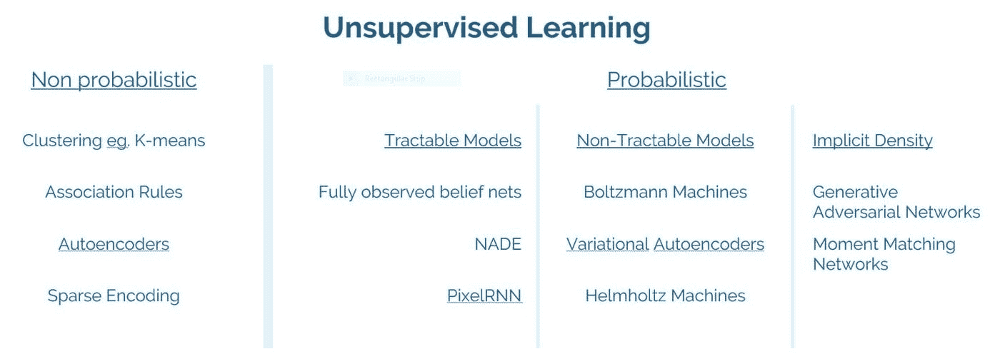

*Figure 1: Unsupervised learners. Source:* [*https://www.youtube.com/watch?v=rK6bchqeaN8*](https://www.youtube.com/watch?v=rK6bchqeaN8)

本文的讨论将仅限于经典的无监督方法，如聚类和自动编码器。概率学习者已经超出了本文的范围，希望我们下次再讨论他们。

# 使聚集

聚类是一种自动在数据集中找到相似对象组的技术。然而，这种“相似性”的定义因情况而异。在某些情况下，数据点的接近度可能决定最佳聚类，而在其他情况下，可能是数据点的密度。来自 sklearn 的图片很好地说明了这一点。

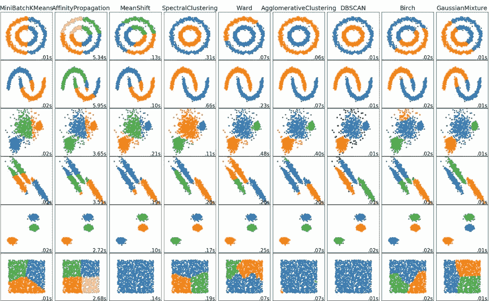

*Figure 2: Comparison of different clustering algorithms Source:* [*sklearn*](https://scikit-learn.org/stable/modules/clustering.html)

以图 2 中的第一行为例，假设您有如下所示的数据:

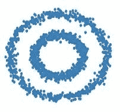

*Figure 3: Original data that is unclustered*

参见图 3，您可能希望算法给出两个集群，最好一个集群来自内圈，另一个来自外圈。如果我们回头参考图 2 的第一行，您会发现那里陈述的大多数算法都不会为您提供这样的聚类。事实上，只有三种方法可以，它们是谱聚类、凝聚聚类和 DBScan。

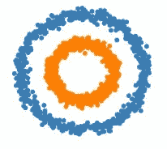

*Figure 4: Correct clustering, identifying both an inner circle and an outer circle.*

请注意，大多数其他算法会将两个圆分开放在中间。这是因为这些算法主要基于点之间的距离来计算聚类。因此，这些算法将计算这些聚类的中心(质心),将数据平均分成右半圆和左半圆。

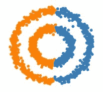

*Figure 5: Incorrect clustering with centroids equally splitting the data on the left and right.*

现在让我们以第一篇文章中的例子为基础。在那篇文章中，我们使用了一个构建决策树的例子，该决策树基于特定的条件，例如是否下雨，或者火车是否发生故障。为了便于参考，表 1 中复制了来自该实例的数据。

*Table 1: Training observations*

如果我们要绘制观察表的地面实况(仅使用三个特征:下雨、列车故障和睡过头)，我们最终会得到这张 3D 地图:

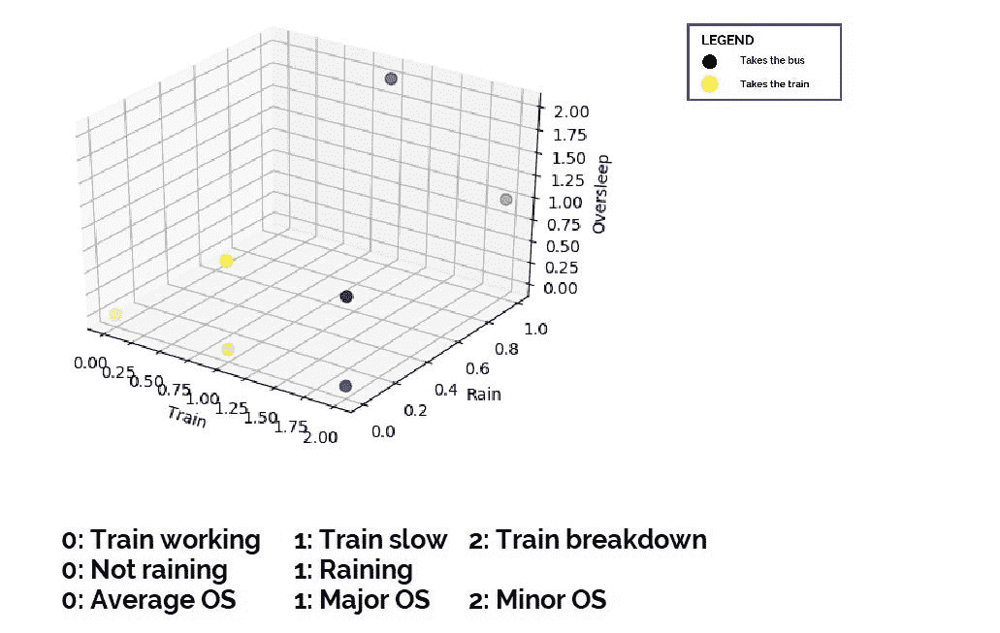

*Figure 6: Ground truth of Table 1 projected on a 3D map.*

现在我们将这些结果与无监督学习的结果进行比较。如无监督学习所述，我们的观察值没有标签。我们首先复制相同的观察表，但是在从表中移除标签之后。

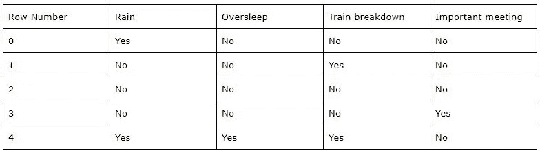

*Table 2: Training observations without classification labels*

如果我们运行聚类算法，如表 2 中的 k-means，我们最终会在同一个 3D 地图中得到如下所示的聚类:

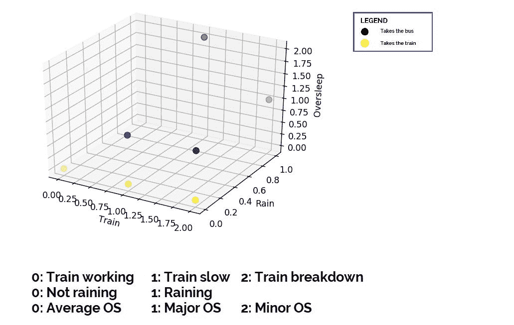

*Figure 7: k-means clustering*

顺便提一下，当我们比较 k-means 给出的数据的聚类时，我们可以得到 0.75 的“分类精度”。不严格地说，这意味着我们能够使用 k-means 来确定正确确定数据是指公共汽车还是火车的数据的聚类。

如果我们使用另一种侧重于密度而不是距离的聚类算法，我们将能够在我们的示例中获得稍微好一点的“聚类准确度”。事实上，使用凝聚聚类给出了 0.875 的准确度。聚类图如下所示:

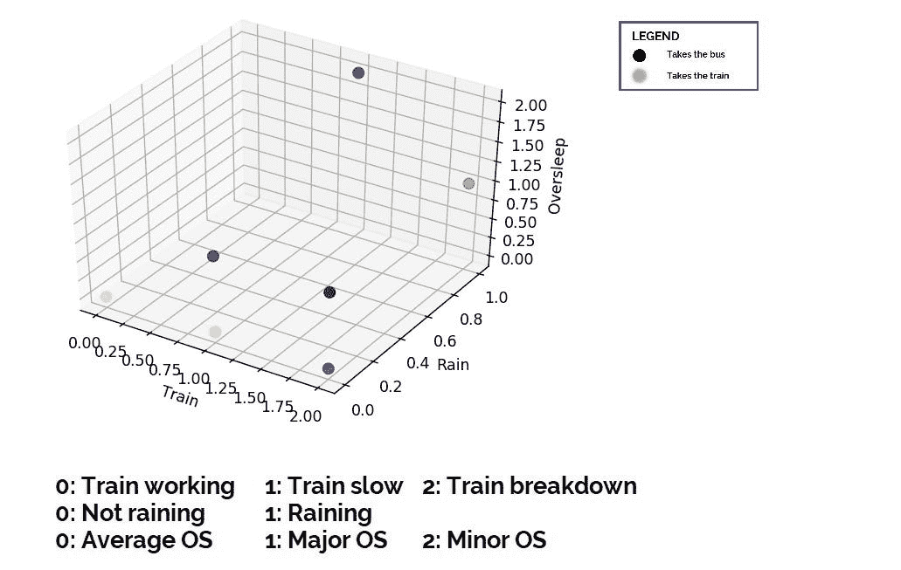

*Figure 8: Agglomerative clustering*

这个例子的最后一点。如果我们使用这种聚类的概念，并将其应用于我们在第 1 部分中学习的决策树，我们将得到如下所示的 2D 图:

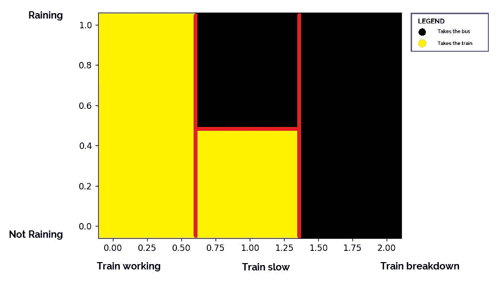

*Figure 9: 2D cluster map of a decision tree*

# 自动编码器

我们在这里讨论的另一类无监督学习算法是自动编码器。自动编码器用于特征提取，并且这些特征通过训练神经网络来学习，其中输入和输出完全相同。自动编码器的典型结构如图 10 所示。

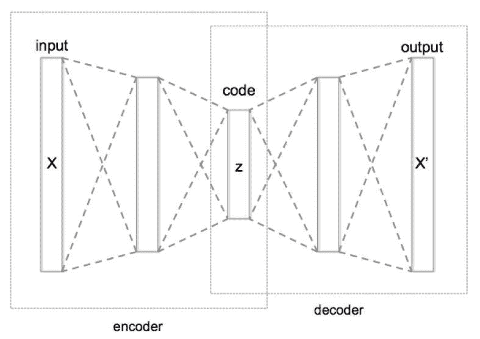

*Figure 10: Typical structure of an Autoencoder.* [*Source*](https://en.wikipedia.org/wiki/Autoencoder)

自动编码器通常由三个部分组成，编码器(在这里数据被编码为瓶颈特征)，解码器(在这里瓶颈代码特征被重构回数据和瓶颈代码特征)。因此，当我们馈送输入层数据 A 时，我们期望输出层返回给我们重构的数据 A ’,其中 A’尽可能接近 A。(你可以把优化损失函数想成|A` — A|)。

一个简单的解决方案是让神经网络直接将输入复制到输出，因此总是返回一个与 a 完全相同的重构 a’。但是，您会注意到瓶颈层包含的节点明显少于输入或输出层。这防止了琐碎情况的发生，并且因为瓶颈包含较少的节点，网络迫使瓶颈学习并总结 A 的关键特征以重构输出层 A`。

使用自动编码器的领域包括维度缩减、异常检测和噪声消除。当代的翻译技术使用自动编码器的变体，称为 seq-to-seq 自动编码器。另一种称为单词嵌入的自动编码器变体已经很容易在 NLP 应用中使用。

我目前正在准备 python 代码片段来说明这些例子，我随后关于自动编码器的文章将包含演示这些例子的工作演示。

在这个由三部分组成的系列的最后一篇文章中，我们将以强化学习的初级读本来结束我们对机器学习算法中的分类的讨论。

相关的系列视频短片可以在 youtube [这里](https://www.youtube.com/playlist?list=PLsXcLJfwDnPqf8H5ttvXI8lKSMHJKWLfz)找到。

*作者是新加坡理工学院的助理教授。他拥有帝国理工学院的计算机科学博士学位。他还在新加坡麻省理工学院联盟(SMA)项目下获得了新加坡国立大学计算机科学硕士学位。*

*本文观点仅代表作者个人，并不代表作者所属组织的官方政策或立场。作者也没有从属关系，也没有从本文提到的任何产品、课程或书籍中赚取任何费用。**