# 强化学习:机器学习技术的当代分类(三)

> 原文：<https://medium.datadriveninvestor.com/contemporary-classification-of-machine-learning-techniques-part-3-f7e3b9de0570?source=collection_archive---------1----------------------->

在题为“学习机器学习”系列的第三部分中，我们将讨论机器学习技术的最后一类:强化学习。如果你想阅读我对监督/非监督学习的看法，你可以在这里阅读**和***。***

# **机器学习算法的当代分类**

**如上所述，今天的机器学习算法可以分为三类，监督学习，非监督学习和强化学习。选择这种分离是因为这些算法学习机器学习模型的方式。特别是:**

** [## DDI 编辑推荐:5 本机器学习书籍，让你从新手变成数据驱动专家…

### 机器学习行业的蓬勃发展重新引起了人们对人工智能的兴趣

www.datadriveninvestor.com](https://www.datadriveninvestor.com/2019/03/03/editors-pick-5-machine-learning-books/) 

*   监督学习:通过实例学习模型
*   无监督学习:从数据中学习模型
*   强化学习:通过经验学习模型

# 强化学习:从经验中学习

在我们之前的讨论中，我们提到过监督学习通常由带标签的数据组成，而无监督学习则处理不带训练标签的数据。

你可以认为强化学习(RL)是不同的，因为你没有从任何数据开始。相反，你应该从理解你试图解决的问题开始。例如，如果您正在寻求使用强化学习解决从 A 点到 B 点的导航问题，您将必须确定以下内容:

1.  **代理人**
2.  代理通过到达 b 点获得的**奖励**。这可能涉及在 A 点和 b 点之间的各种中间奖励里程碑。
3.  环境(**状态**以及代理**如何观察**A 点和 B 点所处的环境。
4.  智能体在环境中从 A 点到 b 点的行动方式(例如向上、向下、向左、向右)

在这个导航示例中，**代理**驻留在一个环境中，它的目标是从 A 点到 b 点。代理通过采取**动作**来实现这个目标。代理人采取的这些行动可能会导致**奖励**，以激励代理人做出正确的选择。这些动作也可能改变环境的**状态**。最后，这个新的环境状态被代理**观察到**，然后代理决定下一个最好的行动是什么。下图对此进行了总结。

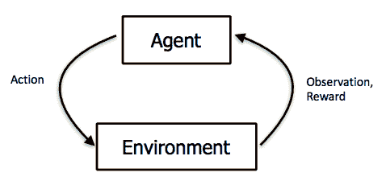

Figure 1: Interaction between Agent and Environment. Source: [http://rll.berkeley.edu/deeprlcourse-fa15/](http://rll.berkeley.edu/deeprlcourse-fa15/)

# 没有数据的机器学习

让我们用这个路由示例来简单说明 RL 是如何工作的。我们从没有数据开始，但是代理将通过试错法生成从 A 点到 B 点的多种路由可能性。假设我们可以采取的行动是:

1.  向上
2.  向下
3.  左边的
4.  对吧

奖励在到达 B 点时给出。假设在这种情况下，代理人在游戏结束前只能走四步。然后，代理会执行一系列类似如下的操作:

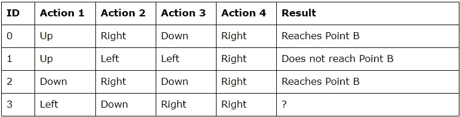

那么第 3 行的结果应该是什么呢？嗯，真的要看情况。如果我们假设代理人在一个只有三个水平方格的迷宫中，并且动作 1 之前的环境状态总是如下:

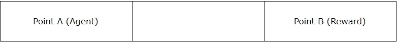

那么很明显，最重要的是代理必须向右移动两次才能到达 B 点(代理向上或向下移动的动作变得无关紧要)。对 ID 3 采取的操作将代理引向 b 点。

假设我们有一个这样的替代迷宫环境:

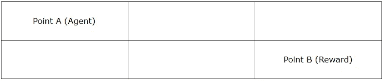

那么最重要的是代理需要向下移动一次，然后向右移动两次，以便到达 b 点。

在另一个可供选择的环境中，假设我们现在在迷宫中有代理不能到达的区域(黑暗区域)。在这种情况下，ID 0 和 ID 2 将代理从 A 点导航到 B 点，而 ID 3 则不能。(您需要代理在向下移动之前先向右移动。)

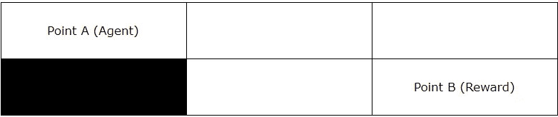

在 RL 问题中，我们没有意识到环境。RL 面临的挑战是，我们如何学习下一个最佳行动，以获得最大回报。这是通过反复试验生成数据来完成的，在反复试验过程中，代理观察环境并采取下一个最佳行动。

有两种主要方法可以从生成的数据中学习，这些方法是 Q 学习(基于值的学习)和策略梯度。为了解释这两种方法，我将解决 OpenAI gym 的一个介绍性游戏，称为 CartPole-v0。我的方法将是尝试从编程的角度解释这些方法，并希望从那里，我们获得对这两种方法的直觉。

# 钢管舞-v0:简介

一根杆子系在一辆手推车上。一集游戏开始，杆子是直立的。手推车可以向左或向右移动。在每个时间点，购物车都需要向左或向右移动。移动手推车会影响电杆。目标是在 100 个连续事件中，在超过 195 个时间点内将极点保持在某个角度。直觉是，如果 RL 算法能够在 100 集内平衡极点超过 195 个时间点，这意味着 RL 算法已经知道如何正确地玩游戏。

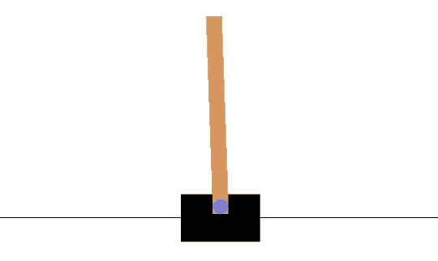

Figure 2: [CartPole-v0](https://github.com/openai/gym/wiki/CartPole-v0)

总而言之:

奖励:每当杆子保持直立，代理人获得+1 奖励。

动作:手推车只能向左或向右移动。

观察:代理通过这四个值观察环境:

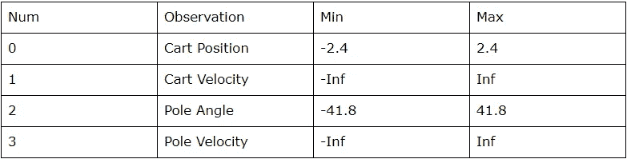

进一步的细节可以在这里找到[。](https://github.com/openai/gym/wiki/CartPole-v0)

# cart pole-v 0:Q-学习

Q 学习的直觉是这样的:给定一定的观察，代理人可以采取的每个行动的预期回报是什么。因此，Q 学习类似于建立一个巨大的查找表，在每一个观察点，该表告诉你采取任何可能的行动的预期回报。让我们从以下五个方面进行分析:

# 详图 1:主回路

从本质上讲，Q-learning 的主要循环是这样的:

*   选择下一个要采取的最佳行动
*   采取行动保护环境
*   观察/离散化环境中的新状态
*   更新 Q 表
*   重复直到完成

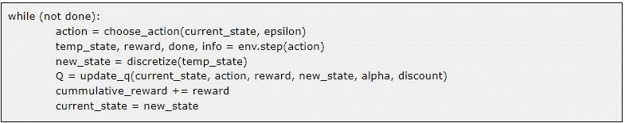

# 细节 2:选择下一个最佳行动

RL 中有一个概念叫做开发与探索。这意味着对于每一个时间步，代理可以执行一个它当前认为最好的动作(利用)，或者代理可以执行一个新的动作(探索)。

做到这一点的技术是通过贪婪ε方法。Greedy-epsilon 生成一个随机数，并检查它是否小于一个变量(epsilon)。如果是，则使用随机动作(探索)。否则，使用观察的最佳动作(利用)。

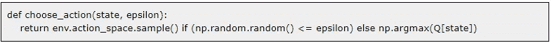

最后一点:在最开始，Q 表很大程度上是空的，因此你会希望代理执行更多的探索行动。然而，你会希望代理变得越来越剥削，随着时间的推移，随着ε的增加，Q 表开始填充。

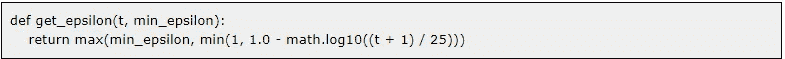

# 细节 3:离散化观察空间

正如我们前面看到的，从环境中返回的观测值是连续的。然而，在创建 Q 表时，更容易将这些数字转换成离散形式。这通过以下功能实现:

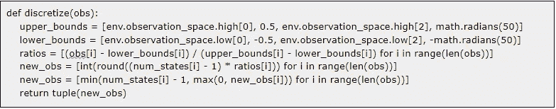

这种优雅的离散化方式归功于这篇[文章](https://medium.com/@tuzzer/cart-pole-balancing-with-q-learning-b54c6068d947)。

# 细节 4:更新 Q 表

最后，我们使用以下公式更新 Q 表:

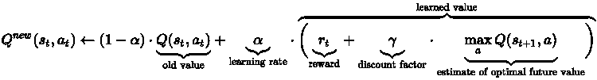

学习到的价值是对新行动的未来回报的估计。学习价值由两部分组成，当前奖励和未来奖励的折扣。这种贴现的未来报酬是采取行动后最优未来价值的估计值乘以一个贴现因子(以说明它是一种未来报酬)。

alpha 变量控制 Q 表现有值的更新速度。

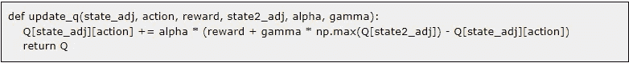

# 细节 5:更新 alpha

最后一步更新学习率α。与 epsilon 类似，在开始时，您可能希望更新更加激进。但是，随着时间的推移，您可能希望缩减更新，以使您的表更加稳定。

# CartPole-v0:政策梯度

对政策梯度的直觉如下:给定一定的观察，代理人采取行动的最佳政策是什么。政策梯度稍微复杂一些，但值得注意的是，最近在 RL 方面取得的成就归功于政策梯度。

从程序上来说，您可以想象有一个主循环，它计算出策略应该是什么。在这种情况下，我们将使用神经网络和主循环来找出这些策略。因此，我们将描述神经网络和该循环中的三个主要细节:

*   神经网络
*   正向传递(计算神经网络的输出动作)
*   计算奖励(计算要输入神经网络的训练数据)
*   损失函数
*   反向传递(更新神经网络的权重)

# 细节 1:神经网络

我们展示了我们构建的神经网络。它由 32 个节点的两个隐藏层组成。

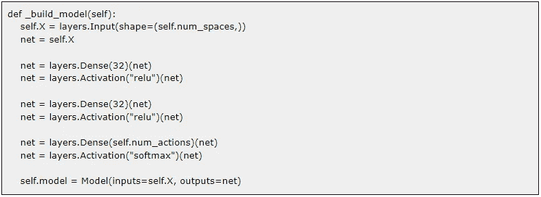

# 细节 2:向前传球

细节 2 将环境的当前状态输入神经网络，并生成行动概率。我们称之为随机选择(基于神经网络提供的行动概率)来决定我们采取的行动。

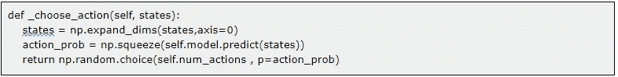

# 细节 3:计算奖励

在第二个细节中，我们从要输入到环境中的转发过程中生成一个动作列表。当我们把这些行为反馈到环境中时，我们最终会得到一系列的回报。

从行动列表中，我们计算出一个称为跑步奖励的向量。该连续奖励是通过考虑从该当前时间戳一直到终点所赢得的奖励来计算的。但是，在更远的地方获得的奖励会打折扣。

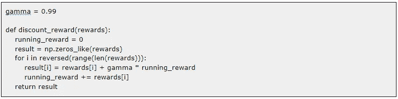

# 细节 4:损失函数

为了描述策略梯度的损失函数，我们首先将监督学习的负对数似然函数描述为

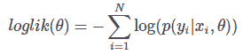

这类似于最大化等式左边的概率项。对于政策梯度，公式是类似的，但增加了一个称为优势的术语*和*。在 RL 中，优势被累积折扣奖励所取代。

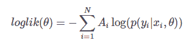

因此，它为我们提供了以下实现，其中我们获取以下内容的日志:

*   模型的输出(采取行动的概率)乘以
*   采取实际行动

这个对数项再乘以折扣奖励。

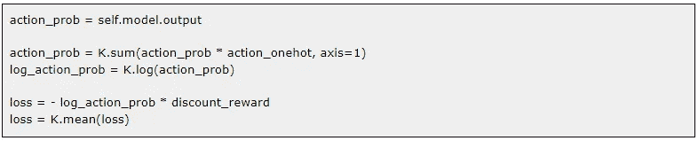

# 细节 5:向后传球

最后，我们使用 Adam 优化器来更新基于 log loss 函数的神经网络的权重。

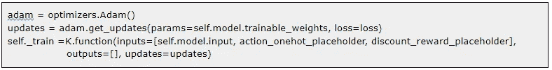

# 强化学习的商业用途

有人引用吴恩达的话说，强化学习背后的兴奋和公关宣传相对于它今天创造的经济价值来说有点不相称。说到这里，已经有一些特定的行业在 RL 的应用上取得了成功。例如:

*   金融([摩根大通](https://www.jpmorgan.com/global/LOXM)的交易执行)
*   控制/机器人问题([交通灯控制](http://web.eecs.utk.edu/~itamar/Papers/IET_ITS_2010.pdf)，[数据中心冷却](https://deepmind.com/blog/deepmind-ai-reduces-google-data-centre-cooling-bill-40/)，[导航](https://ai.googleblog.com/2019/02/long-range-robotic-navigation-via.html))
*   实时赞助搜索竞价([阿里巴巴](https://arxiv.org/abs/1803.00259))

可以看出这些应用程序都有 RL 的共同特点。也就是说，将问题定义为一个代理，在一个具有非常明确的回报结果的环境中观察并采取行动(例如，数据中心冷却奖励成本节约；交通灯控制奖励延迟/拥堵的减少)。

相关的系列视频短片可以在 youtube [这里](https://www.youtube.com/playlist?list=PLsXcLJfwDnPqf8H5ttvXI8lKSMHJKWLfz)找到。

这结束了关于机器学习的当代分类的三部分介绍系列。我希望你能像我写它们一样喜欢阅读它们！

作者是新加坡理工学院的助理教授。他拥有帝国理工学院的计算机科学博士学位。他还通过新加坡麻省理工学院联盟(SMA)项目获得了新加坡国立大学的计算机科学硕士学位。

*本文观点仅代表作者个人观点，并不代表作者所属任何组织的官方政策或立场。作者也没有从属关系，也没有从本文提到的任何产品、课程或书籍中赚取任何费用。*

使用 Q-Learning 解决 CartPole 的要点可以在这里找到:

用政策梯度解决资本极的要点可以在这里找到:**