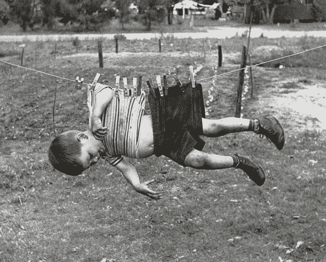
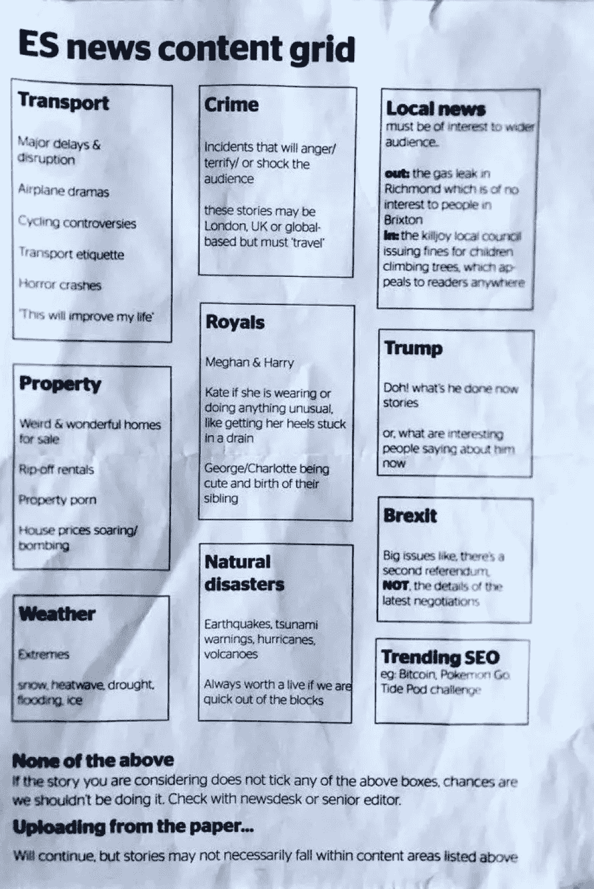
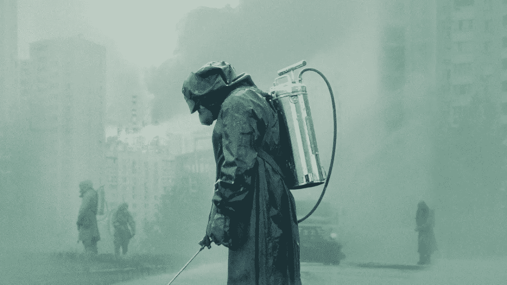

# 满足于故事

> 原文：<https://medium.datadriveninvestor.com/contenting-ourselves-to-stories-5b0ce325f1b7?source=collection_archive---------9----------------------->

Podiem 论文#2:当硅谷接管新闻时会发生什么

ThePodiemPapers 是一个正在进行的短文系列，旨在围绕新闻和社交媒体交叉的核心问题加强公众对话。

________________________________________________________________

*“谎言的代价是什么？这并不是说我们会把它们误认为真理。真正的危险是，如果我们听到了足够多的谎言，我们根本不再认识到真相。那我们能做什么？除了放弃对真理的希望，用故事来满足自己，还有什么别的办法呢？”*

*—瓦列里·勒加索夫，* HBO 的*切尔诺贝利*

**当基辅来到堪萨斯城**

如果你不熟悉 Natalia Bureiko 这个名字，你应该很熟悉。

 [## 社交媒体倾听让你时刻保持联系——数据驱动的投资者

### 虽然社交媒体倾听是一种顶级趋势，但它应该是每个现代营销策略的一部分。保持和谐…

www.datadriveninvestor.com](https://www.datadriveninvestor.com/2019/02/26/social-media-listening-keeps-you-plugged-in/) 

她的故事展开如下:

作为基辅的一名大学生，她在自己的脸书主页上指控一名高级警官性骚扰。她的《脸书邮报》包括了她与这位官员的一段对话的截图。在截图中，在她拒绝他的性关系要求后，该官员暴力威胁她的安全。

这引起了公愤。这个故事一夜之间在脸书疯传。所有的新闻媒体都把它捡起来，第二天早上就刊登出来。48 小时全天候报道。这位警官在自己的脸书上发布了否认声明。他声称指控是捏造的，并将其与他的妻子在国家调查局高层工作的事实联系起来，这是一个破坏他们婚姻和她的信誉的阴谋，等等。

Burieko

从官方否认到 Bureiko 公开收回她的故事并躲藏起来已经过去了两天。一个月后，她加入了证人保护计划。

为什么？整个故事是一场骗局。tinder 的截图是由亲俄罗斯的乌克兰人篡改的，这些人与俄罗斯情报机构有联系，他们付给 Natalia 很少的费用来完成整个事情。(点击 [**此处**](https://www.justsecurity.org/63315/next-step-in-disinformation-how-a-dating-app-becomes-a-weapon/) 阅读更多)

想象一下这个故事的某个版本在一个没有社交媒体的世界中展开。所有的传统媒体记者都竞相尽快弄清事情的真相。抢先报道他们的竞争对手，高度意识到如果他们误报，他们的职业生涯就岌岌可危。一个细节不合时宜，一个来源被错误引用，他们和他们的出版商一起损害了他们的声誉。

记者有两个经常相互冲突的压倒一切的命令来指导他们的报道决策:尽可能快地接近真相。当然*，*经济自然会产生这些需求，但其中也渗透着一种责任感。尽快触及问题的核心，不仅仅是因为媒体会从爆料中获得经济利益，还因为如果不这样做，拖得比必要的时间更长，或者让一个无关紧要的故事看起来比实际情况更大，将会以某种方式积极伤害或破坏他们的观众。相当于新闻业的渎职行为。

不管发生在什么样的媒体环境中，布莱科的故事都是有毒的。但它在 facebook 和 twitter 生态系统中呈现出一种特别狂热和夸张的风格。在这个生态系统中，任何时间权宜和注意力房地产的概念都变得过时了。其中*“…尽快接近真相”*没有任何经济或道德价值。

想想看，在 48 小时之内，布莱科的故事是多么容易就偏离了轨道。在这么短的时间内造成了多大的破坏。如果我们把这个故事看作一个巨大的蒸汽机机车——它在轨道上越往前走，速度和惯性就越大——我们可以准确地指责脸书给轨道上了油，卸掉了刹车，不管火车是否坠毁。

想象一下，如果最初发布这个故事和发现这是一个针对这位警官的阴谋之间的时间差距进一步扩大，会造成多大的混乱。如果让火车继续沿着铁轨行驶。想想公众越来越强烈的不满和愤怒。起诉书。解雇。或许是暴动？

想象一下，不是如果，而是什么时候，类似的事情在美国发生。想想那些要求采取行动的受害者权利团体和反警察团体。想想在社交媒体平台上发生的铺天盖地的回应/反回应，然后过滤到主流媒体和有线新闻节目。不同的部落在意识形态光谱上划分他们的领地，拒绝让步。不真诚的演员和社交媒体骗子都想方设法将故事与他们特定的宠物问题联系起来。所有人都从这种相互作用中获利，当然，美国公众除外，他们是最后的受害者。

**当好莱坞来到舰队街**

值得关注的问题是现在新闻中出现的这种经济和道德不对称的根源。一个布里克式的故事对自由民主具有不可思议的破坏性，同时对脸书和推特的资产负债表有好处。用户流量的增加意味着广告销售的增加，用户流量偏向淫荡、煽情和不和谐的内容。

这种经济扭曲不一定是由通常的嫌疑人(CNN/FOX /MSNBC 和他们的广告商)造成的，他们自 90 年代以来就一直将 n *ews 作为信息娱乐*游戏，试图推动越来越多的广告收入。相反，它来自科技公司本身，它们愉快地消除了唯一的两个限制——时间和注意力房地产——这两个限制阻止了上述商店独自成为事实上的好莱坞工作室。

在 Twitter/脸书的新世界里，让你像一部情节电视剧一样对故事保持兴趣，现在是新的经济要务。叙事*是新的当务之急——*应该从现在开始纹在每个新闻编辑的后腰上。情节传奇的每一个阶段，故事的每一个转折都带来了更多的流量。尽可能拖长一个故事不会受到惩罚。用尽可能多的内容堵塞信息管道是没有代价的。

与此同时，负责真诚“报道”有新闻价值事件的人现在别无选择，只能让每个标题比上一个标题更轰动，以便在这个新的信息剧场中脱颖而出。现在，每个记者和作家都被迫在头条位置推销他们的故事，就像绝望的编剧向工作室负责人推销日志一样。*“叙利亚内战:想想卢旺达酒店遭遇黑鹰坠落。人们会喜欢的！”*

我们把当天的新闻视为情节剧。网飞的*"点击* ***下一集*** *观看下一集*重播。信息门户都像超级马里奥管道一样运作。总有另一个世界让你跳下去。又一个值得阅读的故事。等待中的另一集。*“如果你喜欢这个关于墨西哥毒品战争的故事，你也会喜欢这个关于刚果人口贩卖的故事！”*

我们与新闻的集体关系已经变得依赖于主题，就像好莱坞与观众的关系一样。工作室负责人和新闻媒体高级编辑的头衔是没有区别的。公众真的很喜欢这些超级英雄电影，所以我们再给他们 10 部吧。热门新闻故事也是如此。”

你们中的一些人可能会正确地注意到*“如果流血，它就会领先”*一直是新闻报道的公理真理，这总是在传递新闻时创造一种叙事驱动的“现实扭曲场”。

这是一个公平的批评。我在这里争论的是，从根本上改变的是我们与出血的关系。这种向以消费者为中心的新闻形式的信息娱乐的转变，没有时间或注意力的限制，给了观众勇气。让他们觉得新闻应该是一种客户服务产品，就像某些奥威尔式的*坐卧两用*床垫广告一样；*“我们保证你会喜欢它或者你的新闻是免费的！！！！!"对这些网络来说，不这样做无异于经济自杀。*

这不仅仅是猜测。福克斯新闻在其整个后 9/11 历史上最差的评级时期是卡特里娜飓风后的两周。他们对布什政府及其救灾处理进行了批评性报道，认为他们关心的南大西洋地区的观众会对飓风受害者正在经历的救灾困难感同身受。取而代之的是，人们只是关掉电视或换频道。广告商抱怨随之而来的收视率下降，因此福克斯相应地“调整”了他们的节目。

这有复杂的博弈论原因，与 90 年代中期新闻媒体纳什均衡的内爆和公共领域专家等级制度的崩溃等有关。所有这一切只是说，这是一个深刻的，结构性的，有多种原因的经济现象，而不是任何一个个人或团体或董事会的错。

只是一旦你将福克斯新闻的卡特琳娜评级比喻注入 Twitter/脸书媒体景观的血管中，你就会看到连锁反应对新闻传播来说是多么灾难性，最终，任何客观的“真相”共识都不可能胜出。我们不得不满足于这些故事。*的《谎言的代价》就门市而言利润太大。如果你仍然持怀疑态度，请看下面伦敦《标准晚报》的袖珍打印表格。*

**

*这个网格本身就足够说明问题了，除了说，我敢打赌，与美国同类网格相比，它看起来温顺而沉稳。*

***当克格勃来到你的客厅***

*如果我听起来有点油嘴滑舌和刻薄，我不是故意的。所有这一切都可以很好地融入 Ted Talk 晚会后的鸡尾酒会，只要赌注不那么高。我们不能对这种*“新闻是不折不扣的信息娱乐”*现象沾沾自喜，因为我们的地缘政治敌人已经找到了如何有效地将我们购买床垫的冲动武器化来对付我们。这不是一个留给学者们在我们回去转发和点赞时简单挥挥手的主题。这是我们现在的所有问题，因为我们对故事的沉迷正被邪恶地转向反对我们。正如莱加索夫所警告的，现在越来越难认清真相了。*

*国家和非国家的坏演员都在密切关注这样一个事实，即我们已经扔掉了我们的新闻秒表，放弃了我们的注意力——房地产、*网飞编辑*我们的新闻，并对下一集的系列大结局一直垂涎三尺。*

*这些坏演员正在以同样的系统方式进行这个过程，网飞通过算法决定它应该开绿灯*纸牌屋*。看大卫·芬奇的人也碰巧喜欢凯文·史派西和政治剧；瞧。扫描美国政治和文化景观的外国情报机构也是如此；*“性骚扰+警察敌意=红极一时”**

**

*…the cost of lies*

*当你现在读这篇文章的时候，勤奋的俄罗斯、伊朗和中国情报黑客正在做一些反乌托邦版本的*在编剧室和他们的兄弟们一起嗨起来*来制作下一季的剧集。武器化尽可能多的破坏稳定和混乱诱导的故事，着手精确的位置和时间，以部署他们的最大影响。(这里的 [**这里的**](https://www.bbc.com/news/world-us-canada-45294192) ， [**这里的**](https://foreignpolicy.com/2018/05/25/disinformation-wars/) ，这里的**只是几个引子。)***

***我们都允许这种事情发生。我们已经为新闻驱动的情节剧创造了一个成熟的市场，而积极有意制造分裂和不和的实体都接受了这一暗示，投入巨资为我们制作引人注目的新闻剧。叙事现在统治一切。所有的新闻都是另一个故事。***

***当这种叙事优势产生有害的政治和经济后果时(这种后果肯定会发生，就像布列柯的情况一样)，我们会绝望地四处寻找可以指责的人和事。我们会指出传统的新闻媒体，他们会把这个问题反馈给我们，*“否则我们怎么能让灯一直亮着呢？你不会阅读关于碳税、制药立法和弗林特水中的铅的长篇调查文章。****

***因此，我们将带着愤怒和鄙视的目光盯着科技公司。他们会平静地坐在那里，手举着，眉头紧锁。*“不怪我们吗？是你们需要超级英雄电影。我们只是为你提供剧院和 3d 眼镜。”****