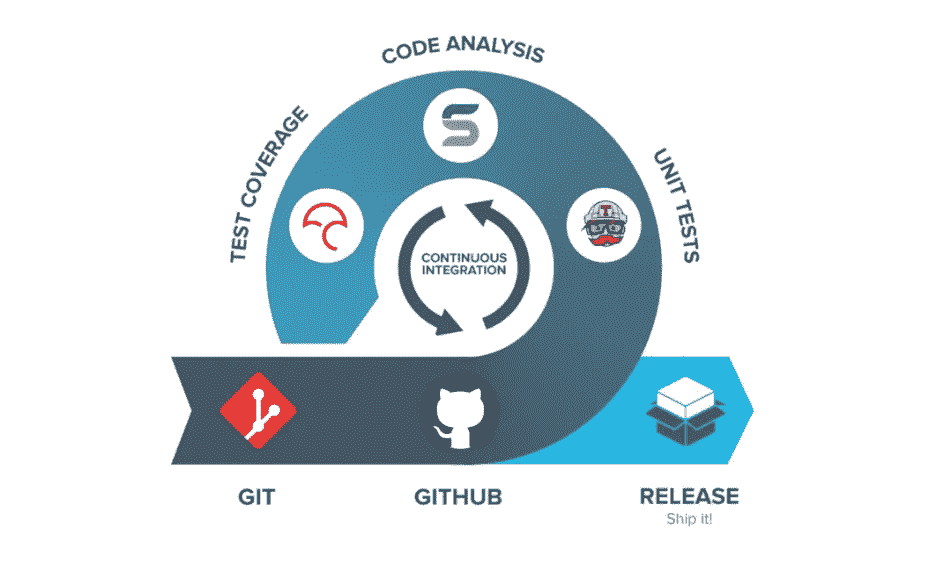

# 持续集成——开发质量更好、错误更少的软件

> 原文：<https://medium.datadriveninvestor.com/continuous-integration-develop-better-quality-and-less-buggy-software-479ccb3e1257?source=collection_archive---------19----------------------->

在 [Pernix](http://www.pernix-solutions.com/) 中，作为软件开发人员，我们不得不面对比简单的[拉请求更精确的问题。](https://www.atlassian.com/git/tutorials/making-a-pull-request)这是一些用于确保软件始终启动和运行的技术。

当你和两个或更多的人一起开发一个软件时，软件开发过程是非常棘手的，对吗？开发一个软件就像建造一座房子，但是不同的是你不能实时看到其他人在做什么。例如，你必须等到有人完成了一整面墙，才能看到他们是如何做到的。

现在，想象一下，在一个数百人的团队中构建一个软件，这怎么可能呢？你怎么知道你的改变不会破坏别人的改变？还是说安润会像预期的那样编译？
举例来说，如果你使用的是 Git 这样的版本控制软件，你可以让
确保你的修改不会破坏本地的任何东西，并发出一个 pull 请求。其他人会检查你的变更，如果**看起来**起作用，那么
接受变更，相信变更起作用。但是一旦存储库被合并，你必须手动编译、执行和测试与存储库合并的新变化。但是如果你打碎了什么东西呢？
这就是持续集成试图简化的。确保每一个
变更都将按照
程序编译、执行并通过一定的测试。循环如下:

开发人员有特定的任务，所以他们构建软件并推动他们的改变
,这就是神奇发生的地方。软件会构建并运行某些测试，而不是发出拉请求，它不会一直运行所有的测试，因为有些测试需要长时间一直执行，所以每次“x”提交或更改都会执行大量测试。为了确保基本功能不被破坏，还会一直执行其他更简单、更快速的测试。在那之后，程序会报告有多少人通过了什么样的测试，以及哪些人没有通过。这些报告被传递给测试人员进行分析。说到这里，这些测试人员建立了测试，决定了一个程序是否有效。
那些没有通过测试的功能，返回给开发者修复。直到在测试中有很高的成功率，变更才会被合并。通过这种方式，你可以确定所有的变更都是程序发布的一部分。或者至少你知道你的程序有错误。使用哪种测试？

共有 4 个测试级别:

1.  单元测试:这测试单个组件，如软件的功能和小部分
    。
2.  集成测试:测试一个组件的集成，例如，如果
    新的改变没有破坏你修改的软件的部分和
    相关的功能。
3.  系统测试:测试整个软件，这是
    没有一直运行的长时间测试。
4.  验收测试:测试最终的系统，所有的测试都在这个级别进行，
    也进行高压力测试，以测试软件的极限。

这些测试是不同的，取决于软件做什么，并且必须非常准确，以确保软件中的每个提交和更改都是功能性的。
这就是为什么叫做持续集成。

## 詹金斯

Jenkins 是最著名的持续集成工具之一。根据詹金斯的官方网站，它被描述为:

> 独立的开源自动化服务器，可用于自动化与构建、测试以及交付或部署软件相关的各种任务

假设你想对你的项目或公司实施持续集成。这意味着每一个变更都必须在实现到存储库之前进行编译和测试。如果你有一个超过 50 人的项目怎么办？谁来构建和测试每个提交的**？**

Jenkins 会自动完成这项工作，当开发人员推动变更时，它会编译并执行测试以确保一切正常。如果没有，Jenkins 将通知[质量保证](https://en.wikipedia.org/wiki/Quality_assurance)部门编译测试失败。如果它成功地完成了每一个测试，你就可以决定是否实现这些改变。这些协调器是持续集成的支柱。

那么，你对持续集成有什么看法？你会在你的项目中实现它吗？

这个博客是我们在 [Pernix Solutions](http://www.pernix-solutions.com/) 的[学徒计划](http://www.pernix-solutions.com/apprenticeship_program)中职责的一部分

# 参考

*   詹金斯
*   [Git](https://git-scm.com/)
*   [单元测试](https://en.wikipedia.org/wiki/Unit_testing)
*   [持续集成](https://en.wikipedia.org/wiki/Continuous_integration)
*   [拉动请求](https://www.atlassian.com/git/tutorials/making-a-pull-request)
*   [Pernix 解决方案](http://www.pernix-solutions.com/)