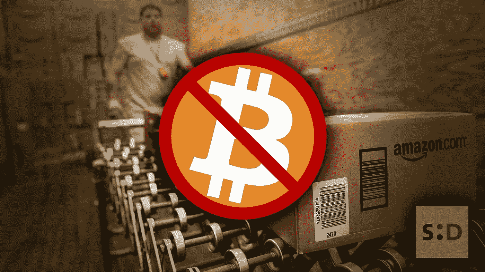

# 与最近的新闻相反，星巴克、亚马逊等不接受加密。

> 原文：<https://medium.datadriveninvestor.com/contrary-to-recent-news-crypto-is-not-accepted-at-starbucks-amazon-etc-9afe7f177a46?source=collection_archive---------10----------------------->

英国《独立报》最近发表的一篇新闻文章称，你无法在亚马逊和星巴克这样的网站上用密码支付。你不能。这篇文章指出，世界上的*【最大的零售商】*正在接受*【比特币、以太坊、比特币现金和双子星币】*。但那并不是真正的真相。

虽然标题暗示你可以走进当地的星巴克，买一杯拿铁，喝几杯小睡，但实际的文章证明这只不过是点击诱饵。

 [## Azbit 旨在连接传统金融和加密货币-数据驱动的投资者

### Azbit 是下一个提供交易平台的加密项目，该平台提供保证金和算法交易。一样多…

www.datadriveninvestor.com](https://www.datadriveninvestor.com/2019/03/20/azbit-aims-to-connect-traditional-finance-and-cryptocurrency/) 

事实是，区块链初创公司 Flexa 发布了一款应用，允许美国的加密货币交易所 Gemini 在使用该应用的交易中充当中间人。问题中的应用是*【Spedn】*，它是 Flexa 的第一款。

## Spedn 应用程序

来自 Flexa 团队的官方新闻稿将 Spedn 应用程序归类为*“安全托管”*加密钱包。

对于那些可能不知道的人来说，一个*“安全保管的”*钱包是一个你不会拥有私人钥匙的钱包。这意味着从技术上讲，你不会拥有任何存储在里面的密码。这也意味着钱包钥匙的拥有者可能会在任何时候消失，使你的密码无法访问。

这是与《独立报》标题相反的第一点。如果星巴克(Starbucks)和亚马逊(Amazon)等公司完全接受加密作为一种支付方式，你将能够使用自己的加密，使用自己控制的钱包。如同法定货币一样。

## 关于“接受加密”…

如上所述，Flexa 现在与 Gemini crypto exchange 合作。这种合作关系通过允许即时加密转换到 Gemini USD(Gemini exchange 上的原生稳定硬币)来推动 Spedn 应用程序。

*如果你是这个行业的新手，你可能想知道稳定硬币是一种价值与法定货币挂钩的加密货币。正如你可能猜到的那样，双子美元与美元挂钩，因此 1 GUSD 将永远值 1 美元。*

正是这种双子美元允许支付发生。当用户试图使用 Spedn 应用程序*进行“加密支付”时，该应用程序会在市场上出售用户希望使用的任何加密，并购买 Gemini 美元。*

*Gemini 美元然后被 Gemini exchange 转换为 fiat 美元，Gemini exchange 然后向零售商支付 fiat 美元。正如你所看到的，亚马逊、星巴克或其他任何人都不会看到一个 satoshi，用户只是以荒谬的价格出售了他们的密码，同时支付了大量的费用。*

## *它甚至还没有公开*

*根据 Spedn 在 Flexa 博客上的官方新闻稿，使用 Spedn 支付商品的能力甚至还没有公开。*

*官方新闻稿明确指出，当前应用程序于 2019 年 5 月 13 日专门向共识参与者发布，团队计划在未来几周内发出更多邀请:*

**“SPEDN 今天只对共识与会者开放，我们将在未来几周通过应用程序发布更多邀请。”* ( [来源](https://medium.com/flexa/the-flexa-network-is-open-for-business-8673c50c3d9d))*

*最后，我想说，Flexa 的 Spedn 应用可能是一个很好的应用，是加密技术向前迈出的坚实一步。有很多关于它的错误信息被发布(不是 Flexa 的错),我不希望人们被错误地告知。*

*所以你知道了，亚马逊不接受比特币，星巴克也不接受。然而，你可以向一个托管钱包提供商付费，让他在 Gemini exchange 上销售你的密码，然后他会用法定货币支付你的物品，并把你的交易费装进口袋。*

*爱，和平和幸福。*

*原文：<https://somethingdecent.co.uk/news/cryptocurrency/contrary-to-recent-news-crypto-is-not-accepted-at-starbucks-amazon-etc/>*