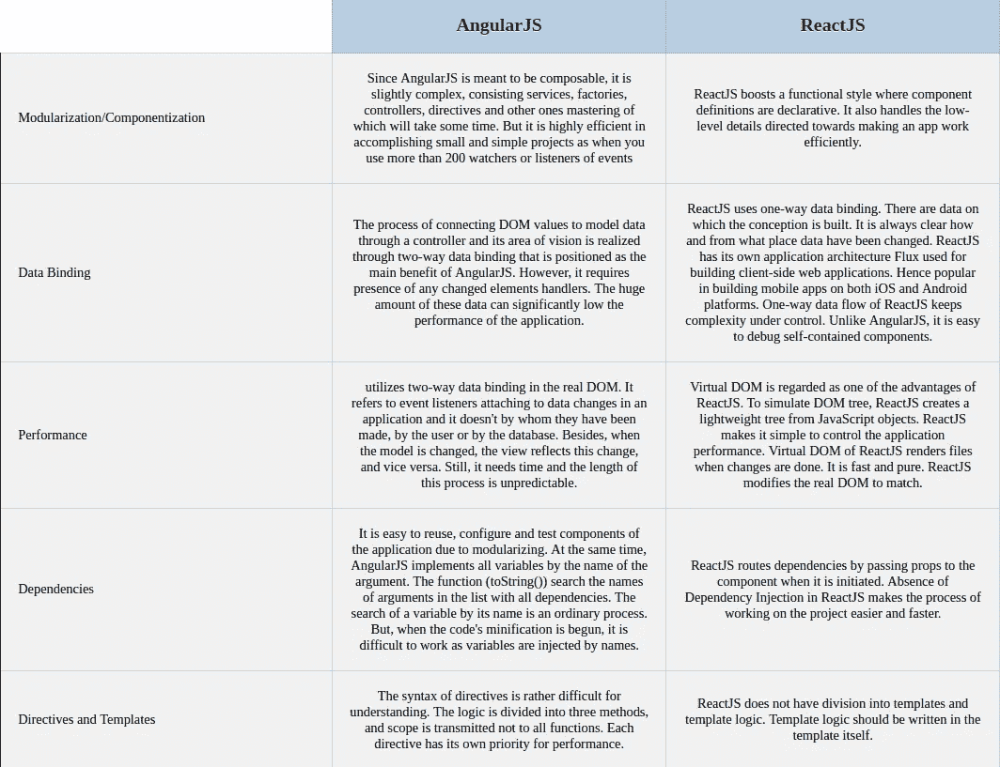

# AngularJS 和 ReactJS 的对比和比较

> 原文：<https://medium.datadriveninvestor.com/contrasting-and-comparing-angularjs-and-reactjs-fef36acb9822?source=collection_archive---------4----------------------->

当我遇到一个关于在上述两者之间选择的建议的有趣问题时，我想到创建这个帖子不是为了渲染一个比另一个更好，而是为了提供一个在解决 Angular 或 React 时考虑开发规范的洞察力。在许多情况下，开发人员试图将 ReactJS 渲染为优于 AngularJS 的。但是，根据我个人的观点，这纯粹是自以为是，而且强烈地依赖于项目的类型。

首先，这里是根据他们的文档对 AngularJS & ReactJS 的一个非常简短的定义。

 [## 2019 年最值得学习的编码语言|数据驱动的投资者

### 在我读大学的那几年，我跳过了很多次夜游去学习 Java，希望有一天它能帮助我在…

www.datadriveninvestor.com](https://www.datadriveninvestor.com/2019/02/21/best-coding-languages-to-learn-in-2019/) 

## 安古拉吉斯

> AngularJS 是一个动态 web 应用的结构框架。它允许您使用 HTML 作为模板语言，并允许您扩展 HTML 的语法以清晰简洁地表达应用程序的组件。Angular 的数据绑定和依赖注入消除了您原本需要编写的大量代码。

这里有一个[完美的例子](http://www.w3schools.com/angular/tryit.asp?filename=try_ng_default)来验证这一点。

## 反应堆

> React.js 是一个用于构建用户界面的 JavaScript 库。

(脸书的名言)

这两者之间的比较已被记录在下表中。

Comparison of Angular and React’s selective-decisive features