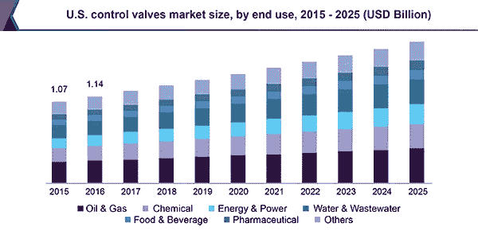

# 到 2025 年，控制阀市场规模将达到 118.5 亿美元

> 原文：<https://medium.datadriveninvestor.com/control-valves-market-9542e856a644?source=collection_archive---------7----------------------->

根据 Grand View Research，Inc .进行的一项研究，全球[控制阀市场](https://www.grandviewresearch.com/industry-analysis/control-valves-market?utm_source=medium&utm_medium=referral&utm_campaign=Gaurav_Aug12_ict_ControlValves_RD1&utm_content=Content)的规模预计到 2025 年将达到 118.5 亿美元，在预测期内 CAGR 将增长 6.50%。能源&电力、水&废水处理和石油&天然气行业等工业部门的需求激增，推动智能控制阀市场的工业自动化的采用不断增加，推动了对控制阀的需求。此外，制药和食品&饮料行业对控制阀不断增长的需求有望推动市场。

由于控制阀在控制整个下游、中游和上游活动的温度和压力方面的优势，控制阀的应用不断增加。因此，不断增长的石油和天然气勘探活动引发了对控制阀的需求。

控制阀提供了安装现代化和复杂的流体处理系统的各种好处。在制药工业中，由于生产卫生和安全产品的安全程序，对流体处理系统的需求不断增加。这些复杂的流体处理机制有助于加速制造过程，从而确保最佳性能。此外，食品和饮料行业利用控制阀来加快生产过程，并确保包装食品等最终产品的卫生。

 [## 另一场精心策划的全球经济危机正在逼近？如果我们的数据经济可以帮助它|数据…

### 我们的 DApp 的开发，称为 DECENTR，目前正与我们的 R&D 同步进行，作为我们即将到来的…

www.datadriveninvestor.com](https://www.datadriveninvestor.com/2019/03/06/another-engineered-global-economic-crisis-looming-not-if-our-data-economy-can-help-it/) 

对包装食品的需求激增，推动了控制阀市场的增长。这是由于应用了流量控制装置，并采用了合适的控制阀设计和技术来提高最终产品的质量。

由于能源和电力以及水和废水行业的需求不断增长，预计亚太地区将主导市场。这些行业正在投入巨资实现流程控制过程的自动化，以提高生产效率，同时降低出错率。此外，北美油砂和页岩气产量的扩大，以及中东、非洲和亚太地区油气勘探活动的增加，都加速了预测期内控制阀的需求。

**如需索取样本或查看本报告摘要，请点击以下链接:**[**https://www . grandviewresearch . com/industry-analysis/control-valves-market**](https://www.grandviewresearch.com/industry-analysis/control-valves-market?utm_source=medium&utm_medium=referral&utm_campaign=Gaurav_Aug12_ict_ControlValves_RD2&utm_content=Content)

**这项研究的进一步关键发现表明:**

*   由于与阀体和其他部件相比成本较高，预计在整个预测期内，致动器市场将主导控制阀市场
*   由于食品和饮料、制药、能源和电力以及化工行业的广泛需求，预计在整个预测期内，尺寸范围为 1”至 6”的控制阀市场将占据主导地位。
*   由于中国和印度等新兴经济体对石油和天然气、水和废水以及能源和电力等行业的需求不断增长，预计亚太地区将成为预测期内最突出的地区。
*   著名的行业参与者包括艾默生电气公司、福斯公司、IMI 公司、斯伦贝谢有限公司和 AVK 控股公司

**查看更多本类报道:** [**https://www . grandviewresearch . com/industry/sensors-and-controls**](https://www.grandviewresearch.com/industry/sensors-and-controls)

**关于大观研究:**

Grand View Research，Inc .是一家总部位于美国的市场研究和咨询公司，在加利福尼亚州注册，总部位于旧金山。该公司提供联合研究报告、定制研究报告和咨询服务。为了帮助客户做出明智的商业决策，我们提供市场情报研究，确保从技术到化学品、材料和医疗保健等一系列行业的相关和基于事实的研究。