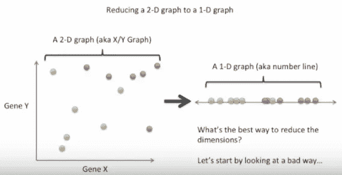
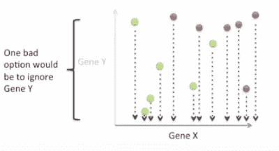
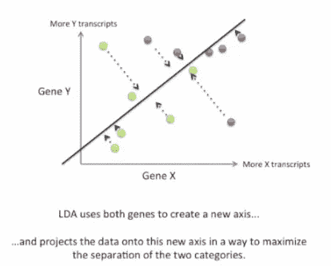
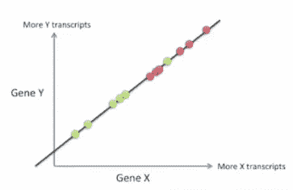
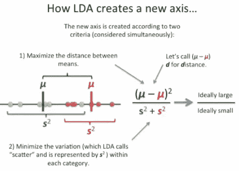

# scikit-learn 监督学习的常规指南—使用线性判别分析进行降维:线性和二次判别分析(18)

> 原文：<https://medium.datadriveninvestor.com/conventional-guide-to-supervised-learning-with-scikit-learn-dimensionality-reduction-using-linear-109a3f071112?source=collection_archive---------4----------------------->

这是 scikit-learn 指导监督学习的 92 篇系列文章中的第 18 篇，撰写这篇文章的目的是为了能够熟练地将算法应用于生产，并能够解释算法背后的算法逻辑。请在[第一篇文章](https://medium.com/@venali/conventional-guide-to-supervised-learning-with-scikit-learn-getting-started-1-f9abd3f0e6c8?source=post_page---------------------------)中找到所有部分的链接。

> 线性判别分析和二次判别分析是两种经典的分类器，顾名思义，它们分别具有线性和二次决策面。

一般来说，判别分析遵循创建一个或多个线性预测器的原则，这些线性预测器不是直接的特征，而是从原始特征导出的。
以上可以被重新定义为 LDA，它创造了新的潜在变量。

# 判别函数

让我们考虑样本为 R(j)的一组预测因子 j。LDA 声明存在找到对应于 j 的 x 的判别规则，该规则以最小化分类误差的方式进行分类。
这些规则有一个判别分数，用于确定预测的好坏。

这可以用下面三个语句来陈述:
*结构相关系数:*特征不相关。
*标准化系数:*线性方程中的系数或常数权重对每个特征都有唯一的权重。
*组质心:*属于特定类的特征的平均值相距更远。

# 歧视规则

*最大似然:*新的潜在特征应该被分配给一个组，这样该组人口的命运是最大的。
*贝叶斯判别规则:*新的潜在特征应该被分配到一个组中，使得该组中特征总体的条件概率最大。

让我们来看一些更详细的解释:

我们的任务是用 LDA 进行线性表示，以便我们可以找到线性空间中的分离。考虑左边的二维图。我们想要导出右边的 1-d 线性表示，这样我们可以得到一个数(在 aka 数轴上的一个阈值，用于区分两个类别)。降低维度的最好方法是什么？

让我们开始寻找不推荐的方法…一种方法是在 X 轴上投影一切。

或者其他人可以把它投射到第三个轴上

这看起来像投影后的线性空间…

使用下面的等式数学地投影新轴。

让我们直接进入编码来理解我们已经讨论过的概念。

# 信用

所有学分归入 Scikit-learn 文档，所有参考资料均符合官方用户指南。

也感谢我的朋友，他相信“对我来说，成功就是我创造了足够的影响力，让世界变得更美好”，这激励我从零开始，以便在某个时刻创造不同。

# 关于作者

我是 venali sonone，职业是数据科学家，也是管理专业的学生，希望在金融行业发展自己的事业。