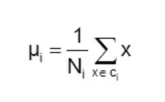
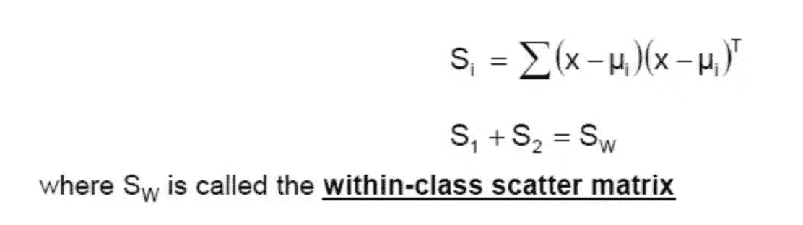
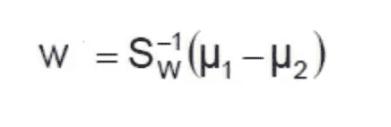
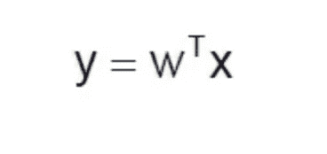
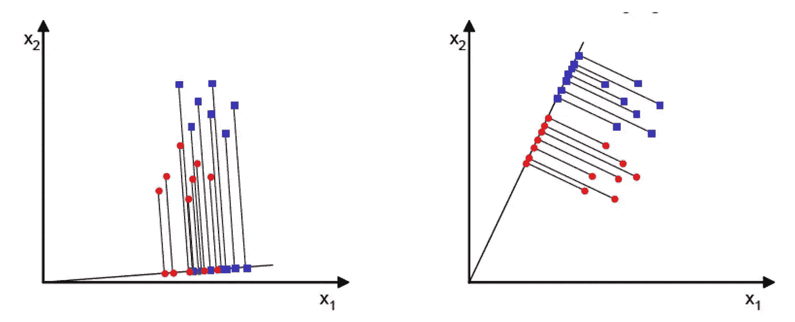
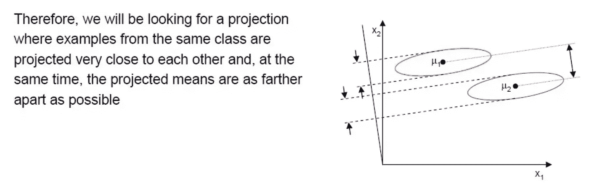

# scikit-learn 监督学习的常规指南 LDA 降维的数学公式—线性和二次判别分析

> 原文：<https://medium.datadriveninvestor.com/conventional-guide-to-supervised-learning-with-scikit-learn-mathematical-formulation-of-lda-9b5ca7c01710?source=collection_archive---------16----------------------->

这是 scikit-learn 指导监督学习的 92 篇系列文章中的第 20 篇，撰写这篇文章的目的是为了能够熟练地将算法应用于生产，并能够解释算法背后的算法逻辑。请在[第一篇文章](https://medium.com/@venali/conventional-guide-to-supervised-learning-with-scikit-learn-getting-started-1-f9abd3f0e6c8?source=post_page---------------------------)中找到所有部分的链接。

以前研究过 LDA

1.  [https://medium . com/datadriveninvestor/conventi on-guide-to-supervised-learning-with-scikit-learn-dimensionally-reduction-using-linear-109 a3f 071112](https://medium.com/datadriveninvestor/conventional-guide-to-supervised-learning-with-scikit-learn-dimensionality-reduction-using-linear-109a3f071112)
2.  [https://medium . com/datadriveninvestor/conventi on-guide-to-supervised-learning-with-scikit-learn-the-LDA-8b 64 CFD 93 c0e](https://medium.com/datadriveninvestor/conventional-guide-to-supervised-learning-with-scikit-learn-mathematical-formulation-of-the-lda-8b64cfd93c0e)

 [## DDI 编辑推荐:5 本让你从新手变成专家的机器学习书籍|数据驱动…

### 机器学习行业的蓬勃发展重新引起了人们对人工智能的兴趣

www.datadriveninvestor.com](https://www.datadriveninvestor.com/2019/03/03/editors-pick-5-machine-learning-books/) 

在本文中，我们将 LDA 本身作为一个单独的主题进行简单的讨论

LDA 的基本原理是对数据进行重标度，实现降维。LDA 重新调整数据以使估计的协方差相同。即在缩放之后，数据点的分类等同于估计的类均值。估计的类均值是具有最近欧几里德距离的点。

# 让我们看看一些细节

这个想法是做以下 4 个步骤

# 1.计算每个特征平均值

# 2.通过公式为每个类别创建散布矩阵

# 3.计算投影向量

# 4.使用第三步投影数据本身

# 投影看起来如下。看右边这些点是如何线性分离排列的。

# 最终可以重新总结如下

# 让我们开始实施吧

让我们直接进入笔记本来理解我们已经讨论过的概念。

# 信用

所有学分归入 Scikit-learn 文档，所有参考资料均符合官方用户指南。

也感谢我的朋友，他相信“对我来说，成功就是我创造了足够的影响力，让世界变得更美好”，这激励我从零开始，以便在某个时刻创造不同。

# 关于作者

我是 venali sonone，职业是数据科学家，也是管理专业的学生，希望在金融行业发展自己的事业。