# 使用 scikit-learn 进行监督学习的常规指南 LDA 和 QDA 分类器的数学公式—线性和二次判别分析(19)

> 原文：<https://medium.datadriveninvestor.com/conventional-guide-to-supervised-learning-with-scikit-learn-mathematical-formulation-of-the-lda-8b64cfd93c0e?source=collection_archive---------7----------------------->

这是 scikit-learn 指导监督学习的 92 篇系列文章中的第 19 篇，撰写这篇文章的目的是为了能够熟练地将算法应用于生产，并能够解释算法背后的算法逻辑。请在[第一篇文章](https://medium.com/@venali/conventional-guide-to-supervised-learning-with-scikit-learn-getting-started-1-f9abd3f0e6c8?source=post_page---------------------------)中找到所有部分的链接。

> 线性判别分析和二次判别分析是两种经典的分类器，顾名思义，它们分别具有线性和二次决策面。

 [## 机器学习的外汇交易挑战|数据驱动的投资者

### 机器学习是人工智能的一个分支，之前占据了很多头条。人们是…

www.datadriveninvestor.com](https://www.datadriveninvestor.com/2019/02/18/the-challenge-of-forex-trading-for-machine-learning/) 

使用类似于 ANOVA(方差分析)的逻辑来计算描述符

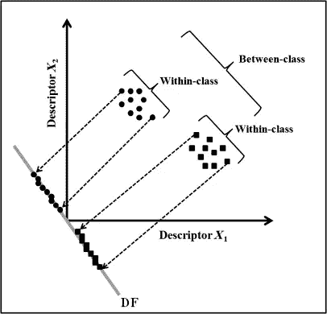

下图很好地描述了 LDA 和 QDA 的分离边界

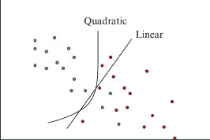

LDA 和 QDA 都是简单的概率模型。潜在的是从贝叶斯规则导出的预测概率

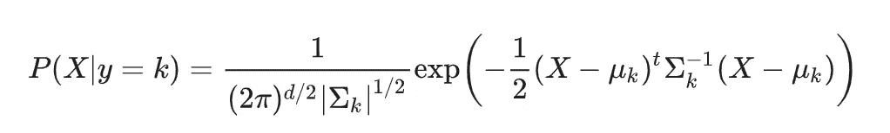

建立该模型以便最大化具有密度的多元高斯分布，即基于具有一个差异的协方差矩阵，对于一类密度具有条件概率最大值

1.  LDA 假设所有类别的协方差矩阵相同
2.  QDA，高斯分布的协方差矩阵没有假设

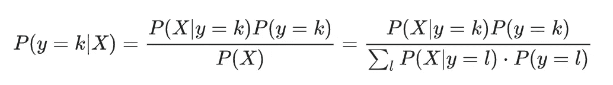

# 让我们玩虹膜数据和 pairplot

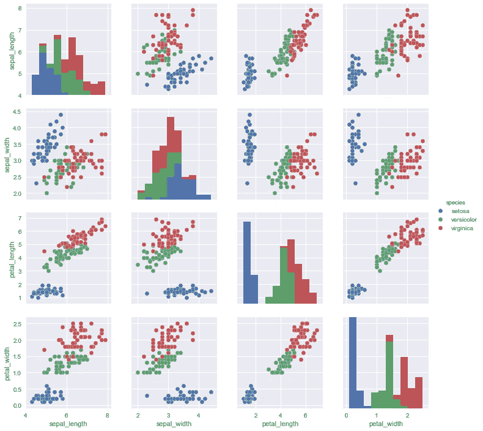

对于这个例子，我们采用两个预测萼片长度和萼片宽度

让我们检查绘图，看看它们是如何根据物种类型相互着色的

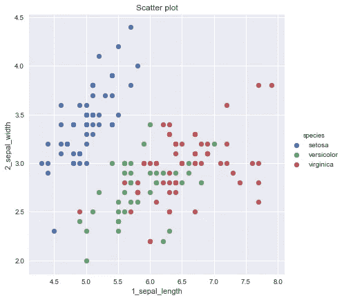

# LDA/QDA 由两部分组成

1.  计算多元高斯分布
2.  计算边界

我们首先提出这两个方程，这样做的详细指南与方程的推导是目前在

来源:【https://xavierbourretsicotte.github.io/LDA_QDA.html
来源:[https://www . science direct . com/topics/nursing-and-health-professions/discriminant-analysis](https://www.sciencedirect.com/topics/nursing-and-health-professions/discriminant-analysis)

# 所以第一部分

1.  计算多元高斯分布

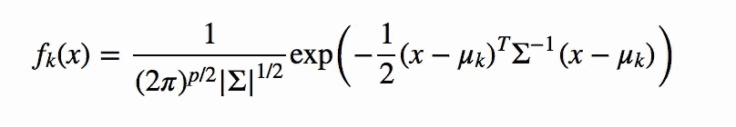

# 第二部分

2.计算边界

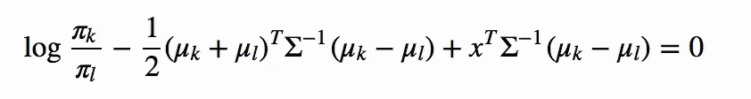

作为一个真实的例子，让我们把数字放入上面的等式，看看它看起来怎么样

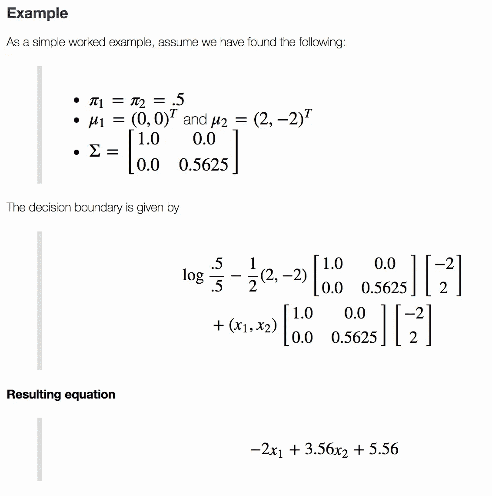

## 估计参数

然后我们需要估计如下参数

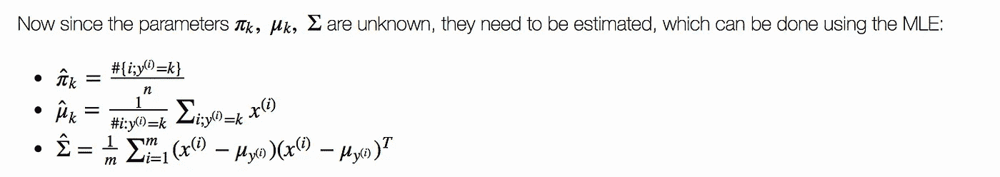

对于 iris，它翻译如下…

mu_list = Means
sigma =协方差值
pi _ list = value/# total

## LDA 的边界

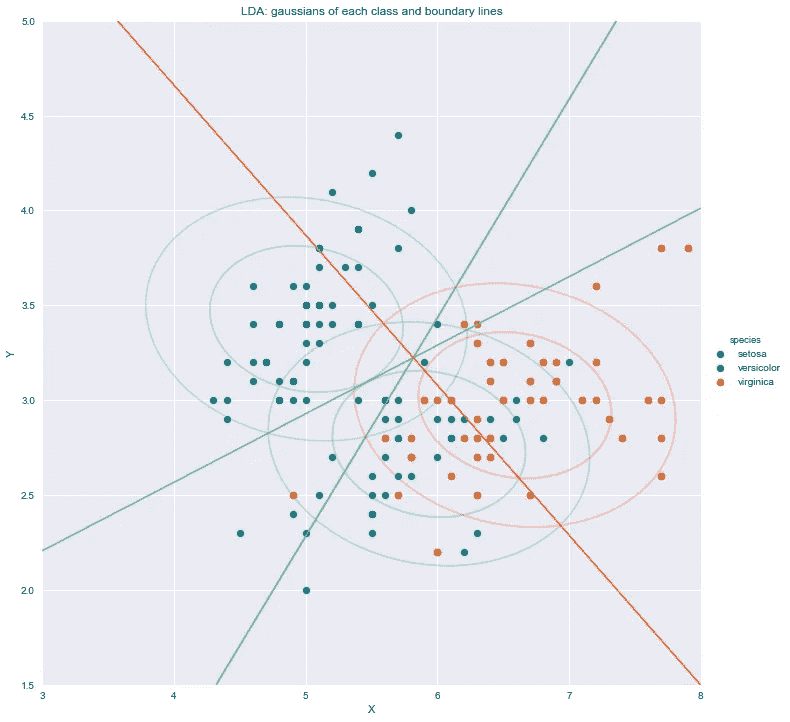

## QDA 的边界

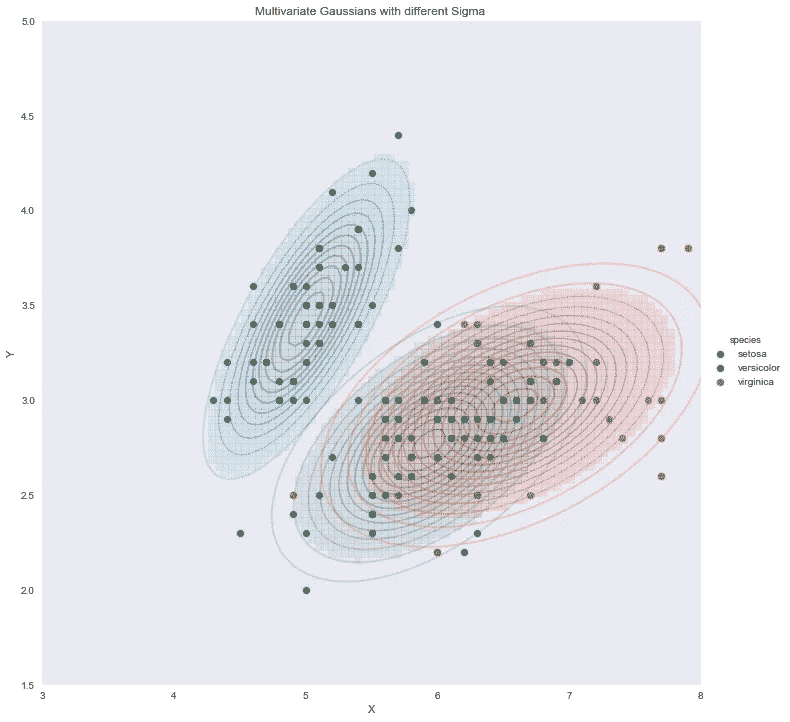

让我们直接进入笔记本来理解我们已经讨论过的概念。

# 信用

所有学分归入 Scikit-learn 文档，所有参考资料均符合官方用户指南。

也感谢我的朋友，他相信“对我来说，成功就是我创造了足够的影响力，让世界变得更美好”，这激励我从零开始，以便在某个时刻创造不同。

# 关于作者

我是 venali sonone，职业是数据科学家，也是管理专业的学生，希望在金融行业发展自己的事业。