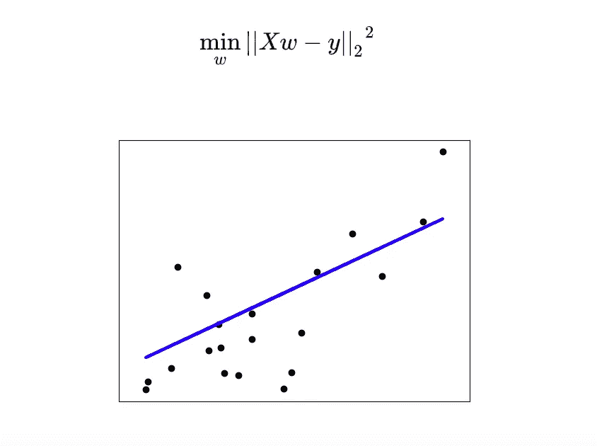

# scikit-learn 监督学习的常规指南—普通最小二乘广义线性模型(2)

> 原文：<https://medium.datadriveninvestor.com/conventional-guide-to-supervised-learning-with-scikit-learn-ordinary-least-squares-generalized-29cbf1648a25?source=collection_archive---------18----------------------->


这是 scikit-learn 指导监督学习的 92 篇系列文章的第二部分，目的是熟练地实现算法，并能够解释算法背后的算法逻辑。请在[第一篇](https://medium.com/@venali/conventional-guide-to-supervised-learning-with-scikit-learn-getting-started-1-f9abd3f0e6c8)中找到所有部分的链接。

# 普通最小二乘法

普通最小二乘法是机器学习中经常提到的技术，称为**线性回归**。

线性方程很简单

```
y = x    or  y = mx + c
```

简单地说，线性回归试图沿着数据画一条线，因为它最接近大多数数据点，并且如果数据必须表示为一条线，它是数据的一种表示。

线性回归拟合系数为 w=(w1，…，wp)的线性模型，以最小化数据集中观察到的响应与通过线性近似预测的响应之间的残差平方和。从数学上讲，它解决了以下形式的问题:



线性回归将接受其`fit`方法数组 X，y，并将线性模型的系数 w 存储在其`coef_`成员中:

```
**>>> from** **sklearn** **import** linear_model
**>>>** reg = linear_model.LinearRegression()
**>>>** reg.fit ([[0, 0], [1, 1], [2, 2]], [0, 1, 2])                                      
LinearRegression(copy_X=True, fit_intercept=True, n_jobs=None,
                 normalize=False)
**>>>** reg.coef_
array([0.5, 0.5])
```

普通最小二乘法的系数估计依赖于每个定义属性的唯一列的独立性，这被称为**模型术语**。

当项是**相关的**(当一个值增加时，其他值增加或减少，即它们以某种方式相互依赖)**设计矩阵 X** (包含上述模型项的矩阵)的列具有近似的**线性相关性**(当一个值增加时，其他值增加或当一个值减少时，其他值也减少)，设计矩阵变得接近奇异，因此，最小二乘估计变得对观察到的响应中的随机误差高度敏感，产生大的方差。

简而言之，噪声或异常点使模型拟合一条线，该线不是数据的最佳代表线，而是高度依赖于少数噪声或异常点。

(少数随机点，例如不是接近相同/正常的点，通常是异常值或噪声，使线拟合采用完全不同的方程，这不是数据的最佳代表线)

这种*多重共线性*的情况可能会出现，例如，在没有实验设计的情况下收集数据。

仅仅在数据中画一条线真的很强大，即使很简单，也可以解决机器学习领域的很多问题

让我们研究一下糖尿病数据集，以便说明这种回归技术的二维图。在上面的图中可以看到直线，显示了线性回归如何试图绘制一条直线，该直线将最好地表示数据集中观察到的响应，以及通过线性近似预测的响应。

[https://gist . github . com/venali/6508 be 7 FB 37 E4 bb 65d 755197 c8 d9 d9 ab](https://gist.github.com/venali/6508be7fb37e4bb65d755197c8d9d9ab)

# 信用

所有学分归入 Scikit-learn 文档，所有参考资料均符合官方用户指南。

也感谢我的朋友，他相信“对我来说，成功就是我创造了足够的影响力，让世界变得更美好”，这激励我从零开始，以便在某个时刻创造不同。

# 关于作者

我是 venali sonone，职业是数据科学家，也是管理专业的学生，希望在金融行业发展我的职业生涯。